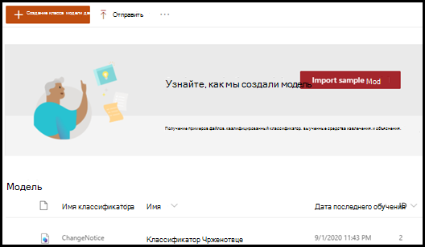

# Подробнее о моделях осмысления документации на примере образца моделиLearn about document understanding models through a sample model

В Microsoft SharePoint Syntex имеется образец модели, которую можно исследовать, чтобы лучше понять, как создавать собственные модели.Microsoft SharePoint Syntex provides you a with a sample model you can use to examine, giving you a better understanding of how to create your own models. Образец модели также позволяет исследовать компоненты модели, такие как классификатор, средства извлечения и пояснения.The sample model also allows you to examine model components, such as its classifier, extractors, and explanations. Также можно использовать образцы файлов, чтобы обучить модель.You can also use the sample files to train the model.

## Импорт образца моделиImport the sample model

Чтобы получить доступ к образцу модели, нужно сначала импортировать модель в центр контента.To access the sample model, you need to first import the model to your content center.

1. В центре контента выберите **Модели**, чтобы просмотреть список моделей.From the content center, select **Models** to see your models list. 
2. На странице **Модели** выберите **Импортировать образец модели**.On the **Models** page, select **Import sample model**. 

      

3. Когда импорт завершится, откроется домашняя страница модели **BenefitsChangeNotice**.When the import completes, the **BenefitsChangeNotice** model home page will open. Если потребуется открыть образец модели в дальнейшем, это можно сделать в списке моделей в центре контента.If you need to open the sample model in the future, you can do this from the models list in the content center.  

      

Можно анализировать образец модели не только для того, чтобы лучше понять устройство модели, но и чтобы улучшить рабочую модель и сделать следующее:You can not only look through analyze the sample model to get a better understanding of how the model is constructed, but as a working model can go further and do things such as:

- Добавить еще одно средство извлечения.Add a another extractor. Например, добавить средство извлечения, которое извлекает *дисконтную комиссию*.For example, add one that extracts the *discount fee*.
- Применить модель к библиотеке документов и загрузить в нее некоторые учебные файлы, чтобы узнать, как модель классифицирует файлы и извлекает из них данные.Apply the model to a document library, and upload some of the training files to it to see how the model classifies files and extracts data from them.

## См. такжеSee Also
[Создание классификатораCreate a classifier](create-a-classifier.md)

[Создание средства извлеченияCreate an extractor](create-an-extractor.md)

[Общие сведения об осмыслении документацииDocument Understanding overview](document-understanding-overview.md)

[Создание модели обработки формCreate a form processing model](create-a-form-processing-model.md)  
