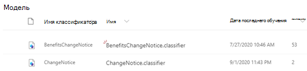

# Сведения об использовании моделей в документе с помощью примера моделиLearn about document understanding models through a sample model

Microsoft SharePoint Синтекс предоставляет примерную модель, которую можно использовать для проверки, чтобы лучше понять, как создавать собственные модели.Microsoft SharePoint Syntex provides you a with a sample model you can use to examine, giving you a better understanding of how to create your own models. Пример модели также позволяет исследовать компоненты модели, такие как классификатор, средства извлечения и объяснения.The sample model also allows you to examine model components, such as its classifier, extractors, and explanations. Кроме того, можно использовать примеры файлов для обучения модели.You can also use the sample files to train the model.

## Импорт образца моделиImport the sample model

Чтобы получить доступ к образцу модели, необходимо сначала импортировать модель в центр управления контентом.To access the sample model, you need to first import the model to your content center.

1. В центре управления контентом выберите **модели** , чтобы просмотреть список моделей.From the content center, select **Models** to see your models list. 
2. На странице " **модели** " выберите пункт **Импорт образца модели**.On the **Models** page, select **Import sample model**. 

      

3. Найдите образец модели под названием *бенефитсчанженотице. классификатор* , который отображается в списке моделей.Look for the sample model titled *BenefitsChangeNotice.classifier* that appears in your models list. 

      

4. Выберите *бенефитсчанженотице. классификатор*, чтобы открыть домашнюю страницу модели.Select the *BenefitsChangeNotice.classifier*, to open the model's home page. 
  
     

5. На домашней странице модели внимательно изучите модель, чтобы узнать, как она была создана.From the model home page, examine the model more closely to see how it was created.
 
- Просмотр образцов файлов, используемых для обучения модели.View the sample files used to train the model.
- Более подробно изучите средства извлечения объектов модели, чтобы увидеть, как учебная модель настроила объяснения.Examine the model's entity extractors more closely to see how the sample model configured the explanations.

     

## См. такжеSee Also
[Создание классификатораCreate a classifier](create-a-classifier.md) 
[Создание средства извлеченияCreate an extractor](create-an-extractor.md) 
[Общие сведения о документеDocument Understanding overview](document-understanding-overview.md) 
[Создание модели обработки формCreate a form processing model](create-a-form-processing-model.md)  
