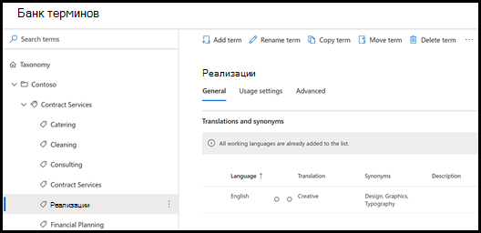
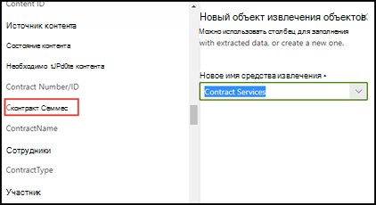
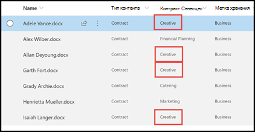

# Использование таксономии банка терминов при создании средства извлеченияLeverage term store taxonomy when creating an extractor

 

> [!VIDEO https://www.microsoft.com/videoplayer/embed/RE4GpJJ]  

 

При создании средства извлечения в модели осмысления документации в SharePoint Syntex можно использовать таксономию банка терминов [служб управляемых метаданных](https://docs.microsoft.com/sharepoint/managed-metadata#terms) для отображения предпочитаемых терминов для извлекаемых данных.When you create an extractor in your document understanding model using SharePoint Syntex, you can take advantage of [Managed Metadata services](https://docs.microsoft.com/sharepoint/managed-metadata#terms) term store taxonomy to display preferred terms for data that you extract.  

В качестве примера модель определяет и классифицирует все документы **контракта**, отправленные в библиотеку документов.As an example, your model identifies and classifies all **Contract** documents that are uploaded to the document library.  Кроме того, модель также извлекает значение **службы контракта** из каждого контракта и отображает его в столбце в представлении библиотеки.Additionally, the model also extracts a **Contract Service** value from each contract, and will display it in a column in your library view. Среди различных значений служб контрактов есть несколько старых значений, которые компания больше не использует, и которые были переименованы.Among the various Contract Services values in the contracts, there are several older values that your company no longer uses and have been renamed. Например, все ссылки на значения служб контрактов *Дизайн*, *Графика* и *Топография* должны быть заменены ссылками на *Творческая служба*.For example, all references to the terms *Design*, *Graphics*, or *Topography* contract services should now be called *Creative*. Когда модель извлекает один из устаревших терминов из документа контракта, желательно, чтобы в представлении библиотеки отображался текущий термин — "Творческая служба".Whenever your model extracts one of the outdated terms from a contract document, you want it to display the current term - Creative - in your library view. В приведенном ниже примере при обучении модели один образец документа содержит устаревший термин *Дизайн*.In the example below, while training the model we see that one sample document contains the outdated term of *Design*.

    

## Использование столбца управляемых метаданных в средстве извлеченияUse a Managed metadata column in your extractor

Наборы терминов настраиваются в банке терминов служб управляемых метаданных в Центре администрирования SharePoint.Term sets are configured in the Managed Metadata services (MMS) term store in the SharePoint admin center. В приведенном ниже примере [набор терминов](https://docs.microsoft.com/sharepoint/managed-metadata#term-set) *службы контрактов* включает ряд терминов, в том числе термин *Творческая служба*.In the the example below, the *Contract Services* [term set](https://docs.microsoft.com/sharepoint/managed-metadata#term-set) is configured to include a number of terms, including *Creative*.  В сведениях указано, что термин имеет три синонима (*Дизайн*, *Графика* и *Топография*), которые должны быть преобразованы в *Творческая служба*.The details for it show that the term has three synonyms (*Design*, *Graphics*, and *Topography*) and the synonyms should be translated to *Creative*. 

    

> [!NOTE]
>  Наборы терминов настраиваются в качестве глобальных в поле MMS центра содержимого.Term sets are configured as global in the MMS field of the content center.

Существует несколько причин, по которым синонимы могут использоваться в наборе терминов.There could be a number of reasons why you might want to use a synonym in your term set. Например, имеются устаревшие либо переименованные термины или отделами организации используются различные вариации при именовании.For example, there could be outdated terms, renamed terms, or variations between your organizations departments on naming.

Чтобы поле управляемых метаданных можно было выбрать при создании в модели средства извлечения, нужно [добавить его в качестве столбца сайта управляемых метаданных](https://support.microsoft.com/office/8fad9e35-a618-4400-b3c7-46f02785d27f).To make the managed metadata field available for you to select when you create your extractor in your model, you need to [add it as a managed-metadata site column](https://support.microsoft.com/office/8fad9e35-a618-4400-b3c7-46f02785d27f). После добавления столбец сайта можно будет выбрать при создании средства извлечения для модели.After you add the site column, it will be available for you to select when you create the extractor for your model.

    

После применения модели к библиотеке документов при отправке документов в библиотеку в столбце *Творческие службы* будет отображаться предпочитаемый термин (*Творческая служба*), если средство извлечения найдет одно из значений синонимов (*Дизайн*, *Графика* или *Топография*).After applying your model to the document library, when documents are uploaded to library, the *Creative Services* column will display the preferred term (*Creative*) when the extractor finds any of the synonym values (*Design*, *Graphics*, and *Topography*).

    

## См. такжеSee Also
[Общие сведения об управляемых метаданныхIntroduction to Managed Metadata](https://docs.microsoft.com/sharepoint/managed-metadata#terms)

[Создание средства извлеченияCreate an extractor](create-an-extractor.md)

[Создание столбца управляемых метаданныхCreate a managed metadata column](https://support.microsoft.com/office/create-a-managed-metadata-column-8fad9e35-a618-4400-b3c7-46f02785d27f?redirectSourcePath=%252farticle%252fc2a06717-8105-4aea-890d-3082853ab7b7&ui=en-US&rs=en-US&ad=US)

