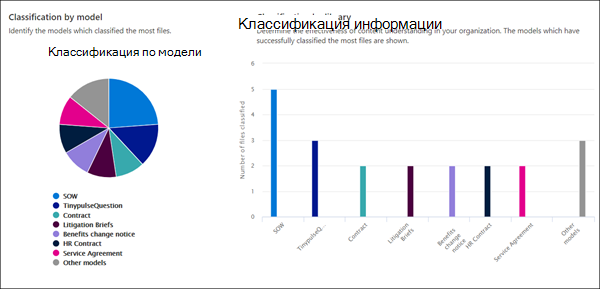
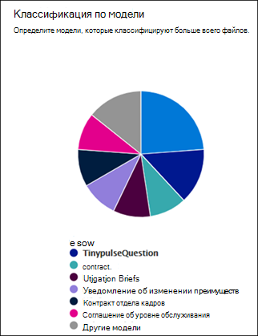
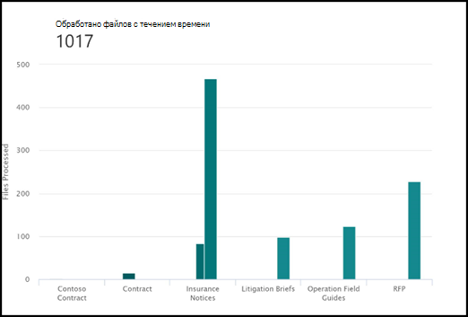

# Аналитика использования модели осмысления документа

 

> [!VIDEO https://www.microsoft.com/videoplayer/embed/RE4GnhX]  

 

Центр управления контентом Syntex в Microsoft SharePoint предоставляет аналитику использования моделей для получения дополнительных сведений о том, как используются ваши модели, опубликованные в центре управления контентом. В разделе <b>Показатели производительности моделей за последние 30 дней</b> центра контента содержится 30-дневная сводка аналитики использования в виде следующих диаграмм и списков.

- Классификация по модели
- Классификация по библиотеке
- Использование модели 

   

### Сводка данных об использовании модели в стандартном центре контента

В SharePoint Syntex стандартный центр контента создается во время настройки. При необходимости также можно создать дополнительные центры контента. Например, отделы могут создавать собственные центры контента для создания моделей и управления ими. 

В отношении аналитики использования модели обратите внимание на следующее.

- В стандартном центре контента отображается аналитика использования модели для всех центров контента и моделей в вашей организации, включая созданные в дополнительных центрах контента. Это предоставляет диспетчерам контента и другим заинтересованным лицам централизованный портал для управления центрами контента и моделями в организации.  
- Другие центры контента отображают только аналитику использования моделей, созданных в них. Это предоставляет диспетчерам контента аналитику об использовании только для моделей, с которыми они связаны.

## Классификация по модели

     

На круговой диаграмме **Классификация по модели** отображены модели, к которым отнесено наибольшее количество файлов. На ней каждая опубликованная модель показана в виде процентной доли от общего числа файлов, обработанных всеми моделями, опубликованными в центре контента.

Для каждой модели также выводится **Показатель завершения**— процентное отношение числа файлов, которые были успешно проанализированы моделью, к общему количеству загруженных файлов. Низкий показатель завершения может указывать на наличие проблем с моделью или анализируемыми файлами.

## Классификация по библиотеке

     

Линейчатая диаграмма **Классификация по библиотеке** позволяет определить эффективность осмысления контента в организации.  На ней показано не только количество файлов, обработанных за определенное время для каждой модели, но выбрав столбец в диаграмме, можно также увидеть библиотеки документов, к которым была применена модель.

## Использование модели

В списке "Использование модели" отображается аналитика использования для моделей, созданных в центре контента.  

> [!NOTE]
> Если вы находитесь в стандартном центре контента и у вас есть дополнительные центры контента в организации, список "Использование модели" будет сгруппирован по центрам контента.

Для каждой модели в списке "Использование модели" отображаются данные об использовании.

- Количество классифицированных элементов: количество файлов, обработанных моделью.
- Средняя степень достоверности: средняя оценка точности модели при запуске для файлов.
- URL-адрес целевого списка: библиотека документов SharePoint, к которой применяется модель.

## См. также
[Создание классификатора](create-a-classifier.md)

[Создание средства извлечения](create-an-extractor.md)

[Общие сведения об осмыслении документации](document-understanding-overview.md)

[Создание модели обработки форм](create-a-form-processing-model.md)  
