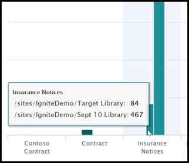

# Аналитика использования модели осмысления документаDocument understanding model usage analytics

 

> [!VIDEO https://www.microsoft.com/videoplayer/embed/RE4GnhX]  

 

Центр управления контентом Syntex в Microsoft SharePoint предоставляет аналитику использования моделей для получения дополнительных сведений о том, как используются ваши модели, опубликованные в центре управления контентом.Your Microsoft SharePoint Syntex content center provides you model usage analytics to provide more information about how your models that have been published from the content center are being used. Сюда входит следующая сводная информация:This includes a roll-up of the following information:

- Где применяются ваши моделиWhere your models are being applied
- Сколько файлов обрабатываются за определенное времяHow many files are being processed over time

   

## Суммарная доля в процентах, приходящаяся на модельTotal model percentage

     

В круговой диаграмме **Суммарная доля в процентах, приходящаяся на модель** каждая опубликованная модель показана в виде процентной доли от общего числа файлов, обработанных всеми моделями, опубликованными в центре управления контентом.The **Total model percentage** pie chart displays each published model as a percentage of the total files processed by all published models on the content center.

Для каждой модели также выводится **Показатель завершения**— процентное отношение числа файлов, которые были успешно проанализированы моделью, к общему количеству загруженных файлов.Each model also shows the **Completeness Rate**, the percentage of uploaded files that were successfully analyzed by the model. Низкий показатель завершения может указывать на наличие проблем с моделью или анализируемыми файлами.A low completeness rate may mean that there are issues with either the model or the files that are being analyzed.

## Количество файлов, обработанных за определенное времяFiles processed over time

     

В линейчатой диаграмме **Количество файлов, обработанных за определенное время** показано не только количество файлов, обработанных за определенное время для каждой модели, но и библиотеки документов, к которым была применена модель.The **Files processed over time** bar chart shows you not only the number of files processed over time for each model, but also shows you the document libraries to which the model was applied.

     

## См. такжеSee Also
[Создание классификатораCreate a classifier](create-a-classifier.md)

[Создание средства извлеченияCreate an extractor](create-an-extractor.md)

[Общие сведения об осмыслении документацииDocument Understanding overview](document-understanding-overview.md)

[Создание модели обработки формCreate a form processing model](create-a-form-processing-model.md)  
