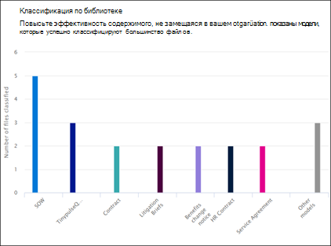

# Документ об аналитике использования модели

 

> [!VIDEO https://www.microsoft.com/videoplayer/embed/RE4CSoL]

 

В центре управления контентом Microsoft SharePoint Синтекс вы можете указать дополнительные сведения о том, как используются модели, опубликованные из центра контента. Включает в себя сведение следующих сведений:

- Место применения моделей
- Количество файлов, обрабатываемых во время

   

## Общий процент модели

     

На круговой диаграмме **итоговой модели** отображается каждая опубликованная модель в процентах от общего числа файлов, обрабатываемых всеми опубликованными моделями в центре контента.

Каждая модель также показывает **полную ставку**, процент отправленных файлов, которые были успешно проанализированы моделью. Низкая скорость полноты может означать проблемы с моделью или анализируемыми файлами.

## Обработано файлов с течением времени

     

**Файлы, обрабатываемые на** диаграмме временной шкалы, показывают, что для каждой модели не только количество файлов, обработанных с течением времени, но также показывает библиотеки документов, к которым применена модель.

     

## См. также
[Создание классификатора](create-a-classifier.md) 
[Создание средства извлечения](create-an-extractor.md) 
[Общие сведения о документе](document-understanding-overview.md) 
[Создание модели обработки форм](create-a-form-processing-model.md)  
