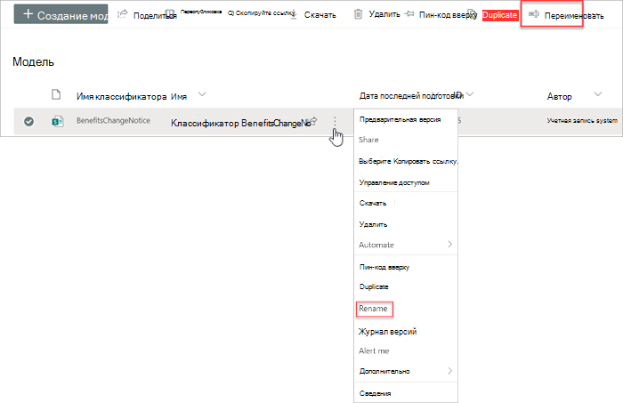
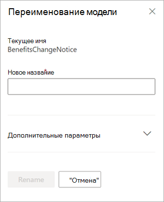

# Переименование модели в Microsoft SharePoint SyntexRename a model in Microsoft SharePoint Syntex

В какой-то момент может потребоваться переименовать модель осмысления документации.At some point, you might want to rename a document understanding model. Распространенным примером является создание исходного черновика модели, вы, возможно, не задумывались об окончательном имени (например, вы могли бы назвать его «AlexWilburModel1»).A common example is when you create an initial draft of a model, you might not have given a lot of thought as to the final name (for example, you might have named it “AlexWilburModel1”). По мере приближения к завершению модели и ее использованию, вы понимаете, что более правильным названием было бы «Продление контракта», и вы хотите переименовать его.As you come closer to finalizing the model and putting it to use, you realize that a more proper name would be “Contract Renewals,” and you want to rename it.  

Еще один пример — когда ваша организация принимает решение ссылаться на процесс или тип документа под другим именем.Another example is when your organization makes a decision to refer to a process or document type by a different name. Например, после создания модели и ее готовности к применению ваша организация может потребовать, чтобы все «Контракты» теперь формально назывались «Соглашениями».For example, after you create your model and are ready to apply it, your organization might mandate that all “Contracts” will now formally be referred to as “Agreements.” При необходимости вы можете переименовать модель с «Продление контракта» на «Продление соглашения».If needed, you can choose to rename your model from “Contract Renewals” to “Agreement Renewals.”

> [!IMPORTANT]
> Модель осмысления документации можно переименовать, только если она не была применена к библиотеке документов.You can only rename a document understanding model if it has not been applied to a document library. 

Переименование модели также переименовывает [тип контента](/sharepoint/governance/content-type-and-workflow-planning#content-type-overview), связанный с моделью.Renaming a model also renames the [content type](/sharepoint/governance/content-type-and-workflow-planning#content-type-overview) that is associated with the model.

## Переименование моделиRename a model

Выполните следующие действия, чтобы переименовать модель осмысления документации.Follow these steps to rename a document understanding model.

1. В центре контента выберите **Модели**, чтобы просмотреть список моделей.From the content center, select **Models** to see your models list.

2. На странице **Модели** выберите модель, которую нужно переименовать.On the **Models** page, select the model you want to rename.

3. С помощью ленты или кнопки **Показать действия** (рядом с именем модели) выберите **Переименовать**.By using either the ribbon or the **Show actions** button (next to the model name), select **Rename**.  

      

4. На панели **Переименование модели**:On the **Rename model** panel:

   а.a. В разделе **Новое имя** введите новое имя модели, которую вы хотите переименовать.Under **New name**, enter the new name of the model that you want to rename. 

      

   б.b. (Необязательно) В разделе **Дополнительные параметры** выберите, следует ли связать существующий [тип контента](/sharepoint/governance/content-type-and-workflow-planning#content-type-overview).(Optional) Under **Advanced settings**, select whether you want to associate an existing [content type](/sharepoint/governance/content-type-and-workflow-planning#content-type-overview). Если выбрать **Использовать существующий тип контента**, модель будет переименована в соответствие с выбранным типом контента.If you choose **Use an existing content type**, the model will be renamed to match the selected content type.

5. Выберите **Переименовать**.Select **Rename**.

## См. такжеSee Also
[Создание классификатораCreate a classifier](create-a-classifier.md)

[Создание средства извлеченияCreate an extractor](create-an-extractor.md)

[Переименование средства извлеченияRename an extractor](rename-an-extractor.md)

[Общие сведения об осмыслении документацииDocument Understanding overview](document-understanding-overview.md)

[Типы объясненияExplanation types](explanation-types-overview.md)

[Применение моделиApply a model](apply-a-model.md) 
