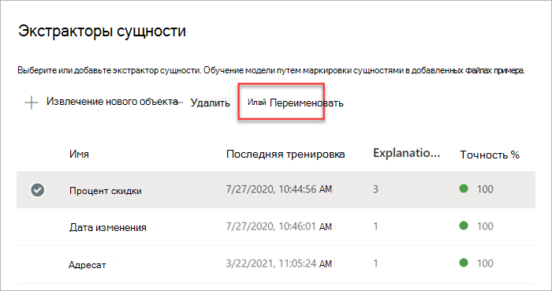
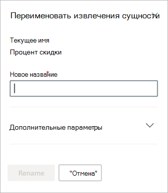

# Переименование средства извлечения в Microsoft SharePoint Syntex

В определенный момент может потребоваться переименовать извлечения, если вы хотите ссылаться на извлеченное поле данных с другим именем. Например, ваша организация решает вносить изменения в свои контрактные документы и называет "клиентов" (customers) в своих документах "клиентами" (clients). При извлечении поля "Клиент" (Customer) в модели, вы можете переименовать его в "Клиент" (Client).

При синхронизации обновленной модели с библиотекой документов SharePoint вы увидите новый столбец "Клиент" в представлении библиотеки документов. В вашем представлении сохранится столбец "Клиент" (Customer) для прошлых действий, но будет обновлен новый столбец "Клиент" (Client) для всех новых документов, обрабатываемых вашей моделью. 

> [!IMPORTANT]
>  Обязательно синхронизируйте обновленную модель с библиотеками документов, в которых она была ранее применена для отображения нового имени столбца. 

## Переименование средства извлечения

Выполните следующие действия, чтобы переименовать средство извлечения объектов.

1. В центре контента выберите **Модели**, чтобы просмотреть список моделей.

2. На странице **Модели** в столбце **Имя** выберите модель, для которой нужно переименовать средство извлечения.

3. В разделе **Средства извлечения объектов** выберите имя средства извлечения, которое вы хотите переименовать, а затем выберите **Переименовать**. 

      

4. На панели **Переименование средства извлечения объектов**:

   а. В разделе **Новое имя** введите новое имя средства извлечения. 

      

   б. (Необязательно) В разделе **Дополнительные параметры** выберите, следует ли связать существующий столбец сайта.

5. Выберите **Переименовать**.

## См. также
[Создание средства извлечения](create-an-extractor.md)

[Создание классификатора](create-a-classifier.md)

[Переименование модели](rename-a-model.md)

[Типы объяснения](explanation-types-overview.md)

[Использование таксономии банка терминов при создании средства извлечения](leverage-term-store-taxonomy.md)

[Общие сведения об осмыслении документации](document-understanding-overview.md)

[Применение модели](apply-a-model.md) 
