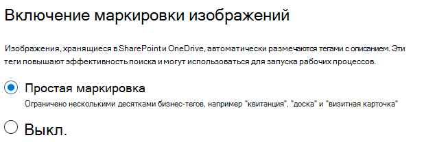

# Настройка SharePoint СинтексSet up SharePoint Syntex

Администраторы могут использовать центр администрирования Microsoft 365 для настройки и Microsoft SharePoint Синтекс.Admins can use the Microsoft 365 admin center to set up and Microsoft SharePoint Syntex. 

Прежде чем начать, примите во внимание следующее:Consider the following before you start:

- Какие сайты SharePoint будут включать обработку формы?Which SharePoint sites will you enable form processing? Все они, некоторые или выбранные сайты?All of them, some, or select sites?
- Укажите имя центра контента и пользователя, который является основным администратором сайта.What will you name of your content center, and who is the primary site admin?

Вы можете изменить параметры после начальной установки в центре администрирования Microsoft 365.You can change your settings after initial setup in the Microsoft 365 admin center.

Содержимое этой статьи предназначено для проекта Кортекс Private Preview.The content in this article is for the Project Cortex Private Preview. [Узнайте больше о Кортекс Project](https://aka.ms/projectcortex).[Find out more about Project Cortex](https://aka.ms/projectcortex).

Прежде чем приступать к настройке, запланируйте оптимальный способ установки и настройки контента в среде.Prior to setup, make sure to plan for the best way to set up and configure content understanding in your environment. Например, необходимо принять во внимание следующие моменты:For example, you need to make considerations about the following names of:

- Сайты SharePoint, для которых необходимо включить обработку форм, все они, некоторые или выбранные сайтыThe SharePoint sites that you want to enable form processing - all of them, some, or selected sites
- Ваш центр управления контентом и имя главного администратора сайтаYour content center and the name of the primary site admin

## ТребованияRequirements 

> [!NOTE]
> Чтобы получить доступ к центру администрирования Microsoft 365 и настроить общие сведения о контенте, необходимо иметь разрешения глобального администратора или администратора SharePoint.You must have Global admin or SharePoint admin permissions to be able to access the Microsoft 365 admin center and set up content understanding.

Как администратор, вы также можете вносить изменения в выбранные параметры в любое время после установки, а также во всем содержимом параметров управления в центре администрирования Microsoft 365.As an admin, you can also make changes to your selected settings anytime after setup, and throughout the content understanding management settings in the Microsoft 365 Admin Center.

## Настройка SharePoint СинтексTo set up SharePoint Syntex

1. В центре администрирования Microsoft 365 выберите пункт **Настройка**, а затем просмотрите раздел **сведения о организации** .In the Microsoft 365 admin center, select **Setup**, and then view the **Organizational knowledge** section.

2. В разделе " **сведения о организации** " выберите элемент **Автоматизация контента**.In the **Organizational knowledge** section, select **Automate content understanding**. 

     

3. На странице " **Автоматизация SharePoint Синтекс** " нажмите кнопку **начать работу** , чтобы пройти процесс установки.On the **Automate SharePoint Syntex** page, click **Get started** to walk through the setup process. 

     

4. На странице Включение тегов изображений выберите, следует ли разрешить [маркировку изображений](image-tagging.md).On the Turn on image tagging page, choose if you want to allow [image tagging](image-tagging.md).

     

5. На странице **Настройка обработки формы** можно выбрать, следует ли разрешить пользователям использовать построитель AI для создания моделей обработки форм в определенных библиотеках документов SharePoint.On the **Configure Form Processing** page, you can choose if you want to let users be able to use AI Builder to create form processing models in specific SharePoint document libraries. Команда меню будет доступна на ленте "Библиотека документов", чтобы **создать модель обработки форм** в библиотеках документов SharePoint, в которых она включена.A menu option will be available in the document library ribbon to **Create a form processing model** in SharePoint document libraries in which it is enabled.
 
     **Чтобы в библиотеках SharePoint отображался параметр для создания модели обработки форм**, можно выбрать:For **Which SharePoint libraries should show option to create a form processing model**, you can select: 
      - **Все библиотеки SharePoint** , чтобы сделать их доступными для всех библиотек SharePoint в Организации.**All SharePoint libraries** to make it available to all SharePoint libraries in your organization. 
      - **Только библиотеки на выбранных сайтах**, а затем выберите сайты, в которых вы хотите сделать их доступными.**Only libraries in selected sites**, and then select the sites in which you want to make it available. 

   

   > [!Note]
   > Включение этого параметра в библиотеке документов SharePoint не влияет на существующие модели, примененные к библиотеке, или на возможность применения моделей к библиотеке.Enabling this setting on a SharePoint document library does not affect existing models applied to the library or the ability to apply document understanding models to a library. 
    
6. На странице " **Создание центра содержимого** " можно создать сайт центра контента SharePoint, на котором пользователи могут создавать и управлять моделями документов.On the **Create Content Center** page, you can create a SharePoint content center site on which your users can create and manage document understanding models.  
    а.a. В поле **имя сайта**введите имя, которое вы хотите присвоить сайту центра контента.For **Site name**, type the name you want to give your content center site. 
    б.b. В поле **адрес сайта** отобразится URL-адрес вашего сайта в зависимости от того, что выбрано для имени сайта.The **Site address** will show the URL for your site, based on what you selected for the site name. Если вы хотите изменить его, нажмите кнопку **изменить**.If you want to change it, click **Edit**. 

       

    Нажмите кнопку **Далее**.Select **Next**.

7. На странице **"Проверка и завершение"** можно просмотреть выбранный параметр и внести изменения.On the **Review and finish** page, you can look at your selected setting and choose to make changes. Если вы удовлетворены выбранными параметрами, нажмите кнопку **активировать**.If you are satisfied with your selections, select **Activate**.

8. На странице подтверждения нажмите кнопку **done (Готово**).On the confirmation page, click **Done**.

9. Вы вернетесь на страницу **автоматизированного понимания контента** .You'll be returned to your **Automate content understanding** page. На этой странице можно выбрать пункт **Управление** , чтобы внести изменения в параметры конфигурации.From this page, you can select **Manage** to make any changes to your configuration settings. 

## Назначение лицензийAssign licenses

После настройки SharePoint Синтекс необходимо назначить лицензии для пользователей, которые будут использовать обработку форм, и ознакомиться с функциями.Once you have configured SharePoint Syntex, you must assign licenses for the users who will be using form processing and document understanding features.

Назначение лицензий:To assign licenses:

1. В центре администрирования Microsoft 365 в разделе **Пользователи**щелкните **Активные пользователи**.In the Microsoft 365 admin center, under **Users**, click **Active users**.

2. Выберите пользователей, которым вы хотите лицензировать, и щелкните **Управление лицензиями продуктов**.Select the users that you want to license, and click **Manage product licenses**.

3. Выберите команду **назначить больше**.Select **Assign more**.

4. Выберите **интеллектуальные службы контента**.Select **Intelligent Content Services**. В разделе **приложения**убедитесь, что выбраны все **Общие службы данных для интеллектуального** и **интеллектуального служб** контента.Under **Apps**, make sure **Common Data Service for Intelligent Content Services** and **Intelligent Content Services** are both selected.

    

5. Нажмите кнопку **Сохранить изменения**.Click **Save changes**.

## Кредиты в построителе AIAI Builder credits

Если у вас 300 или более лицензий SharePoint Синтекс для SharePoint Синтекс в Организации, будет выделено 1 000 000.If you have 300 or more SharePoint Syntex licenses for SharePoint Syntex in your organization, you will be allocated one million AI Builder credits. Если у вас менее 300 лицензий, вы должны приобрести кредиты в построителе AI, чтобы использовать обработку форм.If you have fewer than 300 licenses, you must purchase AI Builder credits in order to use forms processing.

Вы можете оценить мощность AI-построителя, которая подходит для вас с помощью [калькулятора AI Builder](https://powerapps.microsoft.com/ai-builder-calculator).You can estimate the AI Builder capacity that’s right for you with the [AI Builder calculator](https://powerapps.microsoft.com/ai-builder-calculator).

Перейдите в [центр администрирования Power Platform](https://admin.powerplatform.microsoft.com/resources/capacity) , чтобы проверить свои кредиты и использование.Go to the [Power Platform admin center](https://admin.powerplatform.microsoft.com/resources/capacity) to check your credits and usage.

## См. такжеSee also

[Общие сведения о модели обработки формOverview of the form processing model](https://docs.microsoft.com/ai-builder/form-processing-model-overview)

[Пошаговое руководство: создание модели документа "Общие сведения" (видео)Step-by-Step: How to Build a Document Understanding Model (video)](https://www.youtube.com/watch?v=DymSHObD-bg)

