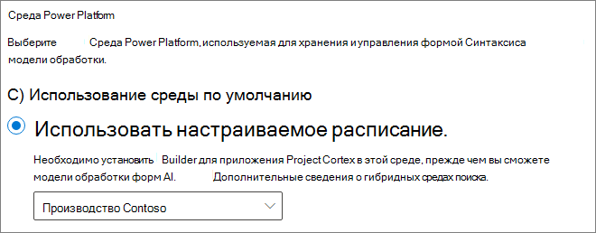

# Настройка SharePoint SyntexSet up SharePoint Syntex

Администраторы могут использовать Центр администрирования Microsoft 365 для настройки [Microsoft SharePoint Syntex](index.md).Admins can use the Microsoft 365 admin center to set up [Microsoft SharePoint Syntex](index.md). 

Прежде чем начать, примите во внимание следующие моменты:Consider the following before you start:

- На каких сайтах SharePoint будет включена обработка форм?In which SharePoint sites will you enable form processing? На всех, некоторых из них или выбранных сайтах?All of them, some, or select sites?
- Как вы назовете свой центр контента по умолчанию?What will you name your default content center?

Вы можете изменить параметры после начальной настройки в Центре администрирования Microsoft 365.You can change your settings after initial setup in the Microsoft 365 admin center.

Перед установкой убедитесь, что вы спланировали наилучший способ настройки понимания содержимого в вашей среде. В частности, необходимо принять следующие решения:Prior to setup, make sure to plan for the best way to set up and configure content understanding in your environment. For example, you need to make the following decisions:

- Сайты SharePoint, на которых вы хотите включить обработку форм — все, некоторые или выбранные сайтыThe SharePoint sites in which you want to enable form processing - all of them, some, or selected sites
- Название вашего центра контента и его администраторыThe name and admins for your content center

## ТребованияRequirements 

> [!NOTE]
> У вас должны быть разрешения глобального администратора или администратора SharePoint, чтобы получить доступ к Центру администрирования Microsoft 365 и настроить SharePoint Syntex.You must have Global admin or SharePoint admin permissions to be able to access the Microsoft 365 admin center and set up SharePoint Syntex.

Как администратор, вы также можете вносить изменения в выбранные параметры в любое время после завершения их настройки, а также во все параметры управления содержимым в Центре администрирования Microsoft 365.As an admin, you can also make changes to your selected settings anytime after setup, and throughout the content understanding management settings in the Microsoft 365 Admin Center.

Если вы планируете использовать настраиваемую среду Power Platform, необходимо [установить *приложение AI Builder для Project Cortex* в этой среде](/power-platform/admin/manage-apps#install-an-app-in-the-environment-view) и [выделить ему кредиты AI Builder](/power-platform/admin/capacity-add-on), прежде чем можно будет создавать обрабатывающие модели.If you plan to use a custom Power Platform environment, you must [install the *AI Builder for Project Cortex* app in this environment](/power-platform/admin/manage-apps#install-an-app-in-the-environment-view) and [allocate AI Builder credits](/power-platform/admin/capacity-add-on) to it before you can create form processing models.

### ЛицензированиеLicensing

Чтобы использовать SharePoint Syntex, у вашей организации должна быть подписка на SharePoint Syntex, а каждому пользователю должны быть назначены следующие лицензии:To use SharePoint Syntex, your organization must have a subscription to SharePoint Syntex, and each user must have the following licenses assigned:

- SharePoint SyntexSharePoint Syntex
- SharePoint Syntex — тип SPOSharePoint Syntex - SPO type
- Общая служба данных для SharePoint SyntexCommon Data Service for SharePoint Syntex

Если вы отмените подписку на SharePoint Syntex в будущем (или истечет срок действия пробной подписки), пользователи не смогут создавать и запускать модели осмысления документации или обработки форм, а шаблон центра контента станет недоступным.If you cancel your SharePoint Syntex subscription at a future date (or your trial expires), users will no longer be able to create or run document understanding or form processing models, and the content center template will no longer be available. Кроме того, станут недоступны отчеты банка терминов, импорт таксономии SKOS и передача типа контента.Additionally, term store reports, SKOS taxonomy import, and Content type push will no longer be available. Содержимое не удаляются, а разрешения сайта не изменяются.No content will be deleted and site permissions will not be changed.

### Титры AI BuilderAI Builder credits

Если у вас есть 300 или более лицензий SharePoint Syntex в вашей организации, вам будет выделен миллион титров AI Builder.If you have 300 or more SharePoint Syntex licenses for SharePoint Syntex in your organization, you will be allocated one million AI Builder credits. Если у вас менее 300 лицензий, необходимо купить титры AI Builder, чтобы использовать обработку форм.If you have fewer than 300 licenses, you must purchase AI Builder credits in order to use forms processing.

Вы можете оценить мощность AI Builder, которая подходит именно вам, с помощью [калькулятора AI Builder](https://powerapps.microsoft.com/ai-builder-calculator).You can estimate the AI Builder capacity that’s right for you with the [AI Builder calculator](https://powerapps.microsoft.com/ai-builder-calculator).

Если вы планируете использовать настраиваемую среду Power Platform, необходимо [выделить кредиты для этой среды](/power-platform/admin/capacity-add-on).If you plan to use a custom Power Platform environment, you must [allocate credits to that environment](/power-platform/admin/capacity-add-on).

Чтобы проверить кредиты и использование, перейдите в [Центр администрирования Power Platform](https://admin.powerplatform.microsoft.com/resources/capacity).Go to the [Power Platform admin center](https://admin.powerplatform.microsoft.com/resources/capacity) to check your credits and usage.

## Чтобы настроить SharePoint Syntex, выполните следующие действия:To set up SharePoint Syntex

1. В Центре администрирования Microsoft 365 выберите **Настройка**, затем просмотрите раздел **Файлы и содержимое**.In the Microsoft 365 admin center, select **Setup**, and then view the **Files and content** section.

2. В разделе **Файлы и содержимое** выберите **Автоматизировать понимание содержимого**.In the **Files and content** section, select **Automate content understanding**. Обратите внимание, что сведения о текущем доступном кредите AI Builder отображаются в разделе **Быстрый обзор**.Note that your current AI Builder credit availability is shown in the **At a glance** section. 

3. На странице **Автоматизировать понимание содержимого**, нажмите **Начать** , чтобы начать процесс настройки.On the **Automate content understanding** page, click **Get started** to walk through the setup process.  

    > [!div class="mx-imgBorder"]
    >  

4. На странице **Настройка обработки форм** можно выбрать, хотите ли вы, чтобы пользователи могли создавать модели обработки форм в определенных библиотеках документов SharePoint.On the **Configure Form Processing** page, you can choose if you want to let users be able to create form processing models in specific SharePoint document libraries. На ленте библиотеки документов будет доступен параметр меню **Создать модель обработки форм** в библиотеках документов SharePoint, в которых он включен.A menu option will be available in the document library ribbon to **Create a form processing model** in SharePoint document libraries in which it is enabled.
 
     Для **каких библиотек SharePoint должен отображаться параметр создания модели обработки форм**, вы можете выбрать:For **Which SharePoint libraries should show option to create a form processing model**, you can select: 
      - **Библиотеки на всех сайтах SharePoint**, чтобы сделать его доступным для всех библиотек SharePoint в вашей организации.**Libraries in all SharePoint sites** to make it available to all SharePoint libraries in your organization. 
      - **Библиотеки на выбранных сайтах SharePoint**, а затем выберите сайты, в которых вы хотите сделать его доступным, или отправьте список, содержащий до 50 сайтов.**Libraries in selected SharePoint sites**, and then select the sites in which you want to make it available or upload a list of up to 50 sites. 
      - **Не в библиотеках SharePoint**, если вы не хотите, чтобы он был доступен для всех сайтов (после настройки вы можете изменить эту настройку).**No SharePoint libraries** if you don't want to make it available to any sites (you can change this after setup).

   > [!div class="mx-imgBorder"]
   > 

   > [!Note]
   > Удаление сайта после его включения, не влияет на существующие модели, применяемые к библиотекам на этом сайте, или на возможность применять модели понимания документов к библиотеке.Removing a site after it has been included does not affect existing models applied to the libraries in that site or the ability to apply document understanding models to a library. 
    
    Если настроено несколько сред Power Platform, можно выбрать одну из них для обработки форм.If you have multiple Power Platform environments configured, you can choose which one you want to use with for form processing. (Этот параметр не будет отображаться, если у вас только одна среда.)(This option will not appear if you only have one environment.)

    

    Для **среды Power Platform** можно выбрать:For **Power Platform environment**, you can select:
    - **Использование стандартной среды**, чтобы использовать среду Power Platform по умолчанию.**Use the default environment** to use your default Power Platform environment.
    - **Использование настраиваемой среды**, чтобы использовать настраиваемую среду.**Use a custom environment** to use a custom environment. Выберите в списке среду для использования.Choose the environment that you want to use from the list. ([См. требования к пользовательской среде](/microsoft-365/contentunderstanding/set-up-content-understanding#requirements)).([See the requirements for a custom environment](/microsoft-365/contentunderstanding/set-up-content-understanding#requirements)).

    Нажмите **Далее**.Click **Next**.

5. На странице **Создание Центра содержимого** можно создать сайт Центра содержимого SharePoint, на котором пользователи смогут создавать и управлять моделями понимания документов.On the **Create Content Center** page, you can create a SharePoint content center site on which your users can create and manage document understanding models.

    1. В поле **Имя сайта** введите имя, которое вы хотите дать сайту Центра содержимого.For **Site name**, type the name you want to give your content center site.
    
    1. В **адресе сайта** будет отображаться URL-адрес вашего сайта в зависимости от выбранного имени сайта.The **Site address** will show the URL for your site, based on what you selected for the site name. Если вы хотите его изменить, нажмите **Изменить**.If you want to change it, click **Edit**.

       > [!div class="mx-imgBorder"]
       >  

       Нажмите кнопку **Далее**.Select **Next**.

6. На странице **Проверка и завершение** можно просмотреть выбранный параметр и внести в него изменения.On the **Review and finish** page, you can look at your selected setting and choose to make changes. Если выбор вас устраивает, нажмите кнопку **Активировать**.If you are satisfied with your selections, select **Activate**.

7. На странице подтверждения нажмите кнопку **Готово**.On the confirmation page, click **Done**.

8. Вы вернетесь к странице **Автоматизировать понимание содержимого**.You'll be returned to your **Automate content understanding** page. На этой странице можно выбрать **Управлять**, чтобы внести изменения в параметры настройки.From this page, you can select **Manage** to make any changes to your configuration settings. 

## Назначение лицензийAssign licenses

После настройки SharePoint Syntex необходимо назначить лицензии пользователям, которые будут использовать возможности SharePoint Syntex.Once you have configured SharePoint Syntex, you must assign licenses for the users who will be using any SharePoint Syntex features.

Чтобы назначить лицензии, выполните следующие действия:To assign licenses:

1. В Центре администрирования Microsoft 365 в разделе **Пользователи**, щелкните **Активные пользователи**.In the Microsoft 365 admin center, under **Users**, click **Active users**.

2. Выберите пользователей, которым вы хотите назначить лицензии, и нажмите **Управление лицензиями продуктов**.Select the users that you want to license, and choose **Manage product licenses**.

3. Выберите **Приложения** в раскрывающемся меню.Choose **Apps** from the drop-down menu.

4. Выберите **Показать приложения для SharePoint Syntex**.Select **Show apps for  SharePoint Syntex**. В разделе **Приложения**, убедитесь, что выбраны **Common Data Service для SharePoint Syntex**, **SharePoint Syntex**, и **SharePoint Syntex - тип SPO**.Under **Apps**, make sure **Common Data Service for SharePoint Syntex**, **SharePoint Syntex**, and **SharePoint Syntex - SPO type** are all selected.

    > [!div class="mx-imgBorder"]
    > 

5. Нажмите кнопку **Сохранить изменения**.Click **Save changes**.

## См. такжеSee also

[Обзор модели обработки формOverview of the form processing model](/ai-builder/form-processing-model-overview)

[Пошаговые инструкции: Создание модели понимания документа (видео)Step-by-Step: How to Build a Document Understanding Model (video)](https://www.youtube.com/watch?v=DymSHObD-bg)

[Создание сред и управление ими в Центре администрирования Power PlatformCreate and manage environments in the Power Platform admin center](/power-platform/admin/create-environment)
