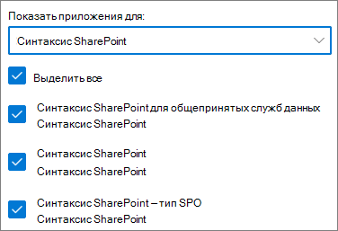

# Настройка SharePoint Syntex

Администраторы могут использовать Центр администрирования Microsoft 365 для настройки [Microsoft SharePoint Syntex](index.md). 

Прежде чем начать, примите во внимание следующие моменты:

- На каких сайтах SharePoint будет включена обработка форм? На всех, некоторых из них или выбранных сайтах?
- Как вы назовете свой центр содержимого по умолчанию?

Вы можете изменить параметры после начальной настройки в Центре администрирования Microsoft 365.

Перед установкой убедитесь, что вы спланировали наилучший способ настройки понимания содержимого в вашей среде. Например, вам необходимо принять во внимание следующие названия:

- Сайтов SharePoint, на которых вы хотите включить обработку форм — всех из них, некоторых или выбранных сайтах
- Центра содержимого и имени главного администратора сайта

## Требования 

> [!NOTE]
> У вас должны быть разрешения глобального администратора или администратора SharePoint, чтобы получить доступ к Центру администрирования Microsoft 365 и настраивать понимание содержимого.

Как администратор, вы также можете вносить изменения в выбранные параметры в любое время после завершения их настройки, а также во все параметры управления содержимым в Центре администрирования Microsoft 365.

## Чтобы настроить SharePoint Syntex, выполните следующие действия:

1. В Центре администрирования Microsoft 365 выберите **Настройка**, затем просмотрите раздел **Файлы и содержимое**.

2. В разделе **Файлы и содержимое** выберите **Автоматизировать понимание содержимого**. 

3. На странице **Автоматизировать понимание содержимого**, нажмите **Начать** , чтобы начать процесс настройки. 

     

4. На странице **Настройка обработки форм** можно выбрать, хотите ли вы, чтобы пользователи могли создавать модели обработки форм в определенных библиотеках документов SharePoint. На ленте библиотеки документов будет доступен параметр меню **Создать модель обработки форм** в библиотеках документов SharePoint, в которых он включен.
 
     Для **каких библиотек SharePoint должен отображаться параметр создания модели обработки форм**, вы можете выбрать: 
      - **Все библиотеки SharePoint**, чтобы сделать его доступным для всех библиотек SharePoint в вашей организации. 
      - **Только библиотеки на выбранных сайтах**, а затем выберите сайты, в которых вы хотите сделать его доступным, или загрузите список, содержащий до 50 сайтов. 
      - **Не в библиотеках SharePoint**, если вы не хотите, чтобы он был доступен для всех сайтов (после настройки вы можете изменить эту настройку).

   

   > [!Note]
   > Удаление сайта после его включения, не влияет на существующие модели, применяемые к библиотекам на этом сайте, или на возможность применять модели понимания документов к библиотеке. 
    
5. На странице **Создание Центра содержимого** можно создать сайт Центра содержимого SharePoint, на котором пользователи смогут создавать и управлять моделями понимания документов.  
    а. В поле **Имя сайта** введите имя, которое вы хотите дать сайту Центра содержимого. 
    б. В **адресе сайта** будет отображаться URL-адрес вашего сайта в зависимости от выбранного имени сайта. Если вы хотите его изменить, нажмите **Изменить**. 

       

    Нажмите кнопку **Далее**.

6. На странице **Проверка и завершение** можно просмотреть выбранный параметр и внести в него изменения. Если выбор вас устраивает, нажмите кнопку **Активировать**.

7. На странице подтверждения нажмите кнопку **Готово**.

8. Вы вернетесь к странице **Автоматизировать понимание содержимого**. На этой странице можно выбрать **Управлять**, чтобы внести изменения в параметры настройки. 

## Назначение лицензий

После настройки SharePoint Syntex необходимо назначить лицензии пользователям, которые будут использовать возможности SharePoint Syntex.

Чтобы назначить лицензии, выполните следующие действия:

1. В Центре администрирования Microsoft 365 в разделе **Пользователи**, щелкните **Активные пользователи**.

2. Выберите пользователей, которых вы хотите лицензировать, и щелкните **Управление лицензиями продуктов**.

3. Щелкните **Назначить еще**.

4. Выберите **Интеллектуальные службы содержимого**. Убедитесь в том, что в разделе **Приложения** выбраны параметры **Common Data Service для интеллектуальных служб содержимого** и **Интеллектуальные службы содержимого**.

    

5. Нажмите кнопку **Сохранить изменения**.

## Титры AI Builder

Если у вас есть 300 или более лицензий SharePoint Syntex в вашей организации, вам будет выделен миллион титров AI Builder. Если у вас менее 300 лицензий, необходимо купить титры AI Builder, чтобы использовать обработку форм.

Вы можете оценить мощность AI Builder, которая подходит именно вам, с помощью [калькулятора AI Builder](https://powerapps.microsoft.com/ai-builder-calculator).

Чтобы проверить титры и использование, перейдите в [Центр администрирования Power Platform](https://admin.powerplatform.microsoft.com/resources/capacity).

## См. также

[Обзор модели обработки форм](https://docs.microsoft.com/ai-builder/form-processing-model-overview)

[Пошаговые инструкции: Создание модели понимания документа (видео)](https://www.youtube.com/watch?v=DymSHObD-bg)

