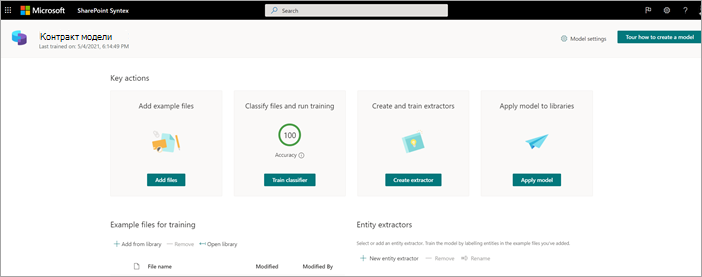
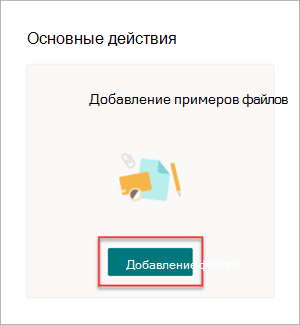
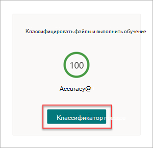
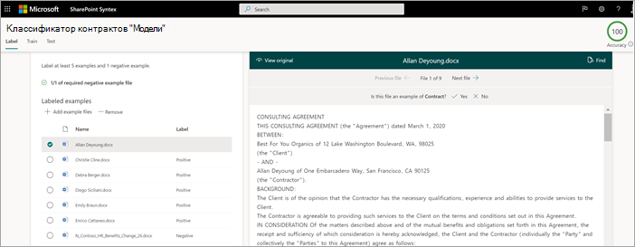
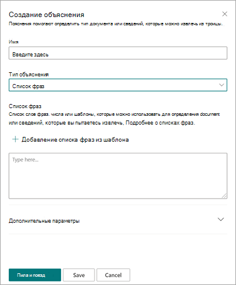
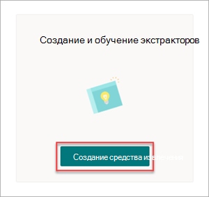
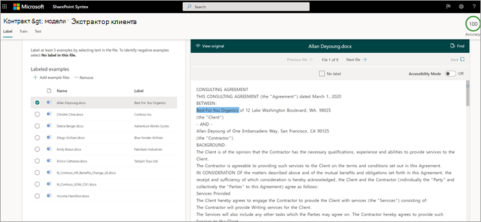
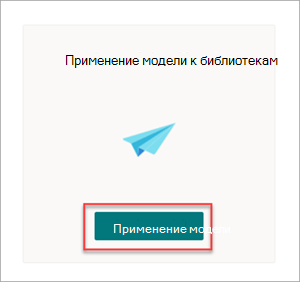
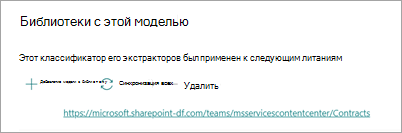

# Этап 1.Step 1. Использование SharePoint Syntex для определения файлов контрактов и извлечения данныхUse SharePoint Syntex to identify contract files and extract data

Вашей организации необходим способ определения и классификации всех документов по контрактам из множества файлов, которые вы получаете.Your organization needs a way to identify and classify all contract documents from the many files you receive. Кроме *того,* необходимо быстро просмотреть несколько ключевых элементов в каждом из идентифицированных файлов контрактов (например, клиент, *подрядчик* и сумма *платы).*You also want to be able to quickly view several key elements in each of the contract files identified (for example, *Client*, *Contractor*, and *Fee amount*). Это можно сделать с помощью [SharePoint Syntex](index.md) для создания модели понимания документов и ее применения в библиотеке документов.You can do this by using [SharePoint Syntex](index.md) to create a document understanding model and applying it to a document library.

## Обзор процессаOverview of the process

[Для автоматизации](document-understanding-overview.md) классификации файлов и извлечения информации для понимания документов используются модели искусственного интеллекта (AI).[Document understanding](document-understanding-overview.md) uses artificial intelligence (AI) models to automate classification of files and extraction of information. Модели понимания документов также являются оптимальными для извлечения информации из неструктурированных и полуструктурированных документов, в которых необходимая информация не содержится в таблицах или формах, например в контрактах.Document understanding models are also optimal in extracting information from unstructured and semi-structured documents where the information you need isn't contained in tables or forms, such as contracts.

1. Сначала необходимо найти по крайней мере пять примеров файлов, которые можно использовать для "обучения" модели для поиска характеристик, определенных типу контента, который вы пытаетесь определить (контракт).First, you need to find at least five example files that you can use to "train" the model to search for characteristics that are specific to the content type you're trying to identify (a contract). 

2. С SharePoint Syntex создайте новую модель понимания документов.Using SharePoint Syntex, create a new document understanding model. С помощью примеров файлов необходимо [создать классификатор](create-a-classifier.md).Using your example files, you need to [create a classifier](create-a-classifier.md). Обучив классификатор с примерными файлами, вы научите его искать характеристики, характерные для того, что вы увидите в контрактах вашей компании.By training the classifier with your example files, you teach it to search for characteristics that are specific to what you would see in your company's contracts. Например, [создайте "объяснение",](create-a-classifier.md#create-an-explanation) которое ищет определенные строки, которые находятся в ваших контрактах, таких как соглашение об обслуживании, условия соглашения *и* *компенсации*.For example, [create an "explanation"](create-a-classifier.md#create-an-explanation) that searches for specific strings that are in your contracts, such as *Service Agreement*, *Terms of Agreement*, and *Compensation*. Вы даже можете обучить объяснению искать эти строки в определенных разделах документа или расположенных рядом с другими строками.You can even train your explanation to look for these strings in specific sections of the document, or located next to other strings. Если вы считаете, что обучили классификатор сведениям, которые ему необходимы, вы можете проверить модель на примере набора примеров файлов, чтобы узнать, насколько она эффективна.When you think you have trained your classifier with the information it needs, you can test your model on a sample set of example files to see how efficient it is. После тестирования можно при необходимости внести изменения в свои объяснения, чтобы сделать их более эффективными.After testing, if needed you can choose to make changes to your explanations to make them more efficient. 

3. В модели можно [создать](create-an-extractor.md) экстрактор для получения определенных фрагментов данных из каждого контракта.In your model, you can [create an extractor](create-an-extractor.md) to pull out specific pieces of data from each contract. Например, для каждого контракта больше всего вас беспокоит информация о том, кто клиент, имя подрядчика и общая стоимость.For example, for each contract, the information you're most concerned about is who the client is, the name of the contractor, and the total cost.

4. После успешного создания модели применяйте ее в библиотеке SharePoint [документов.](apply-a-model.md)After you successfully create your model, [apply it to a SharePoint document library](apply-a-model.md). При отправке документов в библиотеку документов будет работать модель понимания документов, которая будет определять и классифицировать все файлы, соответствующие типу контента контрактов, определенному в модели.As you upload documents to the document library, your document understanding model will run and will identify and classify all files that match the contracts content type you defined in your model. Все файлы, классифицируются как контракты, будут отображаться в пользовательском представлении библиотеки.All files that are classified as contracts will display in a custom library view. В файлах также будут отображаться значения из каждого контракта, определенного в экстракторе.The files will also display the values from each contract that you defined in your extractor.

   

5. Если у вас есть требования к удержанию для  контрактов, вы также можете использовать модель для применения метки хранения, которая не позволит удалить контракты в течение определенного периода времени.If you have retention requirements for your contracts, you can also use your model to [apply a retention label](apply-a-retention-label-to-a-model.md) that will prevent your contracts from being deleted for a specified period of time.

## Действия по созданию и подготовке моделиSteps to create and train your model

> [!NOTE]
> Для этих действий можно использовать примеры файлов в репозитории ресурсов решений по управлению [контрактами.](https://github.com/pnp/syntex-samples/tree/main/scenario%20assets/Contracts%20Management)For these steps, you can use the example files in the [Contracts Management Solution Assets repository](https://github.com/pnp/syntex-samples/tree/main/scenario%20assets/Contracts%20Management). Примеры в этом репозитории содержат как файлы модели для понимания документов, так и файлы, используемые для подготовки модели.The examples in this repository contain both the document understanding model files and the files used to train the model.

### Создание модели ContractCreate a Contract model

Первым шагом является создание модели Контракта.The first step is to create your Contract model.

1. В центре контента выберите **Создать**, а затем —**Создать модель**.From the content center, select **New**, and then **Create a model**.

2. В поле **"Новое понимание документа"** в поле **Имя** введите имя модели.On the **New document understanding model** pane, in the **Name** field, type the name of the model. Для этого решения по управлению контрактом можно назвать типовой *контракт.*For this contract management solution, you can name the model *Contract*.

4. Нажмите **Создать**.Choose **Create**. В результате будет создана домашняя страница для модели.This creates a home page for the model. 

    

### Обучение модели классификации типа файлаTrain your model to classify a type of file

#### Добавление примеров файлов для моделиAdd example files for your model

Необходимо добавить по крайней мере пять примеров файлов, которые являются документами контрактов, и один пример файла, который не является документом контракта (например, заявление о работе).You need to add at least five example files that are contract documents, and one example file that's not a contract document (for example, a statement of work). 

1. На странице **Models >,** в статье **Основные** действия  >  **Добавить примеры файлов**, выберите Добавить **файлы**.On the **Models > Contract** page, under **Key actions** > **Add example files**, select **Add files**.

   

2. В **примере Выберите файлы для страницы** модели откройте папку Контракт, выберите файлы, которые вы хотите использовать, а затем выберите **Добавить**.On the **Select example files for your model** page, open the Contract folder, select files you want to use, and then select **Add**. Если у вас нет примеров файлов, выберите Upload **добавить** их.If you don't have example files there, select **Upload** to add them.

#### Пометить файлы как положительные или отрицательные примерыLabel the files as positive or negative examples

1. На странице **Models >,** в статье **Ключевые** действия классифицировать файлы и выполнить обучение, выберите  >   **классификатор Train**.On the **Models > Contract** page, under **Key actions** > **Classify files and run training**, select **Train classifier**.

   

2. На странице классификатора > contract **> Contract** в верхней части файла первого примера будет см. текст с вопросом, является ли файл примером созданной модели Contract.On the **Models > Contract > Contract classifier** page, in the viewer on the top of the first example file, you'll see text asking if the file is an example of the Contract model you created. Если это положительный пример выберите **Да**.If it is a positive example, select **Yes**. Если это отрицательный пример выберите **Нет**.If it is a negative example, select **No**.

3. В **списке примеры с** меткой слева выберите другие файлы, которые необходимо использовать в качестве примеров, и пометить их.From the **Labeled examples** list on the left, select other files that you want to use as examples, and label them. 

     

#### Добавьте хотя бы одно объяснение для обучения классификатораAdd at least one explanation to train the classifier 

1. На странице **классификатора > contract > contract** выберите вкладку **Train.**On the **Models > Contract > Contract classifier** page, select the **Train** tab.

2. В разделе **&quot;Обученные файлы&quot;** вы увидите список файлов примеров, которые были помечены ранее.In the **Trained files** section, you'll see a list of the example files that you previously labeled. Выберите один из положительных файлов из списка, чтобы отобразить его в зритель.Select one of the positive files from the list to display it in the viewer.

3. В разделе **Пояснения** выберите **New,** а затем **Blank**.In the **Explanations** section, select **New** and then **Blank**.

4. На странице **Создание объяснения**:On the **Create an explanation** page:

    а.a. В поле **Name** введите имя объяснения (например, &quot;Согласование").In the **Name** field, type the name of the explanation (such as "Agreement").

    Б.b. В поле **"Разъяснение"** выберите **список Фразы,** так как вы добавляете текстовую строку.In the **Explanation type** field, select **Phrase list**, because you add a text string.

    В.c. В поле **Список фраз** введите строку (например, "AGREEMENT").In the **Phrase list** box, type the string (such as "AGREEMENT"). Вы можете выбрать **чувствительный к делу,** если строка должна быть чувствительной к делу.You can select **Case sensitive** if the string needs to be case-sensitive.

    г.d. Выберите **Сохранить и обучить**.Select **Save and train**.

     

#### Тестирование моделиTest your model

Вы можете протестировать модель контракта на примере файлов, которые она еще не видела.You can test your Contract model on example files it hasn’t seen before. Это необязательно, но это может быть полезной наилучшей практикой.This is optional, but it can be a useful best practice.

1. На странице **классификатора > contract > contract** выберите вкладку **Test.** Эта модель выполняется в неослабных файлах примеров.On the **Models > Contract > Contract classifier** page, select the **Test** tab. This runs the model on your unlabeled example files.

2. В **списке Тестовые файлы** отображаются файлы примера и показано, предсказывает ли модель положительный или отрицательный результат.In the **Test Files** list, your example files display and shows if the model predicted them to be positive or negative. Используйте эти сведения, чтобы определить эффективность классификатора в определении ваших документов.Use this information to help determine the effectiveness of your classifier in identifying your documents.

     

3. После этого выберите **обучение выходу.**When done, select **Exit Training**.

### Создание и обучение экстрактораCreate and train an extractor

1. На странице **Models > Contract** в статье Key **Actions** Create and  >  **train extractors** выберите Create **extractor**.On the **Models > Contract** page, under **Key actions** > **Create and train extractors**, select **Create extractor**.

   

2. На панели **извлечений нового** объекта в поле **Новое** имя введите имя извлечения.On the **New entity extractor** panel, in the **New name** field, type the name of your extractor. Например, назови его *Клиент,* если вы хотите извлечь имя клиента из каждого контракта.For example, name it *Client* if you want to extract the name of the client from each contract.

3. Когда вы закончили, выберите **Создать**.When you're done, select **Create**.

#### Метка объекта, который необходимо извлечьLabel the entity you want to extract

При создании экстрактора откроется страница экстрактора.When you create the extractor, the extractor page opens. Здесь вы видите список ваших примеров файлов, причем первый файл в списке отображается в средстве просмотра.Here you see a list of your sample files, with the first file on the list displayed in the viewer.

 

Чтобы пометить объект:To label the entity:

1. В средстве просмотра выберите данные, которые нужно извлечь из файлов.From the viewer, select the data that you want to extract from the files. Например, если вы хотите извлечь *клиента,* вы выделяете значение клиента в первом файле (в этом примере Best *For You Organics),* а затем выберите **Сохранить**.For example, if you want to extract the *Client*, you highlight the client value in the first file (in this example, *Best For You Organics*), and then select **Save**. В столбце **Метка** отображается отображение  значения из файла в списке примеров с меткой.You'll see the value display from the file in the **Labeled examples** list, under the **Label** column.

2. Выберите **следующий файл** для автозаданий и откройте следующий файл в списке в зрителье.Select **Next file** to autosave and open the next file in the list in the viewer. Или выберите **Сохранить,** а затем выберите другой файл из списка **примеров с меткой.**Or select **Save**, and then select another file from the **Labeled examples** list.

3. В представлении повторите шаги 1 и 2, а затем повторите, пока не сэкономит метку во всех файлах.In the viewer, repeat steps 1 and 2, then repeat until you saved the label in all the files.

После маркировки файлов отображается баннер уведомлений, информирующий о переходе на обучение.After you've labeled the files, a notification banner displays informing you to move to training. Вы можете выбрать метку дополнительных документов или продвижения к обучению.You can choose to label more documents or advance to training.

#### Добавление объясненийAdd an explanation

Вы можете создать объяснение, которое содержит подсказку о самом формате сущности и вариантах, которые он может иметь в примерах файлов.You can create an explanation that provides a hint about the entity format itself and variations it might have in the example files. Например, значение даты может быть в разных форматах, таких как:For example, a date value can be in many different formats, such as:

- 10/14/201910/14/2019
- 14 октября 2019 г.October 14, 2019
- Понедельник, 14 октября 2019 г.Monday, October 14, 2019

Чтобы определить дату *начала контракта,* можно создать объяснение шаблона.To help identify the *Contract Start Date*, you can create a pattern explanation.

1. В разделе **Пояснения** выберите **New,** а затем **Blank**.In the **Explanations** section, select **New** and then **Blank**.

2. На странице **Создание объяснения**:On the **Create an explanation** page:

    а.a. В поле **Имя** введите имя объяснения (например, *Дата).*In the **Name** field, type the name of the explanation (such as *Date*).

    Б.b. В поле **"Разъяснение"** выберите **список шаблонов**.In the **Explanation type** field, select **Pattern list**.

    В.c. В поле **Значение** укай вариант даты, как они отображаются в примере файлов.In the **Value** field, provide the date variation as they appear in the sample files. Например, если у вас есть форматы даты, которые отображаются как 0/00/0000, вы вводите любые варианты, которые появляются в ваших документах, например:For example, if you have date formats that appear as 0/00/0000, you enter any variations that appear in your documents, such as:

    - 0/0/00000/0/0000
    - 0/00/00000/00/0000
    - 00/0/000000/0/0000
    - 00/00/000000/00/0000

4. Выберите **Сохранить и обучить**.Select **Save and train**.

#### Снова протестировать модельTest your model again

Вы можете протестировать модель контракта на примере файлов, которые она еще не видела.You can test your Contract model on example files it hasn’t seen before. Это необязательно, но это может быть полезной наилучшей практикой.This is optional, but it can be a useful best practice.

1. На странице **классификатора > contract > contract** выберите вкладку **Test.** Эта модель выполняется в неослабных файлах примеров.On the **Models > Contract > Contract classifier** page, select the **Test** tab. This runs the model on your unlabeled example files.

2. В **списке тестовых файлов** отображаются файлы примера и показано, может ли модель извлекать необходимые сведения.In the **Test files** list, your example files display and shows if the model is able to extract the information you need. Используйте эти сведения, чтобы определить эффективность классификатора в определении ваших документов.Use this information to help determine the effectiveness of your classifier in identifying your documents.

3. После этого выберите **обучение выходу.**When done, select **Exit Training**.

### Применение модели в библиотеке документовApply your model to a document library

Чтобы применить модель к библиотеке SharePoint документов:To apply your model to a SharePoint document library:

1. На странице **Models >, в** статье **Ключевые** действия Применить модель к  >  **библиотекам,** выберите **Применить модель**.On the **Models > Contract** page, under **Key actions** > **Apply model to libraries**, select **Apply model**.

   

2. На панели **Добавить контракт** выберите SharePoint, на который содержится библиотека документов, на которую необходимо применить модель.On the **Add Contract** panel, select the SharePoint site that contains the document library that you want to apply the model to. Если сайт не отображается в списке, используйте поле поиска, чтобы найти его.If the site does not show in the list, use the search box to find it. Нажмите **Добавить**.Select **Add**.

    > [!NOTE]
    > Вам потребуются разрешения *Управление списком* или права на *редактирование* для библиотеки документов, к которой применяется модель.You must have *Manage List* permissions or *Edit* rights to the document library you are applying the model to.

3. После выбора сайта выберите библиотеку документов, к которой необходимо применить модель.After you select the site, select the document library to which you want to apply the model.

4. Так как модель связана с типом контента, при ее применении к библиотеке будет добавлен тип контента и его представление с метки, извлеченные в виде столбцов.Because the model is associated to a content type, when you apply it to the library it will add the content type and its view with the labels you extracted showing as columns. Это представление является представлением библиотеки по умолчанию, но по умолчанию можно выбрать, чтобы оно не было представлением  по умолчанию, выбрав **расширенные** параметры и очистив это новое представление в качестве контрольного окна по умолчанию.This view is the library's default view by default, but you can optionally choose to have it not be the default view by selecting **Advanced settings** and clearing the **Set this new view as default** check box.

5. Нажмите кнопку **Добавить**, чтобы применить модель к библиотеке.Select **Add** to apply the model to the library.

6. На странице **Models > Contract** в  разделе Библиотеки с этой моделью вы увидите URL-адрес SharePoint сайта.On the **Models > Contract** page, in the **Libraries with this model** section, you'll see the URL to the SharePoint site listed.

    

После применения модели к библиотеке документов можно приступить к отправке документов на сайт и увидеть результаты.After you apply the model to the document library, you can begin uploading documents to the site and see the results.

## Следующий шагNext step

[Шаг 2. Используйте Microsoft Teams для создания канала управления контрактамиStep 2. Use Microsoft Teams to create your contract management channel](solution-manage-contracts-step2.md)