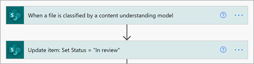

# <a name="step-3-use-power-automate-to-create-your-flow-to-process-your-contracts"></a>Этап 3. Используйте Power Automate для создания потока для обработки контрактов

Вы создали канал управления контрактами и прикрепили SharePoint библиотеку документов. Следующий шаг — создание потока Power Automate обработки контрактов, которые идентифицирует и классифицирует SharePoint syntex. Вы можете сделать этот шаг, [создав поток Power Automate в библиотеке](https://support.microsoft.com/office/create-a-flow-for-a-list-or-library-in-sharepoint-or-onedrive-a9c3e03b-0654-46af-a254-20252e580d01)SharePoint документов.

Для решения управления контрактами необходимо создать поток Power Automate для следующих действий:

-  После того, как контракт был классифицирован SharePoint моделью Syntex, измените состояние контракта на **In review**.
- Затем контракт пересматривается и утверждается или отклоняется.
- Для утвержденных контрактов сведения о контракте вывешив на вкладке для обработки платежей.
- Для отклоненных контрактов команда уведомлена для дальнейшего анализа. 

На следующей схеме показан Power Automate для решения по управлению контрактами.


## <a name="prepare-your-contract-for-review"></a>Подготовка контракта для проверки

При выявлении и классификации контракта SharePoint модели понимания документов Syntex поток Power Automate сначала изменит состояние на **Обзор**.



После проверки файла измените значение состояния на **"В обзоре".**


На следующем этапе необходимо создать адаптивную карту, указывав, что контракт ожидает рассмотрения и отправки в канал управления контрактами.


Ниже приводится код JSON, используемый для этого шага в потоке Power Automate.

```JSON
{
"$schema": "http://adaptivecards.io/schemas/adaptive-card.json",
"type": "AdaptiveCard",
"version": "1.0",
"body": [
    {
    "type": "TextBlock",
    "text": "Contract approval request",
    "size": "large",
    "weight": "bolder",
     "wrap": true
    },
        {
            "type": "Container",
            "items": [
                {
                    "type": "FactSet",
                    "spacing": "Large",
                    "facts": [
                        {
                            "title": "Client",
                            "value": "@{triggerOutputs()?['body/Client']}"
                        },
                        {
                            "title": "Contractor",
                            "value": "@{triggerOutputs()?['body/Contractor']}"
                        },
                        {
                            "title": "Fee amount",
                            "value": "@{triggerOutputs()?['body/FeeAmount']}"
                        },
                        {
                            "title": "Date created",
                            "value": "@{triggerOutputs()?['body/Modified']} "
                        },
                        {
                            "title": "Link",
                            "value": "[@{triggerOutputs()?['body/{FilenameWithExtension}']}](@{triggerOutputs()?['body/{Link}']})"
                        }
                    ]
                }
            ]
         },
    {
    "type": "TextBlock",
    "text": "Comment:"
    },
        {
            "type": "Input.Text",
            "placeholder": "Enter comments",
            "id": "acComments"
        }
],
"actions": [
    {
    "type": "Action.Submit",
    "title": "Approve",
    "data": {
        "x": "Approve"
    }
    },
    {
    "type": "Action.Submit",
    "title": "Reject",
    "data": {
        "x": "Reject"
    }
    }
]
}
```


## <a name="conditional"></a>Условный

В потоке далее необходимо создать условие, при котором ваш контракт будет либо утвержден, либо отклонен.


## <a name="if-the-contract-is-approved"></a>Если контракт утвержден

После утверждения контракта возникают следующие вещи:

- На **вкладке "Контракты"** состояние карты контракта будет изменяться на **"Утверждено".**

   

- В потоке состояние изменено на **"Утверждено".**

   

- В этом решении данные о контракте будут добавлены на вкладку **For Payout,** чтобы можно было управлять выплатами. Этот процесс можно расширить, чтобы разрешить потоку отправлять контракты на оплату сторонним финансовым приложением (например, Dynamics CRM).

   

- В потоке создается следующий элемент для перемещения утвержденных контрактов на вкладку **For Payout.**

   

- Адаптивная карта, указывательная, что контракт утвержден, создается и вывешиваться в канале управления контрактами.

   

   


   Ниже приводится код JSON, используемый для этого шага в потоке Power Automate.

```JSON
{ 
    "type": "AdaptiveCard",
    "body": [
        {
            "type": "Container",
            "style": "emphasis",
            "items": [
                {
                    "type": "ColumnSet",
                    "columns": [
                        {
                            "type": "Column",
                            "items": [
                                {
                                    "type": "TextBlock",
                                    "size": "Large",
                                    "weight": "Bolder",
                                    "text": "CONTRACT APPROVED"
                                }
                            ],
                            "width": "stretch"
                        }
                    ]
                }
            ],
            "bleed": true
        },
        {
            "type": "Container",
            "items": [
                {
                    "type": "FactSet",
                    "spacing": "Large",
                    "facts": [
                        {
                            "title": "Client",
                            "value": "@{triggerOutputs()?['body/Client']}"
                        },
                        {
                            "title": "Contractor",
                            "value": "@{triggerOutputs()?['body/Contractor']}"
                        },
                        {
                            "title": "Fee amount",
                            "value": "@{triggerOutputs()?['body/FeeAmount']}"
                        },
                        {
                            "title": "Approval by",
                            "value": "@{body('Post_an_Adaptive_Card_to_a_Teams_channel_and_wait_for_a_response')?['responder']['displayName']}"
                        },
                        {
                            "title": "Approved date",
                            "value": "@{body('Post_an_Adaptive_Card_to_a_Teams_channel_and_wait_for_a_response')?['responseTime']}"
                        },
                        {
                            "title": "Approval comment",
                            "value": "@{body('Post_an_Adaptive_Card_to_a_Teams_channel_and_wait_for_a_response')?['data']['acComments']}"
                        },
                        {
                            "title": " ",
                            "value": " "
                        },
                        {
                            "title": "Status",
                            "value": "Ready for payout"
                        }
                    ]
                }
            ]
        }
    ],
    "$schema": "http://adaptivecards.io/schemas/adaptive-card.json",
    "version": "1.2",
    "fallbackText": "This card requires Adaptive Cards v1.2 support to be rendered properly."
}
```

## <a name="if-the-contract-is-rejected"></a>Если контракт отклонен

При отклонении контракта возникают следующие действия:

- На **вкладке Контракты** состояние карты контракта будет изменяться на **Отклонено.**

   

- В потоке проверьте файл контракта, измените состояние на **Отклонено,** а затем проверьте файл обратно.

   

- В потоке создается адаптивная карта, указывляемая, что контракт отклонен.

   

Ниже приводится код JSON, используемый для этого шага в потоке Power Automate.

```JSON
{ 
    "type": "AdaptiveCard",
    "body": [
        {
            "type": "Container",
            "style": "attention",
            "items": [
                {
                    "type": "ColumnSet",
                    "columns": [
                        {
                            "type": "Column",
                            "items": [
                                {
                                    "type": "TextBlock",
                                    "size": "Large",
                                    "weight": "Bolder",
                                    "text": "CONTRACT REJECTED"
                                }
                            ],
                            "width": "stretch"
                        }
                    ]
                }
            ],
            "bleed": true
        },
        {
            "type": "Container",
            "items": [
                {
                    "type": "FactSet",
                    "spacing": "Large",
                    "facts": [
                        {
                            "title": "Client",
                            "value": "@{triggerOutputs()?['body/Client']}"
                        },
                        {
                            "title": "Contractor",
                            "value": "@{triggerOutputs()?['body/Contractor']}"
                        },
                        {
                            "title": "Fee amount",
                            "value": "@{triggerOutputs()?['body/FeeAmount']}"
                        },
                        {
                            "title": "Rejected by",
                            "value": "@{body('Post_an_Adaptive_Card_to_a_Teams_channel_and_wait_for_a_response')?['responder']['displayName']}"
                        },
                        {
                            "title": "Rejected date",
                            "value": "@{body('Post_an_Adaptive_Card_to_a_Teams_channel_and_wait_for_a_response')?['responseTime']}"
                        },
                        {
                            "title": "Comment",
                            "value": "@{body('Post_an_Adaptive_Card_to_a_Teams_channel_and_wait_for_a_response')?['data']['acComments']}"
                        },
                        {
                            "title": " ",
                            "value": " "
                        },
                        {
                            "title": "Status",
                            "value": "Needs review"
                        }
                    ]
                }
            ]
        }
    ],
    "$schema": "http://adaptivecards.io/schemas/adaptive-card.json",
    "version": "1.2",
    "fallbackText": "This card requires Adaptive Cards v1.2 support to be rendered properly."
}
```

- Карта размещена в канале управления контрактами.

   