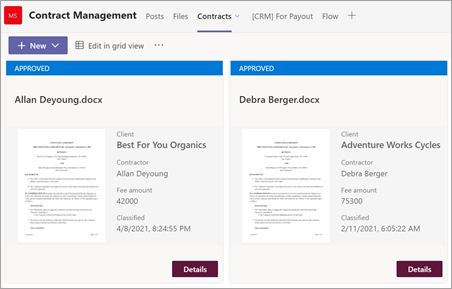

# <a name="step-3-use-power-automate-to-create-your-flow-to-process-your-contracts"></a><span data-ttu-id="1b994-104">Этап 3.</span><span class="sxs-lookup"><span data-stu-id="1b994-104">Step 3.</span></span> <span data-ttu-id="1b994-105">Используйте Power Automate для создания потока для обработки контрактов</span><span class="sxs-lookup"><span data-stu-id="1b994-105">Use Power Automate to create your flow to process your contracts</span></span>

<span data-ttu-id="1b994-106">Вы создали канал управления контрактами и прикрепили SharePoint библиотеку документов.</span><span class="sxs-lookup"><span data-stu-id="1b994-106">You've created your Contract Management channel and have attached your SharePoint document library.</span></span> <span data-ttu-id="1b994-107">Следующий шаг — создание потока Power Automate обработки контрактов, которые идентифицирует и классифицирует SharePoint syntex.</span><span class="sxs-lookup"><span data-stu-id="1b994-107">The next step is to create a Power Automate flow to process your contracts that your SharePoint Syntex model identifies and classifies.</span></span> <span data-ttu-id="1b994-108">Вы можете сделать этот шаг, [создав поток Power Automate в библиотеке](https://support.microsoft.com/office/create-a-flow-for-a-list-or-library-in-sharepoint-or-onedrive-a9c3e03b-0654-46af-a254-20252e580d01)SharePoint документов.</span><span class="sxs-lookup"><span data-stu-id="1b994-108">You can do this step by [creating a Power Automate flow in your SharePoint document library](https://support.microsoft.com/office/create-a-flow-for-a-list-or-library-in-sharepoint-or-onedrive-a9c3e03b-0654-46af-a254-20252e580d01).</span></span>

<span data-ttu-id="1b994-109">Для решения управления контрактами необходимо создать поток Power Automate для следующих действий:</span><span class="sxs-lookup"><span data-stu-id="1b994-109">For your contracts management solution, you want to create a Power Automate flow to do the following actions:</span></span>

-  <span data-ttu-id="1b994-110">После того, как контракт был классифицирован SharePoint моделью Syntex, измените состояние контракта на **In review**.</span><span class="sxs-lookup"><span data-stu-id="1b994-110">After a contract has been classified by your SharePoint Syntex model, change the contract status to **In review**.</span></span>
- <span data-ttu-id="1b994-111">Затем контракт пересматривается и утверждается или отклоняется.</span><span class="sxs-lookup"><span data-stu-id="1b994-111">The contract is then reviewed and is either approved or rejected.</span></span>
- <span data-ttu-id="1b994-112">Для утвержденных контрактов сведения о контракте вывешив на вкладке для обработки платежей.</span><span class="sxs-lookup"><span data-stu-id="1b994-112">For approved contracts, the contract information is posted to a tab for payment processing.</span></span>
- <span data-ttu-id="1b994-113">Для отклоненных контрактов команда уведомлена для дальнейшего анализа.</span><span class="sxs-lookup"><span data-stu-id="1b994-113">For rejected contracts, the team is notified for further analysis.</span></span> 

<span data-ttu-id="1b994-114">На следующей схеме показан Power Automate для решения по управлению контрактами.</span><span class="sxs-lookup"><span data-stu-id="1b994-114">The following diagram shows the Power Automate flow for the contract management solution.</span></span>


## <a name="prepare-your-contract-for-review"></a><span data-ttu-id="1b994-116">Подготовка контракта для проверки</span><span class="sxs-lookup"><span data-stu-id="1b994-116">Prepare your contract for review</span></span>

<span data-ttu-id="1b994-117">При выявлении и классификации контракта SharePoint модели понимания документов Syntex поток Power Automate сначала изменит состояние на **Обзор**.</span><span class="sxs-lookup"><span data-stu-id="1b994-117">When a contract is identified and classified by your SharePoint Syntex document understanding model, the Power Automate flow will first change the status to **In review**.</span></span>


<span data-ttu-id="1b994-119">После проверки файла измените значение состояния на **"В обзоре".**</span><span class="sxs-lookup"><span data-stu-id="1b994-119">After checking out the file, change the status value to **In review**.</span></span>


<span data-ttu-id="1b994-121">На следующем этапе необходимо создать адаптивную карту, указывав, что контракт ожидает рассмотрения и отправки в канал управления контрактами.</span><span class="sxs-lookup"><span data-stu-id="1b994-121">The next step is to create an adaptive card stating that the contract is waiting for review and posting it to the Contract Management channel.</span></span>


<span data-ttu-id="1b994-124">Ниже приводится код JSON, используемый для этого шага в потоке Power Automate.</span><span class="sxs-lookup"><span data-stu-id="1b994-124">The following code is the JSON used for this step in the Power Automate flow.</span></span>

```JSON
{
"$schema": "http://adaptivecards.io/schemas/adaptive-card.json",
"type": "AdaptiveCard",
"version": "1.0",
"body": [
    {
    "type": "TextBlock",
    "text": "Contract approval request",
    "size": "large",
    "weight": "bolder",
     "wrap": true
    },
        {
            "type": "Container",
            "items": [
                {
                    "type": "FactSet",
                    "spacing": "Large",
                    "facts": [
                        {
                            "title": "Client",
                            "value": "@{triggerOutputs()?['body/Client']}"
                        },
                        {
                            "title": "Contractor",
                            "value": "@{triggerOutputs()?['body/Contractor']}"
                        },
                        {
                            "title": "Fee amount",
                            "value": "@{triggerOutputs()?['body/FeeAmount']}"
                        },
                        {
                            "title": "Date created",
                            "value": "@{triggerOutputs()?['body/Modified']} "
                        },
                        {
                            "title": "Link",
                            "value": "[@{triggerOutputs()?['body/{FilenameWithExtension}']}](@{triggerOutputs()?['body/{Link}']})"
                        }
                    ]
                }
            ]
         },
    {
    "type": "TextBlock",
    "text": "Comment:"
    },
        {
            "type": "Input.Text",
            "placeholder": "Enter comments",
            "id": "acComments"
        }
],
"actions": [
    {
    "type": "Action.Submit",
    "title": "Approve",
    "data": {
        "x": "Approve"
    }
    },
    {
    "type": "Action.Submit",
    "title": "Reject",
    "data": {
        "x": "Reject"
    }
    }
]
}
```


## <a name="conditional"></a><span data-ttu-id="1b994-125">Условный</span><span class="sxs-lookup"><span data-stu-id="1b994-125">Conditional</span></span>

<span data-ttu-id="1b994-126">В потоке далее необходимо создать условие, при котором ваш контракт будет либо утвержден, либо отклонен.</span><span class="sxs-lookup"><span data-stu-id="1b994-126">In your flow, next you need to create a condition in which your contract will be either  approved or rejected.</span></span>


## <a name="if-the-contract-is-approved"></a><span data-ttu-id="1b994-128">Если контракт утвержден</span><span class="sxs-lookup"><span data-stu-id="1b994-128">If the contract is approved</span></span>

<span data-ttu-id="1b994-129">После утверждения контракта возникают следующие вещи:</span><span class="sxs-lookup"><span data-stu-id="1b994-129">When a contract has been approved, the following things occur:</span></span>

- <span data-ttu-id="1b994-130">На **вкладке "Контракты"** состояние карты контракта будет изменяться на **"Утверждено".**</span><span class="sxs-lookup"><span data-stu-id="1b994-130">On the **Contracts** tab, the status in the contract card will change to **Approved**.</span></span>

   

- <span data-ttu-id="1b994-132">В потоке состояние изменено на **"Утверждено".**</span><span class="sxs-lookup"><span data-stu-id="1b994-132">In your flow, the status is changed to **Approved**.</span></span>

   

- <span data-ttu-id="1b994-134">В этом решении данные о контракте будут добавлены на вкладку **For Payout,** чтобы можно было управлять выплатами.</span><span class="sxs-lookup"><span data-stu-id="1b994-134">In this solution, the contract data will be added to the **For Payout** tab so that the payouts can be managed.</span></span> <span data-ttu-id="1b994-135">Этот процесс можно расширить, чтобы разрешить потоку отправлять контракты на оплату сторонним финансовым приложением (например, Dynamics CRM).</span><span class="sxs-lookup"><span data-stu-id="1b994-135">This process can be extended to allow the flow to submit the contracts for payment by a third-party financial application (for example, Dynamics CRM).</span></span>

   

- <span data-ttu-id="1b994-137">В потоке создается следующий элемент для перемещения утвержденных контрактов на вкладку **For Payout.**</span><span class="sxs-lookup"><span data-stu-id="1b994-137">In the flow, you create the following item to move approved contracts to the **For Payout** tab.</span></span>

   

- <span data-ttu-id="1b994-139">Адаптивная карта, указывательная, что контракт утвержден, создается и вывешиваться в канале управления контрактами.</span><span class="sxs-lookup"><span data-stu-id="1b994-139">An adaptive card stating that the contract has been approved is created and posted to the Contract Management channel.</span></span>

   

   


   <span data-ttu-id="1b994-142">Ниже приводится код JSON, используемый для этого шага в потоке Power Automate.</span><span class="sxs-lookup"><span data-stu-id="1b994-142">The following code is the JSON used for this step in the Power Automate flow.</span></span>

```JSON
{ 
    "type": "AdaptiveCard",
    "body": [
        {
            "type": "Container",
            "style": "emphasis",
            "items": [
                {
                    "type": "ColumnSet",
                    "columns": [
                        {
                            "type": "Column",
                            "items": [
                                {
                                    "type": "TextBlock",
                                    "size": "Large",
                                    "weight": "Bolder",
                                    "text": "CONTRACT APPROVED"
                                }
                            ],
                            "width": "stretch"
                        }
                    ]
                }
            ],
            "bleed": true
        },
        {
            "type": "Container",
            "items": [
                {
                    "type": "FactSet",
                    "spacing": "Large",
                    "facts": [
                        {
                            "title": "Client",
                            "value": "@{triggerOutputs()?['body/Client']}"
                        },
                        {
                            "title": "Contractor",
                            "value": "@{triggerOutputs()?['body/Contractor']}"
                        },
                        {
                            "title": "Fee amount",
                            "value": "@{triggerOutputs()?['body/FeeAmount']}"
                        },
                        {
                            "title": "Approval by",
                            "value": "@{body('Post_an_Adaptive_Card_to_a_Teams_channel_and_wait_for_a_response')?['responder']['displayName']}"
                        },
                        {
                            "title": "Approved date",
                            "value": "@{body('Post_an_Adaptive_Card_to_a_Teams_channel_and_wait_for_a_response')?['responseTime']}"
                        },
                        {
                            "title": "Approval comment",
                            "value": "@{body('Post_an_Adaptive_Card_to_a_Teams_channel_and_wait_for_a_response')?['data']['acComments']}"
                        },
                        {
                            "title": " ",
                            "value": " "
                        },
                        {
                            "title": "Status",
                            "value": "Ready for payout"
                        }
                    ]
                }
            ]
        }
    ],
    "$schema": "http://adaptivecards.io/schemas/adaptive-card.json",
    "version": "1.2",
    "fallbackText": "This card requires Adaptive Cards v1.2 support to be rendered properly."
}
```

## <a name="if-the-contract-is-rejected"></a><span data-ttu-id="1b994-143">Если контракт отклонен</span><span class="sxs-lookup"><span data-stu-id="1b994-143">If the contract is rejected</span></span>

<span data-ttu-id="1b994-144">При отклонении контракта возникают следующие действия:</span><span class="sxs-lookup"><span data-stu-id="1b994-144">When a contract has been rejected, the following things occur:</span></span>

- <span data-ttu-id="1b994-145">На **вкладке Контракты** состояние карты контракта будет изменяться на **Отклонено.**</span><span class="sxs-lookup"><span data-stu-id="1b994-145">On the **Contracts** tab, the status in the contract card will change to **Rejected**.</span></span>

   

- <span data-ttu-id="1b994-147">В потоке проверьте файл контракта, измените состояние на **Отклонено,** а затем проверьте файл обратно.</span><span class="sxs-lookup"><span data-stu-id="1b994-147">In your flow, you check out the contract file, change the status to **Rejected**, and then check the file back in.</span></span>

   

- <span data-ttu-id="1b994-149">В потоке создается адаптивная карта, указывляемая, что контракт отклонен.</span><span class="sxs-lookup"><span data-stu-id="1b994-149">In your flow, you create an adaptive card stating that the contract has been rejected.</span></span>

   

<span data-ttu-id="1b994-151">Ниже приводится код JSON, используемый для этого шага в потоке Power Automate.</span><span class="sxs-lookup"><span data-stu-id="1b994-151">The following code is the JSON used for this step in the Power Automate flow.</span></span>

```JSON
{ 
    "type": "AdaptiveCard",
    "body": [
        {
            "type": "Container",
            "style": "attention",
            "items": [
                {
                    "type": "ColumnSet",
                    "columns": [
                        {
                            "type": "Column",
                            "items": [
                                {
                                    "type": "TextBlock",
                                    "size": "Large",
                                    "weight": "Bolder",
                                    "text": "CONTRACT REJECTED"
                                }
                            ],
                            "width": "stretch"
                        }
                    ]
                }
            ],
            "bleed": true
        },
        {
            "type": "Container",
            "items": [
                {
                    "type": "FactSet",
                    "spacing": "Large",
                    "facts": [
                        {
                            "title": "Client",
                            "value": "@{triggerOutputs()?['body/Client']}"
                        },
                        {
                            "title": "Contractor",
                            "value": "@{triggerOutputs()?['body/Contractor']}"
                        },
                        {
                            "title": "Fee amount",
                            "value": "@{triggerOutputs()?['body/FeeAmount']}"
                        },
                        {
                            "title": "Rejected by",
                            "value": "@{body('Post_an_Adaptive_Card_to_a_Teams_channel_and_wait_for_a_response')?['responder']['displayName']}"
                        },
                        {
                            "title": "Rejected date",
                            "value": "@{body('Post_an_Adaptive_Card_to_a_Teams_channel_and_wait_for_a_response')?['responseTime']}"
                        },
                        {
                            "title": "Comment",
                            "value": "@{body('Post_an_Adaptive_Card_to_a_Teams_channel_and_wait_for_a_response')?['data']['acComments']}"
                        },
                        {
                            "title": " ",
                            "value": " "
                        },
                        {
                            "title": "Status",
                            "value": "Needs review"
                        }
                    ]
                }
            ]
        }
    ],
    "$schema": "http://adaptivecards.io/schemas/adaptive-card.json",
    "version": "1.2",
    "fallbackText": "This card requires Adaptive Cards v1.2 support to be rendered properly."
}
```

- <span data-ttu-id="1b994-152">Карта размещена в канале управления контрактами.</span><span class="sxs-lookup"><span data-stu-id="1b994-152">The card is posted in the Contract Management channel.</span></span>

   