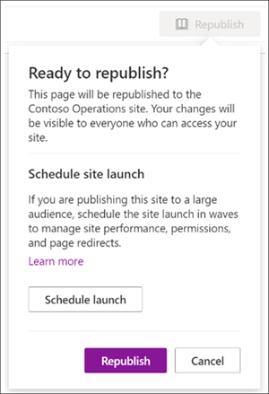
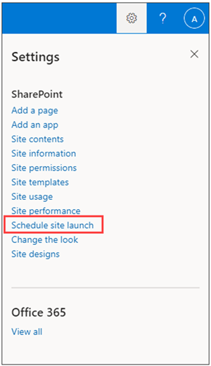
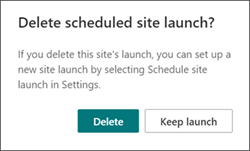

# <a name="launch-your-portal-using-the-sharepoint-portal-launch-scheduler"></a>Запуск портала с помощью SharePoint календаря запуска портала

Портал — это сайт SharePoint на вашем интрасети с высоким трафиком — сайт с количеством от 10 000 до 100 000 зрителей в течение нескольких недель. Используйте план-график запуска портала для запуска портала, чтобы обеспечить пользователям возможность плавного просмотра при доступе к вашему SharePoint порталу.
<br>
<br>
План-график запуска Портала предназначен для того, чтобы помочь вам следовать поэтапному подходу к выкатыву, пакетив просмотры в волнах и управляя URL-адресами для нового портала. Во время запуска каждой волны можно собирать отзывы пользователей, отслеживать производительность портала и приостанавлить запуск, чтобы устранить проблемы перед началом следующей волны. Узнайте больше о планировании [запуска портала](/microsoft-365/Enterprise/Planportallaunchroll-out?view=o365-worldwide)в SharePoint . 

**Существует два типа перенаправления:**

- **Bidirectional**: запустите новый современный SharePoint, чтобы заменить существующий SharePoint или современный портал
- **Перенаправление** на временную страницу: запустите новый современный портал SharePoint без существующего SharePoint портала

Разрешения сайта должны быть настроены отдельно от волн в рамках запуска. Например, при выпуске портала для всей организации можно установить разрешения на "Все, кроме внешних пользователей", а затем разделить пользователей на волны с помощью групп безопасности. Добавление группы безопасности к волне не дает этой группе безопасности доступ к сайту. 


> [!NOTE]
> - Эта функция будет доступна с панели **Параметры** на домашней странице сайтов SharePoint связи для целевых клиентов выпуска начиная с мая 2021 г. и станет доступной для всех клиентов к июлю 2021 г.
> - Версия PowerShell этого средства доступна сегодня
> - Эту функцию можно использовать только на современных сайтах SharePoint связи
> - Чтобы настроить и запланировать запуск портала, необходимо иметь разрешения владельца сайта.
> - Запуски должны быть запланированы не менее чем за семь дней до начала, и каждая волна может длиться от одного до семи дней
> - Количество требуемого количества волн автоматически определяется ожидаемым числом пользователей 
> - Перед планированием запуска портала необходимо запустить SharePoint page [Diagnostics for SharePoint,](https://aka.ms/perftool) чтобы убедиться, что домашняя страница сайта здорова
> - По завершении запуска все пользователи с разрешениями на сайт смогут получить доступ к новому сайту
> - Если ваша организация использует [Viva Connections,](https://docs.microsoft.com/SharePoint/viva-connections)пользователи могут видеть значок вашей организации в панели приложений Microsoft Teams, однако при выборе значка пользователи не смогут получить доступ к порталу до запуска волны.
> - Эта функция недоступна для Office 365, Office 365 21Vianet (Китай) или Microsoft 365 планов правительства США

### <a name="understand-the-differences-between-portal-launch-scheduler-options"></a>Понимание различий между вариантами расписания запуска портала:

Ранее запуски портала могли быть запланированы только через SharePoint PowerShell. Теперь у вас есть два варианта, которые помогут вам планировать запуск портала и управлять им. Узнайте о ключевых различиях между обоими средствами:

**SharePoint Версия PowerShell:**

- Учетные данные администратора необходимы для [SharePoint PowerShell](https://docs.microsoft.com/powershell/sharepoint/sharepoint-online/introduction-sharepoint-online-management-shell?view=sharepoint-ps) 
- Минимальное требование одной волны 
- Запланировать запуск на основе согласованного часовой пояса универсального времени (UTC)

**In-product version:**

- Необходимы учетные данные владельца сайта 
- Минимальное требование в две волны
- Запланировать запуск на основе локального часовой пояса портала, как указано в региональных параметрах


## <a name="get-started-using-the-portal-launch-scheduler"></a>Начало работы с помощью планера запуска портала

1.  Прежде чем использовать средство расписания запуска [Портала,](https://support.microsoft.com/office/share-a-site-958771a8-d041-4eb8-b51c-afea2eae3658) добавьте всех  пользователей, которым потребуется доступ к этому сайту, с помощью разрешений сайта в качестве владельца сайта, члена сайта или посетителя.

2.  Затем приступить к планированию запуска портала с помощью доступа к планировщику запуска портала одним из двух способов:

    **Вариант 1.** Первые несколько раз, когда вы редактируете и переопубликовывайте изменения на домашней странице или вплоть до домашней страницы версии 3.0, вам будет предложено использовать средство расписания запуска портала. Выберите **запуск Schedule,** чтобы двигаться вперед с планированием. Или выберите **Republish,** чтобы переиздать изменения страницы без планирования запуска.
    
    
    
    **Вариант 2.** В любое время можно перейти на домашную  страницу SharePoint  связи, выбрать Параметры, а затем запланировать запуск сайта, чтобы запланировать запуск портала.
    
    

3.  Далее подтвердите оценку состояния здоровья портала и в случае необходимости с помощью средства Page [Diagnostics для](https://aka.ms/perftool) SharePoint, пока портал не получит **полезный** результат. Затем выберите **Далее**.

    
       
    > [!NOTE] 
    > Имя и описание сайта не могут быть изменены из расписания запуска портала, а вместо  этого можно изменить, выбрав Параметры, а затем сведения о сайте на домашней странице. 
 
4.  Выберите **число ожидаемых пользователей** из отсевной части. Этот показатель представляет число пользователей, которым, скорее всего, потребуется доступ к сайту. План-график запуска портала автоматически определяет идеальное количество волн в зависимости от ожидаемых пользователей, таких как:
    
    - Менее 10k пользователей: две волны
    - От 10k до 30k пользователей: три волны 
    - 30k+ до 100k пользователей: пять волн
    - Более 100k пользователей: пять волн и свяжитесь с Microsoft по шагам, перечисленным на портале Запуск с более чем 100k пользователей раздела. 

5.  Затем определите **необходимый тип перенаправления:**

    **Вариант 1.** Отправка пользователей на существующую страницу SharePoint (бидайрекционная) — Используйте этот параметр при запуске нового современного портала SharePoint, чтобы заменить существующий портал SharePoint. Пользователи в активных волнах будут перенаправлены на новый сайт независимо от того, переходят ли они на старый или новый сайт. Пользователи не запущенной волны, которые пытаются получить доступ к новому сайту, будут перенаправлены обратно на старый сайт до запуска волны.
    
    > [!NOTE] 
    > При использовании параметра bidirectional у лица, запланив запуск, также должны быть разрешения владельца сайта на другой SharePoint портале.
       
    **Вариант 2.** Отправка пользователей на автогенерированную временную страницу (временное перенаправление страницы) — Использование временной перенаправления страниц следует использовать, если не существует существующего SharePoint портала. Пользователи направляются на новый современный портал SharePoint, и если пользователь находится в волне, которая не запущена, они будут перенаправлены на временную страницу.
    
    **Вариант 3. Отправка** пользователей на внешнюю страницу — предоставление внешнего URL-адреса на временную пусковую страницу до запуска волны пользователя.
    
6.  Разгон аудитории на волны. Добавьте до 20 групп безопасности на одну волну. Сведения о волне можно изменить до запуска каждой волны. Каждая волна может длиться как минимум один день (24 часа) и не более семи дней. Это позволяет SharePoint и вашей технической среде возможность акклиматить и масштабироваться до большого объема пользователей сайта. При планировании запуска через пользовательский интерфейс часовой пояс основан на региональных параметрах сайта. 

    >[!NOTE] 
    > - План-график запуска портала автоматически по умолчанию будет не менее 2 волн. Однако версия PowerShell этого средства позволяет использовать 1 волну.
    >  - Microsoft 365 группы не поддерживаются этой версией план-графика запуска Портала.

7. Определите, кому нужно сразу просмотреть сайт и ввести их сведения в **поле Пользователи, освобожденные от полей волн.** Эти пользователи исключены из волн и не будут перенаправлены до, во время или после запуска.

    >[!NOTE]
    > Можно добавить до 50 различных пользователей или групп безопасности. Используйте группы безопасности, если вам потребуется более 50 человек, чтобы получить доступ к порталу перед началом запуска волн. 

8.  Подтверждение сведений о запуске портала и выберите **Расписание.** После запланированного запуска все изменения на домашней странице SharePoint портала должны получить здоровый диагностический результат до возобновления запуска портала.

### <a name="launch-a-portal-with-over-100k-users"></a>Запуск портала с более чем 100k пользователями

Если планируется запустить портал с более чем 100 000 пользователей, отправьте запрос на поддержку после перечисленных ниже действий. Обязательно включай всю запрашиваемую информацию.

**Выполните следующие действия.**
1. Перейдите по ссылке https://admin.microsoft.com.
2. Убедитесь, что вы используете новый центр предварительного просмотра центра администрирования
3. На левой области навигации выберите **поддержку** и выберите **новый запрос на службу**

   Откроется область **Нужна помощь?** в правой части экрана.

4. Для **краткого описания проблемы** введите "Запуск SharePoint с 100k пользователями"</br>
5. Затем выберите **службу поддержки контактов**
6. В **статье Описание** введите "Запуск SharePoint с 100k пользователями"
7. Заполните оставшиеся сведения и выберите **Контакт**
8. После создания запроса предоставьте агенту поддержки следующие сведения:
   - URL-адрес портала 
   - Число пользователей
   - Предполагаемое расписание запуска

## <a name="make-changes-to-a-scheduled-portal-launch"></a>Внесение изменений в запланированный запуск портала

Сведения о запуске можно изменить для каждой волны до даты запуска волны. 

1.  Чтобы изменить сведения о запуске портала, перейдите **Параметры** и выберите **расписание запуска сайта.**
2.  Затем выберите **Изменить**.
3.  Когда вы закончите делать изменения, выберите **Обновление**.


## <a name="delete-a-scheduled-portal-launch"></a>Удаление запланированного запуска портала

Запуски, запланированные с помощью средства расписания запуска Портала, могут быть отменены или удалены в любое время, даже если некоторые волны уже запущены.

1.  Чтобы отменить запуск портала, перейдите **на Параметры** и **запланировать запуск сайта.**

2.  Затем выберите **Удаление,** а затем, когда вы увидите сообщение ниже, выберите **Удалить** еще раз.

    


## <a name="use-the-powershell-portal-launch-scheduler"></a>Использование план-графика запуска портала PowerShell

Изначально средство SharePoint портала было доступно только через [SharePoint PowerShell](https://docs.microsoft.com/powershell/sharepoint/sharepoint-online/introduction-sharepoint-online-management-shell?view=sharepoint-ps) и будет по-прежнему поддерживаться с помощью PowerShell для клиентов, предпочитающих этот метод. Эти же заметки в начале этой статьи применяются к обеим версиям планера запуска Портала. 

>[!NOTE]
> Для использования SharePoint PowerShell нужны разрешения администратора.
> Сведения о запуске портала для запусков, созданных в PowerShell, будут отображаться и управляться в новом средстве расписания запуска портала в SharePoint.


### <a name="app-setup-and-connecting-to-sharepoint-online"></a>Настройка приложения и подключение к SharePoint Online
1. [Скачайте последнюю версию командной консоли SharePoint Online](https://go.microsoft.com/fwlink/p/?LinkId=255251).

    > [!NOTE]
    > Если вы установили предыдущую версию командной консоли SharePoint Online, перейдите к разделу "Установка и удаление программ" и удалите компонент "Командная консоль SharePoint Online".<br>На странице Центра загрузки выберите нужный язык и нажмите кнопку "Скачать". Вам будет предложено скачать версию x64 или x86 файла MSI. Для 64-разрядной версии Windows скачайте файл x64, а для 32-разрядной — файл x86. Если вы не знаете свою разрядность, см. статью [Какая у меня версия операционной системы Windows?](https://support.microsoft.com/help/13443/windows-which-operating-system) После скачивания файла запустите его и следуйте инструкциям мастера настройки.

2. Подключите SharePoint, используя [права глобального администратора или администратора SharePoint](/sharepoint/sharepoint-admin-role) в Microsoft 365. Сведения о том, как это сделать, см. в статье [Начало работы с командной консолью SharePoint Online](/powershell/sharepoint/sharepoint-online/connect-sharepoint-online).


### <a name="view-any-existing-portal-launch-setups"></a>Просмотр всех существующих установок запуска портала

Чтобы узнать, существуют ли существующие конфигурации запуска портала:

   ```PowerShell
   Get-SPOPortalLaunchWaves -LaunchSiteUrl <object> -DisplayFormat <object>
   ```

### <a name="schedule-a-portal-launch-on-the-site"></a>Расписание запуска портала на сайте

Количество требуемого количества волн зависит от ожидаемого размера запуска. 
- Менее 10k пользователей: одна волна
- От 10k до 30k пользователей: три волны 
- 30k+ до 100k пользователей: пять волн
- Более 100k пользователей: пять волн и свяжитесь с командой учетных записей Майкрософт

#### <a name="steps-for-bidirectional-redirection"></a>Действия по перенаправлению бидеректов

Перенаправление бидеректов включает запуск нового современного портала SharePoint Online, который заменит существующий SharePoint или современный портал. Пользователи в активных волнах будут перенаправлены на новый сайт независимо от того, переходят ли они на старый или новый сайт. Пользователи не запущенной волны, которые пытаются получить доступ к новому сайту, будут перенаправлены обратно на старый сайт до запуска волны. 

Мы поддерживаем только перенаправление между домашней страницей по умолчанию на старом сайте и домашней страницей по умолчанию на новом сайте. Если у вас есть администраторы или владельцы, которые нуждаются в доступе к старым и новым сайтам без перенаправления, убедитесь, что они указаны с помощью `WaveOverrideUsers` параметра.

Поэтапное перенос пользователей с существующего SharePoint сайта на новый SharePoint сайта:

1. Запустите следующую команду, чтобы назначить волны запуска портала.
   
   ```PowerShell
   New-SPOPortalLaunchWaves -LaunchSiteUrl <object> -RedirectionType Bidirectional -RedirectUrl <string> -ExpectedNumberOfUsers <object> -WaveOverrideUsers <object> -Waves <object>
   ```

   Пример.

   ```PowerShell
   New-SPOPortalLaunchWaves -LaunchSiteUrl "https://contoso.sharepoint.com/teams/newsite" -RedirectionType Bidirectional -RedirectUrl "https://contoso.sharepoint.com/teams/oldsite" -ExpectedNumberOfUsers 10kTo30kUsers -WaveOverrideUsers "admin@contoso.com" -Waves ' 
   [{Name:"Wave 1", Groups:["Viewers 1"], LaunchDateUtc:"2020/10/14"}, 
   {Name:"Wave 2", Groups:["Viewers 2"], LaunchDateUtc:"2020/10/15"}, 
   {Name:"Wave 3", Groups:["Viewers 3"], LaunchDateUtc:"2020/10/16"}]'
   ```

2. Полная проверка. Перенаправление может занять 5-10 минут, чтобы завершить конфигурацию по службе. 

#### <a name="steps-for-redirection-to-temporary-page"></a>Действия по перенаправлению на временную страницу

Временное перенаправление страниц следует использовать, если не существует SharePoint портала. Пользователи направляются на новый современный портал SharePoint Online поэтапно. Если пользователь находится в волне, которая не была запущена, он будет перенаправлен на временную страницу (любой URL-адрес). 

1. Запустите следующую команду, чтобы назначить волны запуска портала.
   
   ```PowerShell
   New-SPOPortalLaunchWaves -LaunchSiteUrl <object> -RedirectionType ToTemporaryPage -RedirectUrl <string> -ExpectedNumberOfUsers <object> -WaveOverrideUsers <object> -Waves <object>
   ```

   Пример.

   ```PowerShell
   New-SPOPortalLaunchWaves -LaunchSiteUrl "https://contoso.sharepoint.com/teams/newsite" -RedirectionType ToTemporaryPage -RedirectUrl "https://portal.contoso.com/UnderConstruction.aspx" -ExpectedNumberOfUsers 10kTo30kUsers -WaveOverrideUsers "admin@contoso.com" -Waves ' 
   [{Name:"Wave 1", Groups:["Viewers 1"], LaunchDateUtc:"2020/10/14"}, 
   {Name:"Wave 2", Groups:["Viewers 2"], LaunchDateUtc:"2020/10/15"}, 
   {Name:"Wave 3", Groups:["Viewers 3"], LaunchDateUtc:"2020/10/16"}]'
   ```

2. Полная проверка. Перенаправление может занять 5-10 минут, чтобы завершить конфигурацию по службе. 

### <a name="pause-or-restart-a-portal-launch-on-the-site"></a>Приостановка или перезапуск запуска портала на сайте

1. Чтобы приостановить запуск портала и временно предотвратить предстоящие прогрессии волн, запустите следующую команду:

   ```PowerShell
   Set-SPOPortalLaunchWaves -Status Pause - LaunchSiteUrl <object>
   ```

2. Проверка перенаправления всех пользователей на старый сайт. 

3. Чтобы перезапустить приостановленный запуск портала, запустите следующую команду:

   ```PowerShell
   Set-SPOPortalLaunchWaves -Status Restart - LaunchSiteUrl <object>
   ```
   
4. Проверка восстановления перенаправления. 

### <a name="delete-a-portal-launch-on-the-site"></a>Удаление запуска портала на сайте

1. Запустите следующую команду, чтобы удалить запланированный или запущенный запуск портала для сайта.

   ```PowerShell
   Remove-SPOPortalLaunchWaves -LaunchSiteUrl <object>
   ```

2. Проверка того, что перенаправление не происходит для всех пользователей.

## <a name="learn-more"></a>Подробнее

[Планирование плана запуска портала в SharePoint Online](./planportallaunchroll-out.md)

[Планирование сайта связи](https://support.microsoft.com/office/plan-your-sharepoint-communication-site-35d9adfe-d5cc-462f-a63a-bae7f2529182)
