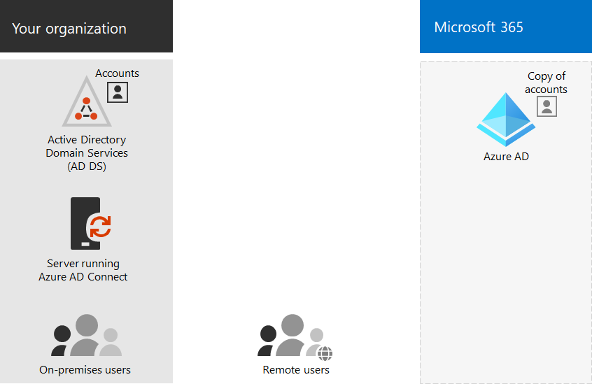

# Модели удостоверений Microsoft 365 и Azure Active Directory

*Эта статья относится к Microsoft 365 корпоративный и Office 365 корпоративный.*

Microsoft 365 использует Azure Active Directory (Azure AD), облачную службу идентификации и проверки подлинности пользователей, включенную в подписку Microsoft 365, для управления удостоверениями и проверкой подлинности для Microsoft 365. Правильная настройка инфраструктуры удостоверений имеет жизненно важное значение для управления доступом и разрешениями пользователей Microsoft 365 для вашей организации.

Перед началом работы посмотрите это видео с обзором моделей удостоверений и проверки подлинности для Microsoft 365.

 

> [!VIDEO https://www.microsoft.com/videoplayer/embed/RE2Pjwu]

Ваш первый выбор планирования — это модель удостоверений Microsoft 365.

## Модели удостоверений Microsoft 365

Чтобы планировать учетные записи пользователей, сначала необходимо разобраться в двух моделях удостоверений в Microsoft 365. Вы можете поддерживать удостоверения организации только в облаке или поддерживать свои идентификаторы доменных служб Active Directory (AD DS) и использовать их для проверки подлинности при доступе пользователей к облачным службам Microsoft 365.  

Вот два типа удостоверений, а также их наиболее подходящие и полезные свойства.

| Атрибут | Облачное удостоверение | Гибридное удостоверение |
|:-------|:-----|:-----|
| **Определение** | Учетная запись пользователя существует только в клиенте Azure AD для подписки на Microsoft 365. | Учетная запись пользователя существует в AD DS, а копия также находится в клиенте Azure AD для подписки Microsoft 365. Учетная запись пользователя в Azure AD также может включать версию с hashed паролем учетной записи пользователя AD DS. |
| **Проверка подлинности учетных данных пользователей в Microsoft 365** | Клиент Azure AD для подписки Microsoft 365 выполняет проверку подлинности с помощью учетной записи облачного удостоверения. | Клиент Azure AD для подписки Microsoft 365 обрабатывает процесс проверки подлинности или перенаправляет пользователя другому поставщику удостоверений. |
| **Оптимально для**. | Организации, которые не имеют или нуждаются в локальной AD DS. | Организации, использующие AD DS или другого поставщика удостоверений. |
| **Наибольшее преимущество** | Простой в использовании. Дополнительные средства каталога или серверы не требуются. | Пользователи могут использовать те же учетные данные при доступе к локальному или облачному ресурсам. |
||||

## Облачное удостоверение

Идентификатор, использующий только облако, использует учетные записи пользователей, которые существуют только в Azure AD. Идентификатор облачного использования обычно используется небольшими организациями, которые не имеют локальных серверов или не используют AD DS для управления локальными удостоверениями. 

Вот основные компоненты идентификатора только для облака.
 

Чтобы получить доступ к облачным службам Microsoft 365, пользователи локального и удаленного (онлайн) используют учетные записи и пароли Azure AD. Azure AD аутентификация учетных данных пользователей на основе хранимой учетной записи и паролей пользователей.

### Администрирование
Так как учетные записи пользователей хранятся только в Azure AD, вы управляете облачными удостоверениями с помощью таких средств, как центр администрирования [Microsoft 365](../admin/add-users/index.yml) [и Windows PowerShell.](manage-user-accounts-and-licenses-with-microsoft-365-powershell.md) 

## Гибридное удостоверение

Гибридное удостоверение использует учетные записи, которые возникают в локальной AD DS и имеют копию в клиенте Azure AD подписки Microsoft 365. Однако большинство изменений течет только в одну сторону. Изменения, внесенные в учетные записи пользователей AD DS, синхронизируются с их копией в Azure AD. Но изменения, внесенные в облачные учетные записи в Azure AD, такие как новые учетные записи пользователей, не синхронизируются с AD DS.

Azure AD Connect обеспечивает текущую синхронизацию учетных записей. Он выполняется на локальном сервере, проверяет изменения в AD DS и передает эти изменения в Azure AD. Azure AD Connect предоставляет возможность фильтрации синхронизированных учетных записей и синхронизации хеш-версии паролей пользователей, известной как синхронизация хеширования паролей (PHS).

При внедрении гибридной идентификации локальное AD DS является авторитетным источником сведений об учетной записи. Это означает, что вы выполняете задачи администрирования в основном локально, которые затем синхронизируются с Azure AD. 

Ниже компоненты гибридного удостоверения.

Клиент Azure AD имеет копию учетных записей AD DS. В этой конфигурации как локально, так и удаленные пользователи, которые имеют доступ к облачным службам Microsoft 365, сдают проверку подлинности в Azure AD.

>[!Note]
>Для синхронизации учетных записей пользователей для гибридной идентификации всегда необходимо использовать Azure AD Connect. Синхронизированные учетные записи пользователей в Azure AD необходимы для выполнения назначения лицензий и управления группой, настройки разрешений и других административных задач, которые связаны с учетными записями пользователей.
>

### Администрирование

Поскольку исходные и авторитетные учетные записи пользователей хранятся в локальной AD DS, вы управляете удостоверениями с помощью тех же средств, что и управление AD DS. 

Центр администрирования Microsoft 365 или PowerShell для Microsoft 365 не используются для управления синхронизированными учетными записями пользователей в Azure AD.

## Следующий шаг

Если вам нужна облачная модель удостоверений, см. в [примере Идентификатор только для облака.](cloud-only-identities.md)

Если вам нужна гибридная модель удостоверений, см. в [примере Hybrid identity.](plan-for-directory-synchronization.md)

## См. также

[Обзор Microsoft 365 корпоративный](microsoft-365-overview.md)