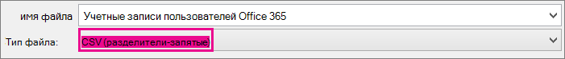

# <a name="add-several-users-at-the-same-time-to-microsoft-365---admin-help"></a>Добавление нескольких пользователей одновременно в Microsoft 365 - справка по администрированию

Каждый человек в вашей команде должен иметь учетную запись пользователя, прежде чем он сможет войти в Microsoft 365 службы, такие как электронная почта и Office. Если в вашей организации много пользователей, вы можете добавить учетные записи сразу для всех с помощью таблицы Excel или файла в формате CSV. [Не знаете, что такое формат CSV?](add-several-users-at-the-same-time.md#not-sure-what-csv-format-is)
  
> [!NOTE]
> Если вы не используете новый Центр администрирования Microsoft 365, можно включить его с помощью переключателя **Попробовать новый Центр администрирования**, расположенного в верхней части главной страницы.

## <a name="add-multiple-users-in-the-microsoft-365-admin-center"></a>Добавление нескольких пользователей в Microsoft 365 центре администрирования

1. Войдите в Microsoft 365, используя свою рабочую или учебную учетную запись.

2. В Центре администрирования выберите **Пользователи** \> **Активные пользователи**.

3. Выберите **Добавить несколько пользователей.**

4. В области **Импорт нескольких пользователей** вы можете скачать шаблон CSV-файла с образцом сведений о пользователях или без него.

    В таблицу необходимо включить  те же заголовки столбцов, что и в примере (имя пользователя, имя и так далее). Если вы используете шаблон, откройте его в инструменте редактирования текста, например Блокнот, и рассмотрите возможность оставить все данные в строке 1 в одиночку и введите данные только в строках 2 и ниже.

    Для каждого человека в таблице также следует указать имя пользователя (например, ivan@contoso.com) и отображаемое имя (например, Иван Воронков).

  ```
  User Name,First Name,Last Name,Display Name,Job Title,Department,Office Number,Office Phone,Mobile Phone,Fax,Address,City,State or Province,ZIP or Postal Code,Country or Region
  chris@contoso.com,Chris,Green,Chris Green,IT Manager,Information Technology,123451,123-555-1211,123-555-6641,123-555-6700,1 Microsoft way,Redmond,Wa,98052,United States
  ben@contoso.com,Ben,Andrews,Ben Andrews,IT Manager,Information Technology,123452,123-555-1212,123-555-6642,123-555-6700,1 Microsoft way,Redmond,Wa,98052,United States
  david@contoso.com,David,Longmuir,David Longmuir,IT Manager,Information Technology,123453,123-555-1213,123-555-6643,123-555-6700,1 Microsoft way,Redmond,Wa,98052,United States
  cynthia@contoso.com,Cynthia,Carey,Cynthia Carey,IT Manager,Information Technology,123454,123-555-1214,123-555-6644,123-555-6700,1 Microsoft way,Redmond,Wa,98052,United States
  melissa@contoso.com,Melissa,MacBeth,Melissa MacBeth,IT Manager,Information Technology,123455,123-555-1215,123-555-6645,123-555-6700,1 Microsoft way,Redmond,Wa,98052,United States
  
  ```

5. Укажите путь к CSV-файлу в специальном поле или нажмите кнопку **Обзор** и выберите его, а затем нажмите кнопку **Проверить**.
  
    Если при добавлении файла возникнут проблемы, их причины будут указаны в области импорта. Вы также можете скачать файл журнала.

6. В диалоговом окне **Настройка параметров пользователей** вы можете изменить состояние при входе в систему, а также лицензию продукта, которая будет назначена всем пользователям.

7. В диалоговом окне **просмотра результатов** вы можете отправить их себе или другим пользователям (при этом пароли будут указаны в виде обычного текста), проверить число созданных пользователей и при необходимости приобрести лицензии, чтобы назначить их новым пользователям.

## <a name="next-steps"></a>Дальнейшие действия

- Теперь, когда у этих людей есть учетные записи, им необходимо скачать и установить или переустановить Microsoft 365 или [Office 2016](https://support.office.com/article/4414eaaf-0478-48be-9c42-23adc4716658)на КОМПЬЮТЕРе или Mac . Каждый человек в вашей команде может установить Microsoft 365 до 5 компьютеров или компьютеров Mac.

- Кроме того, каждый пользователь может [настроить приложения Office и электронную почту на мобильных устройствах](https://support.office.com/article/7dabb6cb-0046-40b6-81fe-767e0b1f014f), используя до пяти планшетов и пяти смартфонов, таких как iPhone, iPad и устройства с Android. Таким образом, они смогут редактировать файлы Office где угодно.

    См. [Microsoft 365 для бизнеса](https://support.office.com/article/6a3a29a0-e616-4713-99d1-15eda62d04fa) для конечного списка действий установки.

## <a name="more-information-about-how-to-add-users-to-microsoft-365"></a>Дополнительные сведения о добавлении пользователей в Microsoft 365

### <a name="not-sure-what-csv-format-is"></a>Общие сведения о формате CSV

CSV-файл содержит значения, разделенные запятыми. Такие файлы создаются и редактируются с помощью обычного текстового редактора или программы для работы с таблицами, например Excel.
  
Для начала вы можете загрузить и использовать [этот пример электронной таблицы](https://www.microsoft.com/download/details.aspx?id=45485). Помните, Microsoft 365 в первом ряду требуются заголовки столбцов, чтобы не заменять их чем-то другим. 
  
Сохраните файл в формате CSV под другим именем.
  

  
При сохранении вы, скорее всего, увидите сообщение о том, что в случае сохранения файла в формате CSV некоторые функции в книге будут потеряны. Это нормально. Нажмите кнопку **Да**, чтобы продолжить.
  

  
### <a name="tips-for-formatting-your-spreadsheet"></a>Советы по форматированию электронной таблицы

- **Обязательно ли использовать такие же заголовки столбцов, как в примере электронной таблицы?** Да. Первая строка в примере таблицы содержит заголовки столбцов. Эти заголовки являются обязательными. Для каждого пользователя, который необходимо добавить Microsoft 365, создайте строку под заголовком. Если вы добавите, измените или удалите любую из заголовков столбцов, Microsoft 365 не удастся создать пользователей из сведений в файле.

- **Что делать, если сведения о пользователе неполны?** Имя пользователя и отображаемое имя обязательны: не указав их, вы не сможете добавить учетную запись. Если у вас нет других сведений, таких как факс, вы можете ввести вместо них пробел и запятую, чтобы оставить соответствующее поле пустым.

- **Насколько небольшой или большой может быть таблица?** В таблице должно быть не менее двух строк. One is for the column headings (the user data column label) and one for the user. You cannot have more than 251 rows. If you need to import more than 250 users, you can create more than one spreadsheet.

- **Какие языки можно использовать?** При создании таблицы можно ввести метки столбцов данных пользователей на любом языке или символах, но не следует изменять порядок меток, как показано в примере. You can then make entries into the fields, using any language or characters, and save your file in a Unicode or UTF-8 format.

- **Как добавить пользователей из разных стран или регионов?** Создайте отдельную таблицу для каждой области. Вам потребуется выполнить мастер массового добавления для каждой таблицы, указав одинаковое расположение для всех пользователей в текущем файле.

- **Ограничено ли количество символов?** Максимальное количество знаков для значений в столбцах данных пользователя указано в таблице ниже.

|**Столбец данных пользователя**|**Максимальная длина в знаках**|
|:-----|:-----|
|Имя пользователя (обязательно)  <br/> |79, включая знак (@), в формате \<extension\> name@domain. . Псевдоним пользователя не может превышать 50 символов, а имя домена не может превышать 48 символов.  <br/> |
|Имя  <br/> |64  <br/> |
|Фамилия  <br/> |64  <br/> |
|Отображаемое имя (обязательно)  <br/> |256  <br/> |
|Должность  <br/> |64  <br/> |
|Отдел  <br/> |64  <br/> |
|Номер офиса  <br/> |128  <br/> |
|Рабочий телефон  <br/> |64  <br/> |
|Мобильный телефон  <br/> |64  <br/> |
|Факс  <br/> |64  <br/> |
|Адрес  <br/> |1023  <br/> |
|Город  <br/> |128  <br/> |
|Область или край  <br/> |128  <br/> |
|Почтовый индекс  <br/> |40  <br/> |
|Страна  <br/> |128  <br/> |

### <a name="still-having-problems-when-adding-users-to-microsoft-365"></a>Все еще возникают проблемы при добавлении пользователей в Microsoft 365?

- **Убедитесь, что электронная таблица отформатирована правильно.** Проверьте соответствие заголовков столбцов заголовкам в примере файла. Убедитесь, что соблюдены ограничения на длину полей и что все поля разделены запятыми.

- **Если вы не видите новых пользователей в Microsoft 365 сразу, подождите несколько минут.** Изменение всех служб в Microsoft 365 может занять некоторое время. 

## <a name="related-articles"></a>Связанные статьи

[Добавьте пользователей по отдельности или оптом в Microsoft 365](/office365/admin/add-users/add-users)