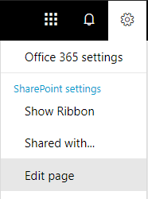

# <a name="configure-search-for-microsoft-365-multi-geo"></a>Настройка поиска для Microsoft 365 Multi-Geo

В среде с поддержкой нескольких регионов для каждого географического расположения предусмотрены отдельные индекс и центр поиска. Когда пользователь пытается что-то найти, запрос развертывается для всех индексов, а возвращенные результаты объединяются.

Например, пользователь, находящийся в одном географическом расположении, может искать контент, хранящийся в другом, а также на сайте SharePoint, доступ к которому ограничен другим географическим расположением. Если у пользователя есть доступ к этому контенту, отобразятся результаты поиска.

## <a name="which-search-clients-work-in-a-multi-geo-environment"></a>Какие клиенты поиска работают в среде с поддержкой нескольких регионов?

Возвращать результаты поиска из всех географических расположений могут такие клиенты:

- OneDrive для бизнеса;
- Delve;
- домашняя страница SharePoint;
- центр поиска;
- специальные поисковые приложения, которые используют API поиска SharePoint.

### <a name="onedrive-for-business"></a>OneDrive для бизнеса

Как только завершится настройка среды с поддержкой нескольких регионов, пользователи, выполняющие поиск в OneDrive, получат результаты из всех географических расположений.

### <a name="delve"></a>Delve

Как только завершится настройка среды с поддержкой нескольких регионов, пользователи, выполняющие поиск в Delve, получат результаты из всех географических расположений.

Веб-канал Delve и карточка профиля показывают только краткое содержание файлов, которые хранятся в центральном расположении. В случае файлов, хранящихся в периферийных расположениях, отображается значок типа файла.

### <a name="the-sharepoint-home-page"></a>Домашняя страница SharePoint

Как только завершится настройка среды с поддержкой нескольких регионов, пользователи на своей домашней странице SharePoint увидят новости, недавние и отслеживаемые сайты из нескольких географических расположений. Используя поле поиска на домашней странице SharePoint, пользователи получат объединенные результаты из нескольких географических расположений.

### <a name="the-search-center"></a>центр поиска;

Когда завершится настройка среды с поддержкой нескольких регионов, каждый центр поиска будет по-прежнему отображать только результаты из своего географического расположения. Чтобы можно было получать данные из всех географических расположений, администраторы должны [изменить настройки каждого центра поиска](#_Set_up_a_1). После этого пользователи станут получать результаты из всех географических расположений.

### <a name="custom-search-applications"></a>Специальные поисковые приложения

Как правило, специальные поисковые приложения взаимодействуют с индексами поиска при помощи существующих REST API поиска SharePoint. Для получения результатов из всех или некоторых географических расположений приложение должно [вызвать API и включить в запрос новые параметры поддержки нескольких регионов](#_Get_custom_search). Это действие активирует развертывание запроса для всех геообъектов.

## <a name="whats-different-about-search-in-a-multi-geo-environment"></a>Чем отличается поиск в среде с поддержкой нескольких регионов?

Некоторые знакомые вам функции поиска работают иначе в среде с поддержкой нескольких регионов.

<table>
<thead>
<tr class="header">
<th align="left"><strong>Функция</strong></th>
<th align="left"><strong>Принцип работы</strong></th>
<th align="left"><strong>Решение</strong></th>
</tr>
</thead>
<tbody>
<tr class="odd">
<td align="left">Повышение уровня результатов</td>
<td align="left">Вы можете создавать правила запросов с повышением уровня результатов для всего клиента, семейства веб-сайтов или отдельного сайта. Чтобы в среде с поддержкой нескольких регионов повысить уровень результатов для центров поиска всех географических расположений, определите такие результаты для клиента. Чтобы повысить уровень результатов только для центра поиска, находящегося в географическом расположении семейства веб-сайтов или отдельного сайта, определите такие результаты для семейства веб-сайтов или сайта. Эти результаты не повышаются в других географических расположениях.</td>
<td align="left">Если вам не нужны различные результаты с повышенным уровнем для каждого отдельного географического расположения (например, разные правила для перемещения), рекомендуем определять результаты с повышенным уровнем для клиента.</td>
</tr>
<tr class="even">
<td align="left">Уточнения поиска</td>
<td align="left">При поиске возвращаются уточнения из всех географических расположений клиента, а затем объединяются. Объединение выполняется максимально правильно, но счетчики уточнений могут не быть точными на 100 %. Для большинства сценариев поиска такой точности вполне достаточно. </td>
<td align="left">Поисковые приложения, которые зависят от полноты уточнения, запрашивают каждое географическое расположение отдельно.</td>
</tr>
<tr class="odd">
<td align="left"></td>
<td align="left">При поиске в среде с поддержкой нескольких регионов невозможно динамическое группирование числовых уточнений.</td>
<td align="left">Используйте параметр <a href="https://docs.microsoft.com/sharepoint/dev/general-development/query-refinement-in-sharepoint">Discretize для</a> числовых уточнений.</td>
</tr>
<tr class="even">
<td align="left">Идентификаторы документов</td>
<td align="left">При разработке поискового приложения, которое зависит от ИД документов, обратите внимание, что такие идентификаторы в среде с поддержкой нескольких регионов уникальны только для каждого отдельного географического расположения.</td>
<td align="left">Добавлен столбец, определяющий географическое расположение и позволяющий добиться уникальности. Этот столбец называется GeoLocationSource.</td>
</tr>
<tr class="odd">
<td align="left">Количество результатов</td>
<td align="left">На странице результатов поиска отображаются объединенные данные из географических расположений (не более 500 результатов на одной странице).</td>
<td align="left"></td>
</tr>
<tr class="even">
<td align="left">Гибридный поиск</td>
<td align="left">В гибридной среде SharePoint с <a href="https://docs.microsoft.com/sharepoint/hybrid/learn-about-cloud-hybrid-search-for-sharepoint">облачным гибридным поиском</a> локальный контент добавляется в индекс Microsoft 365 центрального расположения.</td>
<td align="left"></td>
</tr>
</tbody>
</table>

## <a name="whats-not-supported-for-search-in-a-multi-geo-environment"></a>Что не поддерживается при поиске в среде с несколькими регионами?

Некоторые знакомые вам функции поиска в среде с несколькими регионами не поддерживаются.

<table>
<thead>
<tr class="header">
<th align="left"><strong>Функция поиска</strong></th>
<th align="left"><strong>Примечание</strong></th>
</tr>
</thead>
<tbody>
<tr class="odd">
<td align="left">Проверка подлинности только для приложений</td>
<td align="left">При поиске в среде с поддержкой нескольких регионов невозможна проверка подлинности только для приложений (привилегированный доступ из служб).</td>
</tr>
<tr class="even">
<td align="left">Гостевые пользователи</td>
<td align="left">Гостевые пользователи получают результаты только из того географического расположения, из которого они выполняют поиск.</td>
</tr>
</tbody>
</table>

## <a name="how-does-search-work-in-a-multi-geo-environment"></a>Каковы принципы поиска в среде с поддержкой нескольких регионов?

Все клиенты поиска взаимодействуют с индексами поиска, используя существующие REST API поиска SharePoint.


1. Клиент поиска вызывает конечную точку поиска REST с использованием свойства запроса EnableMultiGeoSearch = true.
2. Запрос отправляется во все геообъекты, предусмотренные для клиента.
3. Результаты поиска из каждого географического расположения объединяются и ранжируются.
4. Клиент получает объединенные результаты поиска.

<span id="_Set_up_a" class="anchor"><span id="_Ref501388384" class="anchor"></span></span>Обратите внимание, что результаты поиска не объединяются до тех пор, пока не будут получены данные из всех географических расположений. Это означает, что поиск в среде с поддержкой нескольких регионов выполняется с большей задержкой, чем поиск в среде с одним геообъектом.

<span id="_Set_up_a_1" class="anchor"><span id="_Ref505252370" class="anchor"></span></span>
## <a name="get-a-search-center-to-show-results-from-all-geo-locations"></a>Настройка отображения в центре поиска результатов из всех географических расположений

Для каждого центра поиска предусмотрено несколько вертикалей, и каждую из них следует настраивать отдельно.

1. Убедитесь, что выполняете эти действия в учетной записи, у которой есть разрешение на изменение страницы результатов поиска и веб-части результатов поиска.

2. Перейдите на страницу результатов поиска (см. [список](https://support.office.com/article/174d36e0-2f85-461a-ad9a-8b3f434a4213) страниц результатов поиска).

3. Выберите вертикаль для настройки. В верхнем правом углу щелкните значок шестеренки **Параметры**, а затем выберите **Изменить страницу**. Откроется страница результатов поиска в режиме редактирования.

   

4. В веб-части результатов поиска переместите указатель в верхний правый угол, щелкните стрелку, а затем в меню выберите **Изменить веб-часть**. Под лентой в верхней правой части страницы откроется область инструментов веб-части результатов поиска. 

   

5. Чтобы в веб-части результатов поиска отображались результаты из всех геообъектов, в области инструментов веб-части выберите **Параметры** > **Параметры управления результатами** > **Отображение результатов с поддержкой нескольких регионов**.

6. Чтобы сохранить изменения и закрыть область инструментов веб-части, нажмите кнопку **ОК**.

7. Проверьте изменения, внесенные в веб-часть результатов поиска, выбрав **Возврат** на вкладке "Страница" главного меню.

8. Опубликуйте изменения, воспользовавшись ссылкой, предоставленной в примечании вверху страницы.

<span id="_Get_custom_search" class="anchor"><span id="_Ref501388387" class="anchor"></span></span>
## <a name="get-custom-search-applications-to-show-results-from-all-or-some-geo-locations"></a>Настройка отображения в специальных поисковых приложениях результатов из всех или некоторых географических расположений

Специальные поисковые приложения получают результаты из всех или некоторых географических расположений, указывая параметры запроса для REST API поиска SharePoint. В зависимости от этих параметров запрос развертывается для всех или некоторых геообъектов. Например, если нужно найти релевантные данные, отправив запрос только в подмножество географических расположений, можно выполнить развертывание запроса именно для них. Если запрос будет выполнен успешно, REST API поиска SharePoint возвратит данные отклика.

### <a name="requirement"></a>Требование

Для каждого географического расположения необходимо убедиться, что всем пользователям в организации предоставлено разрешение **на чтение** корневого веб-сайта (например, contoso **APAC**.sharepoint.com/ и contoso **EU**.sharepoint.com/). [Сведения о разрешениях](https://support.office.com/article/understanding-permission-levels-in-sharepoint-87ecbb0e-6550-491a-8826-c075e4859848).

### <a name="query-parameters"></a>Параметры запроса

EnableMultiGeoSearch — это логическое значение, определяющее, должен ли запрос развертываться для индексов других геообъектов клиента с несколькими регионами. Чтобы выполнить развертывание запроса, задайте для этого параметра значение **true**. Чтобы не выполнять его, установите значение **false**. Если не указать этот параметр, значением по умолчанию будет **false**, кроме случая выполнения вызова REST API для сайта, использующего шаблон корпоративного центра поиска, когда по умолчанию применяется значение **true**. Если вы используете этот параметр в среде без поддержки нескольких регионов, он будет проигнорирован.

ClientType — строка. Введите для каждого поискового приложения уникальное имя клиента. Если не указать этот параметр, развертывание запроса не будет выполнено для других геообъектов.

MultiGeoSearchConfiguration — дополнительный список географических расположений клиента с поддержкой нескольких регионов. Он предназначен для развертывания запроса, когда параметру **EnableMultiGeoSearch** присвоено значение **true**. Если не указать этот параметр или его значение, развертывание запроса будет выполнено для всех географических расположений. Для каждого географического расположения введите указанные ниже элементы в формате JSON.

<table>
<thead>
<tr class="header">
<th align="left">Элемент</th>
<th align="left">Описание</th>
</tr>
</thead>
<tbody>
<tr class="odd">
<td align="left">DataLocation</td>
<td align="left">Географическое расположение (например, NAM).</td>
</tr>
<tr class="even">
<td align="left">EndPoint</td>
<td align="left">Конечная точка для подключения (например, https://contoso.sharepoint.com).</td>
</tr>
<tr class="odd">
<td align="left">SourceId</td>
<td align="left">GUID источника результатов, например B81EAB55-3140-4312-B0F4-9459D1B4FFEE.</td>
</tr>
</tbody>
</table>

Если опустить элемент DataLocation или EndPoint, а также если продублировать DataLocation, запрос будет выполнен с ошибкой. [Сведения о конечной точке геообъектов клиента можно получить с помощью Microsoft Graph](https://docs.microsoft.com/sharepoint/dev/solution-guidance/multigeo-discovery).

### <a name="response-data"></a>Данные отклика

MultiGeoSearchStatus — свойство, которое API поиска SharePoint возвращает в отклике на запрос. Значение этого свойства является строкой и предоставляет указанные ниже сведения о результатах, которые возвращает API поиска SharePoint.

<table>
<thead>
<tr class="header">
<th align="left">Значение</th>
<th align="left">Описание</th>
</tr>
</thead>
<tbody>
<tr class="odd">
<td align="left">Full</td>
<td align="left">Полные результаты из <strong>всех</strong> географических расположений.</td>
</tr>
<tr class="even">
<td align="left">Partial</td>
<td align="left">Частичные результаты из одного или нескольких географических расположений. Такие результаты являются неполными из-за временной ошибки.</td>
</tr>
</tbody>
</table>

### <a name="query-using-the-rest-service"></a>Отправка запросов с помощью службы REST

Используя GET-запрос, нужно указать соответствующие параметры в URL-адресе. Параметры POST-запроса передаются в его теле в формате нотации объектов JavaScript (JSON).

#### <a name="request-headers"></a>Заголовки запросов

<table>
<thead>
<tr class="header">
<th align="left">Имя</th>
<th align="left">Значение</th>
</tr>
</thead>
<tbody>
<tr class="odd">
<td align="left">Content-Type</td>
<td align="left">application/json;odata=verbose</td>
</tr>
</tbody>
</table>

#### <a name="sample-get-request-thats-fanned-out-to-all-geo-locations"></a>Пример GET-запроса, развертывание которого выполняется для **всех** геообъектов

https:// \<tenant\> / \_ api/search/query?querytext='sharepoint'&Properties='EnableMultiGeoSearch:true'&ClientType='my \_ client \_ id'

#### <a name="sample-get-request-to-fan-out-to-some-geo-locations"></a>Пример GET-запроса, развертывание которого выполняется для **некоторых** геообъектов

https:// \<tenant\> / \_ api/search/query?querytext='site'&ClientType='my_client_id'&Properties='EnableMultiGeoSearch:true, MultiGeoSearchConfiguration:[{DataLocation \\ :"NAM" \\ ,Endpoint \\ :"https \\ ://contosoNAM.sharepoint.com" \\ ,SourceId \\ :"B81EAB55-3140-4312-B0F4-9459D1B4FFEE"} \\ ,{DataLocation \\ :"CAN" \\ ,Endpoint \\ :"https \\ ://contosoCAN.sharepoint-df.com"}]"

> [!NOTE]
> Перед запятыми и двоеточиями в списке геообъектов для свойства MultiGeoSearchConfiguration используется символ **обратной косой черты**. Это обусловлено тем, что запросы GET используют двоеточия для разделения свойств и запятые для разделения аргументов свойств. Без обратной косой черты в качестве экранирующего символа свойство MultiGeoSearchConfiguration будет распознаваться неправильно.

#### <a name="sample-post-request-thats-fanned-out-to-all-geo-locations"></a>Пример POST-запроса, развертывание которого выполняется для **всех** геообъектов

```text
    {
    "request": {
            "__metadata": {
            "type": "Microsoft.Office.Server.Search.REST.SearchRequest"
        },
        "Querytext": "sharepoint",
        "Properties": {
            "results": [
                {
                    "Name": "EnableMultiGeoSearch",
                    "Value": {
                        "QueryPropertyValueTypeIndex": 3,
                        "BoolVal": true
                    }
                }
            ]
        },
        "ClientType": "my_client_id"
        }
    }
```

#### <a name="sample-post-request-thats-fanned-out-to-some-geo-locations"></a>Пример POST-запроса, развертывание которого выполняется для **некоторых** геообъектов

```text
    {
        "request": {
            "Querytext": "SharePoint",
            "ClientType": "my_client_id",
            "Properties": {
                "results": [
                    {
                        "Name": "EnableMultiGeoSearch",
                        "Value": {
                            "QueryPropertyValueTypeIndex": 3,
                            "BoolVal": true
                        }
                    },
                    {
                        "Name": "MultiGeoSearchConfiguration",
                        "Value": {
                        "StrVal": "[{\"DataLocation\":\"NAM\",\"Endpoint\":\"https://contoso.sharepoint.com\",\"SourceId\":\"B81EAB55-3140-4312-B0F4-9459D1B4FFEE\"},{\"DataLocation\":\"CAN\",\"Endpoint\":\"https://contosoCAN.sharepoint.com\"}]",
                            "QueryPropertyValueTypeIndex": 1
                        }
                    }
                ]
            }
        }
    }
```

### <a name="query-using-csom"></a>Отправка запросов с помощью CSOM

Пример CSOM-запроса, развертывание которого выполняется для **всех** геообъектов

```text
var keywordQuery = new KeywordQuery(ctx);
keywordQuery.QueryText = query.SearchQueryText;
keywordQuery.ClientType = <enter a string here>;
keywordQuery["EnableMultiGeoSearch"] = true;
```
