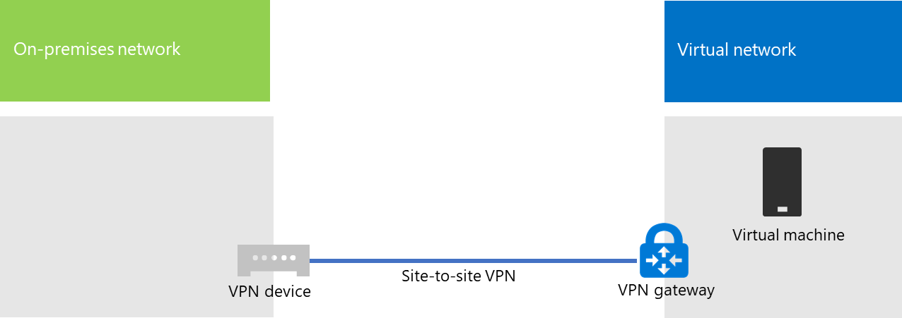

# <a name="connect-an-on-premises-network-to-a-microsoft-azure-virtual-network"></a>Подключение локальной сети к виртуальной сети Microsoft Azure

Виртуальная сеть Azure подключается к вашей локальной сети, расширяя ее за счет подсетей и виртуальных машин, размещенных в службах инфраструктуры Azure. Это подключение обеспечивает компьютерам локальной сети прямой доступ к виртуальным машинам Azure, и наоборот. 

Например, сервер синхронизации каталогов, работающий на виртуальной машине Azure, должен запрашивать у контроллеров локального домена изменения учетных записей и синхронизировать эти изменения с подпиской на Microsoft 365. В этой статье показано, как настроить виртуальную сеть Azure между узлами с помощью VPN-подключения, готового к использованию виртуальных машин Azure.

## <a name="configure-a-cross-premises-azure-virtual-network"></a>Настройка виртуальной сети Azure

Виртуальные машины в Azure не должны быть изолированы от локальной среды. Чтобы подключить виртуальные машины Azure к локальным сетевым ресурсам, необходимо настроить виртуальную сеть Azure. На схеме ниже показаны компоненты, необходимые для развертывания виртуальной сети Azure с виртуальной машиной в Azure.
  

 
На схеме показано VPN-подключение типа "сеть-сеть", установленное между локальной сетью и виртуальной сетью Azure. VPN-подключение типа "сеть-сеть":

- установлено между двумя конечными точками, имеющими адрес в общедоступной сети Интернет.
- Прерывается VPN-устройством в локальной сети и VPN-шлюзом в виртуальной сети Azure.

Виртуальная сеть Azure используется для размещения виртуальных машин. Исходящий сетевой трафик виртуальных машин сперва направляется в VPN-шлюз, который затем перенаправляет сетевой трафик через VPN-подключение типа "сеть-сеть" на VPN-устройство в локальной сети. Затем инфраструктура маршрутизации локальной сети перенаправляет трафик по назначению.

>[!Note]
>Вы также можете использовать [ExpressRoute](https://azure.microsoft.com/services/expressroute/) (прямое подключение между вашей организацией и сетью Майкрософт). Данные, передаваемые через ExpressRoute, не попадают в Интернет. В этой статье нет инструкций по использованию ExpressRoute.
>
  
Чтобы настроить VPN-подключение между виртуальной сетью Azure и локальной сетью, выполните указанные ниже действия: 
  
1. **Локальная сеть.** Определите и создайте локальный сетевой маршрут для адресного пространства виртуальной сети Azure, который указывает на локальное VPN-устройство.
    
2. **Microsoft Azure.**  Создайте виртуальную сеть Azure с VPN-подключением типа "сеть-сеть". 
    
3. **Локальная сеть.** Настройте аппаратное или программное локальное VPN-устройство для прерывания VPN-подключения, которое использует IPsec.
    
После установки VPN-подключения типа "сеть-сеть" добавьте виртуальные машины Azure в подсети виртуальной сети.
  
## <a name="plan-your-azure-virtual-network"></a>Планирование виртуальной сети Azure
<a name="PlanningVirtual"></a>

### <a name="prerequisites"></a>Необходимые компоненты
<a name="Prerequisites"></a>

- Подписка на Azure. Сведения о подписках на Azure см. на странице [Как приобрести Azure](https://azure.microsoft.com/pricing/purchase-options/).
    
- Доступное частное пространство IPv4-адресов, которое необходимо назначить виртуальной сети и ее подсетям, с достаточным количеством адресов с учетом возможного расширения.
    
- Доступное VPN-устройство в локальной сети для прерывания VPN-подключения типа "сеть-сеть", которое поддерживает требования для IPsec. Дополнительные сведения см. в статье [О VPN-устройствах для подключений VPN-шлюзов типа "сеть-сеть"](https://go.microsoft.com/fwlink/p/?LinkId=393093).
    
- Изменение инфраструктуры маршрутизации для перенаправления трафика, поступающего в адресное пространство виртуальной сети Azure, на VPN-устройство, которое принимает VPN-подключение типа "сеть-сеть".
    
- Веб-прокси, который предоставляет доступ в Интернет компьютерам, подключенным к локальной сети и виртуальной сети Azure.
    
### <a name="solution-architecture-design-assumptions"></a>Допущения по архитектуре решения

Ниже перечислены проектные решения для этой архитектуры. 
  
- Это решение использует одну виртуальную сеть Azure с VPN-подключением типа "сеть-сеть". В виртуальной сети Azure размещается одна подсеть, которая может содержать несколько виртуальных машин. 
    
- Вы можете использовать службу RRAS в Windows Server 2016 или Windows Server 2012, чтобы установить VPN-подключение типа "сеть-сеть" с защитой IPsec между локальной сетью и виртуальной сетью Azure. Вы также можете использовать другие VPN-устройства, например Cisco или Juniper Networks.
    
- В локальной сети по-прежнему могут размещаться сетевые службы, такие как доменные службы Active Directory (AD DS), служба доменных имен (DNS), и прокси-серверы. В зависимости от ваших требований, некоторые из этих сетевых ресурсов может быть удобнее разместить в виртуальной сети Azure.
    
Для существующей виртуальной сети Azure с одной или несколькими подсетями определите, осталось ли адресное пространство для дополнительной подсети и размещения необходимых виртуальных машин, учитывая ваши требования. Если адресного пространства для дополнительной подсети не осталось, создайте дополнительную виртуальную сеть с собственным VPN-подключением типа "сеть-сеть".
  
### <a name="plan-the-routing-infrastructure-changes-for-the-azure-virtual-network"></a>Планирование изменения инфраструктуры маршрутизации для виртуальной сети Azure

Локальную инфраструктуру маршрутизации необходимо настроить так, чтобы трафик, поступающий в пространство адресов виртуальной сети Azure, направлялся в локальное VPN-устройство с VPN-подключением типа "сеть-сеть".
  
Конкретный метод обновления инфраструктуры маршрутизации зависит от того, как выполняется управление сведениями о маршрутизации, например:
  
- таблица маршрутизации обновляется в соответствии с ручной настройкой;
    
- таблица маршрутизации обновляется в соответствии с протоколами маршрутизации, например RIP или OSPF.
    
Проконсультируйтесь со своим специалистом по маршрутизации, чтобы убедиться, что трафик, предназначенный для виртуальной сети Azure, перенаправляется на локальное VPN-устройство.
  
### <a name="plan-for-firewall-rules-for-traffic-to-and-from-the-on-premises-vpn-device"></a>Планирование правил брандмауэра для входящего и исходящего трафика на локальном VPN-устройстве

Если VPN-устройство размещается в сети периметра, которая соединяется с Интернетом через брандмауэр, рекомендуем настроить на брандмауэре перечисленные ниже правила, чтобы сделать возможным VPN-подключение типа "сеть-сеть".
  
- Трафик к VPN-устройству (входящий):
    
  - Конечный IP-адрес VPN-устройства и протокол IP 50
    
  - Конечный IP-адрес VPN-устройства и конечный порт UDP 500
    
  - Конечный IP-адрес VPN-устройства и конечный порт UDP 4500
    
- Трафик с VPN-устройства (исходящий):
    
  - Исходный IP-адрес VPN-устройства и протокол IP 50
    
  - Исходный IP-адрес VPN-устройства и исходный порт UDP 500
    
  - Исходный IP-адрес VPN-устройства и исходный порт UDP 4500
    
### <a name="plan-for-the-private-ip-address-space-of-the-azure-virtual-network"></a>Планирование пространства частных IP-адресов виртуальной сети Azure

Пространство частных IP-адресов виртуальной сети Azure должно иметь достаточный размер для адресов, используемых платформой Azure для размещения виртуальной сети как минимум с одной подсетью, в которой достаточно адресов для размещения виртуальных машин Azure.
  
Чтобы определить необходимое количество адресов для подсети, посчитайте количество виртуальных машин, необходимых на данный момент, оцените потенциал роста и определите размер подсети, пользуясь следующей таблицей.
  
|**Необходимое количество виртуальных машин**|**Необходимое количество бит узла**|**Размер подсети**|
|:-----|:-----|:-----|
|1–3  <br/> |3  <br/> |/29  <br/> |
|4–11  <br/> |4  <br/> |/28  <br/> |
|12–27  <br/> |5  <br/> |/27  <br/> |
|28–59  <br/> |6  <br/> |/26  <br/> |
|60–123  <br/> |7  <br/> |/25  <br/> |
   
### <a name="planning-worksheet-for-configuring-your-azure-virtual-network"></a>Таблица планирования настройки виртуальной сети Azure
<a name="worksheet"> </a>

Прежде чем создавать виртуальную сеть Azure для размещения виртуальных машин, необходимо определить нужные параметры в следующих таблицах.
  
Чтобы задать параметры виртуальной сети, заполните таблицу V.
  
 **Таблица V. Настройка распределенной виртуальной сети**
  
|**Элемент**|**Элемент Configuration**|**Описание**|**Значение**|
|:-----|:-----|:-----|:-----|
|1.  <br/> |Имя виртуальной сети  <br/> |Имя, назначаемое виртуальной сети Azure (например, DirSyncNet).  <br/> | |
|2.  <br/> |Расположение виртуальной сети  <br/> |Центр обработки данных Azure, в котором будет расположена виртуальная сеть (например, Запад США).  <br/> |  <br/> |
|3.  <br/> |IP-адрес VPN-устройства  <br/> |Общедоступный IPv4-адрес интерфейса VPN-устройства в Интернете. Попросите ИТ-отдел определить этот адрес.  <br/> |  <br/> |
|4.  <br/> |Адресное пространство виртуальной сети  <br/> |Адресное пространство (определенное в одном префиксе личного адреса) для виртуальной сети. Определите это адресное пространство при поддержке ИТ-отдела. Оно должно быть представлено в формате CIDR, также известном как формат префикса сети. Пример: 10.24.64.0/20.  <br/> | <br/> |
|5.  <br/> |Общий ключ IPsec  <br/> |32-значный случайный буквенно-цифровой ключ, который будет использоваться для проверки подлинности обеих сторон VPN-подключения. Определите значение этого ключа при поддержке ИТ-отдела, а затем сохраните его в надежном месте. Вы также можете ознакомиться со статьей [Создание случайной строки для предварительного ключа IPsec](https://social.technet.microsoft.com/wiki/contents/articles/32330.create-a-random-string-for-an-ipsec-preshared-key.aspx).<br/> | <br/> |
   
Укажите подсети этого решения в таблице S.
  
- Для первой подсети определите 28-битовое адресное пространство (с длиной префикса /28) подсети шлюза Azure. Сведения о том, как определить это адресное пространство, см. в статье [Расчет адресного пространства подсетей шлюза для виртуальных сетей Azure](https://blogs.technet.microsoft.com/solutions_advisory_board/2016/12/01/calculating-the-gateway-subnet-address-space-for-azure-virtual-networks/).
    
- Для второй подсети укажите понятное имя, одно пространство IP-адресов на основе адресного пространства виртуальной сети.
    
Определите эти адресные пространства из адресного пространства виртуальной сети при поддержке ИТ-отдела. Оба адресных пространства должны быть представлены в формате CIDR.
  
 **Таблица S. Подсети виртуальной сети**
  
|**Элемент**|**Имя подсети**|**Адресное пространство подсети**|**Назначение**|
|:-----|:-----|:-----|:-----|
|1.  <br/> |GatewaySubnet  <br/> |  <br/> |Подсеть, используемая шлюзом Azure.  <br/> |
|2.  <br/> |  <br/> |  <br/> |  <br/> |
   
Для локальных DNS-серверов, используемых виртуальными машинами в виртуальной сети, заполните таблицу D. Присвойте каждому DNS-серверу понятное имя и один IP-адрес. Это понятное имя необязательно должно совпадать с именем узла или именем компьютера на DNS-сервере. Обратите внимание, что представлено два пустых поля, но вы можете добавить еще. Определите этот список при поддержке ИТ-отдела.
  
 **Таблица D. Локальные DNS-сервера**
  
|**Элемент**|**Понятное имя DNS-сервера**|**IP-адрес DNS-сервера**|
|:-----|:-----|:-----|
|1.  <br/> |  <br/> |  <br/> |
|2.  <br/> |  <br/> |  <br/> |
   
Чтобы отправлять пакеты из виртуальной сети Azure в сеть организации с помощью VPN-подключения типа "сеть-сеть", необходимо настроить виртуальную сеть с локальной сетью. Эта локальная сеть содержит список адресных пространств (в формате CIDR) для всех расположений в локальной сети организации, которые должны быть доступны виртуальным машинам в виртуальной сети. Это могут быть все расположения в локальной сети или подсети. Список адресных пространств, которые определяют локальную сеть, должен быть уникален и не должен пересекаться с адресными пространствами, используемыми для этой или других виртуальных сетей.
  
Укажите список адресных пространств локальной сети в таблице L. Обратите внимание, что представлено три пустых поля, но обычно требуется больше. Определите этот список при поддержке ИТ-отдела.
  
 **Таблица L. Префиксы адресов для локальной сети**
  
|**Элемент**|**Адресное пространство локальной сети**|
|:-----|:-----|
|1.  <br/> |  <br/> |
|2.  <br/> |  <br/> |
|3.  <br/> |  <br/> |
   
## <a name="deployment-roadmap"></a>План развертывания
<a name="DeploymentRoadmap"> </a>

Создание виртуальной сети и добавление виртуальных машин в Azure состоит из трех этапов:
  
- Этап 1. Подготовка локальной сети.
    
- Этап 2. Создание виртуальной сети в Azure.
    
- Этап 3 (необязательный). Добавление виртуальных машин.
    
### <a name="phase-1-prepare-your-on-premises-network"></a>Этап 1. Подготовка локальной сети
<a name="Phase1"></a>

В локальной сети необходимо настроить маршрут, который указывает на маршрутизатор на границе локальной сети и направляет на него трафик, предназначенный для адресного пространства виртуальной сети. Обратитесь к администратору сети, чтобы определить, как добавить маршрут в инфраструктуру локальной сети.
  
Ниже показана полученная в итоге конфигурация.
  

  
### <a name="phase-2-create-the-cross-premises-virtual-network-in-azure"></a>Этап 2. Создание распределенной виртуальной сети в Azure
<a name="Phase2"></a>

Сначала откройте командную строку Azure PowerShell. Если вы еще не установили Azure PowerShell, см. статью [Начало работы с Azure PowerShell](https://docs.microsoft.com/powershell/azure/get-started-azureps).

 
Затем войдите в свою учетную запись Azure с помощью следующей команды.
  
```powershell
Connect-AzAccount
```

Получите имя подписки с помощью следующей команды.
  
```powershell
Get-AzSubscription | Sort SubscriptionName | Select SubscriptionName
```

Задайте свою подписку Azure с помощью этих команд. Замените весь текст в кавычках, в том числе символы "<" и ">", правильными именами подписок.
  
```powershell
$subscrName="<subscription name>"
Select-AzSubscription -SubscriptionName $subscrName
```

Затем создайте группу ресурсов для виртуальной сети. Чтобы определить уникальное имя группы ресурсов, используйте следующую команду для вывода списка имеющихся групп ресурсов.
  
```powershell
Get-AzResourceGroup | Sort ResourceGroupName | Select ResourceGroupName
```

Создайте группу ресурсов с помощью следующих команд.
  
```powershell
$rgName="<resource group name>"
$locName="<Table V - Item 2 - Value column>"
New-AzResourceGroup -Name $rgName -Location $locName
```

Затем необходимо создать виртуальную сеть Azure.
  
```powershell
# Fill in the variables from previous values and from Tables V, S, and D
$rgName="<name of your new resource group>"
$locName="<Azure location of your new resource group>"
$vnetName="<Table V - Item 1 - Value column>"
$vnetAddrPrefix="<Table V - Item 4 - Value column>"
$gwSubnetPrefix="<Table S - Item 1 - Subnet address space column>"
$SubnetName="<Table S - Item 2 - Subnet name column>"
$SubnetPrefix="<Table S - Item 2 - Subnet address space column>"
$dnsServers=@( "<Table D - Item 1 - DNS server IP address column>", "<Table D - Item 2 - DNS server IP address column>" )
$locShortName=(Get-AzResourceGroup -Name $rgName).Location

# Create the Azure virtual network and a network security group that allows incoming remote desktop connections to the subnet that is hosting virtual machines
$gatewaySubnet=New-AzVirtualNetworkSubnetConfig -Name "GatewaySubnet" -AddressPrefix $gwSubnetPrefix
$vmSubnet=New-AzVirtualNetworkSubnetConfig -Name $SubnetName -AddressPrefix $SubnetPrefix
New-AzVirtualNetwork -Name $vnetName -ResourceGroupName $rgName -Location $locName -AddressPrefix $vnetAddrPrefix -Subnet $gatewaySubnet,$vmSubnet -DNSServer $dnsServers
$rule1=New-AzNetworkSecurityRuleConfig -Name "RDPTraffic" -Description "Allow RDP to all VMs on the subnet" -Access Allow -Protocol Tcp -Direction Inbound -Priority 100 -SourceAddressPrefix Internet -SourcePortRange * -DestinationAddressPrefix * -DestinationPortRange 3389
New-AzNetworkSecurityGroup -Name $SubnetName -ResourceGroupName $rgName -Location $locShortName -SecurityRules $rule1
$vnet=Get-AzVirtualNetwork -ResourceGroupName $rgName -Name $vnetName
$nsg=Get-AzNetworkSecurityGroup -Name $SubnetName -ResourceGroupName $rgName
Set-AzVirtualNetworkSubnetConfig -VirtualNetwork $vnet -Name $SubnetName -AddressPrefix $SubnetPrefix -NetworkSecurityGroup $nsg
$vnet | Set-AzVirtualNetwork
```

Ниже показана полученная в итоге конфигурация.
  

  
Затем используйте следующие команды, чтобы создать шлюзы для VPN-подключения типа "сеть-сеть".
  
```powershell
# Fill in the variables from previous values and from Tables V and L
$vnetName="<Table V - Item 1 - Value column>"
$localGatewayIP="<Table V - Item 3 - Value column>"
$localNetworkPrefix=@( <comma-separated, double-quote enclosed list of the local network address prefixes from Table L, example: "10.1.0.0/24", "10.2.0.0/24"> )
$vnetConnectionKey="<Table V - Item 5 - Value column>"
$vnet=Get-AzVirtualNetwork -Name $vnetName -ResourceGroupName $rgName
# Attach a virtual network gateway to a public IP address and the gateway subnet
$publicGatewayVipName="PublicIPAddress"
$vnetGatewayIpConfigName="PublicIPConfig"
New-AzPublicIpAddress -Name $vnetGatewayIpConfigName -ResourceGroupName $rgName -Location $locName -AllocationMethod Dynamic
$publicGatewayVip=Get-AzPublicIpAddress -Name $vnetGatewayIpConfigName -ResourceGroupName $rgName
$vnetGatewayIpConfig=New-AzVirtualNetworkGatewayIpConfig -Name $vnetGatewayIpConfigName -PublicIpAddressId $publicGatewayVip.Id -SubnetId $vnet.Subnets[0].Id
# Create the Azure gateway
$vnetGatewayName="AzureGateway"
$vnetGateway=New-AzVirtualNetworkGateway -Name $vnetGatewayName -ResourceGroupName $rgName -Location $locName -GatewayType Vpn -VpnType RouteBased -IpConfigurations $vnetGatewayIpConfig
# Create the gateway for the local network
$localGatewayName="LocalNetGateway"
$localGateway=New-AzLocalNetworkGateway -Name $localGatewayName -ResourceGroupName $rgName -Location $locName -GatewayIpAddress $localGatewayIP -AddressPrefix $localNetworkPrefix
# Create the Azure virtual network VPN connection
$vnetConnectionName="S2SConnection"
$vnetConnection=New-AzVirtualNetworkGatewayConnection -Name $vnetConnectionName -ResourceGroupName $rgName -Location $locName -ConnectionType IPsec -SharedKey $vnetConnectionKey -VirtualNetworkGateway1 $vnetGateway -LocalNetworkGateway2 $localGateway
```

Ниже показана полученная в итоге конфигурация.
  

  
Затем настройте локальное VPN-устройство для подключения к VPN-шлюзу Azure. Дополнительные сведения см. в статье [О VPN-устройствах для подключений VPN-шлюзов типа "сеть-сеть"](https://docs.microsoft.com/azure/vpn-gateway/vpn-gateway-about-vpn-devices).
  
Чтобы настроить VPN-устройство, вам потребуется следующее:
  
- Общедоступный IPv4-адрес VPN-шлюза Azure для виртуальной сети. Используйте команду **Get-AzPublicIpAddress -Name $vnetGatewayIpConfigName -ResourceGroupName $rgName** для отображения данного адреса.
    
- Общий ключ IPsec для VPN-подключения типа "сеть-сеть" (таблица V, элемент 5, столбец "Значение").
    
Ниже показана полученная в итоге конфигурация.
  

  
### <a name="phase-3-optional-add-virtual-machines"></a>Этап 3 (необязательный). Добавление виртуальных машин

Создайте необходимые виртуальные машины в Azure. Дополнительные сведения см. в статье [Создание виртуальной машины Windows с помощью портала Azure](https://go.microsoft.com/fwlink/p/?LinkId=393098).
  
Используйте указанные ниже параметры:
  
- На вкладке **Основные** выберите ту же подписку и группу ресурсов, что и в виртуальной сети. Они потребуются позже для входа на виртуальной машине. В разделе **Сведения об экземпляре** выберите подходящий размер виртуальной машины. Запишите имя и пароль учетной записи администратора в надежном месте. 
    
- На вкладке **Сеть** выберите имя виртуальной сети и подсеть для размещения виртуальных машин (не GatewaySubnet). Для всех остальных параметров оставьте значения по умолчанию.
    
Проверьте внутренний DNS, чтобы убедиться, что виртуальная машина правильно использует DNS и для виртуальной машины добавлены адресные записи (A). Чтобы предоставить виртуальным машинам Azure доступ к Интернету, их необходимо настроить на использование прокси-сервера локальной сети. Обратитесь к администратору сети за дополнительными инструкциями по настройке сервера.
  
Ниже показана полученная в итоге конфигурация.
  

  
## <a name="next-step"></a>Следующий шаг
  
[Развертывание синхронизации каталогов Microsoft 365 в Microsoft Azure](deploy-microsoft-365-directory-synchronization-dirsync-in-microsoft-azure.md)
