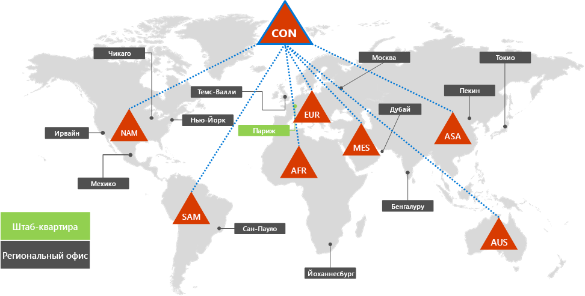
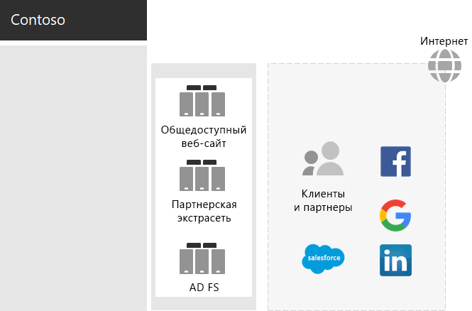
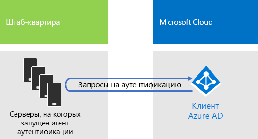
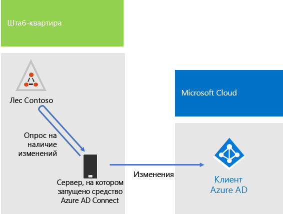
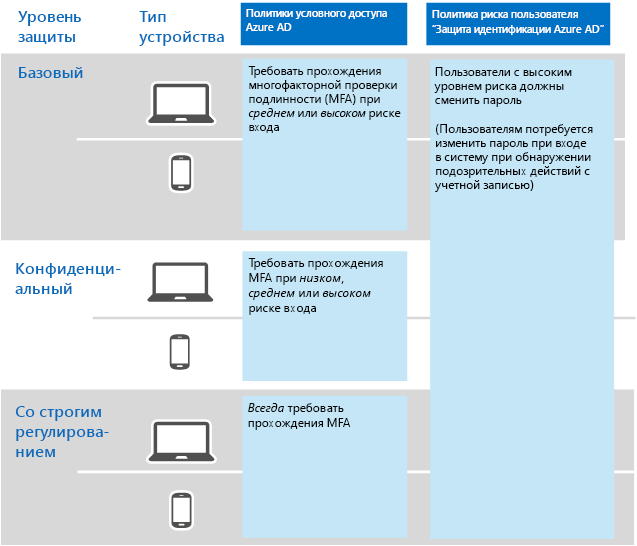

# Удостоверение для корпорации ContosoIdentity for the Contoso Corporation

**Сводка.** Сведения о том, как Contoso использует службу "удостоверение как услуга" (IDaaS) и предоставляет облачную проверку подлинности для сотрудников, а также федеративную проверку подлинности для партнеров и клиентов.**Summary:** How Contoso takes advantage of Identity as a Service (IDaaS) and provides cloud-based authentication for its employees and federated authentication for its partners and customers.

Корпорация Майкрософт включает удостоверение как услугу (IDaaS) в свои облачные предложения с Azure Active Directory (AD). Чтобы внедрить Microsoft 365 корпоративный, решение IDaaS корпорации Contoso должно использовать локального поставщика удостоверений и по-прежнему включать федеративную проверку подлинности с привлечением текущих, надежных, сторонних поставщиков удостоверений.Microsoft provides an Identity as a Service (IDaaS) across its cloud offerings with Azure Active Directory (AD). To adopt Microsoft 365 Enterprise, Contoso's IDaaS solution had to leverage their on-premises identity provider and still include federated authentication with their existing trusted, third-party identity providers.

## Лес Windows Server AD корпорации ContosoContoso's Windows Server AD forest

Корпорация Contoso использует один лес Windows Server Active Directory (AD) для contoso.com с семью дочерними доменами (по одному для каждого региона мира). Главный офис, региональные центральные офисы и подчиненные офисы включают контроллеры доменов для локальной проверки подлинности и авторизации.Contoso uses a single Windows Server Active Directory (AD) forest for contoso.com with seven sub-domains, one for each region of the world. The headquarters, regional hub offices, and satellite offices contain domain controllers for local authentication and authorization.

На рисунке 1 показан лес Contoso с региональными доменами для разных частей света, в которых находятся региональные офисы.Figure 1 shows the Contoso forest with regional domains for the different parts of the world that contain regional hubs.

 
**Рис. 1. Лес Contoso и домены по всему миру****Figure 1: Contoso's forest and domains worldwide**

Корпорация Contoso хочет использовать учетные записи и группы в лесу contoso.com для аутентификации и авторизации своих облачных приложений и рабочих нагрузок.Contoso wants to use the accounts and groups in the contoso.com forest for authentication and authorization for its cloud-based apps and workloads.

## Инфраструктура федеративной аутентификации ContosoContoso's federated authentication infrastructure

Корпорация Contoso разрешает:Contoso allows:

- клиентам использовать свои учетные записи Майкрософт, Facebook или Google Mail для входа на общедоступный веб-сайт;Customers to use their Microsoft, Facebook, or Google Mail accounts to sign in to their public web site.
- поставщикам и партнерам использовать свои учетные записи LinkedIn, Salesforce или Google Mail для входа в партнерскую экстрасеть.Vendors and partners to use their LinkedIn, Salesforce, or Google Mail accounts to sign in to the partner extranet.

На рисунке 2 показана сеть периметра Contoso, которая содержит общедоступный веб-сайт, партнерскую экстрасеть и набор серверов служб федерации Active Directory (AD FS). Сеть периметра подключена к Интернету, в котором находятся клиенты, партнеры и Интернет-службы.Figure 2 shows the Contoso DMZ containing a public web site, a partner extranet, and a set of Active Directory Federation Services (AD FS) servers. The DMZ is connected to the Internet that contains customers, partners, and Internet services.

**Рис. 2. Поддержка федеративной аутентификации клиентов и партнеров в корпорации Contoso****Figure 2: Contoso's support for federated authentication for customers and partners**
 
Серверы AD FS в сети периметра выполняют аутентификацию клиентов на общедоступном веб-сайте и партнеров в партнерской экстрасети.AD FS servers in the DMZ authenticate customer credentials for access to the public web site and partner credentials for access to the partner extranet.

Корпорация Contoso решила сохранить эту инфраструктуру и выделить ее для проверки подлинности клиентов и партнеров. Специалисты по удостоверениям Contoso изучают возможность преобразования этой инфраструктуры в решения Azure AD [B2B](https://docs.microsoft.com/azure/active-directory/b2b/hybrid-organizations) и [B2C](https://docs.microsoft.com/azure/active-directory-b2c/solution-articles).Contoso decided to keep this infrastructure and dedicate it to customer and partner authentications. Contoso identity engineers are investigating the conversion of this infrastructure to Azure AD [B2B](https://docs.microsoft.com/azure/active-directory/b2b/hybrid-organizations) and [B2C](https://docs.microsoft.com/azure/active-directory-b2c/solution-articles) solutions.

## Гибридное удостоверение со сквозной проверкой подлинности для облачной аутентификацииHybrid identity with pass-through authentication for cloud-based authentication

Корпорация Contoso хотела использовать локальный лес Windows Server AD для проверки подлинности при доступе к облачным ресурсам Microsoft 365. Было решено применять сквозную проверку подлинности (PTA) с синхронизацией хэша паролей (PHS).Contoso wanted to leverage its on-premises Windows Server AD forest for authentication to Microsoft 365 cloud resources. It decided on pass-through authentication (PTA) with password hash synchronization (PHS).

### Аутентификация PTAPTA authentication

Для проверки подлинности учетных данных пользователя в Contoso используется PTA. Когда пользователь Contoso переходит к облачным ресурсам, отправленные им учетные данные передаются с помощью Azure AD к серверу, на котором работает агент проверки подлинности в центре обработки данных главного офиса Contoso. Один из этих серверов с агентом проверки подлинности проверяет учетные данные пользователя от имени Azure AD.For authentication of user credentials, Contoso is using PTA. When a Contoso user accesses a cloud-based resources, the credentials it sends are passed by Azure AD to a server running an Authentication Agent in the Contoso headquarters datacenter. One of these Authentication Agent servers validates the user credentials on behalf of Azure AD.

На рисунке 3 показан набор серверов в главном офисе Contoso, на которых работает агент проверки подлинности, обрабатывающий запросы на проверку подлинности, которые передаются из Azure AD.Figure 3 shows a set of servers in the Contoso headquarters running the Authentication Agent, which process authentication requests passed to it from Azure AD. 

 
**Рис. 3. Инфраструктура сквозной проверки подлинности Contoso****Figure 3: Contoso's pass-through authentication infrastructure**

В корпорации Contoso выбрана сквозная проверка подлинности (PTA) для выполнения требования по безопасности, связанного с оценкой всех попыток аутентификации при немедленных изменениях состояний учетных записей пользователей, политик паролей и времени входа, выполняемых в локальном лесу Windows Server AD.Contoso chose PTA to fulfill its security requirement that all authentication attempts be evaluated for immediate changes to user account states, password policies, and sign-in hours made to the on-premises Windows Server AD forest.

### PHSPHS

PHS синхронизирует локальный лес Windows Server AD с клиентом Azure AD подписки на Microsoft 365 корпоративный, копируя учетные записи пользователя и группы, а также хэшированную версию паролей учетной записи пользователя. Корпорация Contoso выбрала PHS в качестве альтернативного способа проверки подлинности непосредственно с клиентом Azure AD на случай недоступности PTA.PHS synchronizes the on-premises Windows Server AD forest with the Azure AD tenant of their Microsoft 365 Enterprise subscription, copying user and group accounts and a hashed version of user account passwords. Contoso decided on PHS to provide an alternate method of authentication directly with the Azure AD tenant in the event that PTA is not available.

Чтобы выполнять текущую синхронизацию каталогов, в корпорации Contoso развернуто средство Azure AD Connect на сервере центра обработки данных в Париже. На рисунке 4 показан сервер, на котором работает Azure AD Connect, опрашивающий лес Contoso Windows Server AD на изменения и затем выполняющий синхронизацию этих изменений с клиентом Azure AD.To perform the ongoing directory synchronization, Contoso has deployed the Azure AD Connect tool on a server in its Paris datacenter. Figure 4 shows the server running Azure AD Connect polling the Contoso Windows Server AD forest for changes and then synchronizing those changes with the Azure AD tenant.

 
**Рис. 4. Инфраструктура синхронизации каталогов PHS корпорации Contoso****Figure 4: Contoso's PHS directory synchronization infrastructure**

## Политики условного доступа для удостоверенийConditional access policies for identity

В корпорации Contoso создан набор [политик условного доступа](identity-access-policies.md) Azure AD, чтобы обеспечивать многофакторную проверку подлинности и принудительную смену пароля, если Azure AD выявляет риск для входа при запросе проверки подлинности.Contoso created a set of Azure AD [conditional access policies](identity-access-policies.md) to ensure that multi-factor authentication and password changes are enforced when Azure AD determines there is sign-in risk for an authentication request.

На рисунке 5 показан результирующий набор политик условного доступа для удостоверения.Figure 5 shows their resulting set of conditional access policies for identity.

 
**Рис. 5. Политики условного доступа на основе удостоверений корпорации Contoso****Figure 5: Contoso’s identity-based conditional access policies**

## Следующее действиеNext step

[Узнайте,](contoso-win10.md) как в корпорации Contoso используют инфраструктуру System Center Configuration Manager для развертывания Windows 10 Корпоративная в организации и поддержания ее в актуальном состоянии.[Learn](contoso-win10.md) how Contoso is leveraging its System Center Configuration Manager infrastructure to deploy and keep current Windows 10 Enterprise across its organization.

## См. такжеSee also

[Удостоверение для Microsoft 365 корпоративныйIdentity for Microsoft 365 Enterprise](identity-infrastructure.md)

[Руководство по развертываниюDeployment guide](deploy-microsoft-365-enterprise.md)

[Руководства по лаборатории тестированияTest lab guides](m365-enterprise-test-lab-guides.md)
