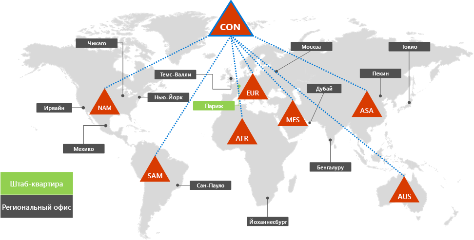
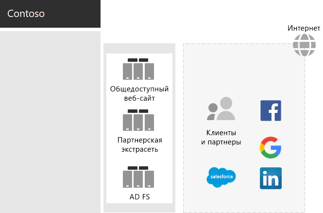
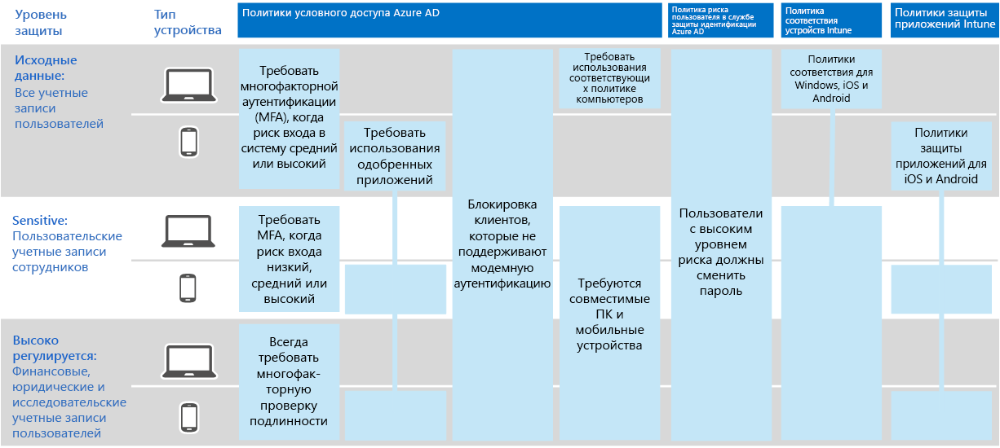

# Удостоверение для корпорации Contoso

Майкрософт предоставляет удостоверение в качестве службы (IDaaS) в облачных решениях через Azure Active Directory (Azure AD). Чтобы использовать Microsoft 365 для предприятий, решение Contoso IDaaS должно использовать свой локальный поставщик удостоверений и включала федеративный способ проверки подлинности с имеющимися надежными сторонними поставщиками удостоверений.

## Лес доменных служб Active Directory contoso

Contoso использует один лес доменных служб Active Directory (AD DS) для Contoso \. com с семь поддоменов, по одному для каждого региона мира. Главный офис, региональные и вспомогательные офисы содержат контроллеры доменов для локальной проверки подлинности и авторизации.

Вот Лес contoso с региональными доменами для различных частей мира, которые содержат региональные концентраторы.

 
Компания Contoso решила использовать учетные записи и группы в \. лесу com для Contoso для проверки подлинности и авторизации для своей рабочей нагрузки и служб Microsoft 365.

## Инфраструктура федеративной проверки подлинности contoso

Корпорация Contoso разрешает:

- Клиенты могут использовать учетные записи Microsoft, Facebook или Google Mail для входа на общедоступный веб-сайт компании.
- Поставщикам и партнерам использовать свои учетные записи LinkedIn, Salesforce или Google для входа в экстрасеть партнера компании.

Вот ДЕМИЛИТАРИЗОВАНная группа Contoso, содержащая общедоступный веб-сайт, экстрасеть партнера и набор серверов AD FS. DMZ подключается к Интернету, который содержит клиентов, партнеров и Интернет-служб.

 
Серверы AD FS в DMZ упрощают проверку подлинности учетных данных клиента по их поставщикам удостоверений для доступа к общедоступному веб-сайту и учетным данным партнера для доступа к экстрасети партнера.

Компания Contoso решила сохранить эту инфраструктуру и выделить ее для проверки подлинности клиентов и партнеров. Архитекторы удостоверений Contoso изучает преобразование этой инфраструктуры в решения Azure AD [B2B](https://docs.microsoft.com/azure/active-directory/b2b/hybrid-organizations) и [B2C](https://docs.microsoft.com/azure/active-directory-b2c/solution-articles) .

## Гибридное удостоверение с синхронизацией хэша пароля для облачной проверки подлинности

Contoso требовалось использовать локальный лес AD DS для проверки подлинности в облачных ресурсах Microsoft 365. Решено использовать синхронизацию хэша паролей (ФС).

ФС синхронизирует локальный лес доменных служб Active Directory с клиентом Azure AD своей подписки Microsoft 365 для предприятия, копируя учетные записи пользователей и групп и хешированную версию паролей учетных записей пользователей.

Для синхронизации службы каталогов компания Contoso развернула средство Azure AD Connect на сервере в центре данных Париж.

Вот сервер, на котором работает Azure AD Connect, который опрашивает лес Contoso AD DS на наличие изменений, а затем синхронизирует эти изменения с клиентом Azure AD.

 
## Политики условного доступа для доступа к удостоверению и устройству

В Contoso создан набор [политик условного доступа](identity-access-policies.md) Azure AD и Intune для трех уровней защиты:

- *Базовые* защиты применяются ко всем учетным записям пользователей.
- *Конфиденциальная* защита относится к высшим лидерам и сотрудникам руководителей.
- *Строго регулируемые* защиты применяются к определенным пользователям в отделе финансов, юридических и исследовательских отделов, имеющих доступ к данным с высоким регулируемым доступом.

Вот итоговый набор политик условного доступа для удостоверений и устройств contoso.

 
## Дальнейшие действия

[Узнайте](contoso-win10.md) , как в компании Contoso для развертывания и сохранения текущей операционной системы Windows 10 Корпоративная в организации используется инфраструктура Configuration Manager конечных точек Майкрософт.

## См. также

[Стратегия удостоверений для Microsoft 365](identity-roadmap-microsoft-365.md)

[Обзор Microsoft 365 для предприятий](microsoft-365-overview.md)

[Руководства по лаборатории тестирования](m365-enterprise-test-lab-guides.md)
