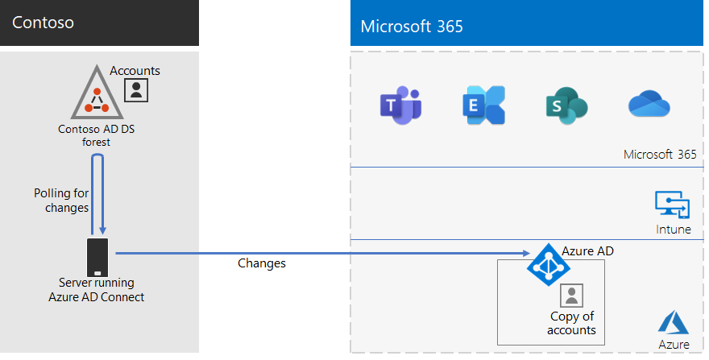

# Удостоверение для корпорации Contoso

Корпорация Майкрософт предоставляет удостоверение как службу (IDaaS) в своих облачных предложениях через Azure Active Directory (Azure AD). Для принятия Microsoft 365 для предприятий решение Contoso IDaaS должно было использовать локального поставщика удостоверений и включить федераированную проверку подлинности с существующими доверенными сторонними поставщиками удостоверений.

## Лес доменных служб Active Directory Contoso

Contoso использует один лес доменных служб Active Directory (AD DS) для contoso com с семью поддоменами, по одному для каждого региона \. мира. Главный офис, региональные и вспомогательные офисы содержат контроллеры доменов для локальной проверки подлинности и авторизации.

Вот лес Contoso с региональными доменами для различных регионов мира, которые содержат региональные концентраторы.

 
Корпорация Contoso решила использовать учетные записи и группы в лесу contoso com для проверки подлинности и авторизации рабочих нагрузок и служб \. Microsoft 365.

## Инфраструктура федераированной проверки подлинности Contoso

Корпорация Contoso разрешает:

- Клиенты используют свои учетные записи Майкрософт, Facebook или Google Mail для входов на общедоступный веб-сайт компании.
- Поставщики и партнеры используют свои учетные записи LinkedIn, Salesforce или Google Mail для входов в партнерской экстрасети компании.

Вот DMZ Contoso, содержащая общедоступный веб-сайт, партнерская экстрасеть и набор серверов служб федерации Active Directory (AD FS). Сеть DMZ подключена к Интернету, в который входят клиенты, партнеры и интернет-службы.

 
Серверы AD FS в DMZ упрощают проверку подлинности учетных данных клиента их поставщиками удостоверений для доступа к общедоступным веб-сайтам и партнерским учетным данным для доступа к партнерской экстрасети.

В компании Contoso решили сохранить эту инфраструктуру и сделать ее выделенной для проверки подлинности клиентов и партнеров. Архитекторы удостоверений Contoso изучают преобразование этой инфраструктуры в решения Azure AD [B2B](https://docs.microsoft.com/azure/active-directory/b2b/hybrid-organizations) и [B2C.](https://docs.microsoft.com/azure/active-directory-b2c/solution-articles)

## Гибридное удостоверение с синхронизацией хэша пароля для облачной проверки подлинности

Корпорация Contoso хочет использовать свой локальной лес AD DS для проверки подлинности в облачных ресурсах Microsoft 365. Было принято решение использовать синхронизацию хеш-паролей (PHS).

PHS синхронизирует локальное лес AD DS с клиентом Azure AD подписки Microsoft 365 для предприятий, копируя учетные записи пользователей и групп, а также hashed версию паролей учетных записей пользователей.

Для синхронизации службы каталогов компания Contoso развернула средство Azure AD Connect на сервере в своем париже.

Вот сервер с Azure AD Connect, который оповещает лес AD DS Contoso об изменениях и затем синхронизирует эти изменения с клиентом Azure AD.

 
## Политики условного доступа для доступа к удостоверению и устройству

В Contoso создан набор [политик условного доступа](identity-access-policies.md) Azure AD и Intune для трех уровней защиты:

- *Базовые* меры защиты применяются для всех учетных записей пользователей.
- *Защита* конфиденциальных данных применяется к старшим руководителям и руководителям.
- *Строго регулируемая* защита применяется к определенным пользователям финансового, юридического и исследовательского отделов, которые имеют доступ к строго регулируемым данным.

Ниже приводится итоговая настройка политик условного доступа к удостоверениям и устройствам Contoso.

 
## Дальнейшие действия

Узнайте, как Contoso использует инфраструктуру Microsoft Endpoint Configuration Manager для развертывания и поддержания [windows 10 Корпоративная](contoso-win10.md) в организации.

## См. также

[Стратегия удостоверений для Microsoft 365](identity-roadmap-microsoft-365.md)

[Обзор Microsoft 365 для предприятий](microsoft-365-overview.md)

[Руководства по лаборатории тестирования](m365-enterprise-test-lab-guides.md)
