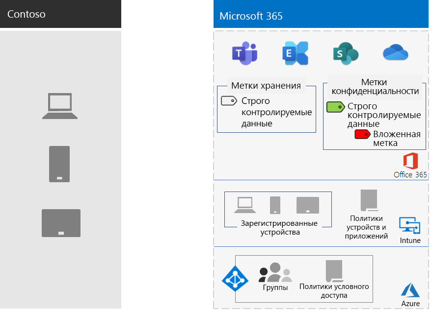

# Защита информации в корпорации ContosoInformation protection for the Contoso Corporation

В компании Contoso серьезно относятся к защите своей информации. Например, допустив утечку или порчу интеллектуальной собственности, включающей описания конструкций продуктов и проприетарных методов ее изготовления, компания лишится своих конкурентных преимуществ.Contoso is serious about their information security and protection. For example, leakage or destruction of their intellectual property describing product designs and proprietary manufacturing techniques would place them at a competitive disadvantage.

Прежде чем перемещать конфиденциальные и самые ценные ресурсы в облако, специалисты компании убедились, что их локальные требования к классификации и защите информации поддерживаются и реализованы в облачных службах Microsoft 365 корпоративный.Before moving their sensitive and most valuable digital assets to the cloud, they made sure that their on-premises information classification and protection requirements were supported and implemented in the cloud-based services of Microsoft 365 Enterprise.

## Классификация уровней безопасности данных компании ContosoContoso's data security classification

Специалисты компании Contoso проанализировали данные и определили указанные ниже уровни.Contoso performed an analysis of their data and determined the following levels.

||||
|:-------|:-----|:-----|
| **Уровень 1: базовая защита****Level 1: Baseline** | **Уровень 2: защита конфиденциальной информации****Level 2: Sensitive** | **Уровень 3: защита строго контролируемой информации****Level 3: Highly regulated** |
| Данные шифруются и доступны только пользователям, прошедшим проверку подлинности.Data is encrypted and available only to authenticated users.     Предоставляется для всех данных, хранящихся локально и в облачном хранилище, а также рабочих нагрузок, таких как Office 365. Данные шифруются при хранении в службе и при перемещении между службой и клиентским устройством.Provided for all data stored on-premises and in cloud-based storage and workloads, such as Office 365. Data is encrypted while it resides in the service and in transit between the service and client devices.    Примеры данных уровня 1: обычная деловая информация (электронная почта) и файлы для администраторов, специалистов по продажам и специалистов службы поддержки.Examples of Level 1 data are normal business communications (email) and files for administrative, sales, and support workers. | Уровень 1 со строгой проверкой подлинности и защитой от потери данных.Level 1 plus strong authentication and data loss protection.     Строгая проверка подлинности включает многофакторную проверку подлинности (MFA) Azure с подтверждением по SMS.Strong authentication includes Azure Multi-Factor Authentication (MFA) with SMS validation. Защита от потери данных гарантирует, что конфиденциальные и критически важные данные не попадут за пределы облака Майкрософт.Data loss prevention ensures that sensitive or critical information does not travel outside the Microsoft cloud.    Примеры данных уровня 2: финансовые и юридические сведения, а также данные об исследованиях и разработке новых продуктов.Examples of Level 2 data are financial and legal information and research and development data for new products. | Уровень 2 с самыми высокими уровнями шифрования, проверки подлинности и аудита.Level 2 plus the highest levels of encryption, authentication, and auditing.      Самые высокие уровни шифрования хранящихся данных и данных в облаке, которые соответствуют региональным нормативам, в сочетании с многофакторной проверкой подлинности с использованием смарт-карт, детального аудита и оповещений.The highest levels of encryption for data at rest and in the cloud, compliant with regional regulations, combined with MFA with smart cards and granular auditing and alerting.     Примеры данных уровня 3: личные сведения клиентов и партнеров, а также технические характеристики продуктов и проприетарные методы их производства.Examples of Level 3 data are customer and partner personally identifiable information, product engineering specifications, and proprietary manufacturing techniques.  |
||||

## Информационные политики компании ContosoContoso's information policies
В приведенной ниже таблице перечислены информационные политики Contoso.The following table lists Contoso's information policies.

|||||
|:-------|:-----|:-----|:-----|
|  | **Доступ****Access** | **Хранение данных****Data retention** | **Защита информации****Information protection** |
| Информация, представляющая малую ценность для бизнеса (уровень 1: базовая информация)Low business value (Level 1: Baseline) | Предоставление доступа всем пользователямAllow access to all  | 6 месяцев6 months | Применение шифрования.Use encryption. |
| Информация, представляющая среднюю ценность для бизнеса (уровень 2: конфиденциальная информация)Medium business value (Level 2: Sensitive) | Предоставление доступа сотрудникам, субподрядчикам и партнерам компании ContosoAllow access to Contoso employees, subcontractors, and partners     Использование многофакторной проверки подлинности, протокола TLS и управления мобильными приложениями (MAM).Use MFA, Transport Layer Security (TLS), and Mobile Application Management (MAM). | 2 года2 years  | Использование хэш-значений для обеспечения целостности данных.Use hash values for data integrity.  |
| Информация, представляющая большую ценность для бизнеса (уровень 3: строго контролируемая информация)High business value (Level 3: Highly regulated) | Предоставление доступа руководителям и ведущим сотрудникам инженерного и производственного отделов.Allow access to executives and leads in engineering and manufacturing.     Система управления правами (RMS), для которой используются только управляемые сетевые устройства.Rights Management System (RMS) with managed network devices only.  | 7 лет7 years  | Использование цифровых подписей для предотвращения отказов.Use digital signatures for non-repudiation.  |
|||||

## Путь компании Contoso к защите информации в Microsoft 365 корпоративныйContoso’s path to information protection with Microsoft 365 Enterprise

Для подготовки Microsoft 365 корпоративный в соответствии с требованиями компании Contoso к защите информации специалисты компании выполнили указанные ниже действия.Contoso used the following steps to prepare Microsoft 365 Enterprise for their information protection requirements:

1. Определение информации, которую необходимо защищатьIdentified what information to protect

   Сотрудники компании Contoso провели обширную работу и выполнили ревизию цифровых активов компании, размещенных на локальных сайтах SharePoint и в файловых ресурсах и классифицировали все активы.Contoso did an extensive review of their existing digital assets located on on-premises SharePoint sites and file shares and classified each one.

2. Определение политик доступа, хранения и защиты информации для различных уровней данныхDetermined access, retention, and information protection policies for data levels

   На основании определенных уровней данных специалисты компании Contoso разработали подробные требования к политикам, используемым для защиты имеющихся цифровых активов после перемещения их в облако.Based on the data levels, Contoso determined detailed policy requirements, which were used to protect existing digital assets as they were moved to the cloud.

3. Создание меток конфиденциальности и их настройка для различных уровней информацииCreated sensitivity labels and their settings for the different levels of information

   Компания Contoso создала метки конфиденциальности для своих уровней данных с использованием метки для строго контролируемой информации, включающей шифрование, разрешения и водяные знаки.Contoso created sensitivity labels for their data levels, with their highly regulated label that includes encryption, permissions, and watermarks.

4. Создание защищенных сайтов SharePoint для конфиденциальных и строго контролируемых данных с разрешениями, блокирующими доступCreated protected SharePoint sites for sensitive and highly regulated data with permissions that lock down access

   Сайты с конфиденциальной и строго контролируемой информацией были настроены в качестве сайтов закрытых групп с дополнительными ограничениями для разрешений.Both sensitive and highly regulated sites were configured as private team sites with additional permissions restrictions. Для конфиденциальных и строго контролируемых сайтов SharePoint также была настроена соответствующая метка хранения.Sensitive and highly regulated SharePoint sites were also configured with a corresponding retention label. Файлы, хранящиеся на строго контролируемых сайтах SharePoint, защищены меткой конфиденциальности "Строго контролируемый".Files stored in highly regulated SharePoint sites are protected with a sensitivity sublabel of the Highly Regulated label. Дополнительные сведения см. в сценарии [сайтов SharePoint для жестко регламентированных данных](teams-sharepoint-online-sites-highly-regulated-data.md).For more information, see the [SharePoint sites for highly regulated data](teams-sharepoint-online-sites-highly-regulated-data.md) scenario.

5.  Перенос данных с локальных сайтов SharePoint и файловых ресурсов на новые сайты SharePoint компанииMoved data from on-premises SharePoint sites and file shares to their new SharePoint sites

    Специалисты компании перенесли файлы на новые сайты SharePoint, которые унаследовали метки хранения, используемые по умолчанию и назначенные сайтам.The files migrated to the new SharePoint sites inherited the default retention labels assigned to the site.

6.  Обучение сотрудников порядку использования меток конфиденциальности для новых документов, взаимодействию с ИТ-подразделением компании Contoso при создании сайтов SharePoint и постоянному хранению цифровых ресурсов на сайтах SharePointTrained employees on how to use sensitivity labels for new documents, how to interact with Contoso IT when creating new SharePoint sites, and to always store digital assets on SharePoint sites

    После обдумывания самой сложной части, касающейся переноса системы защиты информации в облако, ИТ-специалистам и руководителям компании Contoso потребовалось изменить плохие привычки сотрудников организации, связанные с хранением информации. Для этого было установлено требование всегда присваивать метки своим цифровым ресурсам и сохранять их в облаке, избегать использования локальных общих папок и никогда не использовать сторонние облачные службы хранения или USB-накопители.Considered the hardest part of the information protection transition for the cloud, Contoso IT and management needed to change the bad information storage habits of the organization’s employees to always label and store their digital assets in the cloud, refrain from using on-premises file shares, and never use third-party cloud storage services or USB drives.

## Политики условного доступа для защиты информацииConditional Access policies for information protection

В соответствии с имеющейся инфраструктурой управления удостоверениями и мобильными устройствами и в рамках развертывания Exchange Online и SharePoint в компании Contoso настроили указанные ниже политики условного доступа и применили их к соответствующим группам.In conjunction with their identity and mobile device management infrastructure and as part of their rollout of Exchange Online and SharePoint, Contoso configured the following set of Conditional Access policies and applied them to the appropriate groups:

- [Управляемый и неуправляемый доступ к приложениям в политиках для устройствManaged and unmanaged application access on devices policies](identity-access-policies.md)
- [Политики доступа Exchange OnlineExchange Online access policies](secure-email-recommended-policies.md)
- [Политики доступа SharePointSharePoint access policies](sharepoint-file-access-policies.md)

Ниже представлен итоговый набор политик компании Contoso, предназначенных для защиты информации.Here is Contoso's resulting set of policies for information protection.

>[!Note]
>Кроме того, в компании Contoso настроили дополнительные политики условного доступа для удостоверений и входа.Contoso also configured additional Conditional Access policies for identity and sign-in. См. статью [Удостоверение для корпорации Contoso](contoso-identity.md#conditional-access-policies-for-identity-and-device-access).See [Identity for the Contoso Corporation](contoso-identity.md#conditional-access-policies-for-identity-and-device-access).
>

Эти политики выполняют указанные ниже функции.These policies ensure that:

- Они гарантируют, что приложения разрешены, а действия, которые они могут выполнять с данными организации, определяются политиками защиты приложений.Apps are allowed and the actions they can take with your organization data are defined by app protection policies.
- ПК и мобильные устройства должны соответствовать требованиям.PCs and mobile devices must be compliant.
- В Exchange Online используются средства шифрования сообщений Office 365 для Exchange Online.Exchange Online uses Office 365 message encryption for Exchange Online.
- В SharePoint используются принудительно применяемые ограничения для приложений.SharePoint uses app enforced restrictions.
- В SharePoint используются политики условного доступа, разрешающие доступ только из браузера и блокирующие доступ для неуправляемых устройств.SharePoint uses access control policies for browser-only access and to block access for unmanaged devices.

## Сопоставление функций Microsoft 365 корпоративный с уровнями данных, принятыми в компании ContosoMapping Microsoft 365 Enterprise features to Contoso's data levels

В таблице ниже сопоставлены уровни данных в компании Contoso с функциями защиты информации в Microsoft 365 корпоративный.The following table maps Contoso's data levels to information protection features in Microsoft 365 Enterprise.

|||||
|:-------|:-----|:-----|:-----|
| | **Office 365****Office 365** | **Windows 10 и приложения Microsoft 365 для предприятий****Windows 10 and Microsoft 365 Apps for enterprise** | **EMS****EMS** |
| Уровень 1: базовая защитаLevel 1: Baseline  | Политики условного доступа для SharePoint и Exchange OnlineSharePoint and Exchange Online Conditional Access policies   Разрешения на сайтах SharePointPermissions on SharePoint sites | Метки конфиденциальностиSensitivity labels   BitLockerBitLocker   Windows Information ProtectionWindows Information Protection | Политики условного доступа для устройств и политики управления мобильными приложениямиDevice Conditional Access policies and Mobile Application Management policies |
| Уровень 2: защита конфиденциальной информацииLevel 2: Sensitive | Уровень 1+:Level 1 plus:     Метки конфиденциальностиSensitivity labels   Метки хранения Microsoft 365 на сайтах SharePointMicrosoft 365 retention labels on SharePoint sites   Защита от потери данных для SharePoint и Exchange OnlineData Loss Prevention for SharePoint and Exchange Online   Изолированные сайты SharePointIsolated SharePoint sites  | Уровень 1+:Level 1 plus:     метки конфиденциальности для цифровых ресурсовSensitivity labels on digital assets  | Уровень 1Level 1 |
| Уровень 3: защита строго контролируемой информацииLevel 3: Highly regulated | Уровень 2+:Level 2 plus:    Шифрование Bring Your Own Key (BYOK) и защита секретной коммерческой информацииBring Your Own Key (BYOK) encryption and protection for trade secret information   Azure Key Vault для бизнес-приложений, взаимодействующих со службами Microsoft 365Azure Key Vault for line of business applications that interact with Microsoft 365 services | Уровень 2Level 2 | Уровень 1Level 1 |
|||||

Ниже представлена итоговая конфигурация компании Contoso для защиты информации.Here is Contoso's resulting information protection configuration.

## Следующий шагNext step

[Узнайте,](contoso-security-summary.md) как в компании Contoso использовали функции обеспечения безопасности в Microsoft 365 корпоративный для управления удостоверениями и доступом, защиты от угроз, защиты информации и управления безопасностью.[See](contoso-security-summary.md) how Contoso has used the security features across Microsoft 365 Enterprise for identity and access management, threat protection, information protection, and security management.

## См. такжеSee also

[Защита данных в Microsoft 365 корпоративныйInformation protection for Microsoft 365 Enterprise](infoprotect-infrastructure.md)

[Руководство по развертываниюDeployment guide](deploy-microsoft-365-enterprise.md)

[Руководства по лаборатории тестированияTest lab guides](m365-enterprise-test-lab-guides.md)

