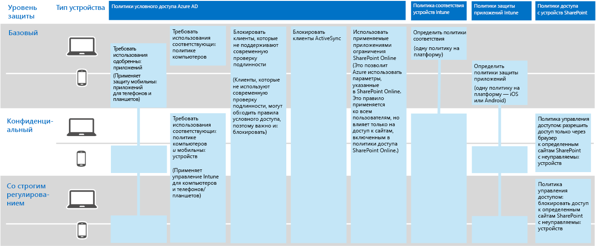

# Защита информации в корпорации Contoso

**Сводка:** в этой статье рассказывается, как специалисты компании Contoso используют функции защиты информации в Microsoft 365 корпоративный для защиты цифровых ресурсов компании в облаке.

В компании Contoso серьезно относятся к защите своей информации. Например, допустив утечку или порчу интеллектуальной собственности, включающей описания конструкций продуктов и проприетарных методов ее изготовления, компания лишится своих конкурентных преимуществ.

Прежде чем перемещать конфиденциальные и самые ценные ресурсы в облако, специалисты компании убедились, что их локальные требования к классификации и защите информации поддерживаются и реализованы в облачных службах Microsoft 365 корпоративный.

## Классификация уровней безопасности данных компании Contoso

Специалисты компании Contoso проанализировали данные и определили указанные ниже уровни.

||||
|:-------|:-----|:-----|
| **Уровень 1: базовая защита** | **Уровень 2: защита конфиденциальной информации** | **Уровень 3: защита строго контролируемой информации** |
| Данные шифруются и доступны только пользователям, прошедшим проверку подлинности.     Предоставляется для всех данных, хранящихся локально и в облачном хранилище, а также рабочих нагрузок, таких как в Office 365. Данные шифруются при хранении в службе и при перемещении между службой и клиентским устройством.    Примеры данных уровня 1: обычная деловая информация (электронная почта) и файлы для администраторов, специалистов по продажам и специалистов службы поддержки. | Уровень 1 со строгой проверкой подлинности и защитой от потери данных.     Строгая проверка подлинности включает многофакторную проверку подлинности с проверкой при помощи SMS. Защита от потери данных гарантирует, что конфиденциальные и критически важные данные не попадут за пределы локальной сети.
    Примеры данных уровня 2: финансовые и юридические сведения, а также данные об исследованиях и разработке новых продуктов. | Уровень 2 с самыми высокими уровнями шифрования, проверки подлинности и аудита.      Самые высокие уровни шифрования хранящихся данных и данных в облаке, которые соответствуют региональным нормативам, в сочетании с многофакторной проверкой подлинности с использованием смарт-карт, детального аудита и оповещений.     Примеры данных уровня 3: личные сведения клиентов и партнеров, а также технические характеристики продуктов и проприетарные методы их производства.  |
||||

## Информационные политики компании Contoso
В приведенной ниже таблице перечислены информационные политики Contoso.

|||||
|:-------|:-----|:-----|:-----|
|  | **Доступ** | **Хранение данных** | **Защита информации** |
| Информация, представляющая малую ценность для бизнеса (уровень 1: базовая информация) | Предоставление доступа всем пользователям  | 6 месяцев | Применение шифрования |
| Информация, представляющая среднюю ценность для бизнеса (уровень 2: конфиденциальная информация) | Предоставление доступа сотрудникам, субподрядчикам и партнерам компании Contoso     Использование многофакторной проверки подлинности (MFA), протокола TLS и управления мобильными приложениями (MAM) | 2 года  | Использование хэш-значений для обеспечения целостности данных  |
| Информация, представляющая большую ценность для бизнеса (уровень 3: строго контролируемая информация) | Предоставление доступа руководителям и ведущим сотрудникам инженерного и производственного отделов     Система управления правами (RMS), для которой используются только управляемые сетевые устройства  | 7 лет  | Использование цифровых подписей для предотвращения отказов  |
|||||

## Путь компании Contoso к защите информации в Microsoft 365 корпоративный

Для подготовки Microsoft 365 корпоративный в соответствии с требованиями компании Contoso к защите информации специалисты компании выполнили указанные ниже действия.

1. Определение информации, которую необходимо защищать

   Сотрудники компании Contoso провели обширную работу и выполнили ревизию цифровых активов компании, размещенных на локальных сайтах SharePoint и в файловых ресурсах и классифицировали все активы.

2. Определение политик доступа, хранения и защиты информации для различных уровней данных

   На основании определенных уровней данных специалисты компании Contoso разработали подробные требования к политикам, используемым для защиты имеющихся цифровых активов после перемещения их в облако.

3. Создание меток конфиденциальности и их настройка для различных уровней информации

   Компания Contoso создала метки конфиденциальности для своих уровней данных, включая метку для строго контролируемой конфиденциальной информации, включающую шифрование, разрешения и водяные знаки.

4. Создание защищенных сайтов SharePoint Online для конфиденциальных и строго контролируемых данных с разрешениями, блокирующими доступ

   Сайты с конфиденциальной и строго контролируемой информацией были настроены в качестве [изолированных сайтов](https://docs.microsoft.com/office365/enterprise/isolated-sharepoint-online-team-sites), на которых исходные разрешения для сайтов групп SharePoint Online, используемые по умолчанию, были изменены на группы Azure Active Directory (Azure AD). Для конфиденциальных и строго контролируемых сайтов SharePoint Online также была настроена соответствующая метка хранения. Файлы, хранящиеся на строго контролируемых сайтах SharePoint Online, защищены меткой конфиденциальности "Строго контролируемый". Дополнительные сведения см. в статье [Сайты Microsoft Teams и SharePoint Online для жестко регламентированных данных](teams-sharepoint-online-sites-highly-regulated-data.md).

5.  Перенос данных с локальных сайтов SharePoint и файловых ресурсов на новые сайты SharePoint Online компании

    Специалисты компании перенесли файлы на новые сайты SharePoint Online, которые унаследовали метки хранения, используемые по умолчанию и назначенные сайтам.

6.  Обучение сотрудников порядку использования меток конфиденциальности для новых документов, взаимодействию с ИТ-подразделением компании Contoso при создании сайтов SharePoint Online и постоянному хранению цифровых активов на сайтах SharePoint Online

    После обдумывания самой сложной части, касающейся переноса системы защиты информации в облако, ИТ-специалистам и руководителям компании Contoso потребовалось изменить плохие привычки сотрудников организации, связанные с хранением информации. Для этого было установлено требование всегда сохранять свои цифровые ресурсы и присваивать им метки в облаке, избегать использования локальных общих папок и никогда не использовать сторонние облачные службы хранения или USB-накопители.

## Политики условного доступа для защиты информации

В соответствии с имеющейся инфраструктурой управления удостоверениями и мобильными устройствами и в рамках развертывания Exchange Online и SharePoint Online в компании Contoso настроили указанные ниже политики условного доступа и применили их к соответствующим группам Azure AD.

- [Управляемый и неуправляемый доступ к приложениям в политиках для устройств](identity-access-policies.md)
- [Политики доступа Exchange Online](secure-email-recommended-policies.md)
- [Политики доступа SharePoint Online](sharepoint-file-access-policies.md)

На рис. 1 показан итоговый набор политик компании Contoso, предназначенных для защиты информации.

**Рис. 1. Политики условного доступа для устройств, Exchange Online и SharePoint Online**
 
>[!Note]
>Кроме того, в компании Contoso настроили дополнительные политики условного доступа для удостоверений и входа. См. статью [Удостоверения для корпорации Contoso](contoso-identity.md).
>

Эти политики выполняют указанные ниже функции.

- Они гарантируют, что приложения разрешены, а действия, которые они могут выполнять с данными организации, определяются политиками защиты приложений.
- ПК и мобильные устройства должны соответствовать требованиям.
- В Exchange Online используются средства шифрования сообщений Office 365 для Exchange Online.
- В SharePoint Online используются принудительно применяемые ограничения для приложений.
- В SharePoint Online используются политики условного доступа, которые разрешают доступ только из браузера и блокируют доступ для неуправляемых устройств.

## Сопоставление функций Microsoft 365 корпоративный с уровнями данных, принятыми в компании Contoso

В таблице ниже приведено сопоставление уровней данных в компании Contoso с функциями защиты информации в Microsoft 365 корпоративный.

|||||
|:-------|:-----|:-----|:-----|
| | **Office 365** | **Windows 10 и Office 365 профессиональный плюс** | **EMS** |
| Уровень 1: базовая защита  | Политики условного доступа для SharePoint Online и Exchange Online   Разрешения на сайтах SharePoint Online | Метки конфиденциальности   BitLocker   Windows Information Protection | Политики условного доступа для устройств и политики управления мобильными приложениями |
| Уровень 2: защита конфиденциальной информации | Уровень 1+:     Метки конфиденциальности   Метки Office 365 на сайтах SharePoint Online   Система защиты от потери данных в Office 365 для SharePoint Online и Exchange Online   Изолированные сайты SharePoint Online  | Уровень 1+:     метки конфиденциальности для цифровых ресурсов   Расширенное управление данными Office 365 | Уровень 1 |
| Уровень 3: защита строго контролируемой информации | Уровень 2+:    Шифрование Bring Your Own Key (BYOK) и защита секретной коммерческой информации   Azure Key Vault для бизнес-приложений, взаимодействующих со службами Office 365 | Уровень 2 | Уровень 1 |
|||||

## Следующее действие

[Узнайте,](contoso-security-summary.md) как в компании Contoso использовали функции обеспечения безопасности в Microsoft 365 корпоративный для управления удостоверениями и доступом, защиты от угроз, защиты информации и управления безопасностью.

## См. также

[Защита данных в Microsoft 365 корпоративный](infoprotect-infrastructure.md)

[Руководство по развертыванию](deploy-microsoft-365-enterprise.md)

[Руководства по лаборатории тестирования](m365-enterprise-test-lab-guides.md)

