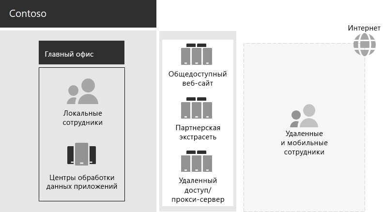

# ИТ-инфраструктура и бизнес-потребности компании ContosoContoso IT infrastructure and business needs

Компания Contoso переходит от локальной, централизованной ИТ-инфраструктуры к настройке, включающей облачную среду, которая включает в себя рабочие нагрузки и приложения, основанные на облачных средах.Contoso is transitioning from an on-premises, centralized IT infrastructure to a cloud-inclusive setup that incorporates cloud-based personal productivity workloads and applications.

## Существующая ИТ инфраструктура contosoExisting Contoso IT infrastructure

В компании Contoso используется по большей части централизованная локальная ИТ-инфраструктура с центрами обработки данных приложений, находящимися в главном офисе в Париже.Contoso uses a mostly centralized on-premises IT infrastructure, with application datacenters in the Paris headquarters.

На рисунке 1 показан Центральный офис с центрами обработки данных приложений, демилитаризованной зоной и Интернетом.Figure 1 shows the headquarters office with application datacenters, a DMZ, and the internet.

**Рисунок 1: существующая ИТ инфраструктура contoso****Figure 1: Existing Contoso IT infrastructure**
 
В локальных центрах обработки данных приложений размещены указанные ниже элементы.The on-premises application datacenters host: 

- Настраиваемые бизнес-приложения, использующие SQL Server и другие базы данных Linux.Custom line-of-business applications that use SQL Server and other Linux databases.
- Набор устаревших серверов SharePoint.A set of legacy SharePoint servers.
- Серверы уровня организации и групп для хранения данных.Organization and team-level servers for file storage.

Кроме того, в каждом региональном центральном офисе поддерживается набор серверов с похожими наборами приложений.Additionally, each regional hub office supports a set of servers with a similar set of applications. Этими серверами управляют региональные ИТ-отделы.These servers are under the control of regional IT departments.

Поиск приложений и данных в этих разрозненных центрах обработки данных, расположенных в разных регионах, сопровождается рядом сложностей.Searchability across the applications and data of these separate multi-geographical datacenters continues to be a challenge.

В ДЕМИЛИТАРИЗОВАНной зоне Contoso headquarters различные наборы серверов предоставляют следующие возможности:In the Contoso headquarters DMZ, different sets of servers provide:

- Размещение для общедоступного веб-сайта Contoso, с которого клиенты могут заказать продукты, запчасти, Канцелярские товары и услуги.Hosting for the Contoso public web site, from which customers can order products, parts, supplies, and service.
- Хостинг для партнерской экстрасети компании Contoso, предназначенной для связи и сотрудничества с партнерами.Hosting for the Contoso partner extranet for partner communication and collaboration.
- Удаленный доступ на основе частной виртуальной сети (VPN) к интрасети компании Contoso и веб-прокси для сотрудников главного офиса в Париже.Virtual private network (VPN)-based remote access to the Contoso intranet and web proxying for workers in the Paris headquarters.

## Бизнес-потребности компании ContosoContoso business needs

Бизнес-потребности компании Contoso делятся на пять основных категорий:Contoso business needs fall into five main categories:

**Производительность труда****Productivity**

- Упрощение совместной работыMake collaboration easier

  Замена электронной почты и совместной работы на основе общих файлов с помощью интерактивной модели, позволяющей вносить в реальном времени изменения в документах, упростить собрания по сети и захваченные цепочки бесед.Replace email and file share-based collaboration with an online model that allows real-time changes on documents, easier online meetings, and captured conversation threads.
- Повышение производительности труда удаленных и мобильных сотрудниковImprove productivity for remote and mobile workers

  Так как многие сотрудники работают дома или в поле, замените узкое решение VPN на доступ к данным и ресурсам Contoso в облаке.With many employees working from home or in the field, replace the bottlenecked VPN solution with performant access to Contoso data and resources in the cloud.
- Повышение уровня креативности и инновацийIncrease creativity and innovation

  Использование последних методов визуального обучения и разработки идей, включая рукописный ввод и трехмерную визуализацию.Take advantage of the latest visual learning and idea development methods, including inking and 3D visualization.

**Безопасность****Security**

- Управление удостоверениями и доступомIdentity and access management

  Применение многофакторной проверки подлинности и других форм проверки подлинности и защита учетных данных учетных записей пользователей и администраторов.Enforce multifactor and other forms of authentication and protect user and administrator account credentials.

- Защита от угрозThreat protection

  Защита от внешних угроз безопасности, включая вредоносное программное обеспечение, проникающее через электронную почту и операционные системы.Protect against external security threats, including email and operating system-based malware.

- Защита информацииInformation protection

  Шифрование важных цифровых ресурсов, например данных клиентов, конструкторских и производственных спецификаций и сведений о сотрудниках, а также блокирование доступа к этим ресурсам.Lock down access to and encrypt high-value digital assets, such as customer data, design and manufacturing specifications, and employee information.

- Управление безопасностьюSecurity management

  Наблюдение за безопасностью и обнаружение угроз в режиме реального времени и реагирования на них.Monitor security posture and detect and respond to threats in real time.

**Удаленный доступ, доступ с мобильных устройств и работа с бизнес-партнерами****Remote and mobile access and business partners**

- Повышенная безопасность для удаленных и мобильных сотрудниковImprove security for remote and mobile workers

  Реализуйте свое устройство (BYOD) и управление устройствами, принадлежащее компании, чтобы обеспечить безопасный доступ, правильное поведение приложения и защиту данных компании.Implement bring your own device (BYOD) and company-owned device management to ensure secured access, correct application behavior, and company data protection.

- Уменьшение инфраструктуры удаленного доступа для сотрудниковReduce remote access infrastructure for employees

  Снижение затрат на обслуживание и поддержку и повышение производительности решения удаленного доступа путем перемещения часто используемых ресурсов в облако.Reduce maintenance and support costs and improve performance for remote access solution by moving commonly accessed resources to the cloud.

- Обеспечение лучшей связи и снижения нагрузки для транзакций "бизнес-сусинесс" (B2B)Provide better connectivity and lower overhead for business-to-susiness (B2B) transactions

  Замена общепринятых и дорогых партнеров экстрасети на облачное решение, использующее федеративный способ проверки подлинности.Replace an aging and expensive partner extranet with a cloud-based solution that uses federated authentication.

**Соответствие требованиям****Compliance**

- Соответствие требованиям региональных нормативных актовAdhere to regional regulatory requirements

  Обеспечьте соответствие отраслевым и региональным нормативам, предъявляемым к хранению данных, шифрованию, конфиденциальности данных и персональным данным, например к общему законодательству по защите данных (GDPR) для союза ЕС.Ensure compliance with industry and regional regulations for data storage, encryption, data privacy, and personal data regulations, such as the General Data Protection Regulation (GDPR) for the Europe Union.

**Управление****Management**

- Снижение затрат на ИТ для управления программным обеспечением, работающим на клиентских компьютерах и устройствахLower IT overhead for managing software running on client PCs and devices

  Автоматизация установки обновлений операционной системы Windows и приложений Microsoft 365 для предприятий в Организации.Automate installation of updates to the Windows operating system and Microsoft 365 Apps for enterprise across the organization.

## Сопоставление потребностей компании Contoso Business с Microsoft 365 для предприятийMapping Contoso business needs to Microsoft 365 for enterprise

ИТ-отдел Contoso определил следующее сопоставление бизнес-потребностей для функций Microsoft 365/с и до развертывания:The Contoso IT department determined the following mapping of business needs to Microsoft 365 E5 features prior to deployment:

| CategoryCategory | Потребности бизнесаBusiness need | Microsoft 365 для корпоративных продуктов и функцийMicrosoft 365 for enterprise products or features |
|:-------|:-----|:-----|
| Производительность трудаProductivity |  |  |
|  | Упрощение совместной работыMake collaboration easier | Microsoft Teams, SharePoint, OneDriveMicrosoft Teams, SharePoint, OneDrive |
|  | Повышение производительности труда удаленных и мобильных сотрудниковImprove productivity for remote and mobile workers | Рабочие нагрузки Microsoft 365 и облачные данныеMicrosoft 365 workloads and cloud-based data |
|  | Повышение уровня креативности и инновацийIncrease creativity and innovation | Windows Ink, Кортана на рабочем месте, PowerPointWindows Ink, Cortana at Work, PowerPoint |
| БезопасностьSecurity |  |  |
|  | Управление удостоверениями и доступомIdentity & access management | Выделенные учетные записи глобальных администраторов с многофакторной проверкой подлинности Azure (MFA) и управление личными удостоверениями Azure Active Directory (PIM)Dedicated global administrator accounts with Azure Multi-Factor Authentication (MFA) and Azure Active Directory Privileged Identity Management (PIM)   Многофакторная проверка подлинности для всех учетных записей пользователейMFA for all user accounts   Условный доступConditional Access   Windows HelloWindows Hello   Credential Guard в Защитнике WindowsWindows Credential Guard |
|  | Защита от угрозThreat protection | Advanced Threat AnalyticsAdvanced Threat Analytics   Защитник WindowsWindows Defender   Расширенная защита от угрозAdvanced Threat Protection   Office 365 Advanced Threat ProtectionOffice 365 Advanced Threat Protection   Исследование угроз и ответ Microsoft 365Microsoft 365 threat investigation and response   |
|  | Защита информацииInformation protection | Azure Information ProtectionAzure Information Protection   Защита от потери данных (DLP)Data Loss Prevention (DLP)   Windows Information Protection (WIP)Windows Information Protection (WIP)   Microsoft Cloud App SecurityMicrosoft Cloud App Security   Microsoft IntuneMicrosoft Intune |
|  | Управление безопасностьюSecurity management | Центр безопасности AzureAzure Security Center    Центр безопасности Защитника WindowsWindows Defender Security Center |
| Удаленный доступ, доступ с мобильных устройств и работа с бизнес-партнерамиRemote and mobile access and business partners |  |  |
|  | Повышение уровня безопасности для удаленных и мобильных сотрудниковBetter security for remote and mobile workers | Microsoft IntuneMicrosoft Intune |
|  | Уменьшение инфраструктуры удаленного доступа для сотрудниковReduce remote access infrastructure for employees | Рабочие нагрузки Microsoft 365 и облачные данныеMicrosoft 365 workloads and cloud-based data |
|  | Улучшите возможности подключения и более низкие затраты для транзакций B2BImprove connectivity and lower overhead for B2B transactions | Федеративная проверка подлинности и облачные ресурсыFederated authentication and cloud-based resources |
| Соответствие требованиямCompliance |  |  |
|  | Соответствие требованиям региональных нормативных актовAdhere to regional regulatory requirements | Функции GDPR в Microsoft 365GDPR features in Microsoft 365 |
| УправлениеManagement |  |  |
|  | Снижение затрат на ИТ для установки обновлений клиентовLower IT overhead for installing client updates | Круги развертыванияDeployment rings   Обновления Windows 10 КорпоративнаяWindows 10 Enterprise updates   Обновления приложений Microsoft 365 для предприятийMicrosoft 365 Apps for enterprise updates |
||||

## Следующий шагNext step

[Узнайте](contoso-networking.md) о локальной сети Contoso Corporation, а также о том, как она была оптимизирована для доступа и задержки в облачных ресурсах Microsoft 365.[Learn](contoso-networking.md) about the Contoso Corporation on-premises network and how it was optimized for access and latency to Microsoft 365 cloud-based resources.

## См. такжеSee also

[Обзор Microsoft 365 для предприятийMicrosoft 365 for enterprise overview](microsoft-365-overview.md)

[Руководства по лаборатории тестированияTest lab guides](m365-enterprise-test-lab-guides.md)
