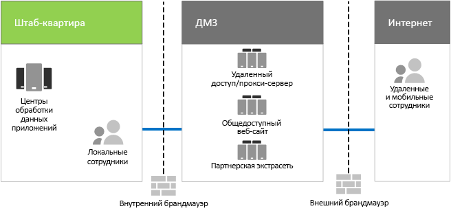

# ИТ-инфраструктура и бизнес-потребности компании Contoso

**Сводка**: в этой статье рассказано о базовой структуре локальной ИТ-инфраструктуры компании Contoso и о том, как можно удовлетворить потребности компании с помощью Microsoft 365 корпоративный.

Компания Contoso выполнила переход от локальной централизованной ИТ-инфраструктуры к инфраструктуре, включающей облако. В состав этой инфраструктуры входят рабочие нагрузки и приложения для повышения производительности труда сотрудников.

## Существующая ИТ-инфраструктура Contoso

В компании Contoso используется по большей части централизованная локальная ИТ-инфраструктура с центрами обработки данных приложений, находящимися в главном офисе в Париже.

На рис. 1 показан главный офис с центрами обработки данных приложений, сетью периметра и Интернетом.

**Рис. 1. Существующая инфраструктура компании Contoso**
 
В локальных центрах обработки данных приложений размещены указанные ниже элементы. 

- Пользовательские бизнес-приложения, использующие SQL Server и другие базы данных, работающие в ОС Linux.
- Набор устаревших серверов SharePoint.
- Серверы уровня организации и групп для хранения данных.

Кроме того, в каждом региональном центральном офисе поддерживается набор серверов с похожими наборами приложений. Этими серверами управляют региональные ИТ-отделы.

Поиск приложений и данных в этих разрозненных центрах обработки данных, расположенных в разных регионах, сопровождается рядом сложностей.

В сети периметра главного офиса компании Contoso различные наборы серверов предоставляют указанные ниже возможности.

- Удаленный VPN-доступ к интрасети компании Contoso и веб-прокси для сотрудников главного офиса в Париже.
- Хостинг для общедоступного веб-сайта компании Contoso, на котором клиенты могут заказывать продукцию, запасные части, расходные материалы или услуги.
- Хостинг для партнерской экстрасети компании Contoso, предназначенной для связи и сотрудничества с партнерами.

## Бизнес-потребности компании Contoso

Бизнес-потребности компании Contoso можно разделить на пять основных категорий.

Производительность труда

- Упрощение совместной работы

  Замена модели совместной работы, предусматривающей использование электронной почты и файловых ресурсов, на онлайн-модель, которая позволяет вносить изменения в документы в режиме реального времени и записывать цепочки в беседах, а также упрощает проведение собраний по сети.
- Повышение производительности труда удаленных и мобильных сотрудников

  Так как большое количество сотрудников работает дома или в разъездах, необходимо заменить решение на базе VPN, т. е. "узкое" место, решением, которое предусматривает высокопроизводительный доступ к данным и ресурсам компании Contoso в облаке.
- Повышение уровня креативности и инноваций

  Использование последних методов визуального обучения и разработки идей, включая рукописный ввод и трехмерную визуализацию.

Безопасность

- Управление удостоверениями и доступом

  Реализация многофакторной и других форм проверки подлинности, а также защиты данных учетных записей пользователей и администраторов.

- Защита от угроз

  Защита от внешних угроз безопасности, включая вредоносное программное обеспечение, проникающее через электронную почту и операционные системы.

- Защита информации

  Шифрование высокоценных цифровых активов, например данных клиентов, конструкторских спецификаций и сведений о сотрудниках, а также блокирование доступа к этим активам.

- Управление безопасностью

  Отслеживание состояния безопасности и готовность к обнаружению угроз и реагированию на них в режиме реального времени.

Удаленный доступ, доступ с мобильных устройств и работа с бизнес-партнерами

- Повышение уровня безопасности для удаленных и мобильных сотрудников

  Применение концепции BYOD (Bring Your Own Device, использование личных устройств сотрудников для работы) и управление принадлежащими компании устройствами для обеспечения защищенного доступа, правильного поведения приложений и защиты данных компании.

- Уменьшение инфраструктуры удаленного доступа для сотрудников

  Сокращение издержек на техническое обслуживание и поддержку, а также повышение производительности решения для удаленного доступа путем перемещения ресурсов с общим доступом в облако.

- Повышение качества подключения и снижение издержек на транзакции типа бизнес-бизнес (B2B)

  Замена устаревающей и дорого обходящейся экстрасети для партнеров облачным решением, в котором используется федеративная проверка подлинности.

Соответствие требованиям

- Соответствие требованиям региональных нормативных актов

  Соблюдение требований отраслевых и региональных нормативных актов в части хранения, шифрования и конфиденциальности данных, а также нормативных документов, касающихся личных сведений, например Общего регламента по защите данных (GDPR), принятого в ЕС.

Управление

- Снижение издержек на ИТ-инфраструктуру в части управления программным обеспечением, работающим на клиентских ПК и устройствах

  Автоматизация установки обновлений в ОС Windows и Microsoft Office в организации.

## Сопоставление бизнес-потребностей компании Contoso с возможностями, предоставляемыми Microsoft 365 корпоративный

Перед развертыванием ИТ-подразделение компании Contoso сопоставило бизнес-потребности с функциями, имеющимися в плане Microsoft 365 корпоративный E5, указанным ниже образом.

||||
|:-------|:-----|:-----|
| **Категория** | **Бизнес-потребность** | **Продукты или функции Microsoft 365 корпоративный** |
| Производительность труда |  |  |
|  | Упрощение совместной работы | Teams, SharePoint Online, Skype для бизнеса Online |
|  | Повышение производительности труда удаленных и мобильных сотрудников | Рабочие нагрузки Office 365 и облачные данные |
|  | Повышение уровня креативности и инноваций | Windows Ink, Кортана на рабочем месте, PowerPoint |
| Безопасность |  |  |
|  | Управление удостоверениями и доступом | Выделенные учетные записи глобальных администраторов с многофакторной проверкой подлинности (MFA) и Azure AD Privileged Identity Management (PIM)   Многофакторная проверка подлинности для всех учетных записей пользователей   Условный доступ   Windows Hello   Credential Guard в Защитнике Windows |
|  | Защита от угроз | Advanced Threat Analytics   Защитник Windows   Расширенная защита от угроз   Office 365 Advanced Threat Protection   Office 365 Threat Intelligence   |
|  | Защита информации | Azure Information Protection (AIP)   Защита от потери данных в Office `365 (DLP)   Windows Information Protection   Microsoft Cloud App Security   Office 365 Cloud App Security (CAS)   Microsoft Intune |
|  | Управление безопасностью | Центр безопасности Azure    Центр безопасности Защитника Windows |
| Удаленный доступ, доступ с мобильных устройств и работа с бизнес-партнерами |  |  |
|  | Повышение уровня безопасности для удаленных и мобильных сотрудников | Microsoft Intune |
|  | Уменьшение инфраструктуры удаленного доступа для сотрудников | Рабочие нагрузки Office 365 и облачные данные |
|  | Повышение качества подключения и снижение издержек на транзакции типа бизнес-бизнес (B2B) | Федеративная проверка подлинности и облачные ресурсы |
| Соответствие требованиям |  |  |
|  | Соответствие требованиям региональных нормативных актов | Функции, необходимые для выполнения требований GDPR, в Office 365 |
| Управление |  |  |
|  | Снижение затрат, связанных с ИТ, на установку обновлений клиентов | Круги развертывания   Обновление на месте и Autopilot для Windows 10   Office 365 профессиональный плюс |
||||

## Следующее действие

[Узнайте](contoso-networking.md) о локальной сети корпорации Contoso и о том, как ее оптимизировали для доступа и уменьшения задержек при работе с облачными ресурсами Microsoft 365 в организации.

## См. также

[Руководство по развертыванию](deploy-microsoft-365-enterprise.md)

[Руководства по лаборатории тестирования](m365-enterprise-test-lab-guides.md)
