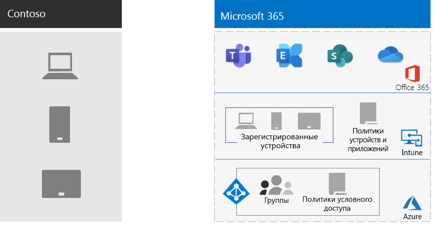

# Управление мобильными устройствами для ContosoMobile device management for Contoso

Microsoft 365 для предприятий включает Intune и набор служб Azure, поддерживающих управление мобильными устройствами и приложениями и безопасность.Microsoft 365 for enterprise includes Intune and a set of Azure services that support mobile device and application management and security.

У компании Contoso есть много сотрудников с поддержкой мобильных устройств. У некоторых есть офисы в расположениях Contoso, а в других нет офисов. Компании Contoso требовалось обеспечить возможность повышения продуктивности сотрудников, хранения устройств, данных Contoso, хранящихся на этих устройствах, и обеспечения безопасности поведения приложений.Contoso has many mobile-enabled employees. Some have offices in Contoso locations, and some have no offices. Contoso needed a way to enable employee productivity but keep the devices, the Contoso data stored on those devices, and application behavior secure.

## ПланPlan

Компания Contoso определила следующие варианты использования Intune для управления мобильными устройствами для Microsoft 365 для предприятий:Contoso identified the following Intune use cases of mobile device management for Microsoft 365 for enterprise:

- Защитите электронную почту и данные Exchange Online, чтобы обеспечить их безопасное обращение к мобильным устройствам.Protect Exchange Online email and data so it can be safely accessed by mobile devices.
- Реализация программы "самостоятельное устройство" (BYOD) для сотрудников Contoso.Implement a bring-your-own-device (BYOD) program for Contoso employees.
- Выдача сотрудников компании Contoso с помощью телефонов, принадлежащих Организации, и общих планшетов.Issue organization-owned phones and limited-use shared tablets to Contoso employees.

Contoso не использует Intune для следующих действий:Contoso doesn't use Intune to:

- Разрешить сотрудникам безопасно получать доступ к Microsoft 365 из неуправляемого общедоступного киоска.Allow employees to securely access Microsoft 365 from an unmanaged public kiosk.
- Защитите локальную электронную почту и данные, чтобы обеспечить их безопасное обращение к мобильным устройствам, так как нет локальных серверов Microsoft Exchange.Protect on-premises email and data so it can be safely accessed by mobile devices, because there are no on-premises Microsoft Exchange servers.

## РазвертываниеDeploy

Процедура настройки инфраструктуры управления мобильными устройствами в Contoso:This is how Contoso set up their mobile device management infrastructure:

- Настройка Intune в качестве центра управления мобильными устройствами (MDM) и использование Intune в Azure для администрирования контента и управления устройствамиSet Intune as the Mobile Device Management (MDM) authority, and use Intune on Azure to administer content and manage the devices
- Созданы группы Azure Active Directory (Azure AD) для устройств для регистрации и настройки Intune и политик условного доступа на основе устройствCreated Azure Active Directory (Azure AD) groups for devices for enrollment and Intune settings and device-based Conditional Access policies

  Дополнительные сведения см. в разделе [политики условного доступа Contoso](contoso-identity.md#conditional-access-policies-for-identity-and-device-access).For more information, see [Contoso Conditional Access policies](contoso-identity.md#conditional-access-policies-for-identity-and-device-access).

- Включена платформа устройств Apple для поддержки сотрудников с iPad, iMac и iPhone, а также для корпоративных iPhoneEnabled the Apple device platform to support employees with iPads, iMacs, and iPhones, and corporate-owned iPhones
- Создание политик использования применительно к Contoso, которые отображаются во время установки корпоративного портала для Contoso на мобильных устройствахCreated Contoso-specific terms and conditions policies, which are seen during the installation of the Company Portal for Contoso on mobile devices
- Для устройств, которые не зарегистрированы, реализован набор политик управления мобильными приложениями (MAM), требующих проверки подлинности для доступа к службам Microsoft 365.For devices that aren't enrolled, implemented a set of Mobile Application Management (MAM) policies to require authentication for access to Microsoft 365 services
- Создание политик Intune, обеспечивающих следующее:Created Intune policies that enforce:
  - Разрешенные приложения.Allowed apps.
  - Шифрование устройств для предотвращения несанкционированного доступа.Device encryption to help prevent unauthorized access.
  - ПИН-код из шести цифр или пароль.A six-digit PIN or password.
  - Период бездействия — время ожидания.An inactivity-timeout period.
  - Защита от вирусов и вредоносных программ, а также обновление подписей с помощью защитника Windows на устройствах с Windows 10.Antivirus and malware protection, and signature updates with Windows Defender on Windows 10 devices.
  - Автоматическое обновление устройств с Windows 10, включающих последние обновления для системы безопасности.Automatic updates on Windows 10 devices that include the latest security updates.
  - Принудительная отправка сертификатов управляемым устройствам.Pushing certificates to managed devices.
  - Четкое разделение корпоративных и личных данных. Пользователи или администраторы могут выборочно стирать корпоративные данные с устройства, не трогая личные данные, такие как рисунки, личные учетные записи электронной почты и личные файлы.A clear separation of business and personal data. Users or admins can selectively wipe corporate data from the device, while leaving personal data such as pictures, personal email accounts, and personal files untouched.

Развернутые компьютеры Contoso, а также смартфоны и планшетные компании добавляются в соответствующие группы устройств Intune.Contoso enrolled deployed PCs and company-owned smartphones and tablets by adding them to the appropriate Intune device groups. Они также установили программу BYOD, чтобы сотрудники зарегистрировали персональные устройства.They also established a BYOD program for employees to enroll their personal devices. Зарегистрированные устройства получают политики Intune, что приводит к управляемым и защищенным устройствам и их приложениям.Enrolled devices receive Intune policies, which results in managed and secured devices and their applications. Устройства, которые не зарегистрированы, имеют политики управления мобильными приложениями (MAM), которые определяют разрешенные приложения.Devices that aren't enrolled have Mobile Application Management (MAM) policies that specify allowed applications.

Ниже показана архитектура развертывания управления мобильными устройствами contoso.Here is the Contoso mobile device management deployment architecture.

## Следующий этапNext step

Узнайте, как компания Contoso использует [возможности защиты информации](contoso-info-protect.md) в Microsoft 365 для предприятий для классификации, идентификации и защиты важных цифровых ресурсов в Организации.Learn how Contoso uses the [information protection capabilities](contoso-info-protect.md) of Microsoft 365 for enterprise to classify, identify, and protect crucial digital assets across its organization.

## Дополнительные ресурсы:See also

[Управление устройствами для Microsoft 365Device management for Microsoft 365](device-management-roadmap-microsoft-365.md)

[Обзор Microsoft 365 для предприятийMicrosoft 365 for enterprise overview](microsoft-365-overview.md)

[Руководства по лаборатории тестированияTest lab guides](m365-enterprise-test-lab-guides.md)

