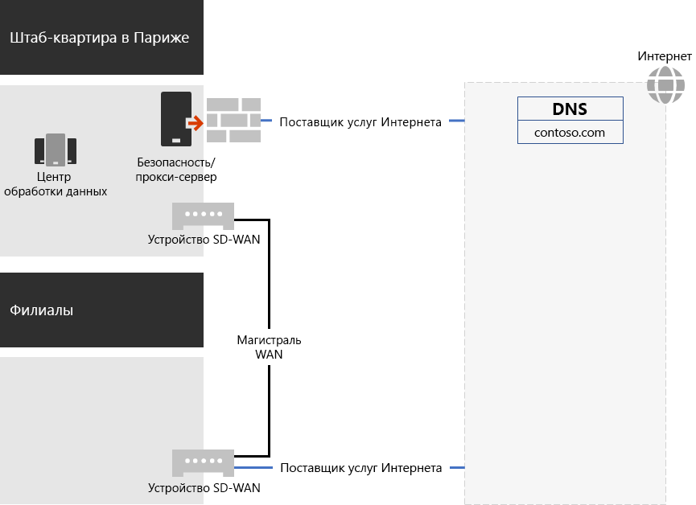
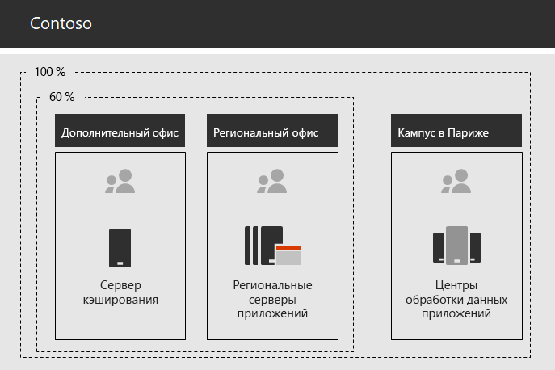

# Сеть корпорации Contoso

Чтобы принять облачную инфраструктуру, компания Contoso изработала фундаментальный сдвиг сетевого трафика к облачным службам. Вместо внутренней модели "звезда", которая нацелена на сетевое подключение и трафик для следующего уровня иерархии Office, они сопоставили расположения пользователей с локальными выходами в Интернет и локальными подключениями к ближайшему сетевому расположению Microsoft 365 в Интернете.

## Сетевая инфраструктура

Это элементы сети, связывающие офисы Contoso по всему миру:

- Сеть WAN с многопротокольной коммутацией по меткам (MPLS)

  Глобальная сеть MPLS соединяет штаб-квартира с региональными офисами и региональными офисами для спутниковых офисов в конфигурации с периферийными и центральными офисами. Сеть позволяет пользователям получать доступ к локальным серверам, которые составляют бизнес-приложения в штаб-квартирах Париж. Кроме того, он направляет любой общий Интернет трафик в Office Париж, где устройства безопасности сети пропускают запросы. В каждом офисе маршрутизаторы доставлять трафик на проводные узлы или точки беспроводного доступа в подсетях, использующих пространство частных IP-адресов.

- Локальный прямой доступ к Интернету для трафика Microsoft 365

  В каждом офисе есть устройство глобальной сети WAN (SD-WAN), имеющее одну или несколько локальных сетевых каналов ISP, подключенных к Интернету через прокси-сервер. Обычно это реализуется в виде связи WAN с локальным поставщиком услуг Интернета, который также предоставляет общедоступные IP-адреса и локальный DNS-сервер.

- Интернет-представительство

  Contoso владеет \. общедоступным доменом имен com для contoso. Общедоступный веб-сайт contoso для заказа продуктов — это набор серверов в центре обработки данных, подключенном к Интернету, в кампусе Париж. Contoso использует диапазон общедоступных IP-адресов (или 24) в Интернете.

На рисунке 1 показана сетевая инфраструктура Contoso и ее подключения к Интернету.

 
**Рисунок 1: сеть Contoso**

## Использование технологии SD-WAN для оптимального подключения к ресурсам Майкрософт

В компании Contoso следуют указанным ниже [принципам сетевого подключения для Microsoft 365](microsoft-365-network-connectivity-principles.md):

- Определение и дифференциация сетевого трафика Microsoft 365
- Локальная организация исходящего трафика для сетевых подключений.
- Недопущение "узких" мест в сети.
- Обход дублируемых устройств обеспечения безопасности сети.

Существует три категории сетевого трафика для Microsoft 365: *оптимизировать*, разрешить и *использовать* *по умолчанию*. Оптимизировать и разрешать трафик является надежным сетевым трафиком, зашифрованным и защищенным в конечных точках и предназначенным для сети Microsoft 365.

В компании Contoso решили следующее:

- Используйте прямой выход из Интернета для оптимизации и разрешения трафика категорий, а также для перенаправления трафика категории по умолчанию в Центральное подключение к Интернету на основе Париж.

- Развертывайте устройства с SD для глобальной сети на каждом офисе, чтобы выполнить эти принципы и обеспечить оптимальную производительность сети для служб Microsoft 365 Cloud.

  Устройство SD-WAN оснащено портом для подключения к локальной сети офиса и несколькими портами для подключения к глобальной сети. Один порт WAN подключается к своей сети MPLS. Другой подключается к локальной цепи ISP. Устройство SD-WAN выполняет маршрутизацию оптимизированного и разрешенного сетевого трафика в канал поставщика услуг Интернета.

## Инфраструктура бизнес-приложений contoso

Компания Contoso разработана как бизнес-приложение и инфраструктура интрасети сервера для следующих компонентов:

- В подчиненных офисах используются локальные кэширующие серверы для хранения часто используемых документов и внутренних веб-сайтов.
- В региональных центрах используются региональные серверы приложений, предназначенные для региональных и подчиненных офисов. Эти серверы синхронизируются с серверами в центральном офисе в Париже.
- Центры обработки данных для Париж содержат централизованные серверы приложений, которые обслуживают всю организацию.

На рисунке 2 показана процентная доля мощности сетевого трафика, используемая при доступе к серверам в интрасети contoso.

 
**Рисунок 2: инфраструктура Contoso для внутренних приложений**

Для спутниковых или региональных офисных отделений 60 процентов ресурсов, необходимых сотрудникам, могут обслуживать спутниковые и региональные серверы центрального офиса. Дополнительные 40 процентов запросов ресурсов должны поступать по каналу WAN в кампусе Париж.

## Анализ сети и подготовка к работе с Microsoft 365 для предприятий

Успешное внедрение Microsoft 365 для корпоративных служб пользователями Contoso зависит от высокой доступности и работоспособного подключения к Интернету или напрямую к облачным службам Майкрософт. В компании Contoso выполнены следующие действия по планированию и внедрению оптимизированного подключения к Microsoft 365 для корпоративных облачных служб.

1. Создание схемы глобальной сети организации для упрощения планирования

   Для запуска планирования сети компания Contoso создала схему, в которой показаны расположения Office, существующие сетевые подключения, существующие сетевые устройства периметра и классы службы, управляемые в сети. Эта схема использовалась для каждого последующего этапа планирования и реализации сетевого подключения.

2. Создание плана для Microsoft 365 для подключения к корпоративной сети в корпоративной сети

   В компании Contoso использовались [принципы сетевых подключений microsoft 365](microsoft-365-network-connectivity-principles.md) и примеры сетевых архитектур, чтобы идентифицировать SD/WAN в качестве предпочтительной топологии для подключения к Microsoft 365.

3. Проанализируйте использование подключения к Интернету и пропускную способность MPLS – WAN на каждом офисе и увеличьте пропускную способность по мере необходимости.

   Все сведения о текущем использовании Office были проанализированы, а цепи были увеличены, так что предсказуемый трафик на основе Microsoft 365 на облачной основе будет работать в среднем на 20 процентов неиспользуемых мощностей.

4. Оптимизация производительности служб Microsoft Network Services

   Для оптимальной производительности компания Contoso определила набор конечных точек Office 365, Intune и Azure, а также настроенные брандмауэры, устройства безопасности и другие системы в пути к Интернету. Конечные точки для Office 365 оптимизация и разрешение трафика категорий были настроены на устройствах SD с глобальной сетью для маршрутизации через цепь ISP.

5. Настройка внутренних DNS-имен

   Для обеспечения трафика в Microsoft 365 необходима работоспособная DNS, которую можно найти в локальной сети.

6. Проверка подключения к конечной точке сети и порту

   Компания Contoso запустила средства тестирования сетевых подключений Майкрософт для проверки возможности подключения для Microsoft 365 для корпоративных облачных служб.

7. Оптимизация компьютеров сотрудников для подключения к сети

   Отдельные компьютеры были проверены, чтобы убедиться, что установлены последние обновления операционной системы, и что мониторинг безопасности конечной точки был активен на всех клиентах.

## Следующий этап

Узнайте, как Contoso применяет [локальные доменные службы Active Directory в облаке](contoso-identity.md) для сотрудников и Федерацию проверки подлинности для клиентов и бизнес-партнеров.

## Дополнительные ресурсы:

[Сетевая схема для Microsoft 365](networking-roadmap-microsoft-365.md)

[Обзор Microsoft 365 для предприятий](microsoft-365-overview.md)

[Руководства по лаборатории тестирования](m365-enterprise-test-lab-guides.md)
