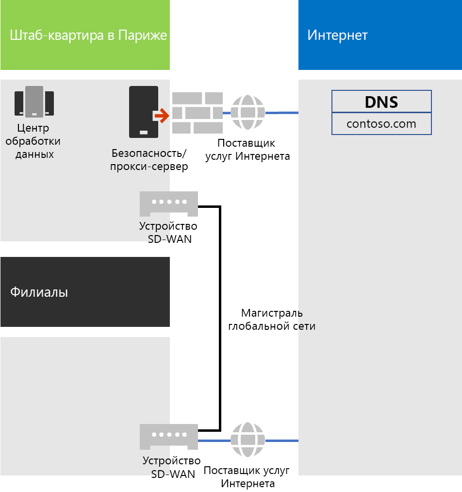
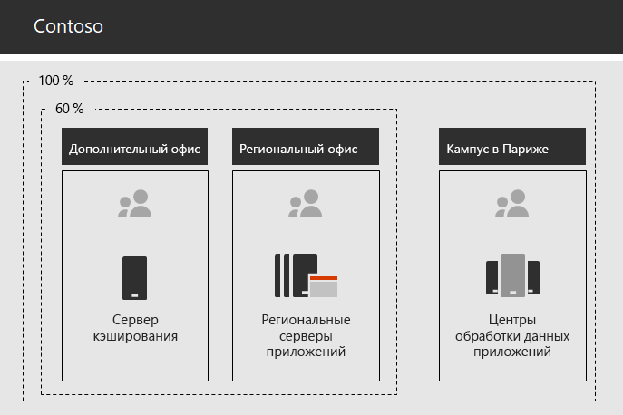

# Сеть корпорации ContosoNetworking for the Contoso Corporation

**Сводка:** в этой статье рассказано об инфраструктуре сети компании Contoso и о том, как специалисты компании используют разработанную ими технологию SD-WAN для достижения оптимальной производительности сети при подключении к облачным службам Microsoft 365 корпоративный.**Summary:** Understand the Contoso networking infrastructure and how it uses its SD WAN technology for optimal performance network connectivity to Microsoft 365 Enterprise cloud based services.

Чтобы перейти к инфраструктуре, включающей облако, специалисты по сетям компании Contoso фундаментальным образом изменили способ, которым сетевой трафик поступает в облачные службы. Вместо модели со звездообразной топологией, в которой центр сети расположен в главном офисе, специалисты ввели новую. Для этого они сопоставили расположения Майкрософт в Интернете и расположения пользователей с локальным исходящим интернет-трафиком и локальными подключениями.To adopt a cloud-inclusive infrastructure, Contoso's network engineers realized the fundamental shift in the way that network traffic to cloud-based services travels. Instead of a hub and spoke model that focusses network connectivity on the head office, they worked to map user locations to local Internet egress and local connections to Microsoft network locations on the Internet.

## Сетевая инфраструктура компании ContosoContoso's networking infrastructure

Ниже перечислены элементы сети компании Contoso, соединяющие офисы компании, расположенные по всему миру.The elements of Contoso's network that links their offices across the globe are the following:

- Сеть MPLS WANMPLS WAN network

  Сеть MPLS WAN соединяет главный офис компании в Париже с региональными офисами, а также региональные офисы с подчиненными офисами с использованием конфигурации со звездообразной топологией. Это сделано для того, чтобы пользователи могли получать доступ к локальным серверам, на которых работают бизнес-приложения в парижском офисе. Кроме того, эта сеть маршрутизирует весь интернет-трафик общего назначения в офис в Париже, в котором устройства обеспечения безопасности сети "очищают" запросы. В каждом офисе маршрутизаторы передают трафик в узлы или точки беспроводного доступа в подсетях, в которых используется частное пространство IP-адресов.An MPLS WAN network connects the Paris headquarters to regional offices and regional offices to satellite offices in a spoke and hub configuration. This is for users to access on-premises servers that make up line of business applications in the Paris office. It also routes any generic Internet traffic to the Paris office where network security devices scrub the requests. Within each office, routers deliver traffic to hosts or wireless access points on subnets, which use the private IP address space.

- Локальный непосредственный доступ в Интернет для трафика Office 365Local direct Internet access for Office 365 traffic

  В каждом офисе есть устройство SD-WAN с одной или несколькими локальными сетями поставщиков услуг Интернета с собственными подключениями к Интернету через прокси-сервер. Такую конфигурацию обычно реализуют в виде канала глобальной сети к локальному поставщику услуг Интернета, который также предоставляет общедоступные IP-адреса и IP-адреса локального DNS-сервера для прокси-сервера.Each office has an SD WAN device with one of more local Internet ISP network circuits, with its own Internet connectivity through a proxy server. This is typically implemented as a WAN link to a local ISP that also provides public IP addresses and local DNS server IP addresses for the proxy server.

- Интернет-представительствоInternet presence

  Компании Contoso принадлежит общедоступное доменное имя contoso.com. Общедоступный веб-сайт компании Contoso, предназначенный для заказа ее продукции, представляет собой ряд серверов в центре обработки данных, подключенном к Интернету, в кампусе в Париже. Компания Contoso использует диапазон общедоступных IP-адресов /24 в Интернете.Contoso owns the contoso.com public domain name. The Contoso public web site for ordering products is a set of servers in an Internet-connected datacenter in the Paris campus. Contoso uses a /24 public IP address range on the Internet.

Нас рисунке 1 показана инфраструктура сети компании Contoso и ее подключения к Интернету.Figure 1 shows Contoso's networking infrastructure and its connections to the Internet.

 
**Рис. 1. Сеть компании Contoso****Figure 1: Contoso's network**

## Использование технологии SD-WAN для оптимального подключения к ресурсам МайкрософтUse of SD WAN for optimal network connectivity to Microsoft

В компании Contoso следуют указанным ниже [принципам подключения к сети для Office 365](https://docs.microsoft.com/office365/enterprise/office-365-network-connectivity-principles).Contoso followed [Office 365 network connectivity principles](https://docs.microsoft.com/office365/enterprise/office-365-network-connectivity-principles):

1. Определение и дифференциация сетевого трафика Office 365.Identify and differentiate Office 365 network traffic
2. Локальная организация исходящего трафика для сетевых подключений.Egress network connections locally
3. Недопущение "узких" мест в сети.Avoid network hairpins
4. Обход дублируемых устройств обеспечения безопасности сети.Bypass duplicate network security devices

Существует три категории сетевого трафика для Office 365: оптимизированный, разрешенный, а также используемый по умолчанию. Оптимизированный и разрешенный трафик представляет собой надежный сетевой трафик, зашифрованный и защищенный в конечных точках и направляемый в центры обработки данных Майкрософт.There are three categories of network traffic for Office 365: Optimize, Allow, and Default. Optimize and Allow traffic is trusted network traffic that is encrypted and secured at the endpoints and is destined for Microsoft datacenters.

Для передачи оптимизированного и разрешенного трафика в компании Contoso решили использовать непосредственный исходящий интернет-трафик, а также перенаправлять весь трафик, используемый по умолчанию, к центральному подключению к Интернету в Париже.Contoso decided to use direct Internet egress for Optimize and Allow category traffic and to forward all Default category traffic to the Paris-based central Internet connection.

Специалисты компании решили развернуть устройства SD-WAN во всех расположениях офисов компании, решив, что это простой способ выполнения перечисленных выше принципов. Кроме того, этот подход позволяет достичь оптимальной производительности сети для работы с облачными службами Microsoft 365.They decided to deploy SD WAN devices at each of their office locations as a simple way to follow these principles and achieve optimal network performance for Microsoft 365 cloud-based services.

Каждое устройство SD-WAN оснащено портом для подключения к локальной сети офиса и несколькими портами для подключения к глобальной сети. Один порт глобальной сети подключен к сети MPLS компании, а остальные порты глобальной сети подключены к сетям локальных поставщиков услуг Интернета. Устройство SD-WAN выполняет маршрутизацию оптимизированного и разрешенного сетевого трафика в каналы поставщиков услуг Интернета.The SD WAN devices have a LAN port for the local office network and multiple WAN ports. One WAN port connects to their MPLS network and other WAN ports connect to local ISP circuits. The SD WAN device routes Optimize and Allow category network traffic to the ISP links.

## Инфраструктура бизнес-приложений компании ContosoContoso's line of business app infrastructure

Специалисты компании Contoso создали архитектуру бизнес-приложений и серверов для указанных ниже целей.Contoso has architected its line of business application and server infrastructure for the following:

- В подчиненных офисах используются локальные кэширующие серверы для хранения часто используемых документов и внутренних веб-сайтов.Satellite offices use local caching servers to store frequently accessed documents and internal web sites.
- В региональных центрах используются региональные серверы приложений, предназначенные для региональных и подчиненных офисов. Эти серверы синхронизируются с серверами в центральном офисе в Париже.Regional hubs use regional application servers for the regional and satellite offices. These servers synchronize with servers in the Paris headquarters.
- В кампусе в Париже расположены центры обработки данных с централизованными серверами приложений, которые обслуживают всю организацию.The Paris campus has the datacenters that contain the centralized application servers that serve the entire organization.

На рисунке 2 показан процент сетевого трафика при доступе к серверам в интрасети компании Contoso.Figure 1 shows the percentage of network traffic when accessing servers across Contoso’s intranet.

 
**Рис. 2. Инфраструктура компании Contoso для внутренних приложений****Figure 2: Contoso's infrastructure for internal applications**

60 % ресурсов, необходимых сотрудникам подчиненных или региональных центральных офисов, могут обслуживаться серверами подчиненных и региональных центральных офисов. Дополнительные 40 % запросов на ресурсы должны передаваться в кампус в Париже по каналу глобальной сети.For users in satellite or regional hub offices, 60% of the resources needed by employees can be served by satellite and regional hub office servers. The additional 40% of resource requests must go over the WAN link to the Paris campus.

## Анализ и подготовка сети компании Contoso для использования Microsoft 365 корпоративныйContoso's network analysis and preparation of their network for Microsoft 365 Enterprise

То, насколько охотно пользователи в компании Contoso начнут использовать службы Microsoft 365 корпоративный, зависит от доступности и пропускной способности подключения к Интернету или непосредственно к облачным службам (Майкрософт). Чтобы спланировать и реализовать оптимальное подключение к облачным службам Microsoft 365 корпоративный, в компании Contoso выполнили указанные ниже действия.Successful adoption of Microsoft 365 Enterprise services by Contoso’s users depend on highly available and performant connectivity to the Internet, or directly to Microsoft cloud services. Contoso took these steps to plan for and implement optimized connectivity to Microsoft 365 Enterprise cloud services:

1. Создание схемы глобальной сети, используемой компанией, для упрощения планированияCreated a company WAN network diagram to aid with planning

   Специалисты компании Contoso начали планирование сети компании с создания схемы, на которой показаны расположения компании, существующие сетевые подключения, имеющиеся устройства периметра сети и классы служб, управляемые в сети. Они использовали эту схему на каждом последующем этапе планирования и реализации подключений к сети.Contoso started their network planning by creating a diagram showing their locations, the existing network connectivity, their existing network perimeter devices and classes of service that are managed on the network. They used this diagram for each subsequent step in the planning and implementation of networking connectivity.

2. Создание плана подключений к сети для работы с Microsoft 365 корпоративныйCreated a plan for Microsoft 365 Enterprise network connectivity

   Специалисты компании Contoso воспользовались [принципами подключения к сети для Office 365](https://docs.microsoft.com/office365/enterprise/office-365-network-connectivity-principles), разработали эталонные сетевые архитектуры и приняли SD-WAN в качестве предпочтительной топологии для подключения к Office 365.Contoso used the [Office 365 network connectivity principles](https://docs.microsoft.com/office365/enterprise/office-365-network-connectivity-principles) and provided reference network architectures to determine SD WAN as their preferred topology for Office 365 connectivity.

3. Анализ использования подключения к Интернету и пропускной способности сети MPLS WAN в каждом офисе и расширение полосы пропускания сети (при необходимости)Analyzed Internet connection utilization and MPLS WAN bandwidth at each office and increased bandwidth as needed

   В каждом офисе было проанализировано текущее использование сети и расширена ее полоса пропускания, чтобы при прохождении прогнозируемого объема трафика для работы с облачными службами Microsoft 365 оставался неиспользованный запас пропускной способности, равный приблизительно 20 %.Each office was analyzed for the current usage and circuits were increased so that predicted Microsoft 365 cloud-based traffic would be operating with an average of 20% of unused capacity.

4. Оптимизация производительности сети при доступе к сетевым службам МайкрософтOptimized performance to Microsoft network services

   В компании Contoso определили набор конечных точек Office 365, Intune и Azure и настроили брандмауэры, устройства для обеспечения безопасности и другие системы, включенные в маршрут в Интернете, достигнув при этом оптимальной производительности сети. Конечные точки для оптимизированного и разрешенного трафика Office 365 были настроены в устройствах SD-WAN, обеспечивающих непосредственный доступ к Интернету.Contoso determined the set of Office 365, Intune, and Azure endpoints and configured firewalls, security devices, and other systems in the Internet path for optimal performance. Endpoints for Office 365 Optimize and Allow category traffic was configured into the SD WAN devices that provided direct Internet access.

5. Настройка внутренних DNSConfigured internal DNS

   Для передачи трафика в Office 365 и обратно необходима работоспособная DNS, которую можно найти в локальной сети.DNS is required to be functional and to be looked up locally for Office 365 traffic.

6. Проверка подключений к конечным точкам сети и портамValidated network endpoint and port connectivity

   С помощью средств проверки, предоставленных Майкрософт, специалисты компании Contoso проверили подключения к облачным службам Microsoft 365 корпоративный.Contoso ran network connectivity test tools provided by Microsoft to validate connectivity for Microsoft 365 Enterprise cloud services.

7. Оптимизация компьютеров сотрудников для подключения к сетиOptimized employee computers for network connectivity

   Специалисты компании проверили, установлены ли на компьютерах последние обновления операционных систем и на всех ли клиентах активны системы мониторинга безопасности в конечных точках.Individual computers were checked to ensure that the latest operating system updates were installed and that endpoint security monitoring is active on all clients.

## Следующее действиеNext step

[Узнайте,](contoso-identity.md) как специалисты компании Contoso используют локальный поставщик удостоверений в облаке для сотрудников и федерацию проверки подлинности для клиентов и партнеров по бизнесу.[Learn](contoso-identity.md) how Contoso is leveraging its on-premises identity provider in the cloud for employees and federating authentication for customers and business partners.

## См. такжеSee also

[Сеть для Microsoft 365 корпоративныйNetworking for Microsoft 365 Enterprise](networking-infrastructure.md)

[Руководство по развертываниюDeployment guide](deploy-microsoft-365-enterprise.md)

[Руководства по лаборатории тестированияTest lab guides](m365-enterprise-test-lab-guides.md)
