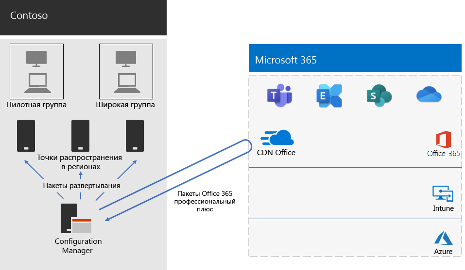

# Развертывание приложений Microsoft 365 для предприятий в компании ContosoMicrosoft 365 Apps for enterprise deployment for Contoso

В компании Contoso обновили программное обеспечение компьютеров до Windows 10 Корпоративная и приложений Microsoft 365 для предприятий, чтобы повысить эффективность совместной работы и уровень безопасности, а также использовать современный интерфейс для настольных систем. Выполнив оценку инфраструктуры и бизнес-потребностей, специалисты компании определили указанные ниже основные требования к развертыванию.Contoso upgraded their PCs to Windows 10 Enterprise and Microsoft 365 Apps for enterprise to enable more effective collaboration, better security, and a more modern desktop experience. After assessing their infrastructure and business needs, Contoso identified these key requirements for the deployment:

- На всех компьютерах должны работать приложения Microsoft 365 для предприятийAll PCs should run Microsoft 365 Apps for enterprise
- По возможности для развертывания следует использовать существующие средства управления и инфраструктуру.Deployment should use existing management tools and infrastructure when possible
- Развертывание должно поддерживать несколько языков и существующие архитектуры на устройствах пользователей.Deployment must support multiple languages and existing architectures on end-user devices
- ПК всегда должны быть в актуальном состоянии и защищены, и это должно сопровождаться минимальными издержками на ИТ-администрирование. При этом процесс получения и установки обновлений не должен причинять заметные неудобства пользователям.PCs should stay up-to-date and secure with minimal IT administrative costs and with minimal impact to end-users

## Средства развертыванияDeployment tools

На основании выработанных требований в компании Contoso предпочли развертывать Windows 10 Корпоративная и приложения Microsoft 365 для предприятий с помощью инструмента Configuration Manager (Current Branch). Этот инструмент обеспечивает возможность масштабирования для крупных сред и осуществления всестороннего контроля над установкой, обновлениями и параметрами. Кроме того, он поддерживает функции, которые упрощают и делают более эффективным развертывание Office и управление им, в том числе следующие.Based on their requirements, Contoso chose to deploy Windows 10 Enterprise and Microsoft 365 Apps for enterprise with Configuration Manager (Current Branch). Configuration Manager scales for large environments and provides extensive control over installation, updates, and settings. It also has built-in features to make it easier and more efficient to deploy and manage Office, including:

- Одноранговый кэш, который может быть полезен при развертывании пакетов на устройствах в удаленных расположениях при ограниченной пропускной способности сети.Peer cache, which can help with limited network capacity when deploying to devices in remote locations
- Информационная панель Office Client Management, которая упрощает развертывание Office и мониторинг обновлений и с помощью которой администраторы могут получить доступ к последним функциям развертывания и управления.The Office Client Management dashboard, which makes it easy to deploy Office and monitor updates and gives administrators access to the latest deployment and management features
- Функция интеллектуального развертывания языковых пакетов, поддерживающая развертывание языка, который используется в операционной системе.Intelligent language pack deployment, including automatically deploying the same language as the operating system
- Полностью поддерживаемый и простой в использовании метод удаления существующих версий Office из клиента в процессе развертывания.Fully supported and easy-to-use method of removing existing versions of Office from a client during deployment

Помимо Configuration Manager в компании Contoso использовали [Readiness Toolkit](https://docs.microsoft.com/deployoffice/readiness-toolkit-application-compatibility-microsoft-365-apps) (бесплатное средство корпорации Майкрософт) для оценки проблем совместимости с макросами и надстройками Office компании.In addition to Configuration Manager, Contoso used the [Readiness Toolkit](https://docs.microsoft.com/deployoffice/readiness-toolkit-application-compatibility-microsoft-365-apps), a free tool from Microsoft, to assess compatibility issues with their Office macros and add-ins.

## Управление развертыванием и обновлениямиManaging the deployment and updates

В приложениях Microsoft 365 для предприятий используется новая модель выпусков: "Office как услуга". Эта модель обслуживания упрощает поддержание продукта в актуальном состоянии и использование новых функций, но при этом зачастую ИТ-подразделениям требуется изменить свой подход к развертыванию и тестированию новых выпусков. Чтобы свести к минимуму количество проблем совместимости и поддерживать компьютеры в актуальном состоянии, специалисты компании Contoso развернули Windows и Office за два следующих этапа.Microsoft 365 Apps for enterprise has a new release model: Office as a service. The service model makes it easy to stay up to date with new features, but often requires a change in approach for IT departments in how new releases are deployed and tested. To minimize any compatibility issues and to ensure their computers stayed up to date, Contoso deployed Windows and Office in two stages: 

- На первом этапе они развернули приложения Microsoft 365 для предприятий на небольшом числе репрезентативных устройств в организации. Эту пилотную группу использовали для тестирования различных приложений, надстроек и оборудования совместно с приложениями Microsoft 365 для предприятий.For the first stage, they deployed Microsoft 365 Apps for enterprise to a small set of representative devices across the organization. This pilot group was used to test apps, add-ins, and hardware with Microsoft 365 Apps for enterprise
- Четыре месяца спустя после устранения всех критических проблем, связанных с приложениями, надстройками и оборудованием, в пилотной группе специалисты компании Contoso выполнили развертывание приложений Microsoft 365 для предприятий на остальных устройствах в организации (в широкой группе).Four months later, after addressing all critical issues with apps, add-ins, and hardware in the pilot group, Contoso deployed Microsoft 365 Apps for enterprise to the rest of the devices in the organization (the broad group). 

Вместо того чтобы управлять обновлениями Office с помощью Configuration Manager, в компании Contoso включили автоматические обновления из облака. Использование облачных обновлений позволило сократить затраты на администрирование и обеспечить актуальность устройств.Instead of managing updates to Office with Configuration Manager, Contoso enabled automatic updates from the cloud. Cloud-based updates reduced their administrative overhead while ensuring the devices stayed up to date. 

Для обновления функций специалисты компании Contoso использовали тот же двухэтапный подход, который они применяли при развертывании Office: устройства, входящие в пилотную группу, получали обновления функций на 4 месяца раньше, чем остальные устройства организации (в широкой группе). Для реализации такого подхода для Office в компании Contoso использовали два указанных ниже рекомендованных [канала обновления](https://docs.microsoft.com/DeployOffice/overview-update-channels).Contoso followed the same two-stage approach for feature updates that they used for deploying Office: devices in the pilot group received feature updates four months earlier than devices in the rest of the organization (the broad group). To enable this for Office, Contoso used two recommended [update channels](https://docs.microsoft.com/DeployOffice/overview-update-channels): 

- Полугодовой канал (предварительная корпоративная версия) для обновлений в пилотной группеSemi-Annual Enterprise Channel (Preview) for updates to the pilot group 
- Полугодовой канал (корпоративная версия) для обновлений в широкой группе.Semi-Annual Enterprise Channel for updates to the broad group. 

Так как в Полугодовом канале (предварительной корпоративной версии) выпуск новых версий приложений Microsoft 365 для предприятий происходит на 4 месяца раньше, чем в Полугодовом канале (корпоративном), в распоряжении специалистов компании Contoso достаточно времени, чтобы проверить обновления без необходимости управлять ими.Because the Semi-Annual Enterprise Channel (Preview) releases a version of Microsoft 365 Apps for enterprise four months earlier than the Semi-Annual Enterprise Channel, Contoso has time to validate the updates without having to manage them. 

## Процесс развертыванияDeployment process

Чтобы выполнить развертывание Office, в компании Contoso реализовали указанный ниже процесс, в котором были использованы рекомендации корпорации Майкрософт.To complete the deployment of Office, Contoso implemented the following process, which includes best practice recommendations from Microsoft:

1. Перед развертыванием специалисты компании с помощью средства Readiness Toolkit протестировали существующие приложения и надстройки Office, чтобы определить, насколько они совместимы с приложениями Microsoft 365 для предприятий.Before deploying, they used the Readiness Toolkit to test their apps and Office add-ins to assess their compatibility with Microsoft 365 Apps for enterprise.
2. В Configuration Manager специалисты компании Contoso включили одноранговый кэш на клиентских устройствах, что позволило преодолеть проблемы, связанные с ограниченной полосой пропускания сети при развертывании пакетов на клиентских устройствах в удаленных расположениях.In Configuration Manager, Contoso enabled peer cache on their client devices, which helped with limited network capacity when deploying to client devices in remote locations. 
3. Специалисты создали две группы развертывания в виде наборов устройств в Configuration Manager: пилотную группу и широкую группу. Пилотную группу, включающую небольшое число репрезентативных устройств в организации, использовали для дополнительного тестирования приложений, надстроек и оборудования совместно с Windows 10 Корпоративная и приложениями Microsoft 365 для предприятий.They defined two deployment groups as device collections in Configuration Manager: a pilot group and a broad group. The pilot group, which included a small set of representative devices across the organization, was used to do additional testing of apps, add-ins, and hardware with Windows 10 Enterprise and Microsoft 365 Apps for enterprise. 
4. Специалисты создали пакеты развертывания Office с помощью информационной панели Office Client Management и мастера по установке Office 365, которые входят в состав консоли Configuration Manager. Они создали два пакета приложений Microsoft 365 для предприятий: один для пилотной группы в Полугодовом канале (предварительной корпоративной версии) и второй для широкой группы в Полугодовом канале (корпоративной версии).They created deployment packages for Office using the Office Client Management dashboard and the Office 365 Installer wizard, both of which are part of the Configuration Manager console. They built two Microsoft 365 Apps for enterprise packages, one for the pilot group on the Semi-Annual Enterprise Channel (Preview) and one for the broad group on the Semi-Annual Enterprise Channel. 
5. В состав каждого пакета Office специалисты компании включили пакеты для английского, французского и немецкого языков. Если для устройства требовался язык, которого нет в пакете Office, система автоматически скачивала пакет для него из сети доставки содержимого (CDN) Office.As part of each Office package, they included English, French, and German Language packs. If a device required a language not included in the Office package, it was automatically downloaded from the Office Content Delivery Network (CDN).
6. Перед установкой приложений Microsoft 365 для предприятий они автоматически удаляли все существующие MSI-версии Office с помощью встроенной в пакет Office функции.They used the built-in feature in the Office package to automatically remove all existing MSI versions of Office before installing Microsoft 365 Apps for enterprise.
7. В Configuration Manager они развернули пакеты Windows и Office в точках распределения в сети, а затем запустили в Configuration Manager выполнение задачи развертывания пилотного пакета приложений Microsoft 365 для предприятий в пилотной группе.In Configuration Manager, they deployed the Windows and Office packages to distribution points across their network, and then ran the Configuration Manager deployment task sequences to deploy the pilot Microsoft 365 Apps for enterprise package to the pilot group.
8. После решения всех проблем совместимости в пилотной группе специалисты компании Contoso запустили выполнение задачи развертывания полного пакета приложений Microsoft 365 для предприятий в широкой группе.After addressing any compatibility issues with the pilot group, Contoso ran the task sequences to deploy the broad Microsoft 365 Apps for enterprise package to the broad group.

В компании Contoso включено автоматическое обновление устройств из облака, поэтому нет необходимости управлять процессом в диспетчере конфигураций.Because Contoso chose to automatically update devices from the cloud, there was no need to manage the process in Configuration Manager. Их устройства автоматически обновляются из облака с учетом канала обновления, выбранного в ходе начального развертывания.Their devices are automatically updated directly from the cloud-based on the update channel that was defined as part of the initial deployment. 

Здесь показана архитектура развертывания установки приложений Microsoft 365 для предприятий и их текущих обновлений в компании Contoso.Here is Contoso’s Microsoft 365 Apps for enterprise installation and ongoing updates deployment architecture.

 
## Следующий шагNext step

[Узнайте](contoso-mdm.md), как в компании Contoso используют Microsoft Intune в Microsoft 365 корпоративный для управления устройствами и работающими на них приложениями в организации.[Learn](contoso-mdm.md) how Contoso is using Microsoft Intune in Microsoft 365 Enterprise to manage its devices and the apps that run on them across its organization.

## См. такжеSee also

[Приложения Microsoft 365 для предприятий для Microsoft 365 корпоративныйMicrosoft 365 Apps for enterprise for Microsoft 365 Enterprise](office365proplus-infrastructure.md)

[Руководство по развертываниюDeployment guide](deploy-microsoft-365-enterprise.md)

[Руководства по лаборатории тестированияTest lab guides](m365-enterprise-test-lab-guides.md)
