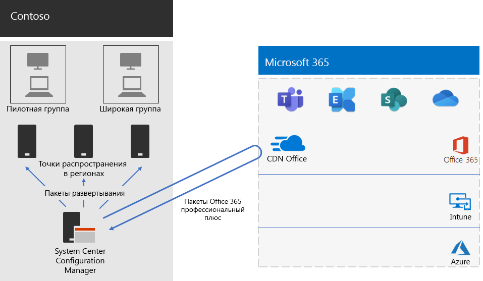

# Развертывание Office 365 профессиональный плюс для компании Contoso

**Сводка.** В этой статье рассказано, как в компании Contoso используют Microsoft Endpoint Configuration Manager для развертывания Office 365 профессиональный плюс.

В компании Contoso обновили программное обеспечение компьютеров до Windows 10 Корпоративная и Office 365 профессиональный плюс, чтобы повысить эффективность совместной работы и уровень безопасности, а также использовать современный интерфейс для настольных систем. Выполнив оценку инфраструктуры и бизнес-потребностей, специалисты компании определили указанные ниже основные требования к развертыванию.

- Office 365 профессиональный плюс необходимо использовать на всех компьютерах.
- По возможности для развертывания следует использовать существующие средства управления и инфраструктуру.
- Развертывание должно поддерживать несколько языков и существующие архитектуры на устройствах пользователей.
- ПК всегда должны быть в актуальном состоянии и защищены, и это должно сопровождаться минимальными издержками на ИТ-администрирование. При этом процесс получения и установки обновлений не должен причинять заметные неудобства пользователям.

## Средства развертывания

На основании выработанных требований в компании Contoso предпочли развертывать Windows 10 Корпоративная и Office 365 профессиональный плюс с помощью Configuration Manager (Current Branch). Инструмент Configuration Manager выполняет масштабирование для крупных сред и обеспечивает всесторонний контроль над установкой, обновлениями и параметрами. Кроме того, он поддерживает функции, которые упрощают и делают более эффективным развертывание Office и управление им, в том числе указанные ниже.

- Одноранговый кэш, который может быть полезен при развертывании пакетов на устройствах в удаленных расположениях при ограниченной пропускной способности сети.
- Информационная панель Office Client Management, которая упрощает развертывание Office и мониторинг обновлений и с помощью которой администраторы могут получить доступ к последним функциям развертывания и управления.
- Функция интеллектуального развертывания языковых пакетов, поддерживающая развертывание языка, который используется в операционной системе.
- Полностью поддерживаемый и простой в использовании метод удаления существующих версий Office из клиента в процессе развертывания.

Помимо Configuration Manager в компании Contoso использовали [Readiness Toolkit](https://docs.microsoft.com/deployoffice/use-the-readiness-toolkit-to-assess-application-compatibility-for-office-365-pro) (бесплатное средство корпорации Майкрософт) для оценки проблем совместимости с макросами и надстройками Office компании.

## Управление развертыванием и обновлениями

В Office 365 профессиональный плюс используется новая модель выпусков: "Office как услуга". Эта модель обслуживания упрощает поддержание продукта в актуальном состоянии и использование новых функций, но при этом зачастую ИТ-подразделениям требуется изменить свой подход к развертыванию и тестированию новых выпусков. Чтобы свести к минимуму количество проблем совместимости и поддерживать компьютеры в актуальном состоянии, специалисты компании Contoso развернули Windows и Office в два указанных ниже этапа. 

- На первом этапе они развернули Office 365 профессиональный плюс в небольшом наборе репрезентативных устройств в организации. Эту пилотную группу использовали для тестирования приложений, надстроек и оборудования в Office 365 профессиональный плюс.
- Четыре месяца спустя после устранения всех критических проблем, связанных с приложениями, надстройками и оборудованием в пилотной группе, специалисты компании Contoso выполнили развертывание Office 365 профессиональный плюс на остальных устройствах в организации (в широкой группе). 

Вместо того чтобы управлять обновлениями Office с помощью Configuration Manager, в компании Contoso включили автоматические обновления из облака. Использование облачных обновлений позволило сократить затраты на администрирование и обеспечить актуальность устройств. 

Для обновления функций специалисты компании Contoso использовали тот же двухэтапный подход, который они применяли при развертывании Office: устройства, входящие в пилотную группу, получали обновления функций на 4 месяца раньше, чем остальные устройства организации (в широкой группе). Для реализации такого подхода для Office в компании Contoso использовали два указанных ниже рекомендованных [канала обновления](https://docs.microsoft.com/DeployOffice/overview-of-update-channels-for-office-365-proplus). 

- Канал Semi-Annual Channel (Targeted) для обновлений устройств пилотной группы. 
- Канал Semi-Annual Channel для обновлений в широкой группе. 

Так как в канале Semi-Annual Channel (Targeted) выпуск новых версий Office 365 профессиональный плюс происходит на 4 месяца раньше, чем в канале Semi-Annual Channel, у специалистов компании Contoso достаточно времени проверить обновления без необходимости управлять ими. 

## Процесс развертывания

Чтобы выполнить развертывание Office, в компании Contoso реализовали указанный ниже процесс, в котором были использованы рекомендации корпорации Майкрософт.

1. Перед развертыванием специалисты компании с помощью средства Readiness Toolkit протестировали приложения и надстройки Office, чтобы определить, насколько они совместимы с Office 365 профессиональный плюс.
2. В Configuration Manager специалисты компании Contoso включили одноранговый кэш на клиентских устройствах, что позволило преодолеть проблемы, связанные с ограниченной полосой пропускания сети при развертывании пакетов на клиентских устройствах в удаленных расположениях. 
3. Специалисты создали две группы развертывания в виде коллекций устройств в Configuration Manager: пилотную группу и широкую группу. Пилотную группу, включающую небольшой набор репрезентативных устройств в организации, использовали для дополнительного тестирования приложений, надстроек и оборудования в Windows 10 Корпоративная и Office 365 профессиональный плюс. 
4. Специалисты создали пакеты развертывания для Office с помощью информационной панели Office Client Management и мастера "Установщик Office 365", которые входят в состав консоли Configuration Manager. Они создали два пакета Office 365 профессиональный плюс: один для пилотной группы в канале Semi-Annual Channel (Targeted) и второй для широкой группы в канале Semi-Annual Channel. 
5. В состав каждого пакета Office специалисты компании включили пакеты для английского, французского и немецкого языков. Если для устройства требовался язык, которого нет в пакете Office, система автоматически скачивала пакет для него из сети доставки содержимого (CDN) Office.
6. Перед установкой Office 365 профессиональный плюс они автоматически удаляли все существующие MSI-версии Office с помощью встроенной в пакет Office функции.
7. В Configuration Manager они развернули пакеты Windows и Office в точках распределения в сети, а затем выполнили задачи развертывания Configuration Manager для развертывания пилотного пакета Office 365 профессиональный плюс в пилотной группе.
8. После решения всех проблем совместимости в пилотной группе специалисты компании Contoso выполнили задачи развертывания полного пакета Office 365 профессиональный плюс в широкой группе.

В компании Contoso включено автоматическое обновление устройств из облака, поэтому нет необходимости управлять процессом в диспетчере конфигураций. Их устройства автоматически обновляются из облака с учетом канала обновления, выбранного в ходе начального развертывания. 

Здесь показана архитектура развертывания установки Office 365 профессиональный плюс и текущих обновлений в компании Contoso.

 
## Дальнейшие действия

[Узнайте](contoso-mdm.md), как в компании Contoso используют Microsoft Intune в Microsoft 365 корпоративный для управления устройствами и работающими на них приложениями в организации.

## См. также

[Office 365 профессиональный плюс для Microsoft 365 корпоративный](office365proplus-infrastructure.md)

[Руководство по развертыванию](deploy-microsoft-365-enterprise.md)

[Руководства по лаборатории тестирования](m365-enterprise-test-lab-guides.md)
