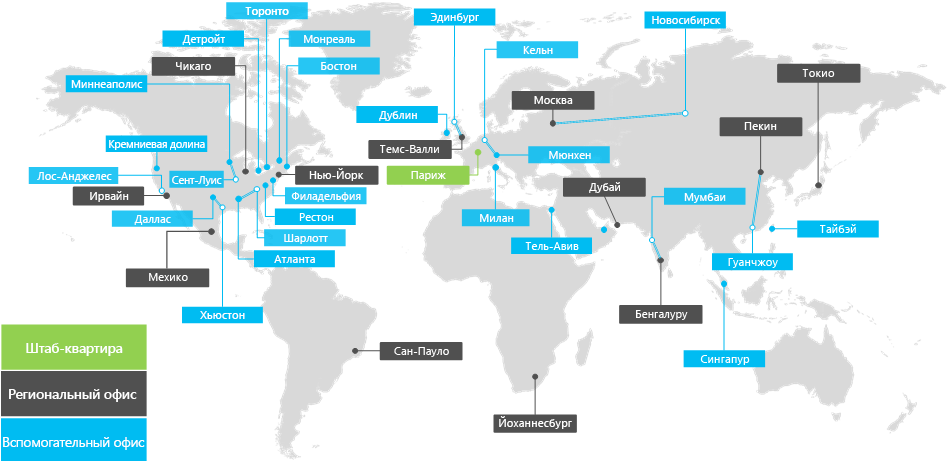

# Обзор корпорации ContosoOverview of Contoso Corporation

Корпорация Contoso является многонациональной организацией с центральным офисом в Париж. Компания является организацией для производства, продажи и поддержки, включающей более 100 000 продуктов.The Contoso Corporation is a multinational business with its headquarters in Paris. The company is a manufacturing, sales, and support organization with more than 100,000 products.

## Представительства Contoso по всему мируContoso around the world

На рисунке 1 показаны офисы центрального офиса в Париж, а также региональные офисы и спутниковые офисы на различных континентах.Figure 1 shows the headquarters office in Paris and regional hub and satellite offices on various continents.

**Рисунок 1: офисы Contoso по всему миру****Figure 1: Contoso offices around the world**
 
В компании Contoso есть три уровня офисов:Contoso has three tiers of offices:

- Главный офисHeadquarters

  Contoso headquarters — корпоративный кампус на аутскиртс с десятками зданий для административных, инженерных и производственных производственных мощностей. Все центры обработки данных Contoso и сведения о присутствии в Интернете размещаются в головном офисе Париж.Contoso headquarters is a corporate campus on the outskirts of Paris with dozens of buildings for administrative, engineering, and manufacturing facilities. All the Contoso datacenters and its internet presence are housed in the Paris headquarters.

  В главном офисе работает 25 000 сотрудников.The headquarters has 25,000 workers.

- Региональные центральные офисыRegional hubs

  Центральные офисы обеспечивают определенный регион мира с 60-процентным персоналом для отдела продаж и поддержки. Каждый региональный концентратор подключается к главному офису Париж через высокоскоростную канал глобальной сети.Hub offices serve a specific region of the world with 60-percent sales and support staff. Each regional hub is connected to the Paris headquarters through a high-bandwidth WAN link.

  Для региональных концентраторов в среднем составляет 2 000 сотрудников.The regional hubs have an average of 2,000 workers.

- Подчиненные офисыSatellite offices

  Вспомогательные офисы содержат сотрудники отдела продаж и поддержки 80 процентов. Они предоставляют сведения о присутствии для клиентов Contoso в ключевых городах или дочерних областях. Каждый спутниковый офис подключается к региональному концентратору через высокоскоростную канал глобальной сети.Satellite offices contain 80-percent sales and support staff. They provide an on-site presence for Contoso customers in key cities or subregions. Each satellite office is connected to a regional hub through a high-bandwidth WAN link.

  Для вспомогательных офисов в среднем составляет 250 сотрудников.The satellite offices have an average of 250 workers.

25 процентов сотрудников Contoso — только для мобильных устройств.About 25 percent of the Contoso workforce is mobile-only. Региональные концентраторы и спутниковые офисы имеют более высокий процент этих работников.The regional hubs and satellite offices have a higher percentage of these workers. Улучшение поддержки мобильных сотрудников — важная бизнес-цель корпорации Contoso.Providing better support for mobile-only workers is an important business goal for Contoso.

## Рекомендации по проектированию для Microsoft 365 для предприятийDesign considerations for Microsoft 365 for enterprise

При развертывании Microsoft 365 для предприятия архитекторам в компании Contoso были определены следующие факторы, относящиеся к проектированию:The Contoso IT architects identified the following design-requirement factors for deploying Microsoft 365 for enterprise:

- Разные географические расположения с местным законодательством и требованиями по соответствию нормамMultiple geographic locations with local regulations and compliance requirements
- Центральный центр обработки данных в интрасети на серверах офисов и региональных приложениях, в которых размещаются внутренние бизнес-приложенияA central intranet datacenter in the headquarters office and regional application servers that host internal line-of-business applications
- Существующая инфраструктура Microsoft Endpoint Configuration ManagerAn existing Microsoft Endpoint Configuration Manager infrastructure
- Сочетание клиентских вычислительных устройств под управлением Windows, Mac и LinuxA mix of client computing devices that run Windows, Mac, and Linux
- Сочетание личных и корпоративных мобильных устройств, включая смартфоны и планшеты на iOS (iPhone и iPad) и AndroidA mix of personal and company-owned mobile devices, including iOS (iPhone and iPad) and Android smart phones and tablets
- Много удаленных и мобильных сотрудниковMany remote and mobile workers
- Большое количество бизнес-партнеровMany business partners
- Большое количество клиентов и другие конфиденциальные персональные данные для управления и безопасностиA large amount of customer and other confidential personal information to manage and secure
- Большой объем ценной интеллектуальной собственности в виде проектных спецификаций для продуктов и производственных тайнA large amount of high-value intellectual property in the form of design specifications for products and manufacturing trade secrets

## Следующий шагNext step

[Узнайте](contoso-infra-needs.md) о локальной ИТ-инфраструктуре корпорации Contoso и о том, как бизнес-потребности компании решаются с помощью Microsoft 365 для предприятий.[Learn](contoso-infra-needs.md) about the Contoso Corporation on-premises IT infrastructure and how the company's business needs are addressed with Microsoft 365 for enterprise.

## См. такжеSee also

[Обзор Microsoft 365 для предприятийMicrosoft 365 for enterprise overview](microsoft-365-overview.md)

[Руководства по лаборатории тестированияTest lab guides](m365-enterprise-test-lab-guides.md)
