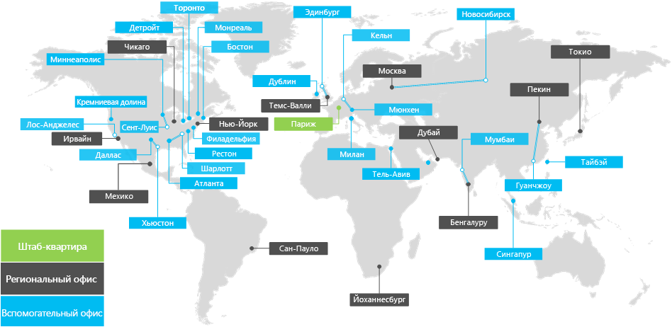

# Общие сведения о корпорации ContosoOverview of the Contoso Corporation

**Сводка.** Статья о корпорации Contoso как о деловой организации и о многоуровневой структуре ее офисов по всему миру.**Summary:** Understand the Contoso Corporation as a business and the tiered structure of its worldwide offices.

Корпорация Contoso — это многонациональная компания с главным офисом в Париже, Франция. Эта организация занимается производством, продажей и поддержкой более чем 100 000 продуктов.The Contoso Corporation is a multi-national business with headquarters in Paris, France. It is a conglomerate manufacturing, sales, and support organization with over 100,000 products.

## Представительства Contoso по всему мируContoso around the world

На рис. 1 показан главный офис в Париже, региональные центральные и подчиненные офисы на разных континентах.Figure 1 shows the headquarters office in Paris and regional hub and satellite offices in various continents.

**Рис. 1. Офисы Contoso по всему миру****Figure 1: Contoso's offices around the world**
 
В офисах корпорации Contoso по всему миру используется трехуровневая среда.Contoso's offices around the world follow a three-tier design.

- Главный офисHeadquarters

  Главный офис корпорации Contoso представляет собой большой корпоративный кампус в окрестностях Парижа с множеством зданий для административных, инженерных и производственных объектов. Все центры данных и интернет-серверы Contoso находятся в главном офисе в Париже.The Contoso Corporation headquarters is a large corporate campus on the outskirts of Paris with dozens of buildings for administrative, engineering, and manufacturing facilities. All of Contoso's datacenters and its Internet presence are housed in the Paris headquarters.

  В главном офисе работает 25 000 сотрудников.The headquarters has 25,000 workers.

- Региональные центральные офисыRegional hubs

  Каждый из региональных центральных офисов обслуживает определенный регион мира; 60 % их сотрудников заняты продажами и поддержкой. Все региональные центральные офисы связаны с главным офисом в Париже через канал глобальной сети с высокой пропускной способностью. Regional hub offices serve a specific region of the world with 60% sales and support staff. Each regional hub is connected to the Paris headquarters with a high-bandwidth WAN link.

  В каждом региональном центральном офисе работает в среднем 2000 сотрудников.Each regional hub has an average of 2,000 workers.

- Подчиненные офисыSatellite offices

  Подчиненные офисы, где продажами и поддержкой занимаются 80 % персонала, расположены в ключевых городах и подрегионах. Благодаря этому клиенты Contoso могут получить необходимые услуги и поддержку на месте. Каждый подчиненный офис подключен к региональному центральному офису с помощью канала глобальной сети с высокой пропускной способностью.Satellite offices contain 80% sales and support staff and provide an on-site presence for Contoso customers in key cities or sub-regions. Each satellite office is connected to a regional hub with a high-bandwidth WAN link.

  В каждом подчиненном офисе работает в среднем 250 сотрудников.Each satellite office has an average of 250 workers.

25 % трудовых ресурсов корпорации Contoso выезжают к клиенту и работают вне офиса, причем процент таких сотрудников выше в региональных центральных и подчиненных офисах. Улучшение поддержки мобильных сотрудников — важная бизнес-цель корпорации Contoso.25% of Contoso's workforce is mobile-only, with a higher percentage of mobile-only workers in the regional hubs and satellite offices. Providing better support for mobile-only workers is an important business goal for Contoso.

## Особенности среды для Microsoft 365 корпоративныйDesign considerations for Microsoft 365 Enterprise

ИТ-архитекторы Contoso определили следующие особенности среды при развертывании Microsoft 365 корпоративный.Contoso's IT architects identified the following design considerations when deploying Microsoft 365 Enterprise: 

- Разные географические расположения с местным законодательством и требованиями по соответствию нормамMultiple geographic locations with local regulations and compliance requirements
- Центр обработки данных центральной интрасети в главном офисе и региональные серверы приложений, в которых размещаются внутренние бизнес-приложенияA central intranet datacenter in the headquarters office and regional application servers that host internal line of business applications
- Существующая инфраструктура System Center Configuration ManagerAn existing System Center Configuration Manager infrastructure
- Сочетание клиентских компьютеров, включая устройства на Windows, Mac и LinuxA mix of client computing devices, including Windows, Mac, and Linux
- Сочетание личных и корпоративных мобильных устройств, включая смартфоны и планшеты на iOS (iPhone и iPad) и AndroidA mix of personal and company-owned mobile devices, including iOS (iPhone and iPad) and Android smart phones and tablets
- Много удаленных и мобильных сотрудниковMany remote and mobile workers
- Большое количество бизнес-партнеровMany business partners
- Большой объем клиентских и личных данныхA large amount of customer and personally identifiable data
- Большой объем ценной интеллектуальной собственности в виде проектных спецификаций для продуктов и производственных тайнA large amount of high-value intellectual property in the form of design specifications for products and manufacturing trade secrets

## Следующее действиеNext step

[Сведения](contoso-infra-needs.md) о локальной ИТ-инфраструктуре корпорации Contoso и способах удовлетворения бизнес-потребностей с помощью Microsoft 365 корпоративный.[Learn](contoso-infra-needs.md) about the Contoso Corporation’s on-premises IT infrastructure and how their business needs can be addressed with Microsoft 365 Enterprise.

## См. такжеSee also

[Руководство по развертываниюDeployment guide](deploy-microsoft-365-enterprise.md)

[Руководства по лаборатории тестированияTest lab guides](m365-enterprise-test-lab-guides.md)

