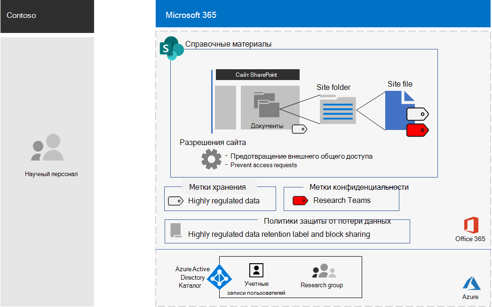
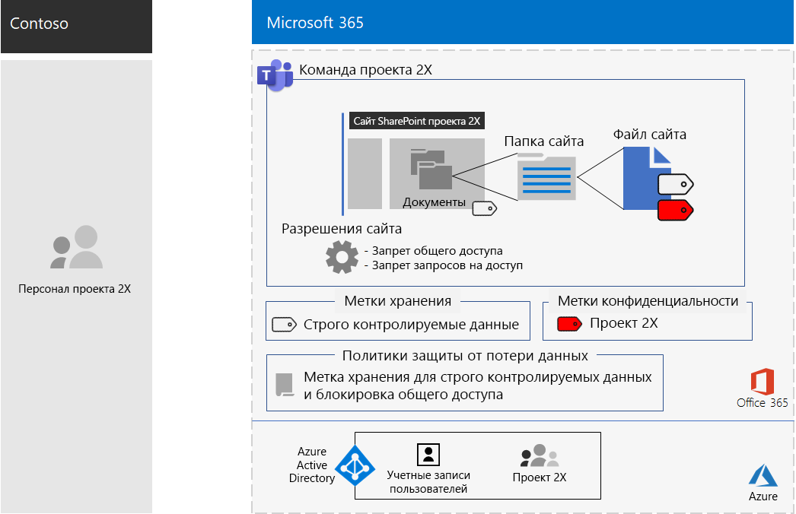

# Команда для сверхсекретного проекта корпорации ContosoTeam for a top-secret project of the Contoso Corporation

После того, как руководитель организации находится за пределами, Генеральный директор Contoso упорядочивает разработку нового набора продуктов и услуг, которые могут вдвое прибыли от компании Contoso в течение следующих пяти лет.After an executive offsite, Contoso’s CEO ordered the development of a new suite of products and services that could double Contoso’s profits in the next five years. Проект верхнего уровня для разработки бизнес-, инженерного и маркетингового плана назывался **Project 2x** и основные сотрудники компании.The top-secret project to develop the business, engineering, and market plan was named **Project 2X** and key staff across the company were recruited. 

Временные шкалы для исследования и разработки были тесно выполнены, поэтому совместная работа должна быть эффективной и обеспечивать безопасное собрание, текущие беседы и хранение файлов.The timelines for research and development were tight, which meant that collaboration had to be efficient and provide for secure meetings, ongoing conversations, and file storage.

Конечные результаты для проекта 2X: бизнес-планы, спецификации продуктов и технических материалов, а также маркетинговые материалы и расписания в виде файлов Word, Excel и PowerPoint.The resulting deliverables for Project 2X were business plans, product and engineering specifications, and marketing materials and schedules in the form of Word, Excel, and PowerPoint files. 

Из-за конфиденциальной природы доступ к этим файлам имел следующий вид:Due to their sensitive nature, access to these files were:

- Ограничено членами группы "проект 2X".Restricted to Project 2X team members.
- Защита от потери данных с помощью политики защиты от потери данных (DLP) для того, чтобы участники группы Project 2X не переключались за их прев группу.Protected with a Data Loss Prevention (DLP) policy to prevent Project 2X team members from sharing them outside the team.
- Зашифровать и защитить с помощью разрешений, чтобы предоставить доступ только членам группы Project 2X, даже если они были распределены за прев компании Contoso.Encrypted and protected with permissions to allow access only to Project 2X team members, even if the files were distributed outside of Contoso.

Сотрудники ИТ отдела Contoso использовали [команду для обеспечения высокой регулируемости данных](secure-teams-highly-regulated-data-scenario.md) в Project 2x и этих действий.Contoso IT staff used a [team for highly-regulated data](secure-teams-highly-regulated-data-scenario.md) for Project 2X and these steps.

## Шаг 1: создание частной команды и блокировка базового сайта SharePointStep 1: Created a private team and locked down the underlying SharePoint site

Чтобы защитить доступ к базовому сайту SharePoint для группы, ИТ-администраторы Contoso настроили [Рекомендуемые политики доступа к SharePoint](sharepoint-file-access-policies.md).To protect access to the underlying SharePoint site for the team, Contoso IT administrators configured the [recommended SharePoint access policies](sharepoint-file-access-policies.md).

Затем администратор Contoso создал новую частную группу с именем Project 2X и добавила учетные записи пользователей в качестве участников Project 2X.Next, a Contoso IT administrator created a new private team named Project 2X and added the user accounts of Project 2X staff as members.

Затем они настроили дополнительные параметры разрешений для сайта, чтобы предотвратить общий доступ к сайту с помощью Project 2X и запретить другому пользователю запрашивать доступ к сайту.Next, they configured additional permission settings for the site to prevent Project 2X from sharing access to the site and to prevent other from requesting access to the site.

Сведения о конфигурации можно найти [в разделе Параметры SharePoint для строго регулируемой группы](https://docs.microsoft.com/microsoft-365/security/office-365-security/deploy-teams-three-tiers#highly-confidential-teams).For the configuration details, see [SharePoint settings for a highly regulated team](https://docs.microsoft.com/microsoft-365/security/office-365-security/deploy-teams-three-tiers#highly-confidential-teams).

## Шаг 2: Настройка политики защиты от потери данных и базового сайта для метки храненияStep 2: Configured a DLP policy and the underlying site for a retention label 

Во-первых, администраторы Contoso применили существующую метку **строго конфиденциального** хранения к разделу " **документы** " на базовом сайте SharePoint для группы "проект 2x".First, Contoso admins applied the existing **Highly Confidential** retention label to the **Documents** section of the underlying SharePoint site of the Project 2X team.

После этого создаются новые политики DLP с именем **Project 2x** , которые:Next, they created a new DLP policy named **Project 2X** that:

- Использует метку хранения строго конфиденциально.Uses the Highly Confidential retention label.
- Блокирует пользователей при попытке предоставить общий доступ к файлу в группе "проект 2" за преходясь в компании Contoso.Blocks users when they attempt to share a file in the Project 2X team outside of Contoso.

Сведения о конфигурации приведены в разделе [Защита файлов в Teams с метками хранения и DLP](https://docs.microsoft.com/microsoft-365/security/office-365-security/deploy-teams-retention-dlp).For the configuration details, see [Protect files in teams with retention labels and DLP](https://docs.microsoft.com/microsoft-365/security/office-365-security/deploy-teams-retention-dlp).

## Шаг 3: создание метки чувствительности для группы проекта 2XStep 3: Created a sensitivity label for the Project 2X team

Администраторы Contoso создали новую метку чувствительности с именем **Project 2x** , которая:Contoso admins created a new sensitivity label named **Project 2X** that:

- Требует шифрования.Requires encryption.
- Разрешает разрешения совместного редактирования для группы Microsoft 365 в проекте 2X.Allows Co-Author permissions for the Project 2X Microsoft 365 group.

Ниже показана итоговая конфигурация команды Project 2X.Here is the resulting configuration of the Project 2X team.

 
Файлы в разделе документы базового сайта SharePoint на 2X защищены:Files in the Documents section of the underlying Project 2X SharePoint site were protected by:

- Разрешения сайта, которые разрешают доступ только к участникам группы Microsoft 365 в проекте 2X.The site permissions, which only allow access to members of the Project 2X Microsoft 365 group.
- Метка хранения строго конфиденциальной информации, которая автоматически назначается новым файлам.The  Highly Confidential retention label, which is automatically assigned to new files.
- Политика защиты от потери данных, использующая метку хранения строго конфиденциальной информации и параметры, которые блокируют доступ внешних пользователей к файлу.A DLP policy that uses the Highly Confidential retention label and settings that block the file from being shared with external users.
- Метка "чувствительность к проекту 2X" с шифрованием и разрешениями, которые передаются вместе с файлом, если он перемещается или копируется с сайта.The Project 2X sensitivity label, with encryption and permissions that travel with the file if it is moved or copied from the site.

Ниже приведен пример файла, хранящегося на базовом сайте с высоким уровнем поднадзорной метки хранения и назначенной метке о конфиденциальности для проекта 2X.Here is an example of a file stored in the underlying Project 2X site with the Highly Regulated retention label and the Project 2X sensitivity label assigned.

 
## Шаг 4: квалифицированные участники группы для Project 2XStep 4: Trained Project 2X team members

Сотрудники отдела безопасности Contoso обучены членам группы "проект 2" в обязательном курсе, в котором их пошагово пройдет следующим образом:Contoso security staff trained the Project 2X team members in a mandatory course that stepped them through:

- Как получить доступ к новой команде Project 2X, использовать собрания и беседы, а также как совместно работать с файлами группы.How to access the new Project 2X team, use meetings and chats, and how to collaborate on team files.
- Создание новых файлов в команде и отправка новых файлов, созданных локально.How to create new files in the team and upload new files created locally.
- Демонстрация того, как политика DLP блокирует доступ к файлам извне.A demonstration of how the DLP policy blocks files from being shared externally.
- Пометка файлов с помощью метки чувствительности к проекту 2X.How to label files with the Project 2X sensitivity label.
- Демонстрация того, как подпись проекта 2X защищает файл, даже если он покидает команду.A demonstration of how the Project 2X  label protects a file even when it leaves the team.

Конечный результат — это безопасная среда, в которой участники группы Project 2X совместно работают в безопасной среде для чатов, собраний и файлов.The end result was a secure environment in which Project 2X team members collaborated in a secure environment for chats, meetings, and files.

В нескольких экземплярах участники группы Project 2X загрузили файлы, защищенные меткой проекта 2X, на локальный диск для работы в автономном режиме.In a couple of instances, Project 2X team members downloaded files protected by the Project 2X label to a local drive for offline work. Однако после того как вы запрашиваете учетные данные при их открытии, они выдавали свои ошибки и удалили их.However, after being prompted for credentials when opening them, they realized their mistake and deleted them.

Из-за среды совместной работы Teams и функций безопасности Microsoft 365 сведения о проекте 2X хранятся в секрете в течение проекта.Because of the collaboration environment of Teams and the security features of Microsoft 365, the details of Project 2X were kept secret for the duration of the project. Компания Contoso объявила о своих планах и в процессе развертывания новых продуктов и служб в сведения своих клиентов и инвесторов и Чагрин конкурентов.Contoso announced its plans and is in the process of rolling out the new products and services to the delight of its customers and investors and the chagrin of its competitors.

## Следующий шагNext step

[Deploy (развертывание](deploy-microsoft-365-enterprise.md) ) Microsoft 365 корпоративный в Организации.[Deploy](deploy-microsoft-365-enterprise.md) Microsoft 365 Enterprise in your organization.

## См. такжеSee also

[Microsoft 365 Productivity Library](https://aka.ms/productivitylibrary) (https://aka.ms/productivitylibrary)[Microsoft 365 Productivity Library](https://aka.ms/productivitylibrary) (https://aka.ms/productivitylibrary)
