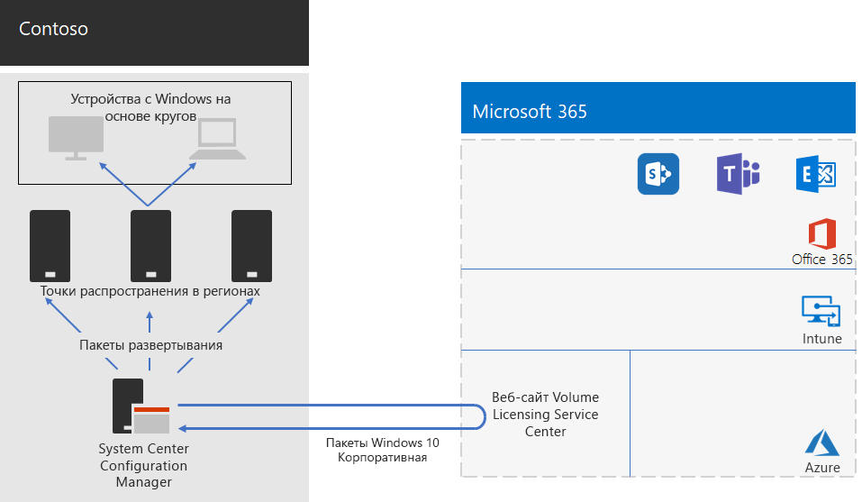

# Развертывание Windows 10 Корпоративная для компании Contoso

До момента выпуска решения Microsoft 365 корпоративный, доступного широкому кругу пользователей, в компании Contoso использовали ПК и устройства, совместимые с ОС Windows. На них были установлены следующие ОС: Windows 7 (10 %), Windows 8.1 (65 %) и Windows 10 (25 %). В компании хотели обновить ПК, чтобы воспользоваться преимуществами, предоставляемыми Windows 10 Корпоративная. Эти преимущества включают возможность повысить уровень безопасности и уменьшить издержки на ИТ-инфраструктуру благодаря системе автоматизированного развертывания обновлений. 

Оценив инфраструктуру и бизнес-потребности, специалисты компании Contoso определили перечисленные ниже основные требования к развертыванию.

- ОС Windows 10 Корпоративная следует использовать на максимально возможном количестве устройств.
- При развертывании обновлений на месте используется существующая инфраструктура Configuration Manager.
- Необходима возможность выбирать версии развертываемой ОС Windows 10 Корпоративная и обновлений с помощью кругов.
- ПК и устройства всегда должны быть в актуальном состоянии, и это должно сопровождаться минимальными издержками на ИТ-администрирование. При этом процесс получения и установки обновлений не должен причинять заметные неудобства пользователям.

Под актуальным состоянием понимается поддерживаемая версия Windows 10 Корпоративная, которая соответствует бизнес-потребностям компании Contoso. При этом, возможно, не обязательно использовать последнюю версию Windows 10 Корпоративная на всех ПК, совместимых с ОС Windows.

## Средства развертывания

До обновления Windows 10 Корпоративная на месте и в процессе такого обновления в компании Contoso использовали указанные ниже решения Windows Analytics.

- Проверка готовности к обновлению  

  Это средство собирает данные о системе, приложениях и драйверах для анализа, а затем находит проблемы совместимости, из-за которых, возможно, не удастся выполнить обновление, и предлагает решения этих проблем, известные корпорации Майкрософт.

- Поддержка обновлений  

  Здесь отображается состояние ваших устройств с учетом обновлений Windows, чтобы вы могли убедиться в том, что ваши устройства имеют наиболее актуальные необходимые обновления.

- Работоспособность устройств  

  Выявляет устройства, которые часто выходят из строя, и, следовательно, нуждаются в модернизации или замене, а также драйверы устройств, которые вызывают сбои устройств, предлагая альтернативные версии таких драйверов, что может способствовать снижению количества сбоев. Предоставляет уведомление о неправильных конфигурациях Windows Information Protection, которые отправляют запросы пользователям.
 
В компании Contoso уже имеется инфраструктура Configuration Manager (Current Branch). Configuration Manager выполняет масштабирование для крупных сред и обеспечивает всесторонний контроль над установкой, обновлениями и параметрами. Кроме того, он оснащен функциями, которые упрощают и повышают эффективность развертывания ОС Windows 10 Корпоративная и управления ею.

## Процесс планирования

Перед развертыванием в компании Contoso определили указанные ниже круги.

- Три круга для поэтапного выполнения процессов проверки и развертывания. 
  - Один круг для сборок ознакомительных версий. 
  - Один круг для сборок новых выпусков.
  - Один круг для предыдущих сборок. 
- Один круг для широкого развертывания Windows 10 Корпоративная на основе данных, полученных в кругах проверки.

Кроме того, с помощью решения "Проверка готовности к обновлению" в Windows Analytics специалисты компании Contoso составили перечень установленных приложений и определили совместимость этих приложений с ОС Windows 10 Корпоративная.

## Процесс развертывания

Чтобы выполнить развертывание обновлений на месте для ОС Windows 10 Корпоративная, в компании Contoso реализовали указанный ниже процесс с использованием рекомендаций корпорации Майкрософт.

1. Был включен одноранговый кэш для Configuration Manager.
2. На основе образов, полученных из Volume Licensing Service Center, были созданы специальные пакеты Windows.
3. С помощью Configuration Manager пакеты Windows были развернуты в точках распространения в сети компании. Кроме того, были развернуты сборки в трех кругах поэтапного выполнения процессов проверки и развертывания.
4. Была выполнена оценка успешности развертывания для ПК и устройств в трех кругах поэтапного выполнения процессов проверки и развертывания с использованием решений "Работоспособность устройств" и "Поддержка обновлений" в Windows Analytics.
5. На основе информации, полученной из Windows Analytics, специалисты компании Contoso выбрали версию Windows 10 Корпоративная, которую необходимо развернуть в круге широкого развертывания.
6. Были выполнены задачи развертывания Configuration Manager для развертывания выбранного пакета Windows в круге широкого развертывания.
7. Был выполнен мониторинг ПК и устройств в круге широкого развертывания. Для решения проблем были использованы решения "Работоспособность устройств" и "Поддержка обновлений".

Здесь показана архитектура развертывания обновлений на месте и текущих обновлений.

Эта инфраструктура состоит из указанных ниже элементов.

- Configuration Manager, который:
  - Получает образы для пакетов Windows 10 Корпоративная из Microsoft Volume Licensing Center в сети Майкрософт.
  - Является центральной точкой администрирования при развертывании пакетов.
- Региональные точки распределения, которые обычно расположены в региональных офисах компании Contoso.
- Компьютеры и устройства с ОС Windows в различных расположениях, на которых выполняется прием и установка пакетов развертывания для обновления на месте или текущих обновлений на основе членства в круге.

## Дальнейшие действия

[Узнайте,](contoso-o365pp.md) как в компании Contoso используют свою инфраструктуру Configuration Manager для развертывания Office 365 профессиональный плюс в организации и поддержания его в актуальном состоянии. 

## См. также

[Windows 10 Корпоративная для Microsoft 365 корпоративный](windows10-infrastructure.md)

[Руководство по развертыванию](deploy-microsoft-365-enterprise.md)

[Руководства по лаборатории тестирования](m365-enterprise-test-lab-guides.md)
