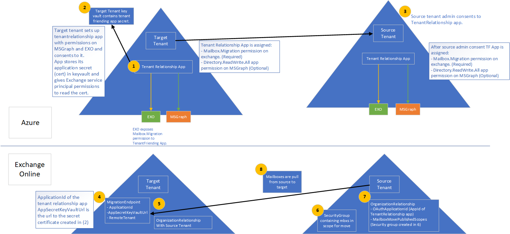

# <a name="cross-tenant-mailbox-migration-preview"></a><span data-ttu-id="fda79-103">Миграция почтовых ящиков с перекрестным клиентом (предварительный просмотр)</span><span class="sxs-lookup"><span data-stu-id="fda79-103">Cross-tenant mailbox migration (preview)</span></span>

<span data-ttu-id="fda79-104">Раньше, когда Exchange Online должен был переместить почтовые ящики другому клиенту в той же службе Exchange Online, ему придется полностью отключить их в локальное помещение, а затем на борту их для нового клиента.</span><span class="sxs-lookup"><span data-stu-id="fda79-104">Previously, when an Exchange Online tenant needed to move mailboxes to another tenant in the same Exchange Online service, they would have to completely offboard them to on-premises and then onboard them to a new tenant.</span></span> <span data-ttu-id="fda79-105">С помощью новой функции миграции почтовых ящиков между клиентами администраторы клиентов в исходных и целевых клиентах могут перемещать почтовые ящики между арендаторами с минимальными зависимостями инфраструктуры в локальной системе.</span><span class="sxs-lookup"><span data-stu-id="fda79-105">With the new cross-tenant mailbox migration feature, tenant administrators in both source and target tenants can move mailboxes between the tenants with minimal infrastructure dependencies in their on-premises systems.</span></span> <span data-ttu-id="fda79-106">Это устраняет необходимость в бортовых и бортовых почтовых ящиках.</span><span class="sxs-lookup"><span data-stu-id="fda79-106">This removes the need to off-board and onboard mailboxes.</span></span>

<span data-ttu-id="fda79-107">Как правило, во время слияний или отгрузок требуется возможность перемещения пользователей и контента в нового клиента.</span><span class="sxs-lookup"><span data-stu-id="fda79-107">Commonly, during mergers or divestitures, you need the ability to move users and content into a new tenant.</span></span> <span data-ttu-id="fda79-108">Когда целевой администратор клиента выполняет этот шаг, он называется перемещением Pull, аналогично локальному переносу облачных бортовых данных.</span><span class="sxs-lookup"><span data-stu-id="fda79-108">When the target tenant administrator executes the move, it’s called a Pull move, similar to on-premises to cloud onboarding migrations.</span></span>

<span data-ttu-id="fda79-109">Перекрестные перемещения Exchange почтовых ящиков полностью самообслуживаются администраторами клиентов, используя хорошо известные интерфейсы, которые можно скриптить в более крупные процессы, необходимые для перехода пользователей в новую организацию.</span><span class="sxs-lookup"><span data-stu-id="fda79-109">Cross-tenant Exchange mailbox moves are fully self-serviced by tenant administrators, using well known interfaces that can be scripted into the larger workflows needed to transition users to their new organization.</span></span> <span data-ttu-id="fda79-110">Администраторы могут использовать комлет, доступный через роль управления почтовыми ящиками Move, для выполнения `New-MigrationBatch` перекрестных ходов клиента.</span><span class="sxs-lookup"><span data-stu-id="fda79-110">Administrators can use the `New-MigrationBatch` cmdlet, available through the Move Mailboxes management role, to execute cross-tenant moves.</span></span> <span data-ttu-id="fda79-111">Процесс перемещения включает проверки авторизации клиента во время синхронизации и финализации почтовых ящиков.</span><span class="sxs-lookup"><span data-stu-id="fda79-111">The move process includes tenant authorization checks during mailbox synchronization and finalization.</span></span> 
 
<span data-ttu-id="fda79-112">Миграция пользователей должна присутствовать в целевой системе Exchange Online клиента в качестве MailUsers, отмеченных определенными атрибутами для обеспечения перекрестного перемещения клиента.</span><span class="sxs-lookup"><span data-stu-id="fda79-112">Users migrating must be present in the target tenant Exchange Online system as MailUsers, marked with specific attributes to enable the cross-tenant moves.</span></span> <span data-ttu-id="fda79-113">Система сбой ходов для пользователей, которые не правильно настроены в целевом клиенте.</span><span class="sxs-lookup"><span data-stu-id="fda79-113">The system will fail moves for users that are not properly set up in the target tenant.</span></span>  

<span data-ttu-id="fda79-114">Когда ходы завершались, почтовый ящик исходных систем преобразуется в MailUser, а адрес targetAddress (показано как ExternalEmailAddress в Exchange) штампуется адресом маршрутки для клиента назначения.</span><span class="sxs-lookup"><span data-stu-id="fda79-114">When the moves are complete, the source system mailbox is converted to MailUser and the targetAddress (shown as ExternalEmailAddress in Exchange) is stamped with the routing address to the destination tenant.</span></span> <span data-ttu-id="fda79-115">Этот процесс оставляет устаревший MailUser в клиенте источника и позволяет на период сосуществования и маршрутизации почты.</span><span class="sxs-lookup"><span data-stu-id="fda79-115">This process leaves the legacy MailUser in the source tenant, and allows for a period of co-existence and mail routing.</span></span> <span data-ttu-id="fda79-116">Когда бизнес-процессы позволяют, клиент-источник может удалить исходный MailUser или преобразовать их в почтовый контакт.</span><span class="sxs-lookup"><span data-stu-id="fda79-116">When business processes allow, the source tenant may remove the source MailUser or convert them to a mail contact.</span></span> 

<span data-ttu-id="fda79-117">Переносы Exchange почтовых ящиков поддерживаются только в гибридном или облачном варианте или в любой комбинации.</span><span class="sxs-lookup"><span data-stu-id="fda79-117">Cross-tenant Exchange mailbox migrations are supported for tenants in hybrid or cloud only, or any combination of the two.</span></span>

<span data-ttu-id="fda79-118">В этой статье описывается процесс перемещения почтовых ящиков между клиентами и содержится руководство по подготовке исходных и целевых клиентов для перемещения контента.</span><span class="sxs-lookup"><span data-stu-id="fda79-118">This article describes the process for cross-tenant mailbox moves and provides guidance on how to prepare source and target tenants for the content move.</span></span>  

## <a name="preparing-source-and-target-tenants"></a><span data-ttu-id="fda79-119">Подготовка исходных и целевых клиентов</span><span class="sxs-lookup"><span data-stu-id="fda79-119">Preparing source and target tenants</span></span>

<span data-ttu-id="fda79-120">Функция переноса Exchange почтовых ящиков с Exchange требует авторизации и скопирования для перекрестных миграций клиента.</span><span class="sxs-lookup"><span data-stu-id="fda79-120">The Cross-tenant Exchange mailbox migration feature requires authorization and scoping for cross-tenant migrations.</span></span> <span data-ttu-id="fda79-121">С помощью решений Enterprise Azure и хранилища key Vault администраторы клиентов теперь уполномочены управлять как авторизацией, так и Exchange Online миграцией почтовых ящиков из одного клиента в другой.</span><span class="sxs-lookup"><span data-stu-id="fda79-121">Using the Azure Enterprise application and Key Vault storage solutions, tenant admins are now empowered to manage both authorization and scoping of Exchange Online mailbox migrations from one tenant to another.</span></span> <span data-ttu-id="fda79-122">Перемещение почтовых ящиков между клиентами поддерживает модель приглашения и согласия для создания приложения Azure Active Directory Azure AD, используемого для проверки подлинности между парой клиентов.</span><span class="sxs-lookup"><span data-stu-id="fda79-122">Cross-tenant mailbox moves supports an invitation and consent model to establish an Azure Active Directory (Azure AD) application used for authentication between a tenant pair.</span></span> <span data-ttu-id="fda79-123">Кроме того, требуются дополнительные компоненты, такие как отношение к организации и конечная точка миграции.</span><span class="sxs-lookup"><span data-stu-id="fda79-123">Additional components such as an organization relationship and a migration endpoint are also required.</span></span>

<span data-ttu-id="fda79-124">В этом разделе не содержатся конкретные действия, необходимые для подготовки объектов пользователя MailUser в целевом каталоге, а также пример команды отправки пакета миграции.</span><span class="sxs-lookup"><span data-stu-id="fda79-124">This section does not include the specific steps required to prepare the MailUser user objects in the target directory, nor does it include the sample command to submit a migration batch.</span></span> <span data-ttu-id="fda79-125">См. [в этой информации подготовка целевых объектов пользователя к](#prepare-target-user-objects-for-migration) миграции.</span><span class="sxs-lookup"><span data-stu-id="fda79-125">Please see [Prepare target user objects for migration](#prepare-target-user-objects-for-migration) for this information.</span></span>

## <a name="prerequisites"></a><span data-ttu-id="fda79-126">Необходимые условия</span><span class="sxs-lookup"><span data-stu-id="fda79-126">Prerequisites</span></span>

<span data-ttu-id="fda79-127">Функция перемещения почтовых ящиков между клиентами требует от [Azure Key Vault](/azure/key-vault/basic-concepts) создать приложение Azure для безопасного хранения и доступа к сертификату/секрету, используемого для проверки подлинности и авторизации миграции почтовых ящиков из одного клиента в другой, с удалением любых требований для обмена сертификатами и секретами между клиентами.</span><span class="sxs-lookup"><span data-stu-id="fda79-127">The cross-tenant mailbox move feature requires [Azure Key Vault](/azure/key-vault/basic-concepts) to establish a tenant pair-specific Azure application to securely store and access the certificate/secret used to authenticate and authorize mailbox migration from one tenant to the other, removing any requirements to share certificates/secrets between tenants.</span></span> 

<span data-ttu-id="fda79-128">Перед запуском убедитесь, что у вас есть необходимые разрешения для запуска сценариев развертывания для настройки хранилища ключей Azure, приложения Move Mailbox, конечной точки миграции EXO и отношения организации EXO.</span><span class="sxs-lookup"><span data-stu-id="fda79-128">Before starting, be sure you have the necessary permissions to run the deployment scripts in order to configure Azure Key Vault, Move Mailbox application, EXO Migration Endpoint, and the EXO Organization Relationship.</span></span> <span data-ttu-id="fda79-129">Как правило, у глобального администратора есть разрешение на выполнение всех действий по настройке.</span><span class="sxs-lookup"><span data-stu-id="fda79-129">Typically, Global Admin has permission to perform all configuration steps.</span></span>

<span data-ttu-id="fda79-130">Кроме того, группы безопасности с включенной почтой в клиенте-источнике требуются перед запуском установки.</span><span class="sxs-lookup"><span data-stu-id="fda79-130">Additionally, mail-enabled security groups in the source tenant are required prior to running setup.</span></span> <span data-ttu-id="fda79-131">Эти группы используются для охвата списка почтовых ящиков, которые могут перемещаться из клиента источника (или иногда именуемого как ресурс) в целевого клиента.</span><span class="sxs-lookup"><span data-stu-id="fda79-131">These groups are used to scope the list of mailboxes that can move from source (or sometimes referred to as resource) tenant to the target tenant.</span></span> <span data-ttu-id="fda79-132">Это позволяет администратору-источнику клиента ограничить или ограничить область действия определенного набора почтовых ящиков, которые необходимо перенести, чтобы предотвратить миграцию нежелательных пользователей.</span><span class="sxs-lookup"><span data-stu-id="fda79-132">This allows the source tenant admin to restrict or scope the specific set of mailboxes that need to be moved, preventing unintended users from being migrated.</span></span> <span data-ttu-id="fda79-133">Вложенные группы не поддерживаются.</span><span class="sxs-lookup"><span data-stu-id="fda79-133">Nested groups are not supported.</span></span>

<span data-ttu-id="fda79-134">Вам также потребуется связаться с доверенными партнерами (с которыми будут перемещены почтовые ящики), чтобы получить Microsoft 365 клиента.</span><span class="sxs-lookup"><span data-stu-id="fda79-134">You will also need to communicate with your trusted partner company (with whom you will be moving mailboxes) to obtain their Microsoft 365 tenant ID.</span></span> <span data-ttu-id="fda79-135">Этот ID клиента используется в поле Отношения `DomainName` организации.</span><span class="sxs-lookup"><span data-stu-id="fda79-135">This tenant ID is used in the Organization Relationship `DomainName` field.</span></span>

<span data-ttu-id="fda79-136">Чтобы получить паспорт клиента подписки, войдите в центр администрирования Microsoft 365 и перейдите в [https://aad.portal.azure.com/#blade/Microsoft_AAD_IAM/ActiveDirectoryMenuBlade/Properties](https://aad.portal.azure.com/#blade/Microsoft_AAD_IAM/ActiveDirectoryMenuBlade/Properties) .</span><span class="sxs-lookup"><span data-stu-id="fda79-136">To obtain the tenant ID of a subscription, sign-in to the Microsoft 365 admin center and go to [https://aad.portal.azure.com/#blade/Microsoft_AAD_IAM/ActiveDirectoryMenuBlade/Properties](https://aad.portal.azure.com/#blade/Microsoft_AAD_IAM/ActiveDirectoryMenuBlade/Properties).</span></span> <span data-ttu-id="fda79-137">Щелкните значок копирования для свойства Tenant ID, чтобы скопировать его в буфер обмена.</span><span class="sxs-lookup"><span data-stu-id="fda79-137">Click the copy icon for the Tenant ID property to copy it to the clipboard.</span></span>

<span data-ttu-id="fda79-138">Вот как работает процесс.</span><span class="sxs-lookup"><span data-stu-id="fda79-138">Here is how the process works.</span></span>

:::image type="content" source="../media/tenant-to-tenant-mailbox-move/prepare-tenants-flow.png" alt-text="Подготовка клиента к миграции почтовых ящиков.":::

<span data-ttu-id="fda79-140">[См. более крупную версию этого изображения.](https://github.com/MicrosoftDocs/microsoft-365-docs/raw/public/microsoft-365/media/tenant-to-tenant-mailbox-move/prepare-tenants-flow.png)</span><span class="sxs-lookup"><span data-stu-id="fda79-140">[See a larger version of this image](https://github.com/MicrosoftDocs/microsoft-365-docs/raw/public/microsoft-365/media/tenant-to-tenant-mailbox-move/prepare-tenants-flow.png).</span></span>

<!--
[](https://github.com/MicrosoftDocs/microsoft-365-docs/raw/public/microsoft-365/media/tenant-to-tenant-mailbox-move/prepare-tenants-flow.png)
--> 

### <a name="prepare-tenants"></a><span data-ttu-id="fda79-141">Подготовка клиентов</span><span class="sxs-lookup"><span data-stu-id="fda79-141">Prepare tenants</span></span>

<span data-ttu-id="fda79-142">На высоком уровне при выполнении скриптов настройки выполняются следующие действия конфигурации.</span><span class="sxs-lookup"><span data-stu-id="fda79-142">At a high level, the following configuration actions take place when executing the setup scripts.</span></span>

<span data-ttu-id="fda79-143">Подготовка целевого клиента:</span><span class="sxs-lookup"><span data-stu-id="fda79-143">Prepare the target tenant:</span></span>

1. <span data-ttu-id="fda79-144">Если существующая группа ресурсов Azure не предоставлена, создается новая (SCRIPT).</span><span class="sxs-lookup"><span data-stu-id="fda79-144">If an existing Azure Resource Group is not provided, a new one is created (SCRIPT).</span></span>
2. <span data-ttu-id="fda79-145">Если существующее хранилище ключей не предоставлено, создается новый (SCRIPT).</span><span class="sxs-lookup"><span data-stu-id="fda79-145">If an existing Key Vault is not provided, a new one is created (SCRIPT).</span></span>
3. <span data-ttu-id="fda79-146">Новая политика доступа создается для приложения миграции Office 365 Exchange Online почтовых ящиков (SCRIPT).</span><span class="sxs-lookup"><span data-stu-id="fda79-146">A new Access Policy is created for the Office 365 Exchange Online Mailbox Migration application (SCRIPT).</span></span>
4. <span data-ttu-id="fda79-147">Для удержания секрета в приложении Migration (SCRIPT) создается новый сертификат (или существующий, если задан).</span><span class="sxs-lookup"><span data-stu-id="fda79-147">A new certificate is created (or existing one, if specified) to hold the secret to the Migration application (SCRIPT).</span></span>
5. <span data-ttu-id="fda79-148">Создается новое приложение Azure AD (SCRIPT).</span><span class="sxs-lookup"><span data-stu-id="fda79-148">A new Azure AD application is created (SCRIPT).</span></span>
6. <span data-ttu-id="fda79-149">Сертификат/секрет загружается в приложение миграции (SCRIPT).</span><span class="sxs-lookup"><span data-stu-id="fda79-149">The certificate/secret is uploaded to the migration application (SCRIPT).</span></span>
7. <span data-ttu-id="fda79-150">Разрешения на миграцию почтовых ящиков назначены приложению (SCRIPT).</span><span class="sxs-lookup"><span data-stu-id="fda79-150">Mailbox migration permissions are assigned to the application (SCRIPT).</span></span>
8. <span data-ttu-id="fda79-151">Сценарий развертывания останавливается до тех пор, пока целевой администратор не согласится на собственное приложение (SCRIPT).</span><span class="sxs-lookup"><span data-stu-id="fda79-151">The deployment script pauses until target admin consents to their own application (SCRIPT).</span></span>
9. <span data-ttu-id="fda79-152">Администратор целевого клиента соглашается на разрешения, выданные приложению (MANUAL).</span><span class="sxs-lookup"><span data-stu-id="fda79-152">The target tenant admin consents to the permissions given to the application (MANUAL).</span></span>
10. <span data-ttu-id="fda79-153">Создается отношение организации к целевому клиенту (SCRIPT).</span><span class="sxs-lookup"><span data-stu-id="fda79-153">An organization relationship is created to the target tenant (SCRIPT).</span></span>
11. <span data-ttu-id="fda79-154">Для переноса почтовых ящиков к целевому клиенту (SCRIPT) создается конечная точка миграции.</span><span class="sxs-lookup"><span data-stu-id="fda79-154">A migration endpoint is created to pull mailboxes to the target tenant (SCRIPT).</span></span>

<span data-ttu-id="fda79-155">Подготовка клиента-источника:</span><span class="sxs-lookup"><span data-stu-id="fda79-155">Prepare the source tenant:</span></span>

1. <span data-ttu-id="fda79-156">Администратор исходных клиентов принимает согласие на приглашение приложения миграции почтовых ящиков от целевого клиента (MANUAL).</span><span class="sxs-lookup"><span data-stu-id="fda79-156">The source tenant admin accepts consent to Mailbox Migration application invitation from the Target tenant (MANUAL).</span></span>
2. <span data-ttu-id="fda79-157">Администратор исходных клиентов создает группу безопасности с включенной почтой в клиенте, чтобы содержать список почтовых ящиков, разрешенных к перемещению приложением миграции (MANUAL).</span><span class="sxs-lookup"><span data-stu-id="fda79-157">The source tenant admin creates a mail-enabled security group in their tenant to contain the list of mailboxes allowed to be moved by the migration application (MANUAL).</span></span>
3. <span data-ttu-id="fda79-158">Для проверки OAuth для приемки запроса на перемещение (SCRIPT) создается связь организации с целевым клиентом, указывающий, что приложение миграции почтовых ящиков должно использоваться для проверки OAuth.</span><span class="sxs-lookup"><span data-stu-id="fda79-158">An organization relationship is created to the target tenant specifying the mailbox migration application should be used for OAuth verification to accept the move request (SCRIPT).</span></span>

#### <a name="step-by-step-instructions-for-the-target-tenant-admin"></a><span data-ttu-id="fda79-159">Пошаговая инструкция для целевого администратора клиента</span><span class="sxs-lookup"><span data-stu-id="fda79-159">Step-by-step instructions for the target tenant admin</span></span>

1. <span data-ttu-id="fda79-160">Скачайте SetupCrossTenantRelationshipForTargetTenant.ps1 для целевой установки клиента из [репозиторий GitHub.](https://github.com/microsoft/cross-tenant/releases/tag/Preview)</span><span class="sxs-lookup"><span data-stu-id="fda79-160">Download the SetupCrossTenantRelationshipForTargetTenant.ps1 script for the target tenant setup from the [GitHub repository](https://github.com/microsoft/cross-tenant/releases/tag/Preview).</span></span> 
2. <span data-ttu-id="fda79-161">Сохраните сценарий (SetupCrossTenantRelationshipForTargetTenant.ps1) на компьютере, с которого будет выполняться сценарий.</span><span class="sxs-lookup"><span data-stu-id="fda79-161">Save the script (SetupCrossTenantRelationshipForTargetTenant.ps1) to the computer from which you will be executing the script.</span></span>
3. <span data-ttu-id="fda79-162">Создание удаленного подключения PowerShell к целевому Exchange Online клиенту.</span><span class="sxs-lookup"><span data-stu-id="fda79-162">Create a Remote PowerShell connection to the Exchange Online target tenant.</span></span> <span data-ttu-id="fda79-163">Кроме того, убедитесь, что у вас есть необходимые разрешения для запуска сценариев развертывания для настройки хранилища и сертификата хранилища ключей Azure, приложения Move Mailbox, конечной точки миграции EXO и отношения организации EXO.</span><span class="sxs-lookup"><span data-stu-id="fda79-163">Again, make sure you have the necessary permissions to run the deployment scripts in order to configure the Azure Key Vault storage and certificate, Move Mailbox application, EXO Migration Endpoint, and the EXO Organization Relationship.</span></span>
4. <span data-ttu-id="fda79-164">Измените каталог папки файлов на расположение скрипта или убедитесь, что сценарий сохранен в настоящее время в вашем сеансе Удаленной PowerShell.</span><span class="sxs-lookup"><span data-stu-id="fda79-164">Change the file folder directory to the script location or verify the script is currently saved to the location currently in your Remote PowerShell session.</span></span>
5. <span data-ttu-id="fda79-165">Запустите сценарий со следующими параметрами и значениями.</span><span class="sxs-lookup"><span data-stu-id="fda79-165">Run the script with the following parameters and values.</span></span>

    | <span data-ttu-id="fda79-166">Параметр</span><span class="sxs-lookup"><span data-stu-id="fda79-166">Parameter</span></span> | <span data-ttu-id="fda79-167">Значение</span><span class="sxs-lookup"><span data-stu-id="fda79-167">Value</span></span> | <span data-ttu-id="fda79-168">Обязательный или необязательный</span><span class="sxs-lookup"><span data-stu-id="fda79-168">Required or Optional</span></span>
    |---------------------------------------------|-----------------|--------------|
    | <span data-ttu-id="fda79-169">-TargetTenantDomain</span><span class="sxs-lookup"><span data-stu-id="fda79-169">-TargetTenantDomain</span></span>                         | <span data-ttu-id="fda79-170">Целевой домен клиента, например fabrikam \. onmicrosoft.com.</span><span class="sxs-lookup"><span data-stu-id="fda79-170">Target tenant domain, such as fabrikam\.onmicrosoft.com.</span></span> | <span data-ttu-id="fda79-171">Обязательный</span><span class="sxs-lookup"><span data-stu-id="fda79-171">Required</span></span> |
    | <span data-ttu-id="fda79-172">-ResourceTenantDomain</span><span class="sxs-lookup"><span data-stu-id="fda79-172">-ResourceTenantDomain</span></span>                       | <span data-ttu-id="fda79-173">Домен исходный клиент, например contoso \. onmicrosoft.com.</span><span class="sxs-lookup"><span data-stu-id="fda79-173">Source tenant domain, such as contoso\.onmicrosoft.com.</span></span> | <span data-ttu-id="fda79-174">Обязательный</span><span class="sxs-lookup"><span data-stu-id="fda79-174">Required</span></span> |
    | <span data-ttu-id="fda79-175">-ResourceTenantAdminEmail</span><span class="sxs-lookup"><span data-stu-id="fda79-175">-ResourceTenantAdminEmail</span></span>                   | <span data-ttu-id="fda79-176">Исходный адрес электронной почты администратора клиента.</span><span class="sxs-lookup"><span data-stu-id="fda79-176">Source tenant admin’s email address.</span></span> <span data-ttu-id="fda79-177">Это исходный администратор клиента, который будет соглашаться на использование приложения миграции почтовых ящиков, отправленного от целевого администратора. Это администратор, который получит приглашение по электронной почте для приложения.</span><span class="sxs-lookup"><span data-stu-id="fda79-177">This is the source tenant admin who will be consenting to the use of the mailbox migration application sent from the target admin. This is the admin who will receive the email invite for the application.</span></span> | <span data-ttu-id="fda79-178">Обязательный</span><span class="sxs-lookup"><span data-stu-id="fda79-178">Required</span></span> |
    | <span data-ttu-id="fda79-179">-ResourceTenantId</span><span class="sxs-lookup"><span data-stu-id="fda79-179">-ResourceTenantId</span></span>                           | <span data-ttu-id="fda79-180">Код организации-клиента источника (GUID).</span><span class="sxs-lookup"><span data-stu-id="fda79-180">Source tenant organization ID (GUID).</span></span> | <span data-ttu-id="fda79-181">Обязательный</span><span class="sxs-lookup"><span data-stu-id="fda79-181">Required</span></span> |
    | <span data-ttu-id="fda79-182">-SubscriptionId</span><span class="sxs-lookup"><span data-stu-id="fda79-182">-SubscriptionId</span></span>                             | <span data-ttu-id="fda79-183">Подписка Azure, используемая для создания ресурсов.</span><span class="sxs-lookup"><span data-stu-id="fda79-183">The Azure subscription to use for creating resources.</span></span> | <span data-ttu-id="fda79-184">Обязательный</span><span class="sxs-lookup"><span data-stu-id="fda79-184">Required</span></span> |
    | <span data-ttu-id="fda79-185">-ResourceGroup</span><span class="sxs-lookup"><span data-stu-id="fda79-185">-ResourceGroup</span></span>                              | <span data-ttu-id="fda79-186">Имя группы ресурсов Azure, которая содержит или будет содержать хранилище ключей.</span><span class="sxs-lookup"><span data-stu-id="fda79-186">Azure resource group name that contains or will contain the Key Vault.</span></span> | <span data-ttu-id="fda79-187">Обязательный</span><span class="sxs-lookup"><span data-stu-id="fda79-187">Required</span></span> |
    | <span data-ttu-id="fda79-188">-KeyVaultName</span><span class="sxs-lookup"><span data-stu-id="fda79-188">-KeyVaultName</span></span>                               | <span data-ttu-id="fda79-189">Экземпляр Хранилища ключей Azure, который будет хранить сертификат/секрет приложения миграции почтовых ящиков.</span><span class="sxs-lookup"><span data-stu-id="fda79-189">Azure Key Vault instance that will store your mailbox migration application certificate/secret.</span></span> | <span data-ttu-id="fda79-190">Обязательный</span><span class="sxs-lookup"><span data-stu-id="fda79-190">Required</span></span> |
    | <span data-ttu-id="fda79-191">-CertificateName</span><span class="sxs-lookup"><span data-stu-id="fda79-191">-CertificateName</span></span>                            | <span data-ttu-id="fda79-192">Имя сертификата при создании или поиске сертификата в хранилище ключей.</span><span class="sxs-lookup"><span data-stu-id="fda79-192">Certificate name when generating or searching for certificate in key vault.</span></span> | <span data-ttu-id="fda79-193">Обязательный</span><span class="sxs-lookup"><span data-stu-id="fda79-193">Required</span></span> |
    | <span data-ttu-id="fda79-194">-CertificateSubject</span><span class="sxs-lookup"><span data-stu-id="fda79-194">-CertificateSubject</span></span>                         | <span data-ttu-id="fda79-195">Имя субъекта сертификата Хранилища ключей Azure, например CN=contoso_fabrikam.</span><span class="sxs-lookup"><span data-stu-id="fda79-195">Azure Key Vault certificate subject name, such as CN=contoso_fabrikam.</span></span> | <span data-ttu-id="fda79-196">Обязательный</span><span class="sxs-lookup"><span data-stu-id="fda79-196">Required</span></span> |
    | <span data-ttu-id="fda79-197">-AzureResourceLocation</span><span class="sxs-lookup"><span data-stu-id="fda79-197">-AzureResourceLocation</span></span>                      | <span data-ttu-id="fda79-198">Расположение группы ресурсов Azure и хранилища ключей.</span><span class="sxs-lookup"><span data-stu-id="fda79-198">The location of the Azure resource group and key vault.</span></span> | <span data-ttu-id="fda79-199">Обязательный</span><span class="sxs-lookup"><span data-stu-id="fda79-199">Required</span></span> |
    | <span data-ttu-id="fda79-200">-ExistingApplicationId</span><span class="sxs-lookup"><span data-stu-id="fda79-200">-ExistingApplicationId</span></span>                      | <span data-ttu-id="fda79-201">Приложение миграции почты для использования, если уже создано.</span><span class="sxs-lookup"><span data-stu-id="fda79-201">Mail migration application to use if one was already created.</span></span> | <span data-ttu-id="fda79-202">Необязательный</span><span class="sxs-lookup"><span data-stu-id="fda79-202">Optional</span></span> |
    | <span data-ttu-id="fda79-203">-AzureAppPermissions</span><span class="sxs-lookup"><span data-stu-id="fda79-203">-AzureAppPermissions</span></span>                        | <span data-ttu-id="fda79-204">Разрешения, необходимые для приложения миграции почтовых ящиков, такие как Exchange или MSGraph (Exchange для перемещения почтовых ящиков, MSGraph для использования этого приложения для отправки приглашения ссылки на согласие клиента ресурса).</span><span class="sxs-lookup"><span data-stu-id="fda79-204">The permissions required to be given to the mailbox migration application, such as Exchange or MSGraph (Exchange for moving mailboxes, MSGraph for using this application to send a consent link invitation to resource tenant).</span></span> | <span data-ttu-id="fda79-205">Обязательный</span><span class="sxs-lookup"><span data-stu-id="fda79-205">Required</span></span> |
    | <span data-ttu-id="fda79-206">-UseAppAndCertGeneratedForSendingInvitation</span><span class="sxs-lookup"><span data-stu-id="fda79-206">-UseAppAndCertGeneratedForSendingInvitation</span></span> | <span data-ttu-id="fda79-207">Параметр для использования приложения, созданного для миграции, которое будет использоваться для отправки приглашения ссылки согласия на исходный администратор клиента. В случае неявки это поможет учетным данным целевого администратора подключиться к диспетчеру приглашений Azure и отправить приглашение в качестве целевого администратора.</span><span class="sxs-lookup"><span data-stu-id="fda79-207">Parameter for using the application created for migration to be used for sending consent link invitation to source tenant admin. If not present this will prompt for the target admin’s credentials to connect to Azure invitation manager and send the invitation as target admin.</span></span> | <span data-ttu-id="fda79-208">Необязательный</span><span class="sxs-lookup"><span data-stu-id="fda79-208">Optional</span></span> |
    | <span data-ttu-id="fda79-209">-KeyVaultAuditStorageAccountName</span><span class="sxs-lookup"><span data-stu-id="fda79-209">-KeyVaultAuditStorageAccountName</span></span>            | <span data-ttu-id="fda79-210">Учетная запись хранилища, в которой будут храниться журналы аудита Key Vault.</span><span class="sxs-lookup"><span data-stu-id="fda79-210">The storage account where Key Vault’s audit logs would be stored.</span></span> | <span data-ttu-id="fda79-211">Необязательный</span><span class="sxs-lookup"><span data-stu-id="fda79-211">Optional</span></span> |
    | <span data-ttu-id="fda79-212">-KeyVaultAuditStorageResourceGroup</span><span class="sxs-lookup"><span data-stu-id="fda79-212">-KeyVaultAuditStorageResourceGroup</span></span>          | <span data-ttu-id="fda79-213">Группа ресурсов, которая содержит учетную запись хранилища для хранения журналов аудита Key Vault.</span><span class="sxs-lookup"><span data-stu-id="fda79-213">The resource group that contains the storage account for storing Key Vault audit logs.</span></span> | <span data-ttu-id="fda79-214">Необязательный</span><span class="sxs-lookup"><span data-stu-id="fda79-214">Optional</span></span> |
    ||||

    >[!Note]
    > <span data-ttu-id="fda79-215">Убедитесь, что перед запуском скриптов установлен модуль Azure AD PowerShell.</span><span class="sxs-lookup"><span data-stu-id="fda79-215">Please ensure you have installed the Azure AD PowerShell module prior to running the scripts.</span></span> <span data-ttu-id="fda79-216">Пожалуйста, обратитесь  для действий по установке</span><span class="sxs-lookup"><span data-stu-id="fda79-216">Please refer to  for installation steps</span></span>

6. <span data-ttu-id="fda79-217">Скрипт приостановит и попросит вас принять или дать согласие на Exchange почтового ящика, созданного в ходе этого процесса.</span><span class="sxs-lookup"><span data-stu-id="fda79-217">The script will pause and ask you to accept or consent to the Exchange mailbox migration application that was created during this process.</span></span> <span data-ttu-id="fda79-218">Пример:</span><span class="sxs-lookup"><span data-stu-id="fda79-218">Here is an example.</span></span>

    ```powershell
    PS C:\PowerShell\> .\SetupCrossTenantRelationshipForTargetTenant.ps1 -ResourceTenantDomain contoso.onmicrosoft.com -ResourceTenantAdminEmail admin@contoso.onmicrosoft.com -TargetTenantDomain fabrikam.onmicrosoft.com -ResourceTenantId ksagjid39-ede2-4d2c-98ae-874709325b00 -SubscriptionId e4ssd05d-a327-49ss-849a-sd0932439023 -ResourceGroup "Cross-TenantMoves" -KeyVaultName "Cross-TenantMovesVault" -CertificateName "Contoso-Fabrikam-cert" -CertificateSubject "CN=Contoso_Fabrikam" -AzureResourceLocation "Brazil Southeast" -AzureAppPermissions Exchange, MSGraph -UseAppAndCertGeneratedForSendingInvitation -KeyVaultAuditStorageAccountName "t2tstorageaccount" -KeyVaultAuditStorageResourceGroup "Demo"

    cmdlet Get-Credential at command pipeline position 1
    Supply values for the following parameters:
    Credential
    Setting up key vault in the fabrikam.onmicrosoft.com tenant

    Name                                     Account                                 SubscriptionName                        Environment                             TenantId
        ----                                     -------                                 ----------------                        -----------                             --------
    Pay-As-You-Go (ewe23423-a3327-34232-343... Admin@fabrikam... Pay-As-You-Go                           AzureCloud                              dsad938432-dd8e-s9034-bf9a-83984293n43
    Auditing setup successfully for Cross-TenantMovesVault
    Exchange application given access to KeyVault Cross-TenantMovesVault
    Application fabrikam_Friends_contoso_2520 created successfully in fabrikam.onmicrosoft.com tenant with following permissions. MSGraph - Directory.ReadWrite.All. Exchange - Mailbox.Migration
    Admin consent URI for fabrikam.onmicrosoft.com tenant admin is -
    https://login.microsoftonline.com/fabrikam.onmicrosoft.com/adminconsent?client_id=6fea6ere-0dwe-404d-ad35-c71a15cers5c&redirect_uri=https://office.com
    Admin consent URI for contoso.onmicrosoft.com tenant admin is -
    https://login.microsoftonline.com/contoso.onmicrosoft.com/adminconsent?client_id=6fea6ssd-0753-404d-wer5-c71a154d675c&redirect_uri=https://office.com
    Application details to be registered in organization relationship: ApplicationId: [ 6fes8en4-sjo3-406d-ad35-sldkfjiew993 ]. KeyVault secret Id: [ https://cross-tenantmovesvault.vault.azure.net:443/certificates/Contoso-Fabrikam-cert/ksdfj843nt8476h84c288c5a3fb8ec5fdb08 ]. These values are available in variables $AppId and $CertificateId respectively
    Please consent to the application for fabrikam.onmicrosoft.com before sending invitation to admin@contoso.onmicrosoft.com:
    ```  

7. <span data-ttu-id="fda79-219">URL-адрес будет отображаться в сеансе Remote PowerShell.</span><span class="sxs-lookup"><span data-stu-id="fda79-219">A URL will be displayed in the Remote PowerShell session.</span></span> <span data-ttu-id="fda79-220">Скопируйте ссылку, предоставленную для согласия клиента, и вклейте ее в веб-браузер.</span><span class="sxs-lookup"><span data-stu-id="fda79-220">Copy the link provided for your tenant consent and paste it into a Web browser.</span></span>

8. <span data-ttu-id="fda79-221">Войте учетные данные глобального администратора.</span><span class="sxs-lookup"><span data-stu-id="fda79-221">Sign in with your Global Admin credentials.</span></span> <span data-ttu-id="fda79-222">Когда будет представлен следующий экран, выберите **Accept**.</span><span class="sxs-lookup"><span data-stu-id="fda79-222">When the following screen is presented, select **Accept**.</span></span>

    :::image type="content" source="../media/tenant-to-tenant-mailbox-move/permissions-requested-dialog.png" alt-text="Диалоговое окно &quot;Прием разрешений&quot;":::

9. <span data-ttu-id="fda79-224">Перейдите к сеансу Remote PowerShell и нажмите ввод для перехода.</span><span class="sxs-lookup"><span data-stu-id="fda79-224">Switch back to the Remote PowerShell session and hit Enter to proceed.</span></span>

10. <span data-ttu-id="fda79-225">Скрипт будет настраивать оставшиеся объекты установки.</span><span class="sxs-lookup"><span data-stu-id="fda79-225">The script will configure the remaining setup objects.</span></span> <span data-ttu-id="fda79-226">Пример:</span><span class="sxs-lookup"><span data-stu-id="fda79-226">Here is an example.</span></span>

    ```powershell
    Successfully sent invitation to admin@contoso.onmicrosoft.com
    Setting up exchange components on target tenant: fabrikam.onmicrosoft.com
    MigrationEndpoint created in fabrikam.onmicrosoft.com for target contoso.onmicrosoft.com
    Exchange setup complete. Migration endpoint details are available in $MigrationEndpoint variable
    ```

<span data-ttu-id="fda79-227">Настройка целевого администратора завершена!</span><span class="sxs-lookup"><span data-stu-id="fda79-227">The target admin setup is now complete!</span></span>

#### <a name="step-by-step-instructions-for-the-source-tenant-admin"></a><span data-ttu-id="fda79-228">Пошаговая инструкция для администратора исходных клиентов</span><span class="sxs-lookup"><span data-stu-id="fda79-228">Step-by-step instructions for the source tenant admin</span></span>

1.  <span data-ttu-id="fda79-229">Вопишите в почтовый ящик в качестве -ResourceTenantAdminEmail, указанного целевым администратором во время их установки.</span><span class="sxs-lookup"><span data-stu-id="fda79-229">Sign in to your mailbox as the -ResourceTenantAdminEmail specified by the target admin during their setup.</span></span> <span data-ttu-id="fda79-230">Найдите приглашение электронной почты от целевого клиента и выберите **кнопку Начало работы.**</span><span class="sxs-lookup"><span data-stu-id="fda79-230">Find the email invitation from the target tenant, and then select the **Get Started** button.</span></span>

    :::image type="content" source="../media/tenant-to-tenant-mailbox-move/invited-by-target-tenant.png" alt-text="Вы были приглашены диалоговое окно":::

2. <span data-ttu-id="fda79-232">Выберите **Принять** приглашение.</span><span class="sxs-lookup"><span data-stu-id="fda79-232">Select **Accept** to accept the invitation.</span></span>

    :::image type="content" source="../media/tenant-to-tenant-mailbox-move/permissions-requested-accept.png" alt-text="Диалоговое окно для получения разрешений":::

   > [!NOTE]
   > <span data-ttu-id="fda79-234">Если вы не получили это письмо или не можете найти его, целевому администратору клиента был предоставлен прямой URL-адрес, который может быть предоставлен для получения приглашения.</span><span class="sxs-lookup"><span data-stu-id="fda79-234">If you do not get this email or cannot find it, the target tenant admin was provided a direct URL that can be given to you to accept the invitation.</span></span> <span data-ttu-id="fda79-235">URL-адрес должен быть в расшифровке сеанса удаленной powerShell администратора целевого клиента.</span><span class="sxs-lookup"><span data-stu-id="fda79-235">The URL should in the in the transcript of the target tenant admin's Remote PowerShell session.</span></span>

3. <span data-ttu-id="fda79-236">В центре администрирования Microsoft 365 или сеансе Удаленной powerShell создайте одну или несколько групп безопасности с поддержкой почты для управления списком почтовых ящиков, разрешенных целевым клиентом для перемещения (перемещения) из клиента-источника в целевого клиента.</span><span class="sxs-lookup"><span data-stu-id="fda79-236">In either the Microsoft 365 admin center or a Remote PowerShell session, create one or more mail-enabled security groups to control the list of mailboxes allowed by the target tenant to pull (move) from the source tenant to the target tenant.</span></span> <span data-ttu-id="fda79-237">Вам не нужно заранее заполнять эту группу, но для запуска этапов установки (скрипта) должна быть предоставлена по крайней мере одна группа.</span><span class="sxs-lookup"><span data-stu-id="fda79-237">You do not need to populate this group in advance, but at least one group must be provided to run the setup steps (script).</span></span> <span data-ttu-id="fda79-238">Группы Nest не поддерживаются.</span><span class="sxs-lookup"><span data-stu-id="fda79-238">Nest groups are not supported.</span></span> 

4. <span data-ttu-id="fda79-239">Скачайте SetupCrossTenantRelationshipForResourceTenant.ps1 для установки исходных клиентов из репозиторий GitHub: [https://github.com/microsoft/cross-tenant/releases/tag/Preview](https://github.com/microsoft/cross-tenant/releases/tag/Preview) .</span><span class="sxs-lookup"><span data-stu-id="fda79-239">Download the SetupCrossTenantRelationshipForResourceTenant.ps1 script for the source tenant setup from the GitHub repository here: [https://github.com/microsoft/cross-tenant/releases/tag/Preview](https://github.com/microsoft/cross-tenant/releases/tag/Preview).</span></span> 

5. <span data-ttu-id="fda79-240">Создание удаленного подключения PowerShell к клиенту-источнику с разрешениями Exchange администратора.</span><span class="sxs-lookup"><span data-stu-id="fda79-240">Create a Remote PowerShell connection to the source tenant with your Exchange Administrator permissions.</span></span> <span data-ttu-id="fda79-241">Глобальные разрешения администратора не требуются для настройки клиента источника, только целевого клиента из-за процесса создания приложений Azure.</span><span class="sxs-lookup"><span data-stu-id="fda79-241">Global Admin permissions are not required to configure the source tenant, only the target tenant because of the Azure application creation process.</span></span>

6. <span data-ttu-id="fda79-242">Измените каталог на расположение скрипта или убедитесь, что сценарий в настоящее время сохранен в расположении в сеансе Удаленной PowerShell.</span><span class="sxs-lookup"><span data-stu-id="fda79-242">Change directory to the script location or verify that the script is currently saved to the location currently in your Remote PowerShell session.</span></span>

7. <span data-ttu-id="fda79-243">Запустите сценарий со следующими требуемой параметрами и значениями.</span><span class="sxs-lookup"><span data-stu-id="fda79-243">Run the script with the following required parameters and values.</span></span>

    | <span data-ttu-id="fda79-244">Параметр</span><span class="sxs-lookup"><span data-stu-id="fda79-244">Parameter</span></span> | <span data-ttu-id="fda79-245">Значение</span><span class="sxs-lookup"><span data-stu-id="fda79-245">Value</span></span> |
    |-----|------|
    | <span data-ttu-id="fda79-246">-SourceMailboxMovePublishedScopes</span><span class="sxs-lookup"><span data-stu-id="fda79-246">-SourceMailboxMovePublishedScopes</span></span> | <span data-ttu-id="fda79-247">Группа безопасности с включенной почтой, созданная клиентом-источником для идентификаторов и почтовых ящиков, которые находятся в области миграции.</span><span class="sxs-lookup"><span data-stu-id="fda79-247">Mail-enabled security group created by source tenant for the identities/mailboxes that are in scope for migration.</span></span> |
    | <span data-ttu-id="fda79-248">-ResourceTenantDomain</span><span class="sxs-lookup"><span data-stu-id="fda79-248">-ResourceTenantDomain</span></span> | <span data-ttu-id="fda79-249">Доменное имя источника клиента, например contoso \. onmicrosoft.com.</span><span class="sxs-lookup"><span data-stu-id="fda79-249">Source tenant domain name, such as contoso\.onmicrosoft.com.</span></span> |
    | <span data-ttu-id="fda79-250">-ApplicationId</span><span class="sxs-lookup"><span data-stu-id="fda79-250">-ApplicationId</span></span> | <span data-ttu-id="fda79-251">Azure application ID (GUID) приложения, используемого для миграции.</span><span class="sxs-lookup"><span data-stu-id="fda79-251">Azure application ID (GUID) of the application used for migration.</span></span> <span data-ttu-id="fda79-252">ID приложения, доступный на портале Azure (Azure AD, Enterprise applications, имя приложения, ID приложения) или включен в ваше приглашение по электронной почте.</span><span class="sxs-lookup"><span data-stu-id="fda79-252">Application ID available via your Azure portal (Azure AD, Enterprise Applications, app name, application ID) or included in your invitation email.</span></span>  |
    | <span data-ttu-id="fda79-253">-TargetTenantDomain</span><span class="sxs-lookup"><span data-stu-id="fda79-253">-TargetTenantDomain</span></span> | <span data-ttu-id="fda79-254">Целевое доменное имя клиента, например fabrikam \. onmicrosoft.com.</span><span class="sxs-lookup"><span data-stu-id="fda79-254">Target tenant domain name, such as fabrikam\.onmicrosoft.com.</span></span> |
    | <span data-ttu-id="fda79-255">-TargetTenantId</span><span class="sxs-lookup"><span data-stu-id="fda79-255">-TargetTenantId</span></span> | <span data-ttu-id="fda79-256">ID клиента целевого клиента.</span><span class="sxs-lookup"><span data-stu-id="fda79-256">Tenant ID of the target tenant.</span></span> <span data-ttu-id="fda79-257">Например, ID клиента Azure AD клиента contoso \. onmicrosoft.com клиента.</span><span class="sxs-lookup"><span data-stu-id="fda79-257">For example, the Azure AD tenant ID of contoso\.onmicrosoft.com tenant.</span></span> |
    |||

    <span data-ttu-id="fda79-258">Пример:</span><span class="sxs-lookup"><span data-stu-id="fda79-258">Here is an example.</span></span>
    ```powershell
    SetupCrossTenantRelationshipForResourceTenant.ps1 -SourceMailboxMovePublishedScopes "MigScope","MyGroup" -ResourceTenantDomain contoso.onmicrosoft.com -TargetTenantDomain fabrikam.onmicrosoft.com -ApplicationId sdf5e87sa-0753-dd88-ad35-c71a15cs8e44c -TargetTenantId 4sdkfo933-3904-sd93-bf9a-sdi39402834
    Exchange setup complete.

    ```

<span data-ttu-id="fda79-259">Настройка администратора источника завершена!</span><span class="sxs-lookup"><span data-stu-id="fda79-259">The source admin setup is now complete!</span></span>

### <a name="verify-setup"></a><span data-ttu-id="fda79-260">Проверка установки</span><span class="sxs-lookup"><span data-stu-id="fda79-260">Verify setup</span></span>

<span data-ttu-id="fda79-261">Убедитесь, что отношения организации в исходных и целевых клиентах и конечной точке миграции в целевом объекте были созданы успешно.</span><span class="sxs-lookup"><span data-stu-id="fda79-261">Verify that the organization relationships in both source and target tenants and migration endpoint in the target were created successfully.</span></span>

#### <a name="target-tenant"></a><span data-ttu-id="fda79-262">Целевой клиент</span><span class="sxs-lookup"><span data-stu-id="fda79-262">Target tenant</span></span>

<span data-ttu-id="fda79-263">**Организационная связь**</span><span class="sxs-lookup"><span data-stu-id="fda79-263">**Organization relationship**</span></span>

<span data-ttu-id="fda79-264">Убедитесь, что объект связи организации был создан и настроен с помощью этой команды.</span><span class="sxs-lookup"><span data-stu-id="fda79-264">Verify that the organization relationship object was created and configured with this command.</span></span>

```powershell
Get-OrganizationRelationship <source tenant organization name> | fl name, DomainNames, MailboxMoveEnabled, MailboxMoveCapability
```
<span data-ttu-id="fda79-265">Пример:</span><span class="sxs-lookup"><span data-stu-id="fda79-265">Here is an example:</span></span>

```powershell
PS C:\PowerShell\> Get-OrganizationRelationship fabrikam_contoso_1178 | fl name, DomainNames, MailboxMoveEnabled, MailboxMoveCapability

Name                  : fabrikam_contoso_1123
DomainNames           : {sd0933me9f-9304-s903-s093-s093mfi903m4}
MailboxMoveEnabled    : True
MailboxMoveCapability : Inbound

```

<span data-ttu-id="fda79-266">**Конечная точка миграции**</span><span class="sxs-lookup"><span data-stu-id="fda79-266">**Migration endpoint**</span></span>

<span data-ttu-id="fda79-267">Убедитесь, что объект конечной точки миграции был создан и настроен с помощью этой команды.</span><span class="sxs-lookup"><span data-stu-id="fda79-267">Verify that the migration endpoint object was created and configured with this command.</span></span>

```powershell
Get-MigrationEndpoint "<fabrikam_contoso_1123> | fl Identity, RemoteTenant, ApplicationId, AppSecretKeyVaultUrl
```

<span data-ttu-id="fda79-268">Пример:</span><span class="sxs-lookup"><span data-stu-id="fda79-268">Here is an example.</span></span>

```powershell
PS C:\PowerShell\> Get-MigrationEndpoint fabrikam_contoso_1123 | fl Identity, RemoteTenant, ApplicationId, AppSecretKeyVaultUrl


Identity             : fabrikam_contoso_1123
RemoteTenant         : contoso.onmicrosoft.com
ApplicationId        : s93mf93-das9-dq24-dq234-dada9033904m
AppSecretKeyVaultUrl : https://cross-tenantmyvaultformoves.vault.azure.net:443/certificates/Contoso-Fabrikam-cert/ae79348mx94384c288c5a3dfsioepw308

```

#### <a name="source-tenant"></a><span data-ttu-id="fda79-269">Клиент источника</span><span class="sxs-lookup"><span data-stu-id="fda79-269">Source tenant</span></span>

<span data-ttu-id="fda79-270">**Организационная связь**</span><span class="sxs-lookup"><span data-stu-id="fda79-270">**Organization relationship**</span></span>

<span data-ttu-id="fda79-271">Убедитесь, что объект связи организации был создан и настроен с помощью этой команды.</span><span class="sxs-lookup"><span data-stu-id="fda79-271">Verify that the organization relationship object was created and configured with this command.</span></span>

```powershell
Get-OrganizationRelationship | fl name, MailboxMoveEnabled, MailboxMoveCapability, MailboxMovePublishedScopes, OAuthApplicationId
```

<span data-ttu-id="fda79-272">Пример:</span><span class="sxs-lookup"><span data-stu-id="fda79-272">Here is an example.</span></span>

```powershell
PS C:\PowerShell\> Get-OrganizationRelationship | fl name, MailboxMoveEnabled, MailboxMoveCapability, MailboxMovePublishedScopes, OAuthApplicationId


Name                       : fabrikam_contoso_001
MailboxMoveEnabled         : True
MailboxMoveCapability      : RemoteOutbound
MailboxMovePublishedScopes : {MigScope}
OAuthApplicationId         : sd9890342-3243-3242-fe3w2-fsdade93m0
```

#### <a name="verify-setup-script"></a><span data-ttu-id="fda79-273">Проверка сценария установки</span><span class="sxs-lookup"><span data-stu-id="fda79-273">Verify Setup Script</span></span>

<span data-ttu-id="fda79-274">Если при настройке источника или целевого клиента будут допущены какие-либо ошибки, [](https://github.com/microsoft/cross-tenant/releases/tag/Preview) можно запустить VerifySetup.ps1, расположенный на GitHub, и просмотреть выходные данные.</span><span class="sxs-lookup"><span data-stu-id="fda79-274">If you receive any errors during the configuration of the source or target tenants, you can run the VerifySetup.ps1 script located [on GitHub](https://github.com/microsoft/cross-tenant/releases/tag/Preview) and review the output.</span></span>

<span data-ttu-id="fda79-275">Вот пример запуска VerifySetup.ps1 целевого клиента:</span><span class="sxs-lookup"><span data-stu-id="fda79-275">Here's an example of running VerifySetup.ps1 on the target tenant:</span></span>

```powershell
VerifySetup.ps1 -PartnerTenantId <SourceTenantId> -ApplicationId <AADApplicationId> -ApplicationKeyVaultUrl <appKeyVaultUrl> -PartnerTenantDomain <PartnerTenantDomain> -Verbose
```

<span data-ttu-id="fda79-276">Вот пример того, как VerifySetup.ps1 исходный клиент:</span><span class="sxs-lookup"><span data-stu-id="fda79-276">Here's an example of VerifySetup.ps1 on the source tenant:</span></span>

```powershell
VerifySetup.ps1 -PartnerTenantId <TargetTenantId> -ApplicationId <AADApplicationId>
```

### <a name="move-mailboxes-back-to-the-original-source"></a><span data-ttu-id="fda79-277">Перемещение почтовых ящиков обратно в исходный источник</span><span class="sxs-lookup"><span data-stu-id="fda79-277">Move mailboxes back to the original source</span></span>

<span data-ttu-id="fda79-278">Если почтовый ящик возвращается к исходному исходному клиенту, необходимо выполнить один и тот же набор действий и сценариев как в новом источнике, так и в новых целевых клиентах.</span><span class="sxs-lookup"><span data-stu-id="fda79-278">If a mailbox move back to the original source tenant is required, the same set of steps and scripts will need to be run in both new source and new target tenants.</span></span> <span data-ttu-id="fda79-279">Существующий объект Отношения организации будет обновляться или примеся, а не воспроизводиться.</span><span class="sxs-lookup"><span data-stu-id="fda79-279">The existing Organization Relationship object will be updated or appended, not recreated.</span></span>

## <a name="prepare-target-user-objects-for-migration"></a><span data-ttu-id="fda79-280">Подготовка целевых пользовательских объектов для миграции</span><span class="sxs-lookup"><span data-stu-id="fda79-280">Prepare target user objects for migration</span></span>

<span data-ttu-id="fda79-281">Мигрирующие пользователи должны присутствовать в целевом клиенте и Exchange Online (как MailUsers), отмеченных определенными атрибутами, чтобы включить перекрестные перемещения клиента.</span><span class="sxs-lookup"><span data-stu-id="fda79-281">Users migrating must be present in the target tenant and Exchange Online system (as MailUsers) marked with specific attributes to enable the cross-tenant moves.</span></span> <span data-ttu-id="fda79-282">Система сбой ходов для пользователей, которые не правильно настроены в целевом клиенте.</span><span class="sxs-lookup"><span data-stu-id="fda79-282">The system will fail moves for users that are not properly set up in the target tenant.</span></span> <span data-ttu-id="fda79-283">В следующем разделе подробные сведения о требованиях к объекту MailUser для целевого клиента.</span><span class="sxs-lookup"><span data-stu-id="fda79-283">The following section details the MailUser object requirements for the target tenant.</span></span>

### <a name="prerequisites"></a><span data-ttu-id="fda79-284">Необходимые условия</span><span class="sxs-lookup"><span data-stu-id="fda79-284">Prerequisites</span></span>
  
<span data-ttu-id="fda79-285">Необходимо убедиться, что в целевой организации установлены следующие объекты и атрибуты.</span><span class="sxs-lookup"><span data-stu-id="fda79-285">You must ensure the following objects and attributes are set in the target organization.</span></span>  

1. <span data-ttu-id="fda79-286">Для любого почтового ящика, перемещаемой из организации-источника, необходимо укачить объект MailUser в целевой организации:</span><span class="sxs-lookup"><span data-stu-id="fda79-286">For any mailbox moving from a source organization, you must provision a MailUser object in the Target organization:</span></span> 

   - <span data-ttu-id="fda79-287">Целевой mailUser должен иметь эти атрибуты из почтового ящика источника или назначен с новым объектом Пользователя:</span><span class="sxs-lookup"><span data-stu-id="fda79-287">The Target MailUser must have these attributes from the source mailbox or assigned with the new User object:</span></span>
      - <span data-ttu-id="fda79-288">ExchangeGUID (прямой поток из источника в целевой) — GUID почтового ящика должен соответствовать.</span><span class="sxs-lookup"><span data-stu-id="fda79-288">ExchangeGUID (direct flow from source to target) – The mailbox GUID must match.</span></span> <span data-ttu-id="fda79-289">Процесс перемещения не будет продолжаться, если он не присутствует на целевом объекте.</span><span class="sxs-lookup"><span data-stu-id="fda79-289">The move process will not proceed if this is not present on target object.</span></span> 
      - <span data-ttu-id="fda79-290">ArchiveGUID (прямой поток из источника в целевой) — GUID архива должен соответствовать.</span><span class="sxs-lookup"><span data-stu-id="fda79-290">ArchiveGUID (direct flow from source to target) – The archive GUID must match.</span></span> <span data-ttu-id="fda79-291">Процесс перемещения не будет продолжаться, если он не присутствует на целевом объекте.</span><span class="sxs-lookup"><span data-stu-id="fda79-291">The move process will not proceed if this is not present on the target object.</span></span> <span data-ttu-id="fda79-292">(Это необходимо только в том случае, если исходный почтовый ящик включен в архиве).</span><span class="sxs-lookup"><span data-stu-id="fda79-292">(This is only required if the source mailbox is Archive enabled).</span></span> 
      - <span data-ttu-id="fda79-293">LegacyExchangeDN (поток в качестве proxyAddress, "x500: ") — LegacyExchangeDN должен присутствовать в целевом <LegacyExchangeDN> MailUser как x500: proxyAddress.</span><span class="sxs-lookup"><span data-stu-id="fda79-293">LegacyExchangeDN (flow as proxyAddress, “x500:<LegacyExchangeDN>”) – The LegacyExchangeDN must be present on target MailUser as x500: proxyAddress.</span></span> <span data-ttu-id="fda79-294">Процессы перемещения не будут продолжаться, если этого нет на целевом объекте.</span><span class="sxs-lookup"><span data-stu-id="fda79-294">The move processes will not proceed if this is not present on the target object.</span></span> 
      - <span data-ttu-id="fda79-295">UserPrincipalName — UPN будет совпадать с новым удостоверением пользователя или целевой компанией (например, user@northwindtraders.onmicrosoft.com).</span><span class="sxs-lookup"><span data-stu-id="fda79-295">UserPrincipalName – UPN will align to the user’s NEW identity or target company (for example, user@northwindtraders.onmicrosoft.com).</span></span> 
      - <span data-ttu-id="fda79-296">Основной SMTPAddress — основной smTP-адрес будет совпадать с новой компанией пользователя (например, user@northwind.com).</span><span class="sxs-lookup"><span data-stu-id="fda79-296">Primary SMTPAddress – Primary SMTP address will align to the user’s NEW company (for example, user@northwind.com).</span></span> 
      - <span data-ttu-id="fda79-297">TargetAddress/ExternalEmailAddress — MailUser будет ссылаться на текущий почтовый ящик пользователя, который был в клиенте источника (например, user@contoso.onmicrosoft.com).</span><span class="sxs-lookup"><span data-stu-id="fda79-297">TargetAddress/ExternalEmailAddress – MailUser will reference the user’s current mailbox hosted in source tenant (for example user@contoso.onmicrosoft.com).</span></span> <span data-ttu-id="fda79-298">При назначении этого значения убедитесь, что у вас есть/также назначается PrimarySMTPAddress или это значение задает PrimarySMTPAddress, что приведет к сбоям в движении.</span><span class="sxs-lookup"><span data-stu-id="fda79-298">When assigning this value, verify that you have/are also assigning PrimarySMTPAddress or this value will set the PrimarySMTPAddress which will cause move failures.</span></span> 
      - <span data-ttu-id="fda79-299">Нельзя добавлять устаревшие прокси-адреса smtp из исходных почтовых ящиков в адрес MailUser.</span><span class="sxs-lookup"><span data-stu-id="fda79-299">You cannot add legacy smtp proxy addresses from source mailbox to target MailUser.</span></span> <span data-ttu-id="fda79-300">Например, нельзя поддерживать contoso.com meU в fabrikam.onmicrosoft.com объектах клиента).</span><span class="sxs-lookup"><span data-stu-id="fda79-300">For example, you cannot maintain contoso.com on the MEU in fabrikam.onmicrosoft.com tenant objects).</span></span> <span data-ttu-id="fda79-301">Домены связаны только с одним клиентом Azure AD или Exchange Online клиентом.</span><span class="sxs-lookup"><span data-stu-id="fda79-301">Domains are associated with one Azure AD or Exchange Online tenant only.</span></span>
 
     <span data-ttu-id="fda79-302">Пример **целевого** объекта MailUser:</span><span class="sxs-lookup"><span data-stu-id="fda79-302">Example **target** MailUser object:</span></span>
 
     | <span data-ttu-id="fda79-303">Атрибут</span><span class="sxs-lookup"><span data-stu-id="fda79-303">Attribute</span></span>             | <span data-ttu-id="fda79-304">Значение</span><span class="sxs-lookup"><span data-stu-id="fda79-304">Value</span></span>                                                                                                                    |
     |-----------------------|--------------------------------------------------------------------------------------------------------------------------|
     | <span data-ttu-id="fda79-305">Alias</span><span class="sxs-lookup"><span data-stu-id="fda79-305">Alias</span></span>                 | <span data-ttu-id="fda79-306">LaraN</span><span class="sxs-lookup"><span data-stu-id="fda79-306">LaraN</span></span>                                                                                                                    |
     | <span data-ttu-id="fda79-307">RecipientType</span><span class="sxs-lookup"><span data-stu-id="fda79-307">RecipientType</span></span>         | <span data-ttu-id="fda79-308">MailUser</span><span class="sxs-lookup"><span data-stu-id="fda79-308">MailUser</span></span>                                                                                                                 |
     | <span data-ttu-id="fda79-309">RecipientTypeDetails</span><span class="sxs-lookup"><span data-stu-id="fda79-309">RecipientTypeDetails</span></span>  | <span data-ttu-id="fda79-310">MailUser</span><span class="sxs-lookup"><span data-stu-id="fda79-310">MailUser</span></span>                                                                                                                 |
     | <span data-ttu-id="fda79-311">UserPrincipalName</span><span class="sxs-lookup"><span data-stu-id="fda79-311">UserPrincipalName</span></span>     | <span data-ttu-id="fda79-312">LaraN@northwintraders.onmicrosoft.com</span><span class="sxs-lookup"><span data-stu-id="fda79-312">LaraN@northwintraders.onmicrosoft.com</span></span>                                                                                    |
     | <span data-ttu-id="fda79-313">PrimarySmtpAddress</span><span class="sxs-lookup"><span data-stu-id="fda79-313">PrimarySmtpAddress</span></span>    | <span data-ttu-id="fda79-314">Lara.Newton@northwind.com</span><span class="sxs-lookup"><span data-stu-id="fda79-314">Lara.Newton@northwind.com</span></span>                                                                                                |
     | <span data-ttu-id="fda79-315">ExternalEmailAddress</span><span class="sxs-lookup"><span data-stu-id="fda79-315">ExternalEmailAddress</span></span>  | <span data-ttu-id="fda79-316">SMTP:LaraN@contoso.onmicrosoft.com</span><span class="sxs-lookup"><span data-stu-id="fda79-316">SMTP:LaraN@contoso.onmicrosoft.com</span></span>                                                                                       |
     | <span data-ttu-id="fda79-317">ExchangeGuid</span><span class="sxs-lookup"><span data-stu-id="fda79-317">ExchangeGuid</span></span>          | <span data-ttu-id="fda79-318">1ec059c7-8396-4d0b-af4e-d6bd4c12a8d8</span><span class="sxs-lookup"><span data-stu-id="fda79-318">1ec059c7-8396-4d0b-af4e-d6bd4c12a8d8</span></span>                                                                                     |
     | <span data-ttu-id="fda79-319">LegacyExchangeDN</span><span class="sxs-lookup"><span data-stu-id="fda79-319">LegacyExchangeDN</span></span>      | <span data-ttu-id="fda79-320">/o=First Organization/ou=Exchange административной группы</span><span class="sxs-lookup"><span data-stu-id="fda79-320">/o=First Organization/ou=Exchange Administrative Group</span></span>                                                                   |
     |                       | <span data-ttu-id="fda79-321">(FYDIBOHF23SPDLT)/cn=Recipients/cn=74e5385fce4b46d19006876949855035Lara</span><span class="sxs-lookup"><span data-stu-id="fda79-321">(FYDIBOHF23SPDLT)/cn=Recipients/cn=74e5385fce4b46d19006876949855035Lara</span></span>                                                  |
     | <span data-ttu-id="fda79-322">EmailAddresses</span><span class="sxs-lookup"><span data-stu-id="fda79-322">EmailAddresses</span></span>        | <span data-ttu-id="fda79-323">x500:/o=First Organization/ou=Exchange Administrative Group (FYDIBOHF23SPDLT)/cn=Recipients/cn=d11ec1a2cacd4f81858c8190</span><span class="sxs-lookup"><span data-stu-id="fda79-323">x500:/o=First Organization/ou=Exchange Administrative Group (FYDIBOHF23SPDLT)/cn=Recipients/cn=d11ec1a2cacd4f81858c8190</span></span>  |
     |                       | <span data-ttu-id="fda79-324">7273f1f9-Lara</span><span class="sxs-lookup"><span data-stu-id="fda79-324">7273f1f9-Lara</span></span>                                                                                                            |
     |                       | <span data-ttu-id="fda79-325">smtp:LaraN@northwindtraders.onmicrosoft.com</span><span class="sxs-lookup"><span data-stu-id="fda79-325">smtp:LaraN@northwindtraders.onmicrosoft.com</span></span>                                                                              |
     |                       | <span data-ttu-id="fda79-326">SMTP:Lara.Newton@northwind.com</span><span class="sxs-lookup"><span data-stu-id="fda79-326">SMTP:Lara.Newton@northwind.com</span></span>                                                                                           |
     |||

     <span data-ttu-id="fda79-327">Пример **объекта исходный** почтовый ящик:</span><span class="sxs-lookup"><span data-stu-id="fda79-327">Example **source** Mailbox object:</span></span>

     | <span data-ttu-id="fda79-328">Атрибут</span><span class="sxs-lookup"><span data-stu-id="fda79-328">Attribute</span></span>             | <span data-ttu-id="fda79-329">Значение</span><span class="sxs-lookup"><span data-stu-id="fda79-329">Value</span></span>                                                                    |
     |-----------------------|--------------------------------------------------------------------------|
     | <span data-ttu-id="fda79-330">Alias</span><span class="sxs-lookup"><span data-stu-id="fda79-330">Alias</span></span>                 | <span data-ttu-id="fda79-331">LaraN</span><span class="sxs-lookup"><span data-stu-id="fda79-331">LaraN</span></span>                                                                    |
     | <span data-ttu-id="fda79-332">RecipientType</span><span class="sxs-lookup"><span data-stu-id="fda79-332">RecipientType</span></span>         | <span data-ttu-id="fda79-333">UserMailbox</span><span class="sxs-lookup"><span data-stu-id="fda79-333">UserMailbox</span></span>                                                              |
     | <span data-ttu-id="fda79-334">RecipientTypeDetails</span><span class="sxs-lookup"><span data-stu-id="fda79-334">RecipientTypeDetails</span></span>  | <span data-ttu-id="fda79-335">UserMailbox</span><span class="sxs-lookup"><span data-stu-id="fda79-335">UserMailbox</span></span>                                                              |
     | <span data-ttu-id="fda79-336">UserPrincipalName</span><span class="sxs-lookup"><span data-stu-id="fda79-336">UserPrincipalName</span></span>     | <span data-ttu-id="fda79-337">LaraN@contoso.onmicrosoft.com</span><span class="sxs-lookup"><span data-stu-id="fda79-337">LaraN@contoso.onmicrosoft.com</span></span>                                            |
     | <span data-ttu-id="fda79-338">PrimarySmtpAddress</span><span class="sxs-lookup"><span data-stu-id="fda79-338">PrimarySmtpAddress</span></span>    | <span data-ttu-id="fda79-339">Lara.Newton@contoso.com</span><span class="sxs-lookup"><span data-stu-id="fda79-339">Lara.Newton@contoso.com</span></span>                                                  |
     | <span data-ttu-id="fda79-340">ExchangeGuid</span><span class="sxs-lookup"><span data-stu-id="fda79-340">ExchangeGuid</span></span>          | <span data-ttu-id="fda79-341">1ec059c7-8396-4d0b-af4e-d6bd4c12a8d8</span><span class="sxs-lookup"><span data-stu-id="fda79-341">1ec059c7-8396-4d0b-af4e-d6bd4c12a8d8</span></span>                                     |
     | <span data-ttu-id="fda79-342">LegacyExchangeDN</span><span class="sxs-lookup"><span data-stu-id="fda79-342">LegacyExchangeDN</span></span>      | <span data-ttu-id="fda79-343">/o=First Organization/ou=Exchange административной группы</span><span class="sxs-lookup"><span data-stu-id="fda79-343">/o=First Organization/ou=Exchange Administrative Group</span></span>                   |
     |                       | <span data-ttu-id="fda79-344">(FYDIBOHF23SPDLT)/cn=Recipients/cn=d11ec1a2cacd4f81858c81907273f1f9Lara</span><span class="sxs-lookup"><span data-stu-id="fda79-344">(FYDIBOHF23SPDLT)/cn=Recipients/cn=d11ec1a2cacd4f81858c81907273f1f9Lara</span></span>  |
     | <span data-ttu-id="fda79-345">EmailAddresses</span><span class="sxs-lookup"><span data-stu-id="fda79-345">EmailAddresses</span></span>        | <span data-ttu-id="fda79-346">smtp:LaraN@contoso.onmicrosoft.com</span><span class="sxs-lookup"><span data-stu-id="fda79-346">smtp:LaraN@contoso.onmicrosoft.com</span></span> 
     |                       | <span data-ttu-id="fda79-347">SMTP:Lara.Newton@contoso.com</span><span class="sxs-lookup"><span data-stu-id="fda79-347">SMTP:Lara.Newton@contoso.com</span></span>          |
     |||

   - <span data-ttu-id="fda79-348">Дополнительные атрибуты могут быть включены в Exchange гибридной записи уже.</span><span class="sxs-lookup"><span data-stu-id="fda79-348">Additional attributes may be included in Exchange hybrid write back already.</span></span> <span data-ttu-id="fda79-349">Если нет, они должны быть включены.</span><span class="sxs-lookup"><span data-stu-id="fda79-349">If not, they should be included.</span></span> 
   - <span data-ttu-id="fda79-350">msExchBlockedSendersHash — записывает в интернете безопасные и заблокированные данные отправителей от клиентов в локальном Active Directory.</span><span class="sxs-lookup"><span data-stu-id="fda79-350">msExchBlockedSendersHash – Writes back online safe and blocked sender data from clients to on-premises Active Directory.</span></span>
   - <span data-ttu-id="fda79-351">msExchSafeRecipientsHash — записывает в интернете безопасные и заблокированные данные отправитель от клиентов в локальном Active Directory.</span><span class="sxs-lookup"><span data-stu-id="fda79-351">msExchSafeRecipientsHash – Writes back online safe and blocked sender data from clients to on-premises Active Directory.</span></span>
   - <span data-ttu-id="fda79-352">msExchSafeSendersHash — записывает в интернете безопасные и заблокированные данные отправителей от клиентов в локальном Active Directory.</span><span class="sxs-lookup"><span data-stu-id="fda79-352">msExchSafeSendersHash – Writes back online safe and blocked sender data from clients to on-premises Active Directory.</span></span>

2. <span data-ttu-id="fda79-353">Если исходный почтовый ящик находится на LitigationHold, а размер источника извлекаемых элементов превышает размер базы данных по умолчанию (30 ГБ), ходы не будут продолжаться, так как целевая квота меньше размера исходных почтовых ящиков.</span><span class="sxs-lookup"><span data-stu-id="fda79-353">If the source mailbox is on LitigationHold and the source mailbox Recoverable Items size is greater than our database default (30 GB), moves will not proceed since the target quota is less than the source mailbox size.</span></span> <span data-ttu-id="fda79-354">Можно обновить целевой объект MailUser, чтобы перенести флаги почтовых ящиков ELC из исходных сред в целевую, что запускает целевую систему для расширения квоты MailUser до 100 ГБ, что позволяет перейти к цели.</span><span class="sxs-lookup"><span data-stu-id="fda79-354">You can update the target MailUser object to transition the ELC mailbox flags from the source environment to the target, which triggers the target system to expand the quota of the MailUser to 100 GB, thus allowing the move to the target.</span></span> <span data-ttu-id="fda79-355">Эти инструкции будут работать только для гибридного удостоверения под управлением Azure AD Подключение, так как команды по штамповке флагов ELC не подвергаются воздействию администраторов клиентов.</span><span class="sxs-lookup"><span data-stu-id="fda79-355">These instructions will work only for hybrid identity running Azure AD Connect, as the commands to stamp the ELC flags are not exposed to tenant administrators.</span></span>

    >[!Note]
    > <span data-ttu-id="fda79-356">ПРИМЕР — КАК ЕСТЬ, БЕЗ ГАРАНТИИ</span><span class="sxs-lookup"><span data-stu-id="fda79-356">SAMPLE – AS IS, NO WARRANTY</span></span><br/><span data-ttu-id="fda79-357">Этот сценарий предполагает подключение как к исходным почтовым ящикам (для получения исходных значений), так и к целевому локальному объекту Active Directory (для штамповки объекта ADUser).</span><span class="sxs-lookup"><span data-stu-id="fda79-357">This script assumes a connection to both source mailbox (to get source values) and the target on-premises Active Directory (to stamp the ADUser object).</span></span> <span data-ttu-id="fda79-358">Если в источнике включено судебное разбирательство или включено восстановление одного элемента, установите это в учетной записи назначения.</span><span class="sxs-lookup"><span data-stu-id="fda79-358">If source has litigation or single item recovery enabled, set this on the destination account.</span></span>  <span data-ttu-id="fda79-359">Это увеличит размер учетной записи контейнера до 100 ГБ.</span><span class="sxs-lookup"><span data-stu-id="fda79-359">This will increase the dumpster size of destination account to 100 GB.</span></span>

    ```powershell
    $ELCValue = 0 
    if ($source.LitigationHoldEnabled) {$ELCValue = $ELCValue + 8} if ($source.SingleItemRecoveryEnabled) {$ELCValue = $ELCValue + 16} if ($ELCValue -gt 0) {Set-ADUser -Server $domainController -Identity $destination.SamAccountName -Replace @{msExchELCMailboxFlags=$ELCValue}} 
    ```

3. <span data-ttu-id="fda79-360">Не гибридная целевая клиенты могут изменить квоту на папку "Извлекаемые элементы" для mailUsers до миграции, выразив следующую команду, чтобы включить удержание судебного разбирательства на объекте MailUser и увеличить квоту до 100 ГБ: `Set-MailUser -EnableLitigationHoldForMigration $TRUE` .</span><span class="sxs-lookup"><span data-stu-id="fda79-360">Non-hybrid target tenants can modify the quota on the Recoverable Items folder for the MailUsers prior to migration by running the following command to enable Litigation Hold on the MailUser object and increasing the quota to 100 GB: `Set-MailUser -EnableLitigationHoldForMigration $TRUE`.</span></span> <span data-ttu-id="fda79-361">Обратите внимание, что это не будет работать для клиентов в гибридном варианте.</span><span class="sxs-lookup"><span data-stu-id="fda79-361">Note this will not work for tenants in hybrid.</span></span>

4. <span data-ttu-id="fda79-362">Пользователи в целевой организации должны иметь лицензии с соответствующими Exchange Online, применимыми к организации.</span><span class="sxs-lookup"><span data-stu-id="fda79-362">Users in the target organization must be licensed with appropriate Exchange Online subscriptions applicable for the organization.</span></span> <span data-ttu-id="fda79-363">Вы можете применить лицензию перед перемещением почтовых ящиков, но только после правильной работы целевого MailUser с exchangeGUID и прокси-адресами.</span><span class="sxs-lookup"><span data-stu-id="fda79-363">You may apply a license in advance of a mailbox move but ONLY once the target MailUser is properly set up with ExchangeGUID and proxy addresses.</span></span> <span data-ttu-id="fda79-364">Применение лицензии до применения ExchangeGUID приведет к новому почтовому ящику, предусмотренном в целевой организации.</span><span class="sxs-lookup"><span data-stu-id="fda79-364">Applying a license before the ExchangeGUID is applied will result in a new mailbox provisioned in target organization.</span></span> 

    > [!Note]
    > <span data-ttu-id="fda79-365">При применении лицензии на объекте Почтовый ящик или MailUser все прокси-серверы типа SMTP будут стираться, чтобы убедиться, что в массив Exchange EmailAddresses включены только проверенные домены.</span><span class="sxs-lookup"><span data-stu-id="fda79-365">When you apply a license on a Mailbox or MailUser object, all SMTP type proxyAddresses are scrubbed to ensure only verified domains are included in the Exchange EmailAddresses array.</span></span> 

5. <span data-ttu-id="fda79-366">Необходимо убедиться, что целевой MailUser не имеет предыдущего ExchangeGuid, который не соответствует Source ExchangeGuid.</span><span class="sxs-lookup"><span data-stu-id="fda79-366">You must ensure that the target MailUser has no previous ExchangeGuid that does not match the Source ExchangeGuid.</span></span> <span data-ttu-id="fda79-367">Это может произойти, если целевой MEU был ранее лицензирован для Exchange Online и заранее был предусмотрен почтовый ящик.</span><span class="sxs-lookup"><span data-stu-id="fda79-367">This might occur if the target MEU was previously licensed for Exchange Online and provisioned a mailbox.</span></span> <span data-ttu-id="fda79-368">Если целевой MailUser ранее имел лицензию на ExchangeGuid, не совпадавший с Source ExchangeGuid, необходимо выполнить очистку облачного MEU.</span><span class="sxs-lookup"><span data-stu-id="fda79-368">If the target MailUser was previously licensed for or had an ExchangeGuid that does not match the Source ExchangeGuid, you need to perform a cleanup of the cloud MEU.</span></span> <span data-ttu-id="fda79-369">Для этих облачных meUs можно запустить `Set-User <identity> -PermanentlyClearPreviousMailboxInfo` .</span><span class="sxs-lookup"><span data-stu-id="fda79-369">For these cloud MEUs, you can run `Set-User <identity> -PermanentlyClearPreviousMailboxInfo`.</span></span>  

    > [!Caution]
    > <span data-ttu-id="fda79-370">Этот процесс необратим.</span><span class="sxs-lookup"><span data-stu-id="fda79-370">This process is irreversible.</span></span> <span data-ttu-id="fda79-371">Если у объекта есть почтовый ящик softDeleted, он не может быть восстановлен после этой точки.</span><span class="sxs-lookup"><span data-stu-id="fda79-371">If the object has a softDeleted mailbox, it cannot be restored after this point.</span></span> <span data-ttu-id="fda79-372">Однако после очистки можно синхронизировать правильный ExchangeGuid с целевым объектом, и MRS соединит исходный почтовый ящик с вновь созданным целевым почтовым ящиком.</span><span class="sxs-lookup"><span data-stu-id="fda79-372">Once cleared, however, you can sync the correct ExchangeGuid to the target object and MRS will connect the source mailbox to the newly created target mailbox.</span></span> <span data-ttu-id="fda79-373">(Ссылка на блог EHLO по новому параметру.)</span><span class="sxs-lookup"><span data-stu-id="fda79-373">(Reference EHLO blog on the new parameter.)</span></span>  

    <span data-ttu-id="fda79-374">Найдите объекты, которые ранее были почтовыми ящиками с помощью этой команды.</span><span class="sxs-lookup"><span data-stu-id="fda79-374">Find objects that were previously mailboxes using this command.</span></span>

    ```powershell
    Get-User <identity> | select Name, *recipient* | ft -AutoSize
    ```

    <span data-ttu-id="fda79-375">Пример:</span><span class="sxs-lookup"><span data-stu-id="fda79-375">Here is an example.</span></span> 

    ```powershell
    PS demo> get-user John@northwindtraders.com |select name, *recipient*| ft -AutoSize  

    Name        PreviousRecipientTypeDetails     RecipientType RecipientTypeDetails  
    ----       ---------------------------- ------------- --------------------  
    John       UserMailbox                  MailUser      MailUser  
    ```  

    <span data-ttu-id="fda79-376">Удаляем электронный почтовый ящик с помощью этой команды.</span><span class="sxs-lookup"><span data-stu-id="fda79-376">Clear the soft-deleted mailbox using this command.</span></span>

    ```powershell
    Set-User <identity> -PermanentlyClearPreviousMailboxInfo
    ```

    <span data-ttu-id="fda79-377">Пример:</span><span class="sxs-lookup"><span data-stu-id="fda79-377">Here is an example.</span></span>

    ```powershell
    PS demo> Set-User John@northwindtraders.com -PermanentlyClearPreviousMailboxInfo Confirm 
    Are you sure you want to perform this action? 
    Delete all existing information about user “John@northwindtraders.com"?. This operation will clear existing values from Previous home MDB and Previous Mailbox GUID of the user. After deletion, reconnecting to the previous mailbox that existed in the cloud will not be possible and any content it had will be unrecoverable PERMANENTLY.  
    Do you want to continue? 
    [Y] Yes  [A] Yes to All  [N] No  [L] No to All  [?] Help (default is "Y"): Y  
    ```

## <a name="perform-mailbox-migrations"></a><span data-ttu-id="fda79-378">Выполнение миграции почтовых ящиков</span><span class="sxs-lookup"><span data-stu-id="fda79-378">Perform mailbox migrations</span></span>

<span data-ttu-id="fda79-379">Переносы Exchange почтовых ящиков с перекрестным клиентом будут отправлены в качестве пакетов миграции, инициированных из целевого клиента.</span><span class="sxs-lookup"><span data-stu-id="fda79-379">Cross-tenant Exchange mailbox migrations are submitted as migration batches initiated from the target tenant.</span></span> <span data-ttu-id="fda79-380">Это похоже на то, как работают пакеты переноса на борт при миграции из Exchange локального в Microsoft 365.</span><span class="sxs-lookup"><span data-stu-id="fda79-380">This is similar to the way that on-boarding migration batches work when migrating from Exchange on-premises to Microsoft 365.</span></span> 

### <a name="create-migration-batches"></a><span data-ttu-id="fda79-381">Создание пакетов миграции</span><span class="sxs-lookup"><span data-stu-id="fda79-381">Create Migration batches</span></span>

<span data-ttu-id="fda79-382">Вот пример пакетного комлета миграции для начала ходов.</span><span class="sxs-lookup"><span data-stu-id="fda79-382">Here is an example migration batch cmdlet for kicking off moves.</span></span>

```powershell
New-MigrationBatch -Name T2Tbatch-testforignitedemo -SourceEndpoint target_source_7977 -CSVData ([System.IO.File]::ReadAllBytes('users.csv')) -Autostart -TargetDeliveryDomain targetformoves.onmicrosoft.com -AutoComplete

Identity                   Status  Type               TotalCount
--------                   ------  ----               ----------
T2Tbatch-testforignitedemo Syncing ExchangeRemoteMove 1

```

> [!Note]
> <span data-ttu-id="fda79-383">Адрес электронной почты в CSV-файле должен быть указанным в целевом клиенте, а не исходным клиентом.</span><span class="sxs-lookup"><span data-stu-id="fda79-383">The email address in the CSV file must be the one specified in the target tenant, not the source tenant.</span></span>

<span data-ttu-id="fda79-384">Отправка пакета миграции также поддерживается из центра администрирования Exchange при выборе параметра перекрестного клиента.</span><span class="sxs-lookup"><span data-stu-id="fda79-384">Migration batch submission is also supported from the new Exchange Admin Center when selecting the cross-tenant option.</span></span>

#### <a name="update-on-premises-mailusers"></a><span data-ttu-id="fda79-385">Обновление локального mailUsers</span><span class="sxs-lookup"><span data-stu-id="fda79-385">Update on-premises MailUsers</span></span>

<span data-ttu-id="fda79-386">После перемещения почтового ящика из источника в целевой следует убедиться, что пользователи локальной почты, как источник, так и целевые, обновляются с помощью нового targetAddress.</span><span class="sxs-lookup"><span data-stu-id="fda79-386">Once the mailbox moves from source to target, you should ensure that the on-premises mail users, both Source and target, are updated with the new targetAddress.</span></span> <span data-ttu-id="fda79-387">В примерах целевой объектDeliveryDomain, используемый в движении, contoso.onmicrosoft.com **.**</span><span class="sxs-lookup"><span data-stu-id="fda79-387">In the examples, the targetDeliveryDomain used in the move is **contoso.onmicrosoft.com**.</span></span> <span data-ttu-id="fda79-388">Обновим пользователей почты с помощью этого targetAddress.</span><span class="sxs-lookup"><span data-stu-id="fda79-388">Update the mail users with this targetAddress.</span></span>

## <a name="frequently-asked-questions"></a><span data-ttu-id="fda79-389">Вопросы и ответы</span><span class="sxs-lookup"><span data-stu-id="fda79-389">Frequently asked questions</span></span>

<span data-ttu-id="fda79-390">**Необходимо ли обновлять удаленные почтовые ящики в локальном источнике после перемещения?**</span><span class="sxs-lookup"><span data-stu-id="fda79-390">**Do we need to update RemoteMailboxes in source on-premises after the move?**</span></span>

<span data-ttu-id="fda79-391">Да, следует обновить targetAddress (RemoteRoutingAddress/ExternalEmailAddress) локального источника пользователей, когда исходный почтовый ящик клиента перемещается в целевой клиент.</span><span class="sxs-lookup"><span data-stu-id="fda79-391">Yes, you should update the targetAddress (RemoteRoutingAddress/ExternalEmailAddress) of the source on-premises users when the source tenant mailbox moves to target tenant.</span></span>  <span data-ttu-id="fda79-392">В то время как маршрутия почты может следовать рефералам для нескольких пользователей почты с различными targetAddresses, бесплатные/загруженные запросы для пользователей почты должны быть ориентированы на расположение пользователя почтового ящика.</span><span class="sxs-lookup"><span data-stu-id="fda79-392">While mail routing can follow the referrals across multiple mail users with different targetAddresses, Free/Busy lookups for mail users MUST target the location of the mailbox user.</span></span> <span data-ttu-id="fda79-393">Free/Busy lookups не будет преследовать несколько перенаправлений.</span><span class="sxs-lookup"><span data-stu-id="fda79-393">Free/Busy lookups will not chase multiple redirects.</span></span> 

<span data-ttu-id="fda79-394">**Перенос Teams с перекрестным клиентом?**</span><span class="sxs-lookup"><span data-stu-id="fda79-394">**Do Teams meetings migrate cross-tenant?**</span></span>  

<span data-ttu-id="fda79-395">Собрания будут перемещаться, Teams URL-адрес собрания не обновляется при переносе элементов поперемя клиента.</span><span class="sxs-lookup"><span data-stu-id="fda79-395">The meetings will move however the Teams meeting URL does not update when items migrate cross-tenant.</span></span> <span data-ttu-id="fda79-396">Так как URL-адрес будет недействительным в целевом клиенте, необходимо удалить и воссоздать Teams собрания.</span><span class="sxs-lookup"><span data-stu-id="fda79-396">Since the URL will be invalid in the target tenant you will need to remove and recreate the Teams meetings.</span></span>

<span data-ttu-id="fda79-397">**Миграция Teams папки чата с перекрестным клиентом?**</span><span class="sxs-lookup"><span data-stu-id="fda79-397">**Does the Teams chat folder content migrate cross-tenant?**</span></span>  

<span data-ttu-id="fda79-398">Нет, содержимое Teams папки чата не переносит перекрестный клиент.</span><span class="sxs-lookup"><span data-stu-id="fda79-398">No, the Teams chat folder content does not migrate cross-tenant.</span></span>  

<span data-ttu-id="fda79-399">**Как я могу видеть только перемещения, которые являются перемещениями с перекрестным клиентом, а не перемещениями с борта и вне посадки?**</span><span class="sxs-lookup"><span data-stu-id="fda79-399">**How can I see just moves that are cross-tenant moves, not my onboarding and off-boarding moves?**</span></span>

<span data-ttu-id="fda79-400">Используйте `-flags` параметр.</span><span class="sxs-lookup"><span data-stu-id="fda79-400">Use the `-flags` parameter.</span></span> <span data-ttu-id="fda79-401">Пример:</span><span class="sxs-lookup"><span data-stu-id="fda79-401">Here is an example.</span></span>

```powershell
Get-MoveRequest -Flags "CrossTenant"  
```

<span data-ttu-id="fda79-402">**Можете ли вы привести примеры сценариев копирования атрибутов, используемых при тестировании?**</span><span class="sxs-lookup"><span data-stu-id="fda79-402">**Can you provide example scripts for copying attributes used in testing?**</span></span>

> [!Note]
> <span data-ttu-id="fda79-403">ПРИМЕР — КАК ЕСТЬ, БЕЗ ГАРАНТИИ</span><span class="sxs-lookup"><span data-stu-id="fda79-403">SAMPLE – AS IS, NO WARRANTY</span></span><br/><span data-ttu-id="fda79-404">Этот сценарий предполагает подключение как к исходным почтовым ящикам (для получения исходных значений), так и к целевым локальному домену Active Directory Services (для штамповки объекта ADUser).</span><span class="sxs-lookup"><span data-stu-id="fda79-404">This script assumes a connection to both source mailbox (to get source values) and the target on-premises Active Directory Domain Services (to stamp the ADUser object).</span></span> <span data-ttu-id="fda79-405">Если в источнике включено судебное разбирательство или включено восстановление одного элемента, установите это в учетной записи назначения.</span><span class="sxs-lookup"><span data-stu-id="fda79-405">If source has litigation or single item recovery enabled, set this on the destination account.</span></span>  <span data-ttu-id="fda79-406">Это увеличит размер учетной записи контейнера до 100 ГБ.</span><span class="sxs-lookup"><span data-stu-id="fda79-406">This will increase the dumpster size of destination account to 100 GB.</span></span>

```powershell
#Dumps out the test mailboxes from SourceTenant 
#Note, the filter applied on Get-Mailbox is for an attribute set on CustomAttribute1 = "ProjectKermit" 
#These are the ‘target’ users to be moved to the Northwind org tenant #################################################################  
$outFileUsers = "$home\desktop\userstomigrate.txt"
$outFileUsersXML = "$home\desktop\userstomigrate.xml"
#output the test objects 
Get-Mailbox -Filter "CustomAttribute1 -like 'ProjectKermit'" -ResultSize Unlimited | Select-Object -ExpandProperty Alias | Out-File $outFileUsers
$mailboxes = Get-Content $outFileUsers
$mailboxes | ForEach-Object {Get-Mailbox $_} | Select-Object PrimarySMTPAddress,Alias,SamAccountName,FirstName,LastName,DisplayName,Name,ExchangeGuid,ArchiveGuid,LegacyExchangeDn,EmailAddresses | Export-Clixml $outFileUsersXML

################################################################# 
#Copy the file $outfile to the desktop of the target on-premises 
#then run the below to create MEU in Target 
#################################################################  
$mailboxes = Import-Clixml $home\desktop\userstomigrate.xml

foreach ($m in $mailboxes) {
    $organization = "@contoso.onmicrosoft.com"
    $mosi = $m.Alias+$organization
    $Password = [System.Web.Security.Membership]::GeneratePassword(16,4) | ConvertTo-SecureString -AsPlainText -Force
    $x500 = "x500:" +$m.LegacyExchangeDn
    $tmpUser = New-MailUser -MicrosoftOnlineServicesID $mosi -PrimarySmtpAddress $mosi -ExternalEmailAddress $m.PrimarySmtpAddress -FirstName $m.FirstName -LastName $m.LastName -Name $m.Name -DisplayName $m.DisplayName -Alias $m.Alias -Password $Password
    $tmpUser | Set-MailUser -EmailAddresses @{add=$x500} -ExchangeGuid $m.ExchangeGuid -ArchiveGuid $m.ArchiveGuid -CustomAttribute1 "ProjectKermit"
    $tmpx500 = $m.EmailAddresses | ?{$_ -match "x500"}
    $tmpx500 | %{Set-MailUser $m.Alias -EmailAddresses @{add="$_"}}
    }

################################################################# 
# On AADSync machine, run AADSync 
#################################################################  
Start-ADSyncSyncCycle 
 
#AADSync and FWDSync will create the target MEUs in the Target tenant 
```
<span data-ttu-id="fda79-407">**Как получить доступ Outlook 1-й день после перемещении почтового ящика?**</span><span class="sxs-lookup"><span data-stu-id="fda79-407">**How do we access Outlook on Day 1 after the use mailbox is moved?**</span></span>

<span data-ttu-id="fda79-408">Так как только один клиент может владеть доменом, прежний основной SMTPAddress не будет связан с пользователем в целевом клиенте по завершению перемещения почтового ящика; только те домены, связанные с новым клиентом.</span><span class="sxs-lookup"><span data-stu-id="fda79-408">Since only one tenant can own a domain, the former primary SMTPAddress will not be associated to the user in the target tenant when the mailbox move completes; only those domains associated with the new tenant.</span></span> <span data-ttu-id="fda79-409">Outlook для проверки подлинности службы использует новый upN пользователей, а профиль Outlook ожидает найти устаревший основной SMTPAddress, чтобы соответствовать почтовому ящику в целевой системе.</span><span class="sxs-lookup"><span data-stu-id="fda79-409">Outlook uses the users new UPN to authenticate to the service and the Outlook profile expects to find the legacy primary SMTPAddress to match the mailbox in the target system.</span></span> <span data-ttu-id="fda79-410">Так как устаревший адрес не находится в целевой системе, профиль outlook не подключается для поиска вновь перемещенного почтового ящика.</span><span class="sxs-lookup"><span data-stu-id="fda79-410">Since the legacy address is not in the target System the outlook profile will not connect to find the newly moved mailbox.</span></span> 

<span data-ttu-id="fda79-411">Для этого начального развертывания пользователям потребуется восстановить свой профиль с помощью нового upN- основного SMTP-адреса и повторной синхронизации содержимого OST.</span><span class="sxs-lookup"><span data-stu-id="fda79-411">For this initial deployment, users will need to rebuild their profile with their new UPN, primary SMTP address and re-sync OST content.</span></span> 

> [!Note]
> <span data-ttu-id="fda79-412">Планирование, соответственно, при пакете ваших пользователей для завершения.</span><span class="sxs-lookup"><span data-stu-id="fda79-412">Plan accordingly as you batch your users for completion.</span></span> <span data-ttu-id="fda79-413">Необходимо учитывать использование сети и емкость, когда Outlook клиентские профили и последующие файлы OST и OAB загружаются клиентам.</span><span class="sxs-lookup"><span data-stu-id="fda79-413">You need to account for network utilization and capacity when Outlook client profiles are created and subsequent OST and OAB files are downloaded to clients.</span></span> 
 
<span data-ttu-id="fda79-414">**Какие Exchange RBAC мне нужно быть участником, чтобы настроить или завершить перемещение по клиенту?**</span><span class="sxs-lookup"><span data-stu-id="fda79-414">**What Exchange RBAC roles do I need to be member of to set up or complete a cross-tenant move?**</span></span>
 
<span data-ttu-id="fda79-415">Существует матрица ролей, основанная на предположении делегирования обязанностей при выполнении перемещения почтового ящика.</span><span class="sxs-lookup"><span data-stu-id="fda79-415">There a matrix of roles based on assumption of delegated duties when executing a mailbox move.</span></span> <span data-ttu-id="fda79-416">В настоящее время требуется две роли:</span><span class="sxs-lookup"><span data-stu-id="fda79-416">Currently, two roles are required:</span></span>  

- <span data-ttu-id="fda79-417">Первая роль — это разовая задача установки, которая устанавливает авторизацию перемещения контента в или из вашей границы клиента или организации.</span><span class="sxs-lookup"><span data-stu-id="fda79-417">The first role is for a one-time setup task that establishes the authorization of moving content into or out of your tenant/organizational boundary.</span></span> <span data-ttu-id="fda79-418">Так как перемещение данных из системы управления организацией является критически важной проблемой для всех компаний, мы выбрали наивысшую роль администратора организации (OrgAdmin).</span><span class="sxs-lookup"><span data-stu-id="fda79-418">As moving data out of your organizational control is a critical concern for all companies, we opted with the highest assigned role of Organization Administrator (OrgAdmin).</span></span> <span data-ttu-id="fda79-419">Эта роль должна изменить или настроить новый корабль OrganizationRelationship, который определяет функцию -MailboxMoveCapability с удаленной организацией.</span><span class="sxs-lookup"><span data-stu-id="fda79-419">This role must alter or setup a new OrganizationRelationship that defines the -MailboxMoveCapability with the remote organization.</span></span> <span data-ttu-id="fda79-420">Только OrgAdmin может изменить параметр MailboxMoveCapability, а другие атрибуты в OrganizationRelationhip могут управляться администратором Федеративного совместного доступа.</span><span class="sxs-lookup"><span data-stu-id="fda79-420">Only the OrgAdmin can alter the MailboxMoveCapability setting, while other attributes on the OrganizationRelationhip can be managed by the Federated Sharing administrator.</span></span> 
 
- <span data-ttu-id="fda79-421">Роль выполнения фактических команд перемещения может быть делегирована на функцию более низкого уровня.</span><span class="sxs-lookup"><span data-stu-id="fda79-421">The role of executing the actual move commands can be delegated to a lower-level function.</span></span> <span data-ttu-id="fda79-422">Роли почтовых ящиков Move назначена возможность перемещения почтовых ящиков в организации или из организации с помощью `-RemoteTenant` параметра.</span><span class="sxs-lookup"><span data-stu-id="fda79-422">The role of Move Mailboxes is assigned the capability of moving mailboxes in or out of the organization by using the `-RemoteTenant` parameter.</span></span>  

<span data-ttu-id="fda79-423">**Как выбрать адрес SMTP для targetAddress (TargetDeliveryDomain) в преобразованном почтовом ящике (для преобразования MailUser)?**</span><span class="sxs-lookup"><span data-stu-id="fda79-423">**How do we target which SMTP address is selected for targetAddress (TargetDeliveryDomain) on the converted mailbox (to MailUser conversion)?**</span></span>
 
<span data-ttu-id="fda79-424">Exchange почтовый ящик перемещается с помощью mrs craft targetAddress на исходном исходном почтовом ящике при преобразовании в MailUser путем совпадения адреса электронной почты (proxyAddress) на целевом объекте.</span><span class="sxs-lookup"><span data-stu-id="fda79-424">Exchange mailbox moves using MRS craft the targetAddress on the original source mailbox when converting to a MailUser by matching an email address (proxyAddress) on the target object.</span></span> <span data-ttu-id="fda79-425">Этот процесс принимает значение -TargetDeliveryDomain, переданное в команду перемещения, а затем проверяет соответствие прокси-сервера для этого домена на целевой стороне.</span><span class="sxs-lookup"><span data-stu-id="fda79-425">The process takes the -TargetDeliveryDomain value passed into the move command, then checks for a matching proxy for that domain on the target side.</span></span> <span data-ttu-id="fda79-426">При поиске совпадения для объекта ExternalEmailAddress (targetAddress) для преобразованного почтового ящика (теперь MailUser) используется совпадающий прокси-сервер.</span><span class="sxs-lookup"><span data-stu-id="fda79-426">When we find a match, the matching proxyAddress is used to set the ExternalEmailAddress (targetAddress) on the converted mailbox (now MailUser) object.</span></span>
 
<span data-ttu-id="fda79-427">**Как переход разрешений почтовых ящиков?**</span><span class="sxs-lookup"><span data-stu-id="fda79-427">**How do mailbox permissions transition?**</span></span>

<span data-ttu-id="fda79-428">Разрешения почтовых ящиков включают отправку от имени и доступ к почтовым ящикам:</span><span class="sxs-lookup"><span data-stu-id="fda79-428">Mailbox permissions include Send on Behalf of and Mailbox Access:</span></span> 

- <span data-ttu-id="fda79-429">Отправка от имени (AD:publicDelegates) хранит DN получателей с доступом к почтовому ящику пользователя в качестве делегата.</span><span class="sxs-lookup"><span data-stu-id="fda79-429">Send On Behalf Of (AD:publicDelegates) stores the DN of recipients with access to a user’s mailbox as a delegate.</span></span> <span data-ttu-id="fda79-430">Это значение хранится в Active Directory и в настоящее время не перемещается в рамках перехода почтового ящика.</span><span class="sxs-lookup"><span data-stu-id="fda79-430">This value is stored in Active Directory and currently does not move as part of the mailbox transition.</span></span> <span data-ttu-id="fda79-431">Если исходный почтовый ящик имеет набор publicDelegates, необходимо будет перенастроить общедоступныеDelegates на целевом почтовом ящике после завершения преобразования MEU для почтовых ящиков в целевой среде с помощью запуска `Set-Mailbox <principle> -GrantSendOnBehalfTo <delegate>` .</span><span class="sxs-lookup"><span data-stu-id="fda79-431">If the source mailbox has publicDelegates set, you will need to restamp the publicDelegates on the target Mailbox once the MEU to Mailbox conversion completes in the target environment by running `Set-Mailbox <principle> -GrantSendOnBehalfTo <delegate>`.</span></span> 
 
- <span data-ttu-id="fda79-432">Разрешения почтовых ящиков, хранимые в почтовом ящике, будут перемещаться вместе с почтовым ящиком при перемещении основного и делегата в целевую систему.</span><span class="sxs-lookup"><span data-stu-id="fda79-432">Mailbox Permissions that are stored in the mailbox will move with the mailbox when both the principal and the delegate are moved to the target system.</span></span> <span data-ttu-id="fda79-433">Например, пользователю TestUser_7 fullAccess для почтового ящика TestUser_8 в клиентской SourceCompany.onmicrosoft.com.</span><span class="sxs-lookup"><span data-stu-id="fda79-433">For example, the user TestUser_7 is granted FullAccess to the mailbox TestUser_8 in the tenant SourceCompany.onmicrosoft.com.</span></span> <span data-ttu-id="fda79-434">После завершения перемещения почтового ящика TargetCompany.onmicrosoft.com в целевом каталоге устанавливаются те же разрешения.</span><span class="sxs-lookup"><span data-stu-id="fda79-434">After the mailbox move completes to TargetCompany.onmicrosoft.com, the same permissions are set up in the target directory.</span></span> <span data-ttu-id="fda79-435">Ниже показаны примеры *использования Get-MailboxPermission* для TestUser_7 как в исходных, так и в целевых клиентах.</span><span class="sxs-lookup"><span data-stu-id="fda79-435">Examples using *Get-MailboxPermission* for TestUser_7 in both source and target tenants are shown below.</span></span> <span data-ttu-id="fda79-436">Exchange будут префиксы с исходным и целевым соответственно.</span><span class="sxs-lookup"><span data-stu-id="fda79-436">Exchange cmdlets are prefixed with source and target accordingly.</span></span> 
 
<span data-ttu-id="fda79-437">Вот пример вывода разрешения почтового ящика перед перемещением.</span><span class="sxs-lookup"><span data-stu-id="fda79-437">Here's an example of the output of the mailbox permission before a move.</span></span> 

```powershell
PS C:\PowerShell\> Get-SourceMailboxPermission testuser_7 |ft -AutoSize User, AccessRights, IsInherited, Deny
User                                             AccessRights                                                            IsInherited Deny
----                                             ------------                                                            ----------- ----
NT AUTHORITY\SELF                                {FullAccess, ReadPermission}                                            False       False
TestUser_8@SourceCompany.onmicrosoft.com         {FullAccess}                                                            False       False....
```
<span data-ttu-id="fda79-438">Вот пример вывода разрешения почтового ящика после перемещения.</span><span class="sxs-lookup"><span data-stu-id="fda79-438">Here's an example of the output of the mailbox permission after the move.</span></span> 

```powershell
PS C:\PowerShell\> Get-TargetMailboxPermission testuser_7 | ft -AutoSize User, AccessRights, IsInherited, Deny
User                                             AccessRights                                                            IsInherited Deny
----                                             ------------                                                            ----------- ----
NT AUTHORITY\SELF                                {FullAccess, ReadPermission}                                            False       FalseTestUser_8@TargetCompany.onmicrosoft.com         {FullAccess}                                                            False       False
```
 
> [!Note]
> <span data-ttu-id="fda79-439">Почтовый ящик и разрешения календаря между клиентом не поддерживаются.</span><span class="sxs-lookup"><span data-stu-id="fda79-439">Cross-tenant mailbox and calendar permissions are NOT supported.</span></span> <span data-ttu-id="fda79-440">Необходимо упорядочить директоров и делегатов в консолидированные пакеты перемещения, чтобы эти подключенные почтовые ящики одновременно перемещались из основного клиента.</span><span class="sxs-lookup"><span data-stu-id="fda79-440">You must organize principals and delegates into consolidated move batches so that these connected mailboxes are transitioned at the same time from the source tenant.</span></span> 

<span data-ttu-id="fda79-441">**Какой прокси-сервер X500 должен быть добавлен в целевые прокси-адреса MailUser для обеспечения миграции?**</span><span class="sxs-lookup"><span data-stu-id="fda79-441">**What X500 proxy should be added to the target MailUser proxy addresses to enable migration?**</span></span>  

<span data-ttu-id="fda79-442">Миграция почтовых ящиков между клиентами требует, чтобы значение LegacyExchangeDN объекта исходных почтовых ящиков было штампована как адрес электронной почты x500 на целевом объекте MailUser.</span><span class="sxs-lookup"><span data-stu-id="fda79-442">The cross-tenant mailbox migration requires that the LegacyExchangeDN value of the source mailbox object to be stamped as an x500 email address on the target MailUser object.</span></span>  

<span data-ttu-id="fda79-443">Пример.</span><span class="sxs-lookup"><span data-stu-id="fda79-443">Example:</span></span>  
```powershell
LegacyExchangeDN value on source mailbox is:  
/o=First Organization/ou=Exchange Administrative Group(FYDIBOHF23SPDLT)/cn=Recipients/cn=d11ec1a2cacd4f81858c81907273f1f9Lara  

so the x500 email address to be added to target MailUser object would be:  
x500:/o=First Organization/ou=Exchange Administrative Group (FYDIBOHF23SPDLT)/cn=Recipients/cn=d11ec1a2cacd4f81858c81907273f1f9-Lara  
```

> [!Note]  
> <span data-ttu-id="fda79-444">В дополнение к прокси-серверу X500 необходимо скопировать все прокси-серверы X500 из почтового ящика в источнике в почтовый ящик в целевом.</span><span class="sxs-lookup"><span data-stu-id="fda79-444">In addition to this X500 proxy, you will need to copy all X500 proxies from the mailbox in the source to the mailbox in the target.</span></span>  

<span data-ttu-id="fda79-445">**Где начать устранение неполадок, если ходы не работают?**</span><span class="sxs-lookup"><span data-stu-id="fda79-445">**Where do I start troubleshooting if moves do not work?**</span></span>  

<span data-ttu-id="fda79-446">Начните с запуска VerifySetup.ps1, расположенного [на](https://github.com/microsoft/cross-tenant/releases/tag/Preview) GitHub, и просмотрите вывод.</span><span class="sxs-lookup"><span data-stu-id="fda79-446">Start by running the VerifySetup.ps1 script located [on GitHub](https://github.com/microsoft/cross-tenant/releases/tag/Preview) and review the output.</span></span>

<span data-ttu-id="fda79-447">Вот пример запуска VerifySetup.ps1 целевого клиента:</span><span class="sxs-lookup"><span data-stu-id="fda79-447">Here's an example of running VerifySetup.ps1 on the target tenant:</span></span>

```powershell
VerifySetup.ps1 -PartnerTenantId <SourceTenantId> -ApplicationId <AADApplicationId> -ApplicationKeyVaultUrl <appKeyVaultUrl> -PartnerTenantDomain <PartnerTenantDomain> -Verbose
```

<span data-ttu-id="fda79-448">Вот eExample запуска VerifySetup.ps1 клиента источника:</span><span class="sxs-lookup"><span data-stu-id="fda79-448">Here's an eExample of running VerifySetup.ps1 on the source tenant:</span></span>

```powershell
VerifySetup.ps1 -PartnerTenantId <TargetTenantId> -ApplicationId <AADApplicationId>
```

<span data-ttu-id="fda79-449">**Может ли источник и целевой клиент использовать одно и то же доменное имя?**</span><span class="sxs-lookup"><span data-stu-id="fda79-449">**Can the source and target tenant utilize the same domain name?**</span></span>  

<span data-ttu-id="fda79-450">Нет.</span><span class="sxs-lookup"><span data-stu-id="fda79-450">No.</span></span> <span data-ttu-id="fda79-451">Имена доменов источника и целевого клиента должны быть уникальными.</span><span class="sxs-lookup"><span data-stu-id="fda79-451">The source and target tenant domain names must be unique.</span></span> <span data-ttu-id="fda79-452">Например, исходный домен contoso.com и целевой домен fourthcoffee.com.</span><span class="sxs-lookup"><span data-stu-id="fda79-452">For example, a source domain of contoso.com and the target domain of fourthcoffee.com.</span></span>

<span data-ttu-id="fda79-453">**Будут ли общие почтовые ящики двигаться и работать?**</span><span class="sxs-lookup"><span data-stu-id="fda79-453">**Will shared mailboxes move and still work?**</span></span>

<span data-ttu-id="fda79-454">Да, однако мы храним только разрешения магазина, как описано в этих статьях:</span><span class="sxs-lookup"><span data-stu-id="fda79-454">Yes, however we only keep the store permissions as described in these articles:</span></span>

- [<span data-ttu-id="fda79-455">Microsoft Docs | Управление разрешениями для получателей в Exchange Online</span><span class="sxs-lookup"><span data-stu-id="fda79-455">Microsoft Docs | Manage permissions for recipients in Exchange Online</span></span>](/exchange/recipients-in-exchange-online/manage-permissions-for-recipients)

- [<span data-ttu-id="fda79-456">Поддержка Майкрософт | Предоставление разрешений Exchange и Outlook почтовых ящиков в Office 365 выделенных</span><span class="sxs-lookup"><span data-stu-id="fda79-456">Microsoft Support | How to grant Exchange and Outlook mailbox permissions in Office 365 dedicated</span></span>](https://support.microsoft.com/topic/how-to-grant-exchange-and-outlook-mailbox-permissions-in-office-365-dedicated-bac01b2c-08ff-2eac-e1c8-6dd01cf77287)

<span data-ttu-id="fda79-457">**Требуется ли хранилище ключей Azure и когда будут сделаны транзакции?**</span><span class="sxs-lookup"><span data-stu-id="fda79-457">**Is Azure Key Vault required and when are transactions made?**</span></span>  

<span data-ttu-id="fda79-458">Да, подписка Azure необходима для хранения сертификата для авторизации миграции с помощью Key Vault.</span><span class="sxs-lookup"><span data-stu-id="fda79-458">Yes, an Azure subscription is required to use Key Vault to store the certificate to authorize migration.</span></span> <span data-ttu-id="fda79-459">В отличие от переноса бортовых данных, в которых для проверки подлинности & имя пользователя используется пароль для проверки подлинности источника, миграции почтовых ящиков между клиентами используют OAuth и этот сертификат в качестве секрета/учетных данных.</span><span class="sxs-lookup"><span data-stu-id="fda79-459">Unlike onboarding migrations which use username & password to authenticate to the source, cross-tenant mailbox migrations use OAuth and this certificate as the secret/credential.</span></span> <span data-ttu-id="fda79-460">Доступ к хранилище ключей должен поддерживаться во всех миграциях почтовых ящиков, поскольку к нему можно получить доступ один раз в начале и после окончания миграции, а также один раз в 24 часа во время постепенной синхронизации.</span><span class="sxs-lookup"><span data-stu-id="fda79-460">Access to the Key Vault must be maintained throughout all mailbox migrations as it is accessed once at the beginning and once end of migration, as well as once every 24 hours during incremental sync times.</span></span> <span data-ttu-id="fda79-461">Сведения о стоимости AKV можно просмотреть [здесь.]( https://azure.microsoft.com/en-us/pricing/details/key-vault/)</span><span class="sxs-lookup"><span data-stu-id="fda79-461">You can review AKV costing details [here]( https://azure.microsoft.com/en-us/pricing/details/key-vault/).</span></span>  

<span data-ttu-id="fda79-462">**Есть ли у вас рекомендации для пакетов?**</span><span class="sxs-lookup"><span data-stu-id="fda79-462">**Do you have any recommendations for batches?**</span></span>  

<span data-ttu-id="fda79-463">Не превышать 2000 почтовых ящиков на одну партию.</span><span class="sxs-lookup"><span data-stu-id="fda79-463">Do not exceed 2000 mailboxes per batch.</span></span> <span data-ttu-id="fda79-464">Мы настоятельно рекомендуем отправку пакетов за две недели до даты среза, так как при синхронизации конечным пользователям не будет никакого влияния. Если вам нужно руководство для почтовых ящиков с количеством более 50 000, вы можете связаться со списком рассылки инженерных отзывов по crosstenantmigrationpreview@service.microsoft.com.</span><span class="sxs-lookup"><span data-stu-id="fda79-464">We strongly recommend submitting batches two weeks prior to the cut-over date as there is no impact to the end users during sync. If you need guidance for mailboxes quantities over 50,000 you can reach out to the Engineering Feedback Distribution List at crosstenantmigrationpreview@service.microsoft.com.</span></span>

<span data-ttu-id="fda79-465">**Что делать, если я использую шифрование службы с ключом клиента?**</span><span class="sxs-lookup"><span data-stu-id="fda79-465">**What if I use Service encryption with Customer Key?**</span></span>

<span data-ttu-id="fda79-466">Перед перемещением почтовый ящик будет расшифровываться.</span><span class="sxs-lookup"><span data-stu-id="fda79-466">The mailbox will be decrypted prior to moving.</span></span> <span data-ttu-id="fda79-467">Убедитесь, что клиентский ключ настроен в целевом клиенте, если он по-прежнему требуется.</span><span class="sxs-lookup"><span data-stu-id="fda79-467">Ensure Customer Key is configured in the target tenant if it is still required.</span></span> <span data-ttu-id="fda79-468">[Дополнительные](../compliance/customer-key-overview.md) сведения см. здесь.</span><span class="sxs-lookup"><span data-stu-id="fda79-468">See [here](../compliance/customer-key-overview.md) for more information.</span></span>  

<span data-ttu-id="fda79-469">**Какое предполагаемое время миграции?**</span><span class="sxs-lookup"><span data-stu-id="fda79-469">**What is the estimated migration time?**</span></span>

<span data-ttu-id="fda79-470">Чтобы помочь вам спланировать [](/exchange/mailbox-migration/office-365-migration-best-practices#estimated-migration-times) миграцию, в таблице, которая представлена здесь, показаны рекомендации о том, когда следует ожидать массовых миграций почтовых ящиков или отдельных миграций.</span><span class="sxs-lookup"><span data-stu-id="fda79-470">To help you plan your migration, the table present [here](/exchange/mailbox-migration/office-365-migration-best-practices#estimated-migration-times) shows the guidelines about when to expect bulk mailbox migrations or individual migrations to complete.</span></span> <span data-ttu-id="fda79-471">Эти оценки основаны на анализе данных предыдущих миграций клиентов.</span><span class="sxs-lookup"><span data-stu-id="fda79-471">These estimates are based on a data analysis of previous customer migrations.</span></span> <span data-ttu-id="fda79-472">Поскольку каждая среда уникальна, то точная скорость миграции может отличаться.</span><span class="sxs-lookup"><span data-stu-id="fda79-472">Because every environment is unique, your exact migration velocity may vary.</span></span>  

<span data-ttu-id="fda79-473">Помните, что эта функция в настоящее время находится в предварительном просмотре, а SLA и любые применимые уровни служб не применяются к любым вопросам производительности или доступности во время предварительного просмотра этой функции.</span><span class="sxs-lookup"><span data-stu-id="fda79-473">Do remember that this feature is currently in preview and the SLA and any applicable Service Levels do not apply to any performance or availability issues during the preview status of this feature.</span></span>

## <a name="known-issues"></a><span data-ttu-id="fda79-474">Известные проблемы</span><span class="sxs-lookup"><span data-stu-id="fda79-474">Known issues</span></span>  

-  <span data-ttu-id="fda79-475">**Проблема. Автоматические расширенные архивы не могут быть перенесены.**</span><span class="sxs-lookup"><span data-stu-id="fda79-475">**Issue: Auto Expanded archives cannot be migrated.**</span></span> <span data-ttu-id="fda79-476">Функция перекрестной миграции клиента поддерживает миграции основного почтового ящика и архивного почтового ящика для определенного пользователя.</span><span class="sxs-lookup"><span data-stu-id="fda79-476">The cross-tenant migration feature support migrations of the primary mailbox and archive mailbox for a specific user.</span></span> <span data-ttu-id="fda79-477">Если у пользователя в источнике, однако, есть автоматический расширенный архив, то есть несколько архивных почтовых ящиков, функция не сможет перенести дополнительные архивы и должна выйти из строя.</span><span class="sxs-lookup"><span data-stu-id="fda79-477">If the user in the source however has an auto expanded archive – meaning more than one archive mailbox, the feature is unable to migrate the additional archives and should fail.</span></span>

- <span data-ttu-id="fda79-478">**Проблема. Облачные mailUsers с невладными smtp proxyAddress блок MRS перемещает фон.**</span><span class="sxs-lookup"><span data-stu-id="fda79-478">**Issue: Cloud MailUsers with non-owned smtp proxyAddress block MRS moves background.**</span></span> <span data-ttu-id="fda79-479">При создании объектов целевого клиента MailUser необходимо убедиться, что все прокси-адреса SMTP принадлежат целевой организации-клиента.</span><span class="sxs-lookup"><span data-stu-id="fda79-479">When creating target tenant MailUser objects, you must ensure that all SMTP proxy addresses belong to the target tenant organization.</span></span> <span data-ttu-id="fda79-480">Если прокси-сервер SMTP существует на целевом пользователе почты, который не принадлежит локальному клиенту, преобразование MailUser в почтовый ящик предотвращается.</span><span class="sxs-lookup"><span data-stu-id="fda79-480">If an SMTP proxyAddress exists on the target mail user that does not belong to the local tenant, the conversion of the MailUser to Mailbox is prevented.</span></span> <span data-ttu-id="fda79-481">Это связано с нашей гарантией того, что объекты почтовых ящиков могут отправлять почту только из доменов, для которых клиент является авторитетным (домены, заявленные клиентом):</span><span class="sxs-lookup"><span data-stu-id="fda79-481">This is due to our assurance that mailbox objects can only send mail from domains for which the tenant is authoritative (domains claimed by the tenant):</span></span> 

   - <span data-ttu-id="fda79-482">Когда вы синхронизируете пользователей с локальной помощью Azure AD Подключение, вы в качестве домена, расположенного в целевом клиенте (Lara.Newton@northwind.com), ввести локальное предоставление объектов MailUser с помощью ExternalEmailAd laran@contoso.onmicrosoft.com dress.</span><span class="sxs-lookup"><span data-stu-id="fda79-482">When you sync users from on-premises using Azure AD Connect, you provision on-premises MailUser objects with ExternalEmailAddress pointing to the source tenant where the mailbox exists (laran@contoso.onmicrosoft.com) and you stamp the PrimarySMTPAddress as a domain that resides in the target tenant (Lara.Newton@northwind.com).</span></span> <span data-ttu-id="fda79-483">Эти значения синхронизируются с клиентом, и соответствующий пользователь почты готов и готов к миграции.</span><span class="sxs-lookup"><span data-stu-id="fda79-483">These values sync down to the tenant and an appropriate mail user is provisioned and ready for migration.</span></span> <span data-ttu-id="fda79-484">Пример объекта показан здесь.</span><span class="sxs-lookup"><span data-stu-id="fda79-484">An example object is shown here.</span></span>
     ```powershell
     target/AADSynced user] PS C> Get-MailUser laran | select ExternalEmailAddress, EmailAddresses   
     ExternalEmailAddress               EmailAddresses 
     --------------------               -------------- 
     SMTP:laran@contoso.onmicrosoft.com {SMTP:lara.newton@northwind.com} 
     ```

   > [!Note]
   > <span data-ttu-id="fda79-485">Адрес *contoso.onmicrosoft.com* не *присутствует* в массиве EmailAddresses/proxyAddresses.</span><span class="sxs-lookup"><span data-stu-id="fda79-485">The *contoso.onmicrosoft.com* address is *not* present in the EmailAddresses / proxyAddresses array.</span></span>

- <span data-ttu-id="fda79-486">**Проблема: объекты MailUser с "внешними" основными SMTP-адресами изменены или сброшены на "внутренние" заявленные домены компании**</span><span class="sxs-lookup"><span data-stu-id="fda79-486">**Issue: MailUser objects with “external” primary SMTP addresses are modified / reset to “internal” company claimed domains**</span></span>

   <span data-ttu-id="fda79-487">Объекты MailUser являются указателями на не локальные почтовые ящики.</span><span class="sxs-lookup"><span data-stu-id="fda79-487">MailUser objects are pointers to non-local mailboxes.</span></span> <span data-ttu-id="fda79-488">В случае переноса почтовых ящиков между клиентами мы используем объекты MailUser для представления источника почтового ящика (с точки зрения целевой организации) или целевого почтового ящика (с точки зрения организации-источника).</span><span class="sxs-lookup"><span data-stu-id="fda79-488">In the case for cross-tenant mailbox migrations, we use MailUser objects to represent either the source mailbox (from the target organization’s perspective) or target mailbox (from the source organization’s perspective).</span></span> <span data-ttu-id="fda79-489">У mailUsers будет внешнийEmailAddress (targetAddress), который указывает на smtp-адрес фактического почтового ящика (ProxyTest@fabrikam.onmicrosoft.com) и основной SMTP-адрес, который представляет отображаемую SMTP-адрес пользователя почтового ящика в каталоге.</span><span class="sxs-lookup"><span data-stu-id="fda79-489">The MailUsers will have an ExternalEmailAddress (targetAddress) that points to the smtp address of the actual mailbox (ProxyTest@fabrikam.onmicrosoft.com) and primarySMTP address that represents the displayed SMTP address of the mailbox user in the directory.</span></span> <span data-ttu-id="fda79-490">Некоторые организации предпочитают отображать основной SMTP-адрес в качестве внешнего SMTP-адреса, а не как адрес, который принадлежит локальному клиенту (например, fabrikam.com, а не как contoso.com).</span><span class="sxs-lookup"><span data-stu-id="fda79-490">Some organizations choose to display the primary SMTP address as an external SMTP address, not as an address owned/verified by the local tenant (such as fabrikam.com rather than as contoso.com).</span></span>  <span data-ttu-id="fda79-491">Однако после того как объект Exchange плана службы применяется к MailUser с помощью операций лицензирования, основной smTP-адрес изменен, чтобы показать его как домен, проверенный локальной организацией (contoso.com).</span><span class="sxs-lookup"><span data-stu-id="fda79-491">However, once an Exchange service plan object is applied to the MailUser via licensing operations, the primary SMTP address is modified to show as a domain verified by the local organization (contoso.com).</span></span> <span data-ttu-id="fda79-492">Существует две возможные причины:</span><span class="sxs-lookup"><span data-stu-id="fda79-492">There are two potential reasons:</span></span>
   
   - <span data-ttu-id="fda79-493">При применении Exchange службы к MailUser процесс Azure AD начинает применять очистку прокси-серверов, чтобы убедиться, что местная организация не может отправлять почту, подмену или почту от другого клиента.</span><span class="sxs-lookup"><span data-stu-id="fda79-493">When any Exchange service plan is applied to a MailUser, the Azure AD process starts to enforce proxy scrubbing to ensure that the local organization is not able to send mail out, spoof, or mail from another tenant.</span></span> <span data-ttu-id="fda79-494">Любой SMTP-адрес объекта получателя с этими планами службы будет удален, если адрес не будет проверен локальной организацией.</span><span class="sxs-lookup"><span data-stu-id="fda79-494">Any SMTP address on a recipient object with these service plans will be removed if the address is not verified by the local organization.</span></span> <span data-ttu-id="fda79-495">Как и в примере, Fabikam.com не проверяется клиентом contoso.onmicrosoft.com, поэтому очистка удаляет fabrikam.com домена.</span><span class="sxs-lookup"><span data-stu-id="fda79-495">As is the case in the example, the Fabikam.com domain is NOT verified by the contoso.onmicrosoft.com tenant, so the scrubbing removes that fabrikam.com domain.</span></span> <span data-ttu-id="fda79-496">Если вы хотите сохранить этот внешний домен в MailUser до миграции или после миграции, вам необходимо изменить процессы миграции, чтобы лишить лицензии после завершения перемещения или до перехода, чтобы убедиться, что пользователи должны применяться внешние брендинги.</span><span class="sxs-lookup"><span data-stu-id="fda79-496">If you wish to persist these external domain on MailUser, either before the migration or after migration, you need to alter your migration processes to strip licenses after the move completes or before the move to ensure that the users have the expected external branding applied.</span></span> <span data-ttu-id="fda79-497">Необходимо убедиться, что объект почтового ящика имеет правильную лицензию, чтобы не влиять на службу почты.</span><span class="sxs-lookup"><span data-stu-id="fda79-497">You will need to ensure that the mailbox object is properly licensed to not affect mail service.</span></span><br/><br/><span data-ttu-id="fda79-498">Пример сценария удаления планов службы в MailUser в Contoso.onmicrosoft.com показан здесь.</span><span class="sxs-lookup"><span data-stu-id="fda79-498">An example script to remove the service plans on a MailUser in the Contoso.onmicrosoft.com tenant is shown here.</span></span>

    ```powershell
    $LO = New-MsolLicenseOptions -AccountSkuId "contoso:ENTERPRISEPREMIUM" DisabledPlans 
    "LOCKBOX_ENTERPRISE","EXCHANGE_S_ENTERPRISE","INFORMATION_BARRIERS","MIP_S_CLP2","
    MIP_S_CLP1","MYANALYTICS_P2","EXCHANGE_ANALYTICS","EQUIVIO_ANALYTICS","THREAT_INTE
    LLIGENCE","PAM_ENTERPRISE","PREMIUM_ENCRYPTION" 
    Set-MsolUserLicense -UserPrincipalName proxytest@contoso.com LicenseOptions $lo 
    ```

       <span data-ttu-id="fda79-499">Результаты в наборе назначенных ServicePlans показаны здесь.</span><span class="sxs-lookup"><span data-stu-id="fda79-499">Results in the set of ServicePlans assigned are shown here.</span></span>

    ```powershell
    (Get-MsolUser -UserPrincipalName proxytest@contoso.com).licenses |select 
    -ExpandProperty servicestatus |sort ProvisioningStatus -Descending   
    ServicePlan           ProvisioningStatus 
    -----------           ------------------ 
    ATP_ENTERPRISE        PendingProvisioning 
    MICROSOFT_SEARCH      PendingProvisioning 
    INTUNE_O365           PendingActivation 
    PAM_ENTERPRISE        Disabled 
    EXCHANGE_ANALYTICS    Disabled 
    EQUIVIO_ANALYTICS     Disabled 
    THREAT_INTELLIGENCE   Disabled 
    LOCKBOX_ENTERPRISE    Disabled 
    PREMIUM_ENCRYPTION    Disabled 
    EXCHANGE_S_ENTERPRISE Disabled 
    INFORMATION_BARRIERS  Disabled 
    MYANALYTICS_P2        Disabled 
    MIP_S_CLP1            Disabled 
    MIP_S_CLP2            Disabled 
    ADALLOM_S_O365        PendingInput 
    RMS_S_ENTERPRISE      Success 
    YAMMER_ENTERPRISE     Success 
    PROJECTWORKMANAGEMENT Success 
    BI_AZURE_P2           Success 
    WHITEBOARD_PLAN3      Success 
    SHAREPOINTENTERPRISE  Success 
    SHAREPOINTWAC         Success 
    KAIZALA_STANDALONE    Success 
    OFFICESUBSCRIPTION    Success 
    MCOSTANDARD           Success 
    Deskless              Success 
    STREAM_O365_E5        Success 
    FLOW_O365_P3          Success 
    POWERAPPS_O365_P3     Success 
    TEAMS1                Success 
    MCOEV                 Success 
    MCOMEETADV            Success 
    BPOS_S_TODO_3         Success 
    FORMS_PLAN_E5         Success 
    SWAY                  Success 

    ```
 
       <span data-ttu-id="fda79-500">Первичный интерфейс primarySMTPAddress пользователя больше не будет очисткой.</span><span class="sxs-lookup"><span data-stu-id="fda79-500">The user’s PrimarySMTPAddress is no longer scrubbed.</span></span> <span data-ttu-id="fda79-501">Домен fabrikam.com не принадлежит клиенту contoso.onmicrosoft.com и будет сохраняться в качестве основного SMTP-адреса, показанного в каталоге.</span><span class="sxs-lookup"><span data-stu-id="fda79-501">The fabrikam.com domain is not owned by the contoso.onmicrosoft.com tenant and will persist as the primary SMTP address shown in the directory.</span></span>

       <span data-ttu-id="fda79-502">Пример:</span><span class="sxs-lookup"><span data-stu-id="fda79-502">Here is an example.</span></span>

    ```powershell
    get-recipient proxytest | ft -a userprin*, primary*, external*   
    PrimarySmtpAddress        ExternalDirectoryObjectId               ExternalEmailAddress 
    ------------------        -------------------------               -------------------- 
    proxytest@fabrikam.com    e2513482-1d5b-4066-936a-cbc7f8f6f817    SMTP:proxytest@fabrikam.com 
    ```

   - <span data-ttu-id="fda79-503">Когда msExchRemoteRecipientType задает 8 (DeprovisionMailbox), для локального mailUsers, которые переносились в целевой клиент, логика очистки прокси в Azure удаляет бесхозные домены и сбрасывает первичные ДОМЕНЫ в собственный домен.</span><span class="sxs-lookup"><span data-stu-id="fda79-503">When msExchRemoteRecipientType is set to 8 (DeprovisionMailbox), for on-premises MailUsers that are migrated to the target tenant, the proxy scrubbing logic in Azure will remove nonowned domains and reset the primarySMTP to an owned domain.</span></span> <span data-ttu-id="fda79-504">Очищая msExchRemoteRecipientType в локальном MailUser, логика прокси-очистки больше не применяется.</span><span class="sxs-lookup"><span data-stu-id="fda79-504">By clearing msExchRemoteRecipientType in the on-premises MailUser, the proxy scrub logic no longer applies.</span></span> <br/><br><span data-ttu-id="fda79-505">Ниже приведен полный набор возможных планов обслуживания, которые включают Exchange Online.</span><span class="sxs-lookup"><span data-stu-id="fda79-505">Below is the full set of possible Service Plans that include Exchange Online.</span></span>

   | <span data-ttu-id="fda79-506">Имя</span><span class="sxs-lookup"><span data-stu-id="fda79-506">Name</span></span>                                              |
   |---------------------------------------------------|
   | <span data-ttu-id="fda79-507">Advanced eDiscovery служба хранилища (500 ГБ)</span><span class="sxs-lookup"><span data-stu-id="fda79-507">Advanced eDiscovery Storage (500GB)</span></span>               |
   | <span data-ttu-id="fda79-508">Защищенное хранилище</span><span class="sxs-lookup"><span data-stu-id="fda79-508">Customer Lockbox</span></span>                                  |
   | <span data-ttu-id="fda79-509">Защита от потери данных</span><span class="sxs-lookup"><span data-stu-id="fda79-509">Data Loss Prevention</span></span>                              |
   | <span data-ttu-id="fda79-510">Exchange Enterprise cal Services (EOP, DLP)</span><span class="sxs-lookup"><span data-stu-id="fda79-510">Exchange Enterprise CAL Services (EOP, DLP)</span></span>       |
   | <span data-ttu-id="fda79-511">Exchange Основные</span><span class="sxs-lookup"><span data-stu-id="fda79-511">Exchange Essentials</span></span>                               |
   | <span data-ttu-id="fda79-512">Exchange Foundation</span><span class="sxs-lookup"><span data-stu-id="fda79-512">Exchange Foundation</span></span>                               |
   | <span data-ttu-id="fda79-513">Exchange Online (P1)</span><span class="sxs-lookup"><span data-stu-id="fda79-513">Exchange Online (P1)</span></span>                              |
   | <span data-ttu-id="fda79-514">Exchange Online (план 1)</span><span class="sxs-lookup"><span data-stu-id="fda79-514">Exchange Online (Plan 1)</span></span>                          |
   | <span data-ttu-id="fda79-515">Exchange Online (план 2)</span><span class="sxs-lookup"><span data-stu-id="fda79-515">Exchange Online (Plan 2)</span></span>                          |
   | <span data-ttu-id="fda79-516">Exchange Online Archiving для Exchange Online</span><span class="sxs-lookup"><span data-stu-id="fda79-516">Exchange Online Archiving for Exchange Online</span></span>     |
   | <span data-ttu-id="fda79-517">Exchange Online Archiving для Exchange Server</span><span class="sxs-lookup"><span data-stu-id="fda79-517">Exchange Online Archiving for Exchange Server</span></span>     |
   | <span data-ttu-id="fda79-518">Exchange Online Неактивное пользовательское надстройка</span><span class="sxs-lookup"><span data-stu-id="fda79-518">Exchange Online Inactive User Add-on</span></span>              |
   | <span data-ttu-id="fda79-519">Базовая подписка на Exchange Online</span><span class="sxs-lookup"><span data-stu-id="fda79-519">Exchange Online Kiosk</span></span>                             |
   | <span data-ttu-id="fda79-520">Exchange Online с поддержкой нескольких регионов</span><span class="sxs-lookup"><span data-stu-id="fda79-520">Exchange Online Multi-Geo</span></span>                         |
   | <span data-ttu-id="fda79-521">Exchange Online (план 1)</span><span class="sxs-lookup"><span data-stu-id="fda79-521">Exchange Online Plan 1</span></span>                            |
   | <span data-ttu-id="fda79-522">Exchange Online POP</span><span class="sxs-lookup"><span data-stu-id="fda79-522">Exchange Online POP</span></span>                               |
   | <span data-ttu-id="fda79-523">Exchange Online Protection</span><span class="sxs-lookup"><span data-stu-id="fda79-523">Exchange Online Protection</span></span>                        |
   | <span data-ttu-id="fda79-524">Информационные барьеры</span><span class="sxs-lookup"><span data-stu-id="fda79-524">Information Barriers</span></span>                              |
   | <span data-ttu-id="fda79-525">Защита данных для Office 365 — Premium</span><span class="sxs-lookup"><span data-stu-id="fda79-525">Information Protection for Office 365 - Premium</span></span>   |
   | <span data-ttu-id="fda79-526">Защита данных для Office 365 — Standard</span><span class="sxs-lookup"><span data-stu-id="fda79-526">Information Protection for Office 365 - Standard</span></span>  |
   | <span data-ttu-id="fda79-527">Сведения по MyAnalytics</span><span class="sxs-lookup"><span data-stu-id="fda79-527">Insights by MyAnalytics</span></span>                           |
   | <span data-ttu-id="fda79-528">Microsoft 365 Расширенный аудит</span><span class="sxs-lookup"><span data-stu-id="fda79-528">Microsoft 365 Advanced Auditing</span></span>                   |
   | <span data-ttu-id="fda79-529">Microsoft Bookings</span><span class="sxs-lookup"><span data-stu-id="fda79-529">Microsoft Bookings</span></span>                                |
   | <span data-ttu-id="fda79-530">Microsoft Business Center</span><span class="sxs-lookup"><span data-stu-id="fda79-530">Microsoft Business Center</span></span>                         |
   | <span data-ttu-id="fda79-531">Microsoft MyAnalytics (полнофункциональная версия)</span><span class="sxs-lookup"><span data-stu-id="fda79-531">Microsoft MyAnalytics (Full)</span></span>                      |
   | <span data-ttu-id="fda79-532">Office 365 Advanced eDiscovery</span><span class="sxs-lookup"><span data-stu-id="fda79-532">Office 365 Advanced eDiscovery</span></span>                    |
   | <span data-ttu-id="fda79-533">Защитник Майкрософт для Office 365 (план 1)</span><span class="sxs-lookup"><span data-stu-id="fda79-533">Microsoft Defender for Office 365 (Plan 1)</span></span>    |
   | <span data-ttu-id="fda79-534">Защитник Майкрософт для Office 365 (План 2)</span><span class="sxs-lookup"><span data-stu-id="fda79-534">Microsoft Defender for Office 365 (Plan 2)</span></span>    |
   | <span data-ttu-id="fda79-535">Office 365 Privileged Access Management</span><span class="sxs-lookup"><span data-stu-id="fda79-535">Office 365 Privileged Access Management</span></span>           |
   | <span data-ttu-id="fda79-536">Premium Шифрование в Office 365</span><span class="sxs-lookup"><span data-stu-id="fda79-536">Premium Encryption in Office 365</span></span>                  |
