# Базовая инфраструктура Microsoft 365 для предприятий для некорпоративных организацийMicrosoft 365 for enterprise foundation infrastructure for non-enterprises

Некорпоративные организации также могут развернуть Microsoft 365 для предприятий, чтобы воспользоваться преимуществами интегрированной и безопасной инфраструктуры, удобной для совместной работы и развития творческого потенциала.Non-enterprise organizations can also deploy Microsoft 365 for enterprise and realize the business value of an integrated and secure infrastructure that enables teamwork and unlocks creativity. Характерные особенности некорпоративных организаций:A non-enterprise typically has:

- Локальная инфраструктура — небольшая (серверы электронной почты, файловые серверы и домен доменных служб Active Directory) или вовсе отсутствует.A small amount of on-premises IT infrastructure, such as email and file servers and an Active Directory Domain Services (AD DS) domain, or none at all.
- Небольшая численность ИТ-отдела, причем большинство ИТ-сотрудников занимаются задачами широкого профиля, а не специализируются на определенных задачах, таких как сети или электронная почта.A small IT staff, most of whom are IT generalists, rather than specialists in a specific technology or workload such as networking or email.

Для небольших некорпоративных организаций корпорация Майкрософт предлагает [Microsoft 365 бизнес](https://www.microsoft.com/microsoft-365/business).For smaller, non-enterprise organizations, Microsoft offers [Microsoft 365 Business](https://www.microsoft.com/microsoft-365/business). Однако существуют причины, по которым вам может потребоваться Microsoft 365 для предприятий, например:However, there are reasons why you might need Microsoft 365 for enterprise, such as:

- Вашей организации требуется или в будущем потребуется более 300 лицензий Microsoft 365, тогда как в Microsoft 365 бизнес это максимальное количество.Your organization needs more or will need more than 300 Microsoft 365 licenses, which is the maximum for Microsoft 365 Business.
- Вашей организации требуются расширенные возможности эффективной работы, голосовой связи и аналитики, недоступные в Microsoft 365 бизнес.Your organization needs the advanced productivity, voice, security, and analytics capabilities that are not available with Microsoft 365 Business.

В этой статье приведена упрощенная пошаговая инструкция по развертыванию базовой инфраструктуры Microsoft 365 для предприятий для вашей некорпоративной организации.This article steps you through a simplified deployment of the foundation infrastructure of Microsoft 365 for enterprise suitable for your non-enterprise.

## Во-первых, необходимо настроить подписку.First, set up your subscription

Нужно настроить домены системы доменных имен (DNS) для своей подписки.You must set up the Domain Name System (DNS) domains for your subscription. Если у вас уже есть подписка на Office 365, то это должно быть уже сделано.If you already have an Office 365 subscription, this should have been done. Если нет, то выполните инструкции, перечисленные в статье [Добавление домена в Office 365](https://docs.microsoft.com/office365/admin/setup/add-domain?view=o365-worldwide).If not, follow the instructions in [Add a domain to Office 365](https://docs.microsoft.com/office365/admin/setup/add-domain?view=o365-worldwide).

Затем нужно настроить дополнительные параметры безопасности для Microsoft 365.Next, you need to configure additional security for Microsoft 365. Выполните инструкции, перечисленные в статье [Настройка усиленной защиты](https://docs.microsoft.com/office365/securitycompliance/tenant-wide-setup-for-increased-security).Follow the instructions in [Configure increased security](https://docs.microsoft.com/office365/securitycompliance/tenant-wide-setup-for-increased-security).

## Этап 1. СетьPhase 1: Networking

В некорпоративных организациях обычно используется локальное подключение к Интернету, при этом не используются прокси-серверы, брандмауэры и устройства проверки пакетов.Non-enterprise organizations typically have local Internet connections in each office and do not use proxy servers, firewalls, or packet inspection devices. У поставщика услуг Интернета (ISP), обслуживающего каждый офис, имеется локальный для этого региона DNS-сервер, поэтому трафик направляется на сетевое расположение Microsoft 365, ближайшее к офисам и работающим в этих офисах локальным пользователям.The Internet service provider (ISP) serving each office has a regionally local DNS server so that traffic is directed to the Microsoft 365 network location that is closest to your offices and their on-premises users. Дополнительные сведения см. в статье [Настройка локальных подключений к Интернету для всех офисов](networking-dns-resolution-same-location.md).For more information, see [Configure local Internet connections for each office](networking-dns-resolution-same-location.md).

Таким образом, необходимо убедиться у поставщика услуг Интернета, что подключение в каждом офисе:Therefore, you only need to verify with your ISP that the connection at each of your office locations:

- Использует локальный DNS-сервер для этого региона.Uses a regionally local DNS server.
- Пригодно для существующих и будущих потребностей при увеличении объема используемых облачных служб Microsoft 365.Is adequate for current and future needs as your users begin using more Microsoft 365 cloud services.

Если вы используете прокси-серверы, брандмауэры или средства проверки пакетов, сведения по оптимизации производительности служб Microsoft 365 см. в статье [Настройка обхода трафика](networking-configure-proxies-firewalls.md).If you do use proxy servers, firewalls, or packet inspection devices, see [Configure traffic bypass](networking-configure-proxies-firewalls.md) for information on how to optimize performance to Microsoft 365 services.

### Конфигурация на этом этапеYour configuration so far

Вот наглядное сводное представление, на котором выделен элемент 1-го этапа.Here is a visual summary with the Phase 1 element highlighted. **У вашей организации** может быть несколько офисов, в каждом из которых используется локальное подключение к Интернету, при этом поставщик услуг Интернета использует локальный DNS-сервер для этого региона.**Your organization** can be multiple offices, each of which has a local Internet connection with an ISP that uses a regionally local DNS server. Используя подключение к Интернету, пользователи в каждом офисе подключаются к ближайшему расположению сети Microsoft 365 и к ресурсам вашей подписки Microsoft 365.Through the ISP, users in each office can reach the nearest Microsoft 365 network location and the resources of your Microsoft 365 subscription.

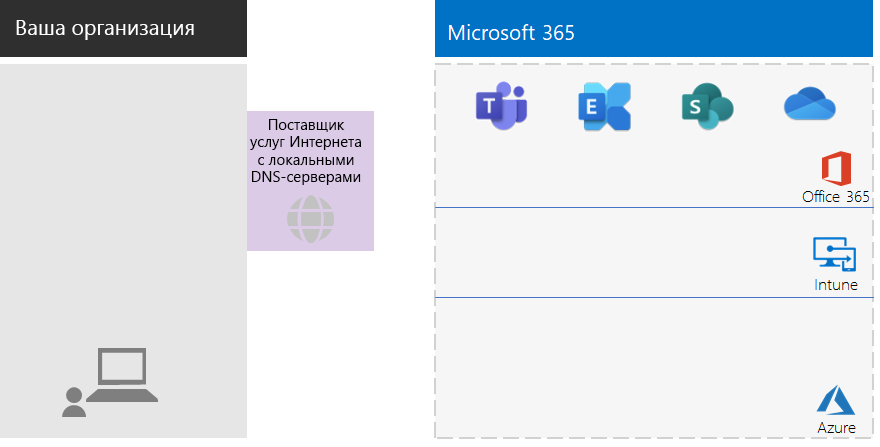

## Этап 2. ИдентификацияPhase 2: Identity

Каждый сотрудник вашей организации должен иметь возможность войти в систему. Для этого требуется учетная запись пользователя в клиенте Azure Active Directory (Azure AD) вашей подписки Microsoft 365 для предприятий.Each employee of your organization must be able to sign in, which requires a user account in the Azure Active Directory (Azure AD) tenant of your Microsoft 365 for enterprise subscription. Для размещения учетных записей используются группы. Другие группы используются для общения и для получения доступа к разрешенным ресурсам, например к сайтам SharePoint Online или к команде.Groups are then used to contain user accounts and other groups to communicate or gain access to permissioned resources, such as a SharePoint Online site or a team. 

### Учетные записи администратораAdministrator accounts

Для защиты учетных записей глобальных администраторов необходимо включить требование стойких паролей и многофакторной проверки подлинности (MFA).Protect your global administrator user accounts by requiring strong passwords and multi-factor authentication (MFA). Дополнительные сведения см. в статье [Защита учетных записей глобальных администраторов](identity-create-protect-global-admins.md#protect-global-administrator-accounts).See [Protect global administrator accounts](identity-create-protect-global-admins.md#protect-global-administrator-accounts) for more information.

Если в вашей организации требуется высокий уровень безопасности и вы используете Microsoft 365 E5, используйте службу Privileged Identity Management в Azure AD, чтобы включить предоставление своевременного доступа администраторам.If your organization requires high security and you have Microsoft 365 E5, use Azure AD Privileged Identity Management to enable just-in-time administrator access. Дополнительные сведения см. в статье [Настройка глобальных администраторов по требованию](identity-create-protect-global-admins.md#identity-pim).See [Set up on-demand global administrators](identity-create-protect-global-admins.md#identity-pim) for more information.

### Рекомендации для группRecommendations for groups

Если у вас есть локальный домен AD DS, используйте эти группы в Microsoft 365 для предприятий в качестве групп в Azure AD.If you have an on-premises AD DS domain, continue to use those groups in Microsoft 365 for enterprise as groups in Azure AD.

Если у вас нет локального домена AD DS, создайте группы безопасности в Azure AD со следующими уровнями безопасности.If you don’t have an on-premises AD DS domain, create security groups in Azure AD using these levels of security.

| Уровень безопасностиSecurity level | ОписаниеDescription | ПримерыExamples |
|:-------|:-----|:-----|
| БазовыйBaseline | Это минимальный стандарт по умолчанию, используемый для защиты данных и удостоверений устройств, обращающихся к данным.This is a minimum and default  standard for protecting data and the identities and devices that access your data.    Этот уровень используется для большей части данных организации, находящихся под управлением большей части пользователей.This is typically most of your organization’s data managed by most of your users. | Группы для рядовых сотрудников, включая направления продаж, маркетинга, поддержки, администрирования и производства.Groups for first line workers, such as sales, marketing, support, administration, and manufacturing. |
| КонфиденциальныйSensitive | На этом уровне обеспечивается дополнительная безопасность для данных, которым требуется более надежная защита по сравнению с базовым уровнем.This is additional protection for a subset of your data that must be protected beyond the baseline level. В состав этих групп входят пользователи, которые используют и создают конфиденциальные данные, относящиеся к отделам и проектам, не предназначенным для всеобщего доступа.These groups contain users that use and create sensitive data that is specific to departments and projects that are not meant to be available to everyone. | Группы продуктов и маркетинга, занимающиеся разработкой будущих продуктовProduct or marketing teams that are developing future products |
| Строго контролируемыйHighly regulated | Это высший уровень защиты, обычно он требуется для относительно небольшого объема строго засекреченных данных, относящихся к интеллектуальной собственности или к коммерческим тайнам. Также этот уровень необходим для данным, для которых обязательно выполнение требований безопасности.This is the highest level of protection for a typically small amount of data that is highly classified, considered intellectual property or trade secrets, or data that must adhere to security regulations. |  Исследовательские, юридические и финансовые группы, а также группы, в которых хранятся или используются данные по клиентам или партнерам.Research, legal, and financial teams, or teams storing or using customer or partner data. |
||||

### Гибридная идентификацияHybrid identity

Если у вас есть локальный домен AD DS, необходимо синхронизировать набор учетных записей пользователей, групп и контактов вашего домена с клиентом Azure AD вашей подписки Microsoft 365 для предприятий.If you have an on-premises AD DS domain, you need to synchronize the set of user accounts, groups, and contacts of your domain with the Azure AD tenant of your Microsoft 365 for enterprise subscription. Для ваших некорпоративных пользователей настройте Azure AD Connect на сервере с синхронизацией хэша паролей (PHS).For your non-enterprise, you configure Azure AD Connect on a server with password hash synchronization (PHS). Дополнительные сведения см. в разделе [Синхронизация удостоверений](identity-add-user-accounts.md#synchronize-identities-for-hybrid-identity).See [Synchronize identities](identity-add-user-accounts.md#synchronize-identities-for-hybrid-identity) for more information.

### Более безопасный доступ пользователей с помощью политик условного доступаMore secure user access with Conditional Access policies

Azure AD проверяет условия входа пользователей и может задействовать политики условного доступа, чтобы предоставить или запретить доступ, а также требовать выполнения дальнейших действий для завершения входа.Azure AD evaluates the conditions of user sign-ins and can use Conditional Access policies to grant or deny access and impose further actions that must be taken to complete the sign-in. Например, если служба Azure AD определит, что вход происходит в условиях среднего или высокого риска, она может потребовать, чтобы пользователь прошел многофакторную проверку подлинности для завершения входа.For example, if Azure AD determines that the sign-in is happening under medium or high-risk conditions, it can require the user to perform MFA to complete the sign-in.

Политики условного доступа применяются к учетным записям пользователей или группам.You apply Conditional Access policies to user accounts or groups. Чтобы упростить назначение политик условного доступа, создайте в организации следующие группы безопасности AD:To facilitate an easier assignment of Conditional Access policies, create these Azure AD security groups in your organization:

- BASELINEBASELINE

  Содержит группы и учетные записи пользователей с доступом к базовым данным.Contains the groups or user accounts for users with access to baseline data.

- SENSITIVESENSITIVE

  Содержит группы и учетные записи пользователей с доступом к конфиденциальным данным.Contains the groups or user accounts for users with access to sensitive data.

- HIGHLY-REGULATEDHIGHLY-REGULATED

  Содержит группы или учетные записи пользователей с доступом к строго контролируемым данным.Contains the groups or user accounts for users with access to highly regulated data.

- COND-ACCESS-EXCLUDECOND-ACCESS-EXCLUDE

  Пустая группа, которую можно использовать, чтобы временно исключать пользователей из политик условного доступа.An empty group that you can use to temporarily exclude a user from Conditional Access policies.

Ниже приведен список политик условного доступа Azure AD, которые следует включить или создать.Here is the list of Azure AD Conditional Access policies to enable or create.

| Политика условного доступа Azure ADAzure AD Conditional Access policy | Группы, к которым применяется эта политикаGroups to which it applies |
|:------|:-----|
| Базовая политика: требовать многофакторную проверку подлинности для администраторовBaseline policy: Require MFA for admins | Эта политика применяется к ролям администраторов, поэтому нет необходимости создавать группы.This policy applies to admin roles, so no groups need to be specified. Эту политику просто нужно включить.This policy just needs to be enabled. Все остальные политики необходимо создать и включить.All subsequent policies need to be created and enabled. |
| Блокировать клиенты, не поддерживающие современную проверку подлинностиBlock clients that don't support modern authentication | В параметрах политики выберите "Все пользователи".Select “All users” in the policy settings. |
| Требовать многофакторную проверку подлинности при среднем или высоком риске входа (требуется Microsoft 365 E5)Require MFA when sign-in risk is medium or high (requires Microsoft 365 E5) | BASELINEBASELINE |
| Требовать многофакторную проверку подлинности при среднем или высоком риске входа (требуется Microsoft 365 E5)Require MFA when sign-in risk is low, medium, or high (requires Microsoft 365 E5) | SENSITIVESENSITIVE |
| Всегда требовать многофакторную проверку подлинностиAlways require MFA | HIGHLY-REGULATEDHIGHLY-REGULATED |
| Требовать использования одобренных приложений на устройствах с iOS и AndroidRequire approved apps on iOS and Android devices | BASELINE, SENSITIVE, HIGHLY-REGULATEDBASELINE, SENSITIVE, HIGHLY-REGULATED |
| Требовать использования соответствующих политике компьютеровRequire compliant PCs | BASELINEBASELINE |
| Требовать использования соответствующих политике компьютеров, устройств с iOS и AndroidRequire compliant PCs and iOS and Android devices | SENSITIVE, HIGHLY-REGULATEDSENSITIVE, HIGHLY-REGULATED |
|||

Здесь нужно создать и включить политику риска пользователей в службе защиты идентификации Azure AD (требуется Microsoft 365 E5)Here is the Azure AD Identity Protection (requires Microsoft 365 E5) user risk policy to create and enable.

| Политика риска пользователя в службе защиты идентификации Azure ADAzure AD Identity Protection user risk policy | Группы, к которым применяется эта политикаGroups to which it applies |
|:------|:-----|
| Пользователи с высоким уровнем риска должны сменить парольHigh risk users must change passwords | В параметрах политики выберите "Все пользователи".Select “All users” in the policy settings. |
|||

Инструкции см. в статье [Основные политики идентификации и доступа для устройств](identity-access-policies.md).See [Common identity and device access policies](identity-access-policies.md) for the instructions.

### Упрощение управления с помощью группGroups for easier management

Ниже описаны некоторые функции, позволяющие упростить управление группами и лицензированием.Here are some features that can make group and licensing management easier for you.

| ФункцияFeature | ИспользованиеUse |
|:------|:-----|
| Самостоятельное управление группамиSelf-service group management | Разрешите управление группами Azure AD владельцам групп, а не ИТ-специалистам.Allow management of Azure AD groups by group owners instead of IT staff. Дополнительные сведения см. в статье [Самостоятельное управление группами](identity-use-group-management.md#allow-users-to-create-and-manage-their-own-groups).See [Self-service group management](identity-use-group-management.md#allow-users-to-create-and-manage-their-own-groups) for more information. |
| Динамическое членство в группахDynamic group membership | Настройте автоматическое добавление или удаление учетных записей пользователей из групп Azure AD на основании атрибутов учетных записей пользователей, таких как отдел или страна.Configure automatic addition or removal of user accounts from Azure AD groups based on user account attributes, such as Department or Country. Дополнительные сведения см. в статье [Динамическое членство в группах](identity-use-group-management.md#set-up-dynamic-group-membership).See [Dynamic group membership](identity-use-group-management.md#set-up-dynamic-group-membership) for more information. |
| Групповое лицензированиеGroup-based licensing | Используйте членство в группах, чтобы автоматически назначать лицензии учетным записям пользователей или отменять назначение.Use group membership to automatically assign or unassign licenses to user accounts. Дополнительные сведения см. в статье [Групповое лицензирование](identity-use-group-management.md#set-up-automatic-licensing).See [Group-based licensing](identity-use-group-management.md#set-up-automatic-licensing) for more information. |
|  |  |

При использовании группового лицензирования создайте группу с названием LICENSED. В этой группе будут содержаться имена учетных записей пользователей, которым назначается лицензия Microsoft 365 для предприятий.If you are using group-based licensing, create a group named LICENSED to contain user account names that are assigned a Microsoft 365 for enterprise license.

### Мониторинг доступа пользователейMonitor user access

Если вы используете Microsoft 365 E5, можно использовать защиту идентификации Azure AD для мониторинга и анализа попыток входа пользователей на предмет компрометации учетных данных.If you have Microsoft 365 E5, you can use Azure AD Identity Protection to monitor and analyze user sign-ins for credential compromise. Дополнительные сведения см. в статье [Защита от компрометации учетных данных](identity-secure-user-sign-ins.md#protect-against-credential-compromise).See [Protect against credential compromise](identity-secure-user-sign-ins.md#protect-against-credential-compromise) for more information.

### Конфигурация на этом этапеYour configuration so far

Вот наглядное представление этапа "Идентификация" для гибридной идентификации, на котором выделены существующие и новые элементы.Here is a visual summary of the Identity phase for hybrid identity, with existing and new elements highlighted.

 
Новые и выделенные элементы гибридной идентификации включают:The new and highlighted hybrid identity elements include:
 
|||
|:------:|:-----|
| 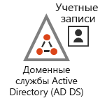 | Локальный домен AD DS с учетными записями пользователей и группами.An on-premises AD DS domain with user accounts and groups. |
| 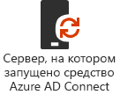 | Сервер под управлением Windows, на котором запущено решение Azure AD Connect.A Windows-based server running Azure AD Connect. |
|  | Синхронизированный набор учетных записей пользователей и групп AD DS в Azure AD.The synchronized set of AD DS user accounts and groups in Azure AD. |
|  | Параметры Azure AD для проверки подлинности, защиты глобальных учетных записей и более удобного управления группами и лицензиями.Azure AD settings for authentication, securing global accounts, and making it easier to manage groups and licenses. |
|  | Политики условного доступа Azure AD.Azure AD Conditional Access policies. |
|||

Вот наглядное представление этапа "Идентификация" для облачной идентификации, на котором выделены новые элементы.Here is a visual summary of the Identity phase for cloud-only identity, with the new elements highlighted.

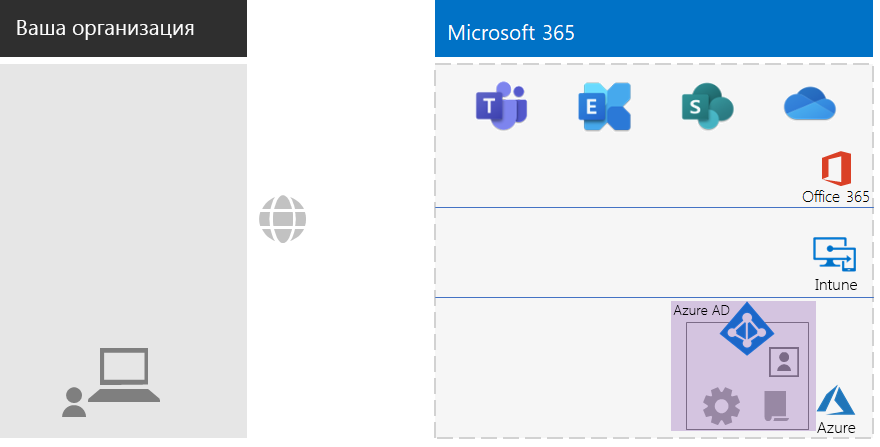
 
Новые и выделенные элементы облачной идентификации включают:The new and highlighted cloud-only identity elements include:
 
|||
|:------:|:-----|
|  | Учетные записи пользователей и группы в Azure AD.The user accounts and groups in Azure AD. |
|  | Параметры Azure AD для проверки подлинности, защиты глобальных учетных записей и более удобного управления группами и лицензиями.Azure AD settings for authentication, securing global accounts, and making it easier to manage groups and licenses. |
|  | Политики условного доступа Azure AD.Azure AD Conditional Access policies. |
|||

## Этап 3. Windows 10 КорпоративнаяPhase 3: Windows 10 Enterprise

Чтобы убедиться, что устройства с Windows 10 Корпоративная интегрированы в инфраструктуру удостоверений и безопасности Microsoft 365 для предприятий, можно использовать следующие способы:To ensure that your Windows 10 Enterprise devices are integrated into the identity and security infrastructure of Microsoft 365 for enterprise, here are your options:

- Гибридная среда (есть локальный домен AD DS)Hybrid (you have an on-premises AD DS domain)

  Все существующие устройства с Windows 10 Корпоративная, уже присоединенные к вашему домену AD DS, необходимо подключить к клиенту Azure ADFor each existing Windows 10 Enterprise device already joined to your AD DS domain, join them to the Azure AD tenant. Инструкции см. в статье [Настройка гибридных устройств, присоединенных к Azure Active Directory](https://go.microsoft.com/fwlink/p/?linkid=872870).See [How to configure hybrid Azure Active Directory joined devices](https://go.microsoft.com/fwlink/p/?linkid=872870) for the instructions.

  Все новые устройства с Windows 10 Корпоративная необходимо присоединить к домену AD DS, а затем присоединить к клиенту Azure AD.For each new Windows 10 Enterprise device, join them to your AD DS domain, and then join them to the Azure AD tenant.

  Все устройства с Windows 10 Корпоративная необходимо зарегистрировать в службе управления мобильными устройствами.For each Windows 10 Enterprise device, enroll them for mobile device management. Инструкции см. в статье [Регистрация устройств с Windows 10 в Intune с помощью групповой политики](https://go.microsoft.com/fwlink/p/?linkid=872871).See [Enroll a Windows 10 device with Intune by using a Group Policy](https://go.microsoft.com/fwlink/p/?linkid=872871) for the instructions.

- Только облачная среда (нет локального домена AD DS)Cloud-only (you do not have an on-premises AD DS domain)

  Присоедините каждое устройство с Windows 10 Корпоративная к клиенту Azure AD своей подписки.Join each Windows 10 Enterprise device to the Azure AD tenant of your subscription.

  Дополнительные сведения см. в статье [Присоединение рабочего устройства к сети организации](https://docs.microsoft.com/azure/active-directory/user-help/user-help-join-device-on-network).See [Join your work device to your organization's network](https://docs.microsoft.com/azure/active-directory/user-help/user-help-join-device-on-network) for more information.

После установки и присоединения на все устройства с Windows 10 Корпоративная будут автоматически устанавливать устанавливаться обновления из облачной службы Центра обновления Windows для бизнеса.Once installed and joined, each Windows 10 Enterprise device automatically installs updates from the Windows Update for Business cloud service. В некорпоративных организациях обычно не нужно настраивать инфраструктуру для распространения и установки обновлений Windows 10.There is typically no need in a non-enterprise organization to set up an infrastructure to distribute and install Windows 10 updates.

### Конфигурация на этом этапеYour configuration so far

Вот наглядное представление этапа развертывания Windows 10 Корпоративная, на котором выделены новые элементы.Here is a visual summary of the Windows 10 Enterprise phase with the new elements highlighted.

 
Новые и выделенные элементы этапа "Windows 10 Корпоративная" включают:The new and highlighted Windows 10 Enterprise elements include:

|||
|:------:|:-----|
|  | ОС Windows 10 Корпоративная установлена на устройствах с Windows, например, на локальном ноутбуке.Windows 10 Enterprise installed on Windows devices, with an on-premises laptop as an example. |
| 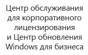 | Центр обслуживания корпоративного лицензирования предоставляет образы для новой установки Windows 10 Корпоративная; служба Центра обновления Windows для бизнеса предоставляет последние обновления.The Volume Licensing Service Center, which provides images for new installations of Windows 10 Enterprise, and the Windows Update for Business service, which provides the latest updates. |
|||

## Этап 4. Office 365 профессиональный плюсPhase 4: Office 365 ProPlus

В состав Microsoft 365 для предприятий входит Office 365 профессиональный плюс — версия Microsoft Office, доступная по подписке.Microsoft 365 for enterprise includes Office 365 ProPlus, the subscription version of Microsoft Office. Office 365 профессиональный плюс, как и Office 2016 или Office 2019, устанавливается непосредственно на клиентских устройствах.Like Office 2016 or Office 2019, Office 365 ProPlus is installed directly on your client devices. При этом Office 365 профессиональный плюс получает обновления, регулярно включающие новые функции.However, Office 365 ProPlus receives updates that include new features on a regular basis. Дополнительные сведения см. в статье [Office 365 профессиональный плюс на предприятии](https://docs.microsoft.com/deployoffice/about-office-365-proplus-in-the-enterprise).See [About Office 365 ProPlus in the enterprise](https://docs.microsoft.com/deployoffice/about-office-365-proplus-in-the-enterprise) for more information.

В некорпоративной организации необходимо вручную установить Office 365 профессиональный плюс на устройствах, в том числе устройствах с Windows, iOS и Android.For your non-enterprise organization, you manually install Office 365 ProPlus on devices, which can include Windows, iOS, and Android devices. Это можно сделать при подготовке новых устройств к использованию, также это могут сделать пользователи в процессе перехода на новую инфраструктуру.This can be done as part of preparing a new device for use, or by the user as part of their onboarding process.

Как бы то ни было, администратор или пользователь входят на портал Office 365 в https://portal.office.com.In either case, the administrator or the user signs in to the Office 365 portal at https://portal.office.com. На **главной вкладке Microsoft Office** щелкните **Установить Office** и пройдите все шаги процесса установки.On the **Microsoft Office Home** tab, click **Install Office** and step through the installation process.

Обновления компонентов Office 365 профессиональный плюс ежемесячно устанавливаются на все компьютеры, на которых установлен этот пакет.Feature updates to Office 365 ProPlus are downloaded monthly by each computer on which it is installed. В некорпоративных организациях обычно не нужно настраивать инфраструктуру для распространения и установки обновлений Office 365 профессиональный плюс.There is typically no need in a non-enterprise organization to set up an infrastructure to distribute Office 365 ProPlus updates. 

### Конфигурация на этом этапеYour configuration so far

Вот наглядное представление этапа развертывания Office 365 профессиональный плюс, на котором выделены новые элементы.Here is a visual summary of the Office 365 ProPlus phase with the new elements highlighted.

 
Новые и выделенные элементы этапа "Office 365 профессиональный плюс" включают:The new and highlighted Office 365 ProPlus elements include:
 
|||
|:------:|:-----|
|  | Пакет Office 365 профессиональный плюс установлен на устройствах, например, на локальном ноутбуке.Office 365 ProPlus installed on devices, with an on-premises laptop as an example. |
|  | Устройства обращаются в сеть доставки содержимого Office (CDN) для Office 365 профессиональный плюс, чтобы получать обновления для Office 365 профессиональный плюс.The Office Content Delivery Network (CDN) for Office 365 ProPlus, which devices access for Office 365 ProPlus updates. |
|||

## Этап 5. Управление мобильными устройствамиPhase 5: Mobile device management

Microsoft 365 для предприятий включает Microsoft Intune для управления мобильными устройствами.Microsoft 365 for enterprise includes Microsoft Intune for mobile device management. С помощью Intune можно управлять устройствами с Windows, iOS, Android и macOS, чтобы защитить ресурсы организации, включая данные.With Intune, you can manage Windows, iOS, Android, and macOS devices to protect access to your organization's resources, including your data. В Intune используются учетные записи пользователей, групп и компьютеров в Azure AD.Intune uses the user, group, and computer accounts of Azure AD.

В Intune поддерживается два способа управления мобильными устройствами:Intune provides two types of mobile device management:

- Управление мобильными устройствами (MDM) при регистрации устройств в Intune.Mobile device management (MDM) is when devices get enrolled in Intune. После регистрации эти устройства становятся управляемыми, они могут получать политики, правила и параметры, используемые в вашей организации.Once enrolled, they are managed devices and can receive the policies, rules, and settings used by your organization. Как правило, такие устройства принадлежат вашей организации и выдаются сотрудникам.These types of devices are typically owned by your organization and issued to your employees.

- Пользователи со своими собственными личными устройствами могут не желать регистрировать эти устройства или разрешать управление своими устройствами системе Intune с вашими политиками и параметрами.Users with their own personal devices may not want to enroll their devices or be managed by Intune with your policies and settings. Тем не менее, вам все равно нужно защитить ресурсы и данные организации.However, you still need to protect your organization's resources and data. В этом случае вы можете защитить свои приложения с помощью управления мобильными приложениями (MAM).For this scenario, you can protect your apps with mobile application management (MAM).  

Политики Intune могут обеспечить соответствие устройств требованиям и защиту приложений.Intune policies can enforce device compliance and app protection. Вот список политик Intune, которые необходимо создать.Here is the list of Intune policies to create.

| Политики IntuneIntune policies | Группы, к которым применяется эта политикаGroups to which it applies |
|:------|:-----|
| Политика соответствия устройства требованиям для WindowsDevice compliance policy for Windows | BASELINE, SENSITIVE, HIGHLY-REGULATEDBASELINE, SENSITIVE, HIGHLY-REGULATED |
| Политика соответствия устройства требованиям для iOSDevice compliance policy for iOS | SENSITIVE, HIGHLY-REGULATEDSENSITIVE, HIGHLY-REGULATED |
| Политика соответствия устройства требованиям для macOSDevice compliance for macOS | SENSITIVE, HIGHLY-REGULATEDSENSITIVE, HIGHLY-REGULATED |
| Политика соответствия устройства требованиям для Android и Android EnterpriseDevice compliance policy for Android and Android Enterprise | SENSITIVE, HIGHLY-REGULATEDSENSITIVE, HIGHLY-REGULATED |
| Политика защиты приложений для iOSApp protection policy for iOS | BASELINE, SENSITIVE, HIGHLY-REGULATEDBASELINE, SENSITIVE, HIGHLY-REGULATED |
| Политика защиты приложений для macOSApp protection policy for macOS | BASELINE, SENSITIVE, HIGHLY-REGULATEDBASELINE, SENSITIVE, HIGHLY-REGULATED |
| Политика защиты приложений для Android и Android EnterpriseApp protection policy for Android and Android Enterprise | BASELINE, SENSITIVE, HIGHLY-REGULATEDBASELINE, SENSITIVE, HIGHLY-REGULATED |
|||
    
Инструкции см. в статье [Основные политики идентификации и доступа для устройств](identity-access-policies.md).See [Common identity and device access policies](identity-access-policies.md) for the instructions.

### Конфигурация на этом этапеYour configuration so far

Вот наглядное представление этапа "Управление мобильными устройствами", на котором выделены новые элементы.Here is a visual summary of the Mobile Device Management phase with the new elements highlighted.

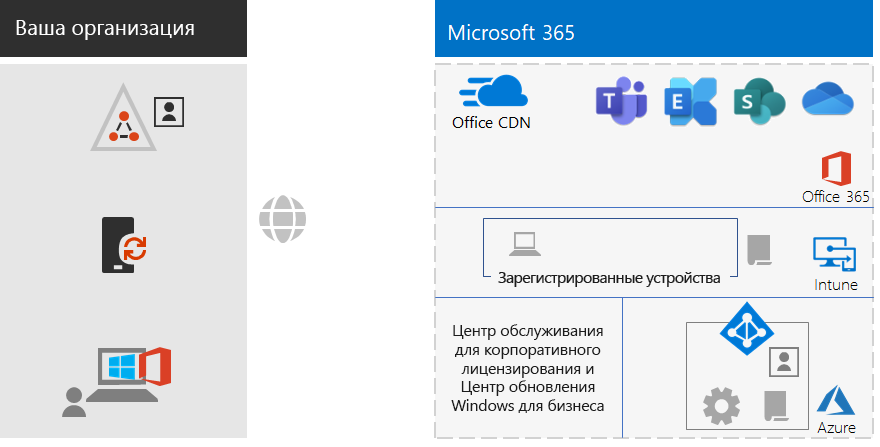
 
Новые и выделенные элементы этапа "Управление мобильными устройствами" включают:The new and highlighted mobile device management elements include:

|||
|:------:|:-----|
| 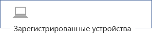 | Устройства, зарегистрированные в Intune: в качестве примера показан локальный ноутбук под управлением Windows 10 Корпоративная.Devices that are enrolled in Intune, showing an on-premises laptop running Windows 10 Enterprise as an example. |
|  | Политики Intune для обеспечения соответствия устройств и защиты приложений.Intune policies for device compliance and app protection. |
|||

## Этап 6. Защита данныхPhase 6: Information protection

В Microsoft 365 для предприятий предусмотрен целый ряд функций защиты информации, с помощью которых можно по-разному классифицировать данные, применяя к ним различные уровни управления, безопасности и защиты.Microsoft 365 for enterprise has a host of information protection features that allow you to treat classifications of data differently by applying different levels of governance, security, and protection. 

Например, для обычной переписки большинства сотрудников и для документов, над которыми работают эти сотрудники, требуется некоторый базовый уровень защиты.For example, normal correspondence between most employees and the documents on which they work need a certain baseline level of protection. Для финансовых записей, данных о клиентах и интеллектуальной собственности требуется более высокий уровень защиты.Financial records, customer data, and your intellectual property need a higher level of protection.

Первый шаг в стратегии защиты информации состоит в определении уровней защиты.The first step to an information protection strategy is to determine the levels of protection. Во многих организациях используются следующие уровни, которые уже применяются для политик условного доступа:Many organizations use these levels, which are already being used for Conditional Access policies:

- БазовыйBaseline

  Примеры данных: обычная деловая переписка (электронная почта) и файлы администраторов, специалистов по продажам и сотрудников службы поддержки.Examples include normal business communications (email) and files for administrative, sales, and support workers.

- КонфиденциальныйSensitive

  Примеры данных: финансовые и юридические сведения, данные об исследованиях и разработке новых продуктов или услуг.Examples include financial and legal information and research and development data for new products or services.

- Строго контролируемыйHighly regulated

  Примеры данных: личные сведения ваших клиентов и партнеров, интеллектуальная собственность или стратегические планы вашей организации.Examples include customer and partner personally identifiable information and your organization’s strategic plans or intellectual property.

На основе этих уровней безопасности необходимо определить и применить:Based on these levels of data security, the next step is to identify and implement:

- Пользовательские типы конфиденциальной информацииCustom sensitive information types

  В Microsoft 365 предусмотрен широкий набор типов конфиденциальной информации, например, номера медицинского страхования или номера кредитных карт.Microsoft 365 supplies a wide selection of sensitive information types, such as health service and credit card numbers. Если в предоставленном списке нет нужного вам типа информации, можно создать собственный тип.If you do not find one that you need in the supplied list, you can create your own.

- Метки храненияRetention labels

  Необходимо определить, как долго следует хранить документы определенных типов или с определенным содержимым в соответствии с правилами организации и региональными нормативными требованиями.To comply with organization policies and regional regulations, you might have to specify how long specific types of documents or documents with specific contents should be retained. Это задачу можно решить для электронной почты и документов с помощью меток хранения.You can implement this for email and documents using retention labels. Метки хранения также можно использовать совместно с политиками защиты от потери данных, которые могут ограничивать общий доступ к файлам или электронной почте за пределами организации.Retention labels can also be used in conjunction with Data Loss Prevention (DLP) policies that can restrict the sharing of files or email outside your organization.

- Метки конфиденциальностиSensitivity labels

  Можно помечать сообщения электронной почты и документы, используя именованные метки конфиденциальности, чтобы можно было применять дополнительные уровни безопасности.You can label email or documents with a named sensitivity label so that additional levels of security can be applied. Это могут быть водяные знаки, шифрование и разрешения, указывающие, кому разрешен доступ к электронной почте или документу, и какие действия разрешены.Examples are watermarks, encryption, and permissions, which specify who is allowed to access the email or document and what they are allowed to do.

Дополнительные сведения см. в статье [Типы классификации Microsoft 365](infoprotect-configure-classification.md#microsoft-365-classification-types).See [Microsoft 365 classification types](infoprotect-configure-classification.md#microsoft-365-classification-types) for more information.

Если вы используете метки конфиденциальности с разрешениями, можно создать дополнительные группы безопасности Office 365, чтобы определить, каким пользователям доступны те или иные действия с электронной почтой и документами с примененными метками конфиденциальности.If you use sensitivity labels with permissions, you might have to create additional Office 365 security groups to define who is allowed to do what with email and documents that have the sensitivity label applied. 

Например, нужно создать метку конфиденциальности RESEARCH, чтобы защитить электронную почту и документы исследовательской группы.For example, you need to create a RESEARCH sensitivity label to protect the email and documents of your research team. Вы определяете, что:You determine that:

- Исследователи должны иметь возможность изменения документов, помеченных меткой конфиденциальности RESEARCH.Researchers must have the ability to change documents marked with the RESEARCH sensitivity label.
- Сотрудники, не связанные с исследовательской деятельностью, должны иметь только возможность просмотра документов, помеченных меткой конфиденциальности RESEARCH.Non-research employees only need to have the ability to view documents marked with the RESEARCH sensitivity label. 

Это означает, что нужно создать и настроить еще две дополнительные группы Office 365:This means you need to create and manage two additional Office 365 groups:

- RESEARCH-ALLRESEARCH-ALL
- RESEARCH-VIEWRESEARCH-VIEW

Эти группы и их разрешения входит в состав конфигурации метки конфиденциальности RESEARCH.These groups and their permissions become part of the RESEARCH sensitivity label's configuration.

Если метки конфиденциальности настроены с групповыми разрешениями, необходимо управлять членством в этих группах.For sensitivity labels configured with group-based permissions, you must manage the membership of these groups.

### Конфигурация на этом этапеYour configuration so far

Вот наглядное представление этапа "Защита информации", на котором выделены новые элементы.Here is a visual summary of the Information Protection phase with the new elements highlighted.

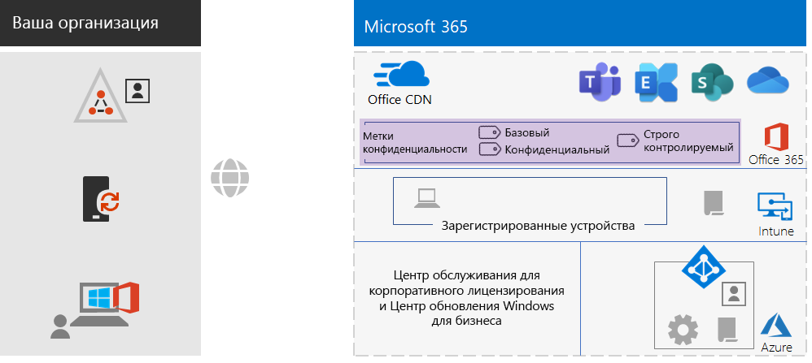
 
Новые и выделенные элементы этапа "Защита информации" включают:The new and highlighted information protection elements include:
 
|||
|:------:|:-----|
| 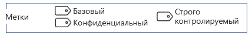 | Метки конфиденциальности для трех уровней безопасности, применяемых пользователями к документам и электронной почте.Sensitivity labels for the three levels of security that users can apply to documents and email. |
|||

Пользовательские типы данных и метки хранения не показаны.Custom information types and retention labels are not shown.

## АдаптацияOnboarding

Благодаря инфраструктуре Microsoft 365 для предприятий вы можете легко осуществить адаптацию новых сотрудников.With your Microsoft 365 for enterprise infrastructure in place, you can easily onboard your employees.

### Новое устройство с Windows 10 КорпоративнаяA new Windows 10 Enterprise device

Перед выдачей сотруднику нового устройства с Windows 10 Корпоративная:Before giving an employee a new Windows 10 Enterprise device:

- Если используется гибридная идентификацияFor hybrid identity

  Подключите устройство к домену AD DS, присоедините устройство к клиенту Azure AD, затем зарегистрируйте устройство в Intune.Join the device to your AD DS domain, join the device to your Azure AD tenant, and then enroll the device in Intune.

- Если используется только облачная идентификацияFor cloud-only identity

  Подключите устройство к клиенту AD DS.Join the device to your Azure AD tenant.

### Существующий сотрудник с учетной записью пользователя AD DSExisting employee with an AD DS user account

При первоначальном переходе вашей организации, если используется гибридная идентификация, добавьте учетную запись пользователя AD DS в следующие группы Azure AD:As part of the initial onboarding for your organization when using hybrid identity, add the AD DS user account to these Azure AD groups:

- LICENSEDLICENSED
- Соответствующие группы безопасности AD DS или Azure AD, являющиеся участниками групп BASELINE, SENSITIVE и HIGHLY-REGULATED в Azure ADThe appropriate AD DS or Azure AD security groups that are members of the BASELINE, SENSITIVE, and HIGHLY-REGULATED Azure AD groups
- Группы меток конфиденциальности (по мере необходимости)Sensitivity label groups (as needed)

Существующий сотрудник уже должен быть уже добавлен в соответствующие группы AD DS на уровне рабочих групп, отделов и регионов.The existing employee should already be added to the appropriate workgroup, departmental, and regional AD DS groups.

В центре администрирования Microsoft 365 можно добавить учетную запись пользователя для нескольких групп Azure AD.You can add a user account to multiple Azure AD groups in the Microsoft 365 admin center. В окне свойств учетной записи пользователя щелкните **Управление группами > Добавление членства в группах**.From the properties of the user account, click **Manage groups > Add memberships**.

Если вы хотите использовать оболочку PowerShell, см данную [загружаемую книгу Excel](https://github.com/MicrosoftDocs/microsoft-365-docs/raw/public/microsoft-365/enterprise/media/deploy-foundation-infrastructure-non-enterprises/Group-License-Mgmt-PowerShell.xlsx), которая создает команды PowerShell на основе указанной учетной записи пользователя и выбранных имен групп.If you want to use PowerShell, see this [downloadable Excel workbook](https://github.com/MicrosoftDocs/microsoft-365-docs/raw/public/microsoft-365/enterprise/media/deploy-foundation-infrastructure-non-enterprises/Group-License-Mgmt-PowerShell.xlsx), which generates the PowerShell commands based on a specified user account and selected group names.

### Новый сотрудник с полностью облачной учетной записьюNew employee with a cloud-only user account

При первоначальном переходе вашей организации, если используется только облачная идентификация, добавьте учетную запись нового пользователя в следующие группы:As part of the initial onboarding for your organization when using cloud-only identity, add the new user account to these groups:

- LICENSEDLICENSED
- Соответствующие группы безопасности Azure AD, являющиеся участниками групп BASELINE, SENSITIVE и HIGHLY-REGULATED в Azure ADThe appropriate Azure AD security groups that are members of the BASELINE, SENSITIVE, and HIGHLY-REGULATED Azure AD groups
- Группы на уровне рабочих групп, отделов и регионовWorkgroup, departmental, and regional groups
- Группы меток конфиденциальности (по мере необходимости)Sensitivity label groups (as needed)

### Начальный вход в Microsoft 365Initial sign-in to Microsoft 365

Когда сотрудники впервые входят в Microsoft 365, попросите их:For the first time employees sign in to Microsoft 365, instruct them to:

1. Войти на свои устройства с помощью учетных данных своих учетных записей пользователей.Sign into their devices with their user account credentials.
2. В веб-браузере войти на портал Office 365 по адресу https://portal.office.com.Using a browser, sign in to the Office 365 portal at https://portal.office.com.
3. На **главной вкладке Office 365** щелкнуть **Установить Office**, чтобы установить Office 365 профессиональный плюс на свои устройства.From the **Office 365 Home** tab, click **Install Office** to install Office 365 ProPlus on their device.

## Итоговые результатыEnd results

Ниже приведены результаты настройки базовой инфраструктуры Microsoft 365 для предприятий для некорпоративной организации.Here are the results of configuring the Microsoft 365 for enterprise foundation infrastructure for your non-enterprise organization.

### Результаты для инфраструктурыInfrastructure results

После построения и настройки инфраструктуры Microsoft 365 для предприятий у вас должно быть следующее:After the build-out and configuration of your Microsoft 365 for enterprise infrastructure, you should have:

- Локальное подключение к Интернету в каждом офисе с достаточной пропускной способностью. Такое подключение предоставляется поставщиком услуг Интернета, использующим локальный DNS-сервер для этого региона.A local Internet connection for each of your offices with sufficient bandwidth supplied by an ISP that uses a regionally local DNS server.
- При использовании гибридной идентификации служба Azure AD Connect должна работать на сервере, который синхронизирует ваш локальный домен AD DS с вашим клиентом Azure AD.For hybrid identity, Azure AD Connect running on a server that synchronizes your on-premises AD DS domain with your Azure AD tenant.
- Следующие группы:These groups:
  - LICENSEDLICENSED
  - COND-ACCESS-EXCLUDECOND-ACCESS-EXCLUDE
  - Соответствующие группы безопасности AD DS или Azure AD, также являющиеся участниками групп BASELINE, SENSITIVE и HIGHLY-REGULATED в Azure ADThe appropriate AD DS or Azure AD security groups that are also members of the BASELINE, SENSITIVE, and HIGHLY-REGULATED Azure AD groups 
  - Группы на уровне рабочих групп, отделов и регионовWorkgroup, departmental, and regional groups
  - Группы меток конфиденциальности Office 365 (по мере необходимости)Sensitivity label Office 365 groups (as needed)
- Политики условного доступа для входа в Azure AD, использующие группы BASELINE, SENSITIVE, HIGHLY-REGULATED и COND-ACCESS-EXCLUDE в Azure AD.Azure AD sign-in Conditional Access policies that use the BASELINE, SENSITIVE, and HIGHLY-REGULATED, and COND-ACCESS-EXCLUDE Azure AD groups.
- Политики соответствия устройств и приложений требованиям в Intune.Intune application and device compliance policies.
- Пользовательские типы конфиденциальной информации (по мере необходимости).Custom sensitive information types (as needed).
- Метки хранения (по мере необходимости).Retention labels (as needed).
- Метки конфиденциальности (по мере необходимости).Sensitivity labels (as needed).

Вот наглядное сводное представление инфраструктуры, если в организации используется гибридная идентификация, включающая ваш домен AD DS, сервер Azure AD Connect и синхронизированных пользователей и группы AD DS.Here is a visual summary of the infrastructure if your organization uses hybrid identity, which includes your AD DS domain, an Azure AD Connect server, and synchronized AD DS users and groups.

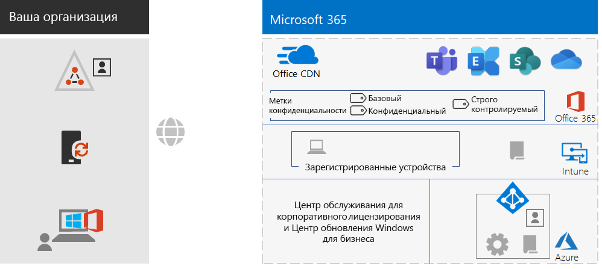
 
Вот наглядное сводное представление инфраструктуры, если организация использует только облачную идентификацию.Here is a visual summary of the infrastructure if your organization uses cloud-only identity.
 
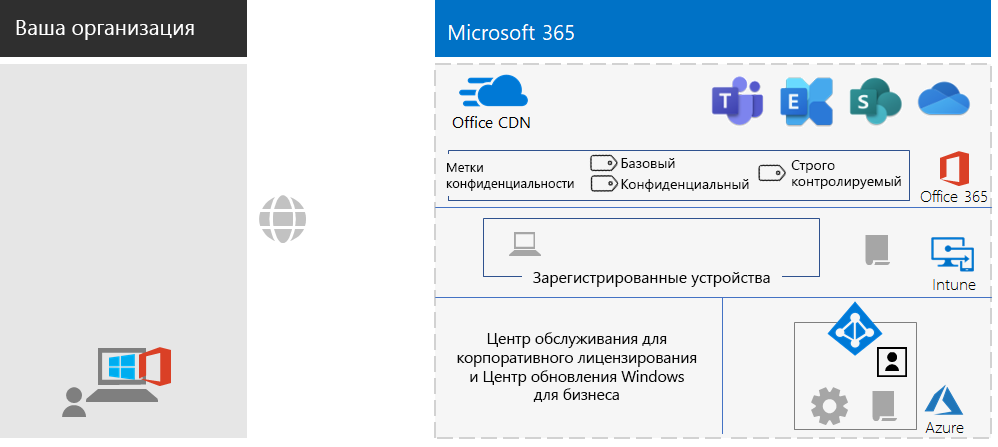

### Результаты для сотрудниковEmployee results

После перехода на новую инфраструктуру у каждого сотрудника должно быть следующее:After their onboarding, each employee should have:

- Высокоскоростной локальный сетевой канал, соединяющий используемое устройство с облачными службами Microsoft 365 в этом регионе.A performant, on-premises network path from their device to the Microsoft 365 cloud services in their region.
- Учетная запись, являющаяся участником следующих групп:A user account with these group memberships:
   - LICENSEDLICENSED
   - Соответствующие группы безопасности AD DS или Azure AD, также являющиеся участниками групп BASELINE, SENSITIVE и HIGHLY-REGULATED в Azure AD для политик условного доступаThe appropriate AD DS or Azure AD security groups, which are also members of the BASELINE, SENSITIVE, and HIGHLY-REGULATED Azure AD groups for Conditional Access policies 
   - Соответствующие группы на уровне рабочих групп, отделов и регионовThe appropriate workgroup, departmental, and regional groups
   - Группы меток конфиденциальности Office 365 (по мере необходимости)Sensitivity label Office 365  groups (as needed)
- Новое устройство с Windows 10 Корпоративная, при этом:A Windows 10 Enterprise device that:
   - Это устройство присоединено к клиенту Azure AD (только облачное решение) или одновременно к клиенту Azure AD и к вашему домену AD DS (гибридное решение).Is joined to the Azure AD tenant (cloud-only) or to both the Azure AD tenant and your AD DS domain (hybrid).
   - Это устройство автоматически обновляется, получая последние улучшения продукта и улучшения безопасности Windows 10 Корпоративная.Automatically updates itself with the latest Windows 10 Enterprise product improvements and security enhancements.
   - На это устройство установлен пакет Office 365 профессиональный плюс, который автоматически обновляется, получая последние улучшения продукта и улучшения безопасности Office.Has Office 365 ProPlus installed, which automatically updates itself with the latest Office product improvements and security enhancements.
   - Это устройство зарегистрировано в Intune и подчиняется политикам соответствия устройств и политикам защиты приложений в Intune.Is enrolled in Intune and subject to Intune device compliance policies and app protection policies.

## Следующий шагNext step

Развертывание [нагрузок и сценариев](deploy-workloads.md) с использованием возможностей и конфигурации базовой инфраструктуры Microsoft 365 для предприятий.Deploy your [workloads and scenarios](deploy-workloads.md) to take advantage of the features and configuration of your Microsoft 365 for enterprise foundation infrastructure.
