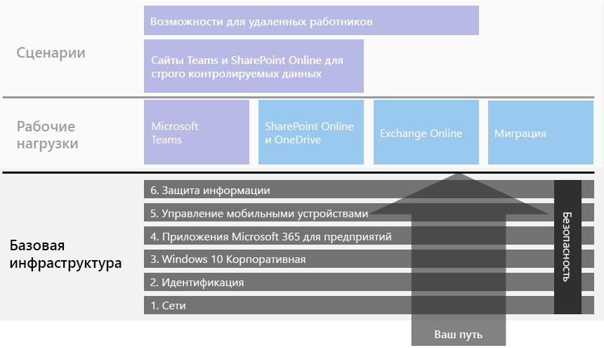
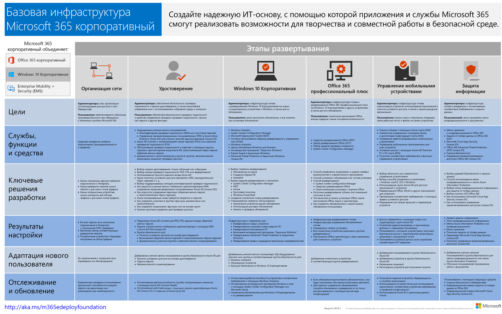

# Базовая инфраструктура Microsoft 365 для предприятий

Если вы выполняете полное развертывание Microsoft 365 для предприятий самостоятельно, понадобится надежная основа, на которой приложения и службы помогут раскрыть творческий потенциал и обеспечат командную работу в безопасной среде. Такая основа также называется *базовым развертыванием*.

Чтобы разработать четкий путь полного развертывания, используйте следующие этапы планирования и развертывания базовой инфраструктуры Microsoft 365 для предприятий:

| | Этап | Результаты |
|:-------|:-----|:-----|
||[Этап 1. Сеть](networking-infrastructure.md)| Сеть оптимизирована для доступа к облачным службам Microsoft 365. |
||[Этап 2. Идентификация](identity-infrastructure.md)| Учетные записи администраторов защищены, пользователи и группы, синхронизированы, а проверка подлинности пользователя обладает высокой надежностью. |
||[Этап 3. Windows 10 Корпоративная](windows10-infrastructure.md)| На действующих компьютерах под управлением Windows операционную систему можно обновить до Windows 10 Корпоративная, а на новых устройствах сразу устанавливается Windows 10 Корпоративная. |
||[Этап 4. Office 365 профессиональный плюс](office365proplus-infrastructure.md)| Для существующих пользователей можно обновить лицензию Microsoft Office до Office 365 профессиональный плюс. |
||[Этап 5. Управление мобильными устройствами](mobility-infrastructure.md)| Ваши устройства можно регистрировать и контролировать. |
||[Этап 6. Защита данных](infoprotect-infrastructure.md)| Средства безопасности Office 365 включены, а метки и политики для защиты документов и электронной почты готовы. |

Этапы начинаются с самых основных (сеть и идентификация), а затем создаются уровни параметров инфраструктуры и групп, чтобы:

- Установите самую новую и безопасную версию Windows на своих устройствах и поддерживайте ее актуальность.
- Установите самую новую версию Microsoft Office на своих устройствах и поддерживайте ее актуальность.
- Управляйте устройствами организации и доступом к приложениям.
- Защитить информацию на этих устройствах и в облаке.

Тем не менее, вы можете проявлять гибкость при настройке и развертывании этапов или шагов внутри этапов в соответствии с ИТ-ресурсы и потребностями бизнеса.

- **Если у вас небольшая или новообразованная организация**, выполняйте этапы по необходимости для методичного создания инфраструктуры. Чтобы упростить развертывание для некорпоративных организаций, щелкните [здесь](deploy-foundation-infrastructure-non-enterprises.md).

-  **В случае крупной корпорации**, смотрите на этапы как на уровни ИТ-инфраструктуры, а не заданный маршрут, и определите, как лучше всего добиться итогового соблюдения требований для каждого уровня в вашей организации.

В конце каждого этапа проверьте *критерии завершения*, включающие обязательные условия, которые должны быть соблюдены, и необязательные условия, которые следует учитывать. Критерии завершения для каждого этапа гарантируют, что локальная и облачная инфраструктура, как и полученная полная конфигурация, отвечают требованиям для развертывания Microsoft 365 для предприятий.

В этом коротком видеоролике показана структура содержимого.

> [!VIDEO https://www.microsoft.com/videoplayer/embed/RE23VRG]

Вот базовая инфраструктура в общем руководстве по развертыванию Microsoft 365 для предприятий:

## Краткий обзор

[Плакат базовой инфраструктуры Microsoft 365 для предприятий](../media/deploy-foundation-infrastructure/Microsoft365EnterpriseFoundInfra.pdf) — это основное место для просмотра следующих элементов для каждого этапа:

- Общие цели этапа для администраторов и пользователей
- Службы, функции и средства
- Ключевые решения разработки для планирования
- Результаты настройки
- Процесс адаптации нового пользователя
- Способ отслеживания и обновления

Чтобы скачать копию плаката, щелкните [здесь](https://github.com/MicrosoftDocs/microsoft-365-docs/raw/public/microsoft-365/enterprise/media/deploy-foundation-infrastructure/Microsoft365EnterpriseFoundInfra.pdf).

## Настройка инфраструктуры и развертывание пользователей

Базовая инфраструктура — это набор настроенного программного обеспечения и служб, которые позволяют пользоваться всем спектром возможностей и средств защиты, которые предлагает Microsoft 365 для предприятий. Конечная задача работы по полному развертыванию - это доступность данной инфраструктуры для всех пользователей и их устройств на базе Windows. 

Обратите внимание, что базовая инфраструктура Microsoft 365 для предприятий не зависит от развертывания программного обеспечения и служб для пользователей. ***Вы можете настроить уровни базовой инфраструктуры без развертывания этих уровней для всех пользователей.***

Вы можете настроить, протестировать и запустить элементы базовой инфраструктуры задолго до развертывания этих элементов для большинства пользователей в отделениях, регионах и подразделениях организации.

Например, вы создаете следующие параметры:

| Этап | Результаты |
|:-------|:-----|
| Удостоверение | Синхронизация учетной записи и групп для политик условного доступа на основе удостоверений. |
| Windows 10 Корпоративная | Группы автоматического обновления компьютеров под управлением Windows 7 или Windows 8.1 до Windows 10 Корпоративная на месте. |
| Office 365 профессиональный плюс | Группы автоматического развертывания Office 365 профессиональный плюс для пользователей Office 2010, Office 2013 или Office 2016. |
| Управление мобильными устройствами | Группы регистрации устройства и политик условного доступа на основе устройств. |
| Защита информации | Группы для меток конфиденциальности Office 365. |

Когда вы будете готовы развернуть элементы данной инфраструктуры для пользователей, сделайте следующее:

| Этап | Действие |
|:-------|:-----|
| Удостоверение | Добавьте учетные записи пользователей в группы для политик условного доступа на основе удостоверений. |
| Windows 10 Корпоративная | Добавьте учетные записи пользователей в группы для автоматического развертывания Windows 10 Корпоративная вместо пользователей с Windows 7 или Windows 8.1. |
| Office 365 профессиональный плюс | Добавьте учетные записи пользователей в группы автоматического развертывания Office 365 профессиональный плюс для пользователей Office 2010, Office 2013 или Office 2016. |
| Управление мобильными устройствами | Добавьте учетные записи пользователей в группы регистрации устройства и политик условного доступа на основе устройств. |
| Защита информации | Добавьте учетные записи в группы для меток конфиденциальности. |

Когда этапы развития и элементы базовой инфраструктуры будут завершены, протестированы и запущены в пилотном режиме, вы можете развернуть установленное программное обеспечение, например Windows 10 Корпоративная и Office 365 профессиональный плюс, облачные службы и средства защиты, например регистрацию устройства и политики условного доступа, для пользователей в форме, которая лучше всего подходит для ваших бизнес-целей и ИТ-ресурсов.

## Стратегии развертывания и управления проектом

Идеи и предложения в отношении проектного управления на различных этапах создания базовой инфраструктуры для пилотных пользователей и остальных сотрудников организации см. в статье [Стратегии развертывания](deployment-strategies-microsoft-365-enterprise.md).

## Развертывание для некорпоративных организаций

Если у вас небольшая организация, и Microsoft 365 бизнес не подходит для вас, см. статью [Развертывание для некорпоративных организаций](deploy-foundation-infrastructure-non-enterprises.md), содержащую упрощенный метод развертывания.

## Следующий шаг

| Текущее состояние | Куда перейти |
|:-------|:-----|
| У меня есть существующая инфраструктура для Office 365, Enterprise Mobility + Security (EMS) или Windows 10 Корпоративная | Начните со статьи [Развертывание в существующей инфраструктуре](deploy-with-existing-infrastructure.md), содержащей пошаговые действия с условиями завершения каждого этапа. |
| Я начинаю с нуля в качестве корпорации | Начните работу над полным развертыванием со статьи [Этап 1. Сеть](networking-infrastructure.md). |
| Я начинаю с нуля в качестве некорпоративной организации | Начните работу над полным развертыванием со статьи [Развертывание для некорпоративных организаций](deploy-foundation-infrastructure-non-enterprises.md). |
