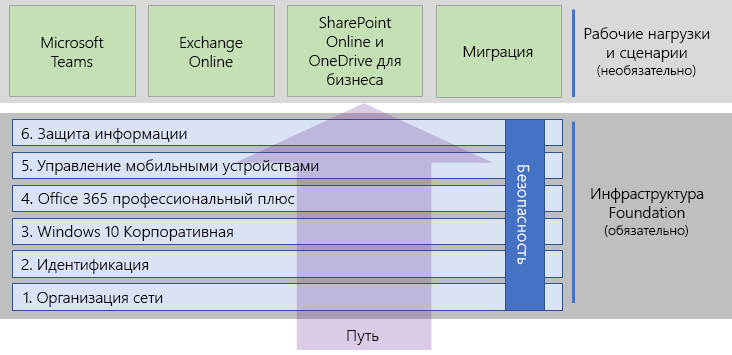
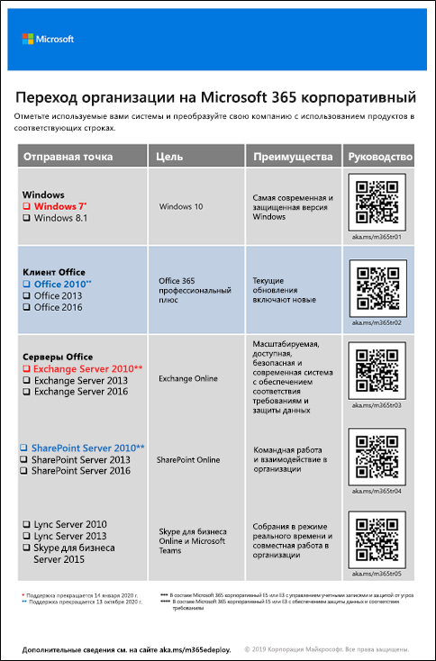

# Развертывание Microsoft 365 корпоративный

Microsoft 365 корпоративный — это сочетание местных и облачных приложений и служб с Windows 10 Корпоративной со следующими характеристиками:  

- Наличие интеллектуальной системы безопасности.
- Интеграция для простоты использования.
- Возможности для творчества.
- Поддержка работы в группах.

Вы можете реализовать эти преимущества, развернув инфраструктуру и рабочие нагрузки интегрированным способом, включающим современные службы и функции безопасности.

Существует три основных способа развертывания Microsoft 365 корпоративный:

- Помощь инженеров корпорации Майкрософт с [FastTrack для Microsoft 365](#fasttrack-for-microsoft-365).
- Помощь службы Microsoft Consulting Services или [партнера Майкрософт](https://partner.microsoft.com/).
- Использование [руководства по развертыванию Microsoft 365 корпоративный](#microsoft-365-enterprise-deployment-guide).

## FastTrack для Microsoft 365

FastTrack — это текущая и стандартная возможность, доступная в рамках подписки, предоставляемая инженерами Майкрософт, которые помогут вам перейти на облачные технологии в своем темпе. FastTrack также обеспечивает доступ к надежным партнерам, предоставляющим дополнительные услуги. Поддерживая на данный момент более 40 000 клиентов, FastTrack помогает добиться максимальной рентабельности инвестиций, ускорить развертывание и адаптацию в масштабе всей организации. См. [FastTrack для Microsoft 365](https://fasttrack.microsoft.com/microsoft365).

Если вы хотите получить преимущества, которые дает FastTrack для развертывания Microsoft 365 корпоративный, используйте [советник по развертыванию Microsoft 365](https://aka.ms/microsoft365setupguide) в FastTrack. В этом советнике есть рекомендации по развертыванию и настройке базовой инфраструктуры. Для доступа к этой странице необходимо войти в клиент Office 365 или Microsoft 365 с правами глобального администратора.

Начало работы над полным развертыванием с FastTrack [здесь](https://fasttrack.microsoft.com/microsoft365).

## Руководство по развертыванию Microsoft 365 корпоративный

Руководство по развертыванию Microsoft 365 корпоративный поможет выполнить корректную и обязательную настройку продуктов и функций Microsoft 365 корпоративный.

Чтобы развернуть Microsoft 365 корпоративный самостоятельно, вы можете:

- Развернуть [базовую инфраструктуру](deploy-foundation-infrastructure.md) для использования встроенных средств безопасности и интеграции упрощенного управления, чтобы гарантировать, что клиентское ПО будет получать все последние улучшения производительности и безопасности. 
 
  Базовая инфраструктура организуется в виде ряда нумерованных этапов, которые опираются друг на друга и среду, которая поддерживает рабочие нагрузки и сценарии Microsoft 365 корпоративный. 

  **Если у вас небольшая или новообразованная организация**, выполняйте этапы для методичного создания инфраструктуры.

  Вы также можете развернуть этапы или части этапов в любом порядке при необходимости, [один за другим или параллельно](deployment-strategies-microsoft-365-enterprise.md), чтобы обеспечить интеграцию с текущей инфраструктурой, соответствие с вашими ИТ-планами и ресурсами, а также бизнес-потребностями. Чтобы упростить развертывание для некорпоративных организаций, щелкните [здесь](deploy-foundation-infrastructure-non-enterprises.md).

  **В случае крупной корпорации**, смотрите на этапы как на уровни ИТ-инфраструктуры, а не заданный маршрут, и определите, как лучше всего добиться итогового соблюдения требований для каждого уровня в вашей организации.

- Разверните ключевые [рабочие нагрузки и сценарии](deploy-workloads.md) для продуктивности поверх вашей инфраструктуру. Эти позволит открыть возможности для творчества и совместной работы в вашей организации.

Так выглядит связь между базовой инфраструктурой и рабочими процессами и сценариями.

Рабочие нагрузки и сценарии функционируют поверх базовой инфраструктуры. Тем не менее, вам не обязательно выполнять все этапы создания базовой инфраструктуры, чтобы использовать рабочие нагрузки для эффективной работы и взаимодействия.

Начните самостоятельную работу над полным развертыванием [здесь](deploy-foundation-infrastructure.md).

## Тестовый запуск

"*Вещам, которые нам нужно узнать, прежде чем делать, мы учимся только на практике*" - Аристотель

Если вы только осваиваете Microsoft 365 корпоративный или определенный продукт или функцию, лучше всего настроить его самостоятельно и посмотреть, как это работает.

Мы облегчили для вас эту задачу с помощью руководств по лаборатории тестирования, которые содержат пошаговое описание настройки инфраструктуры или функции в простой, но типичной среде с пробной или платной подпиской.

С помощью руководств по лаборатории тестирования вы можете самообучаться, демонстрировать, настроить или создать экспериментальный вариант сложной конфигурации, рабочего процесса или полноценного сценария.

Дополнительные сведения см. в статье [Руководства по лаборатории тестирования для Microsoft 365 корпоративный](m365-enterprise-test-lab-guides.md).

## Переход всей организации

Чтобы лучше понять, как перевести всю организацию на продукты и службы в Microsoft 365 корпоративный, скачайте [плакат по переходу](https://github.com/MicrosoftDocs/microsoft-365-docs/raw/public/microsoft-365/enterprise/media/deploy-microsoft-365-enterprise/transitionorgtom365.pdf).

Этот двухстраничный плакат содержит быстрый способ определения элементов существующей инфраструктуры и руководство по переходу на соответствующий продукт или службу в Microsoft 365 корпоративный. На нем представлены продукты Windows и Office, а также другие элементы инфраструктуры и безопасности, например управление устройствами, удостоверения, защита информации и защита от угроз.

Вы можете распечатать этот плакат в формате письма, юридического документа или газетном формате (11 х 17).

## Как делают другие?

Используйте эти ресурсы, чтобы понять, как другие развертывают и используют Microsoft 365 корпоративный.

### Как клиенты используют Microsoft 365 корпоративный

Используйте сайт с историями клиентов, чтобы узнать, как клиенты Майкрософт применяют Microsoft 365 корпоративный.

1. Откройте сайт [https://customers.microsoft.com/](https://customers.microsoft.com/) и щелкните **Поиск**.
2. В левой области выберите нужный язык в разделе **Язык**.
3. Выберите отрасль организации в разделе **Отрасль**.
4. Выберите **Microsoft 365** в разделе **Продукт**.
5. Щелкните карточку, чтобы ознакомиться с практическим примером клиента.

### Как Майкрософт использует Microsoft 365 корпоративный

Определение цифровой культуры является основным приоритетом для каждого руководителя, стремящегося к созданию современного рабочего места. Microsoft 365 предназначен для поддержки такого культурного сдвига, помогая руководителям предоставлять возможности всем пользователям в компании для реализации творческого потенциала и выполнения совместной работы. Формирование базовой инфраструктуры корпорации Майкрософт обеспечило именно такой цифровой культурный сдвиг. Внедрение Microsoft 365 корпоративный позволило нам развернуть технологию совместной работы, включая Microsoft Teams и Exchange Online, и обмениваться конфиденциальными данными по сети с помощью безопасных сайтов интрасети SharePoint.

В то же время интеллектуальные функции безопасности и интеграция продуктов помогают оптимизировать управление и уменьшить общую стоимость владения в течение жизненного цикла ИТ-службы. 

Узнайте, как группа проектирования основных служб и операций (прежнее название — ИТ-отдел Майкрософт) [спланировала и развернула основу](https://www.microsoft.com/en-us/itshowcase/deploying-and-managing-microsoft-365) для поддержки приложений и служб, раскрывающих творческие возможности и поощряющих совместную работу в безопасной среде.

> [!Note]
> Эта веб-страница доступна только на английском языке.

### Как корпорация Contoso выполнила развертывание Microsoft 365 корпоративный

Корпорация Contoso — вымышленная показательная транснациональная промышленная компания-конгломерат с главным офисом в Париже. Узнайте, [как в корпорации Contoso развертывался Microsoft 365 корпоративный](contoso-case-study.md) и рассматривались основные проектные решения и детали внедрения сети, удостоверений, Windows 10 Корпоративная, Office 365 профессиональный плюс, управления мобильными устройствами, защиты информации и системы безопасности. 

## Следующее действие

Чтобы воспользоваться прямой помощью Майкрософт, используйте [FastTrack](https://fasttrack.microsoft.com/microsoft365).

Чтобы воспользоваться услугами консультанта, обратитесь в службу Microsoft Consulting Services или к [партнеру Майкрософт](https://partner.microsoft.com/).

Чтобы приступить к работе самостоятельно, см. статью [Базовая инфраструктура](deploy-foundation-infrastructure.md).
