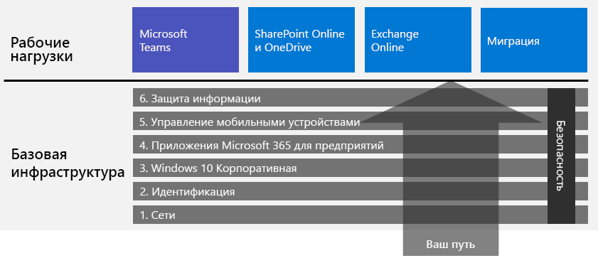

# Развертывание Microsoft 365 для предприятийDeploy Microsoft 365 for enterprise

Microsoft 365 для предприятий — это сочетание локальных и облачных приложений и служб с Windows 10 Корпоративной со следующими характеристиками:Microsoft 365 for enterprise is a combination of local and cloud-based productivity apps and services with Windows 10 Enterprise that:  

- Наличие интеллектуальной системы безопасности.Has intelligent security.
- Интеграция для простоты использования.Is integrated for simplicity.
- Возможности для творчества.Unlocks creativity.
- Поддержка работы в группах.Is built for teamwork.

Вы можете реализовать эти преимущества, развернув инфраструктуру и рабочие нагрузки интегрированным способом, включающим современные службы и функции безопасности.You can realize these benefits by deploying the infrastructure and productivity workloads in an integrated way that includes state-of-the-art security services and features.

Существует три основных способа развертывания Microsoft 365 для предприятий:There are three main ways to deploy Microsoft 365 for enterprise:

- Помощь инженеров корпорации Майкрософт с [FastTrack для Microsoft 365](#fasttrack-for-microsoft-365).Do it with Microsoft engineers using [FastTrack for Microsoft 365](#fasttrack-for-microsoft-365).
- Помощь службы Microsoft Consulting Services или [партнера Майкрософт](https://partner.microsoft.com/).Do it with help from Microsoft Consulting Services or a [Microsoft partner](https://partner.microsoft.com/).
- Используйте [руководство по развертыванию Microsoft 365 для предприятий](#microsoft-365-for-enterprise-deployment-guide).Do it yourself with the [Microsoft 365 for enterprise deployment guide](#microsoft-365-for-enterprise-deployment-guide).

## FastTrack для Microsoft 365FastTrack for Microsoft 365

FastTrack — это текущая и стандартная возможность, *доступная бесплатно в рамках подписки*, предоставляемая инженерами Майкрософт, чтобы помочь вам перейти на облачные технологии в своем темпе.FastTrack is an ongoing and repeatable benefit—*available for free as part of your subscription*—that is delivered by Microsoft engineers to help you move to the cloud at your own pace. FastTrack также обеспечивает доступ к надежным партнерам, предоставляющим дополнительные услуги.FastTrack also gives you access to qualified partners for additional services. Поддерживая на данный момент более 40 000 клиентов, FastTrack помогает добиться максимальной рентабельности инвестиций, ускорить развертывание и адаптацию в масштабе всей организации.With over 40,000 customers enabled to date, FastTrack helps maximize ROI, accelerate deployment, and increase adoption across your organization. См. [FastTrack для Microsoft 365](https://fasttrack.microsoft.com/microsoft365).See [FastTrack for Microsoft 365](https://fasttrack.microsoft.com/microsoft365).

Если вы хотите получить преимущества, которые дает FastTrack для развертывания Microsoft 365 для предприятий, используйте [советник по развертыванию Microsoft 365](https://aka.ms/microsoft365setupguide) в FastTrack. В этом советнике есть рекомендации по развертыванию и настройке базовой инфраструктуры.If you want to take advantage of FastTrack to deploy Microsoft 365 for enterprise, you can use the FastTrack [Microsoft 365 deployment advisor](https://aka.ms/microsoft365setupguide) for guidance on how to deploy and set up your foundation infrastructure. Для доступа к этой странице необходимо войти в клиент Office 365 или Microsoft 365 с правами глобального администратора.You must be signed in as a global administrator in an Office 365 or Microsoft 365 tenant to access this page.

Начало работы над полным развертыванием с FastTrack [здесь](https://fasttrack.microsoft.com/microsoft365).Get started on your end-to-end deployment journey with FastTrack [here](https://fasttrack.microsoft.com/microsoft365).

## Руководство по развертыванию Microsoft 365 для предприятийMicrosoft 365 for enterprise deployment guide

Руководство по развертыванию Microsoft 365 для предприятий поможет выполнить корректную и обязательную настройку продуктов и функций Microsoft 365 для предприятий.The Microsoft 365 for enterprise deployment guide steps you through the correct and required configuration of Microsoft 365 for enterprise products and features.

Чтобы самостоятельно развернуть Microsoft 365 для предприятий, вы можете:To deploy Microsoft 365 for enterprise yourself, you can:

- Развернуть [базовую инфраструктуру](deploy-foundation-infrastructure.md) для использования встроенных средств безопасности и интеграции упрощенного управления, чтобы гарантировать, что клиентское ПО будет получать все последние улучшения производительности и безопасности.Deploy the [foundation infrastructure](deploy-foundation-infrastructure.md) for built-in security and integration for simplified management, which makes it easier to ensure your client software is updated with the latest productivity and security enhancements. 
 
  Базовая инфраструктура организуется в виде ряда нумерованных этапов, которые опираются друг на друга и среду, которая поддерживает рабочие нагрузки и сценарии Microsoft 365 для предприятий.The foundation infrastructure is organized as a series of numbered phases that build upon each other and towards an environment that supports Microsoft 365 for enterprise workloads and scenarios. 

  **Если у вас небольшая или новообразованная организация**, выполняйте этапы для методичного создания инфраструктуры.**If you are a smaller or newer organization**, follow the phases in order to methodically build out your infrastructure.

  Вы также можете развернуть этапы или части этапов в любом порядке при необходимости, [один за другим или параллельно](deployment-strategies-microsoft-365-enterprise.md), чтобы обеспечить интеграцию с текущей инфраструктурой, соответствие с вашими ИТ-планами и ресурсами, а также бизнес-потребностями.However, you can deploy phases or the portions of phases of this infrastructure in any order as needed, [one after the other or in parallel](deployment-strategies-microsoft-365-enterprise.md), to integrate with your current infrastructure, fit your IT plans and resources, and meet your business needs. Чтобы упростить развертывание для некорпоративных организаций, щелкните [здесь](deploy-foundation-infrastructure-non-enterprises.md).For a simplified deployment for non-enterprises, click [here](deploy-foundation-infrastructure-non-enterprises.md).

  **В случае крупной корпорации**, смотрите на этапы как на уровни ИТ-инфраструктуры, а не заданный маршрут, и определите, как лучше всего добиться итогового соблюдения требований для каждого уровня в вашей организации.**If you are an enterprise organization**, view the phases as layers of IT infrastructure, rather than a defined path, and determine how to best work toward eventual adherence to the requirements of each layer across your organization.

- Разверните ключевые [рабочие нагрузки и сценарии](deploy-workloads.md) для продуктивности поверх вашей инфраструктуру.Deploy key productivity [workloads and scenarios](deploy-workloads.md) on top of your infrastructure. Эти позволит открыть возможности для творчества и совместной работы в вашей организации.These unlock creativity and teamwork in your organization.

Так выглядит связь между базовой инфраструктурой и рабочими процессами и сценариями.Here's the relationship between the foundation infrastructure and the workloads and scenarios.

Рабочие нагрузки и сценарии функционируют поверх базовой инфраструктуры.Workloads and scenarios operate over the top of the foundation infrastructure. Тем не менее, вам не обязательно выполнять все этапы создания базовой инфраструктуры, чтобы использовать рабочие нагрузки для эффективной работы и взаимодействия.However, you do not have to have all of the foundation infrastructure phases built out to begin using workloads for productivity and collaboration.

Начните самостоятельную работу над полным развертыванием [здесь](deploy-foundation-infrastructure.md).Get self-started on your end-to-end deployment journey [here](deploy-foundation-infrastructure.md).

## Тестовый запускTake a test drive

"*Вещам, которые нам нужно узнать, прежде чем делать, мы учимся только на практике*"“*For the things we have to learn before we can do them, we learn by doing them.*” - Аристотель- Aristotle

Если вы только осваиваете Microsoft 365 для предприятий или определенный продукт или функцию, лучше всего настроить его самостоятельно и посмотреть, как это работает.If you're new to Microsoft 365 for enterprise or to a specific product or feature, one of the best ways to gain understanding is to build it out yourself and see it working.

Мы облегчили для вас эту задачу с помощью руководств по лаборатории тестирования, которые содержат пошаговое описание настройки инфраструктуры или функции в простой, но типичной тестовой среде с пробной или платной подпиской.We've made this easier with Test Lab Guides (TLGs), which step you through the configuration of infrastructure or a feature in a simplified but representative test environment using trial or paid subscriptions.

С помощью руководств по лаборатории тестирования вы можете самостоятельно изучать, демонстрировать, настраивать и создавать экспериментальный вариант (подтверждение концепции) сложной конфигурации, рабочего процесса или сквозного сценария.With TLGs, you can self-learn, demonstrate, customize, or build a proof of concept (PoC) of a complex configuration, workload, or end-to-end scenario.

Дополнительные сведения см. в статье [Руководства по лаборатории тестирования для Microsoft 365 для предприятий](m365-enterprise-test-lab-guides.md).For more information, see [Microsoft 365 for enterprise Test Lab Guides](m365-enterprise-test-lab-guides.md).

## Переход всей организацииTransition your entire organization

Чтобы лучше понять, как перевести всю организацию на продукты и службы в Microsoft 365 для предприятий, ознакомьтесь с плакатом [Переход организации на Microsoft 365](../media/deploy-microsoft-365-enterprise/transition-org-to-m365.pdf).To get a better picture of how to move your entire organization to the products and services in Microsoft 365 for enterprise, see the [Transition Your Organization to Microsoft 365](../media/deploy-microsoft-365-enterprise/transition-org-to-m365.pdf) poster.

Этот двухстраничный плакат содержит быстрый способ определения элементов существующей инфраструктуры и руководство по переходу на соответствующий продукт или службу в Microsoft 365 для предприятий.This two-page poster is a quick way to inventory your existing infrastructure and get to the guidance for moving to the corresponding product or service in Microsoft 365 for enterprise. На нем представлены продукты Windows и Office, а также другие элементы инфраструктуры и безопасности, например управление устройствами, удостоверения, защита информации и защита от угроз.It includes Windows and Office products and other infrastructure and security elements such as device management, identity, and information and threat protection.

Вы также можете [скачать плакат по переходу](https://github.com/MicrosoftDocs/microsoft-365-docs/raw/public/microsoft-365/media/deploy-microsoft-365-enterprise/transition-org-to-m365.pdf) и распечатать его в формате письма, юридического документа или в газетном формате (11 х 17).You can also [download the transition poster](https://github.com/MicrosoftDocs/microsoft-365-docs/raw/public/microsoft-365/media/deploy-microsoft-365-enterprise/transition-org-to-m365.pdf) and print it in letter, legal, or tabloid (11 x 17) formats.

## Как делают другие?How did others do it?

Используйте эти ресурсы, чтобы понять, как другие развертывают и используют Microsoft 365 для предприятий.Use these resources to understand how others have deployed and are using Microsoft 365 for enterprise.

### Как клиенты используют Microsoft 365 для предприятийHow customers use Microsoft 365 for enterprise

Используйте сайт с историями клиентов, чтобы узнать, как клиенты Майкрософт применяют Microsoft 365 для предприятий.Use the Customer Stories site to see how Microsoft customers are using Microsoft 365 for enterprise.

1. Откройте сайт [https://customers.microsoft.com/](https://customers.microsoft.com/) и щелкните **Поиск**.Go to [https://customers.microsoft.com/](https://customers.microsoft.com/) and click **Search**.
2. В левой области выберите нужный язык в разделе **Язык**.In the left pane, select your language in **Language**.
3. Выберите отрасль организации в разделе **Отрасль**.Select your organization's industry in **Industry**.
4. Выберите **Microsoft 365** в разделе **Продукт**.Select **Microsoft 365** in **Product**.
5. Щелкните карточку, чтобы ознакомиться с практическим примером клиента.Click on a card for the customer's case study.

### Как Майкрософт использует Microsoft 365 для предприятийHow Microsoft uses Microsoft 365 for enterprise

Определение цифровой культуры является основным приоритетом для каждого руководителя, стремящегося к созданию современного рабочего места.Defining a digital culture is a major priority for every leader who strives to foster a modern workplace. Microsoft 365 предназначен для поддержки такого культурного сдвига, помогая руководителям предоставлять возможности всем пользователям в компании для реализации творческого потенциала и выполнения совместной работы.Microsoft 365 was designed to support this kind of cultural shift helping leaders empower everyone at their companies to unleash creativity and collaboration. Формирование базовой инфраструктуры корпорации Майкрософт обеспечило именно такой цифровой культурный сдвиг.Establishing Microsoft's foundational infrastructure has sparked precisely this kind of digital culture shift. Внедрение Microsoft 365 для предприятий позволило нам развернуть технологию совместной работы, включая Microsoft Teams и Exchange Online, и обмениваться конфиденциальными данными по сети с помощью безопасных сайтов интрасети SharePoint.Implementing Microsoft 365 for enterprise has allowed us to deploy collaboration technology, like Microsoft Teams and Exchange Online, and to share sensitive data online across secure SharePoint intranet sites.

В то же время интеллектуальные функции безопасности и интеграция продуктов помогают оптимизировать управление и уменьшить общую стоимость владения в течение жизненного цикла ИТ-службы.At the same time, intelligent security features and product integration helps streamline management needs and minimize the total cost of ownership across the IT lifecycle. 

Узнайте, как группа проектирования основных служб и операций (прежнее название — ИТ-отдел Майкрософт) [создает современное рабочее место с Microsoft 365](https://www.microsoft.com/en-us/itshowcase/microsoft-365).Learn how Core Services Engineering and Operations (formerly Microsoft IT) has [built a modern workplace with Microsoft 365](https://www.microsoft.com/en-us/itshowcase/microsoft-365).

> [!Note]
> Эта веб-страница доступна только на английском языке.This web page is only available in English.

### Как корпорация Contoso выполнила развертывание Microsoft 365 для предприятийHow the Contoso Corporation deployed Microsoft 365 for enterprise

Корпорация Contoso — вымышленная показательная транснациональная промышленная компания-конгломерат с главным офисом в Париже.The Contoso Corporation is a fictional but representative global manufacturing conglomerate with its headquarters in Paris, France. Узнайте, [как в корпорации Contoso развертывали Microsoft 365 для предприятий](contoso-case-study.md) и рассматривали основные проектные решения и детали внедрения сети, удостоверений, Windows 10 Корпоративная, Приложений Microsoft 365 для предприятий, управления мобильными устройствами, защиты информации и системы безопасности.See how [Contoso deployed Microsoft 365 for enterprise](contoso-case-study.md) and addressed major design decisions and implementation details for networking, identity, Windows 10 Enterprise, Microsoft 365 Apps for enterprise, mobile device management, information protection, and security. 

## Отслеживание содержимого развертыванияStay current with deployment content

Последние изменения содержимого см. в [этой статье](microsoft-365-deploment-guide-changes.md).For the latest changes in content, see [this article](microsoft-365-deploment-guide-changes.md).

## Следующий шагNext step

Чтобы воспользоваться прямой помощью Майкрософт, используйте [FastTrack](https://fasttrack.microsoft.com/microsoft365).To do it with direct Microsoft assistance, use [FastTrack](https://fasttrack.microsoft.com/microsoft365).

Чтобы воспользоваться услугами консультанта, обратитесь в службу Microsoft Consulting Services или к [партнеру Майкрософт](https://partner.microsoft.com/).To do it with a consultant, contact Microsoft Consulting Services or a [Microsoft partner](https://partner.microsoft.com/).

Чтобы приступить к работе самостоятельно, см. статью [Базовая инфраструктура](deploy-foundation-infrastructure.md).To get started doing it yourself, see the [foundation infrastructure](deploy-foundation-infrastructure.md).
