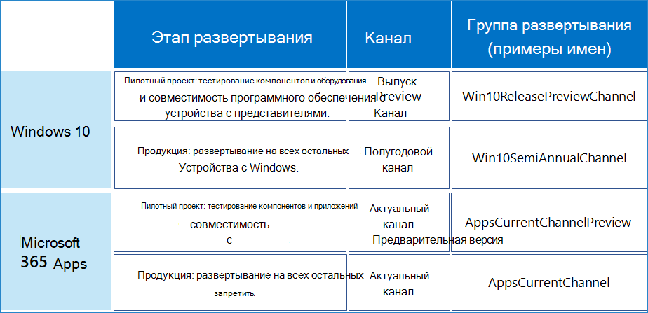

# Пример широкого развертывания для новых выпусков

Этот пример конфигурации канала подходит организациям, использующим быстрое развертывание новых выпусков, и соответствует следующим бизнес-приоритетам:

- Обеспечение бесперебойной работы приложений и служб Майкрософт.
- Повышение безопасности устройств, служб и данных благодаря новейшим возможностям и исправлениям, предлагаемым Майкрософт.
- Повышение производительности пользователей благодаря новейшим возможностям Майкрософт.

Эти цели связаны с ИТ-задачами, призванными достичь равновесия между быстрым развертыванием в рабочей среде и процедурой ранней проверки, а также репрезентативным подмножеством пользователей и устройств для проверки всех функциональных возможностей перед широким развертыванием.

В приведенном примере организация насчитывает 5000 сотрудников по всему миру: в Европе, Африке, Азии и Северной и Южной Америке. 70 % сотрудников используют Microsoft 365 E3, а остальные — Microsoft 365 E5.

>[!Note]
>Этот пример, создан, чтобы показать варианты использования этапов и групп развертывания, которые подойдут многим организациям различных типов и размеров.
>

ИТ-инфраструктура таких организаций: 

- преимущественно однородная, при этом 60 % установленной базы занимают Windows, Приложения Microsoft 365 и облачные службы (Майкрософт). Только некоторые устаревшие системы устояли перед интенсивными многолетними попытками упростить и ускорить ИТ-инфраструктуру;
- обслуживается опытным высококвалифицированным персоналом; и нацелена на продуктивную работу пользователей и их устройств благодаря использованию ведущих выпусков, предоставляемых Майкрософт.

## Этапы развертывания и обновления

Основываясь на целях быстрого развертывания новых выпусков, организация, описанная в этом примере, использует двухэтапный процесс развертывания.

1. **Использование предварительного или пилотного развертывания**: проверка и многократное развертывание системы ранними пользователями, сотрудниками ИТ-отделов, пользователями с репрезентативными конфигурациями и обучающим персоналом. 

   Это позволяет проверить взаимодействие выпуска с другими приложениями и его работу на различных устройствах перед выполнением полного развертывания во всей организации.

   Менеджеры, отвечающие за внедрение изменений, могут заранее ознакомиться с новыми функциям и спланировать обмен сообщениями и развертывание.

   Обучающий персонал может запланировать проведение новых курсов для сотрудников перед началом развертывания или внести изменения в уже существующие с учетом появления новых возможностей.

2. **Развертывание продукта**: развертывание выпуска для остальных пользователей с использованием различных методов: например, по регионам, отделам и т. д.

## Конфигурация развертывания для Windows 10

Общая цель — выполнение широкого развертывания нового выпуска Semi-Annual Channel после проверки изменений, вошедших в предварительную версию Release Preview Channel, группой репрезентативных пользователей на их устройствах.

Дополнительные сведения о методах и стратегиях развертывания Windows 10 см. в [этой статье](https://docs.microsoft.com/windows/deployment/).

| Этап | Канал | Группа развертывания |
|:-------|:-------|:-----|
| Пилотное развертывание |  **Release Preview Channel**  <ul><li>Цель: развертывание функциональных обновлений для сотрудников ИТ-отдела и ранних пользователей для проверки на репрезентативных устройствах и конфигурациях (языки, сторонние приложения). </li><li> Состояние: полная совместимость и поддержка для коммерческих пользователей; не влияет на имеющиеся соглашения о поддержке. </li></ul> | **Win10ReleasePreviewChannel** (имя для примера)    Члены — группы, в которые входят: <ul><li> приверженцы Windows из разных отделов и регионов; </li><li> персонал, чьи конфигурации системы нуждаются в проверке; </li><li> ИТ-администраторы и сотрудники ИТ-отделов развертывания </li><li> Менеджеры, ответственные за внедрение изменений </li><li> Внутренний обучающий персонал </li></ul> |
| Производство |  **Semi-Annual Channel**  <ul><li>Цель: широкое развертывание новейших функциональных обновлений в остальной организации. </li><li> Состояние: полная совместимость и поддержка. </li></ul> | **Win10SemiAnnualChannel** (имя для примера)    Члены — все пользователи, не входящие в группу Win10ReleasePreviewChannel. |
||||

В этой организации используется наилучший вариант развертывания полезных данных Release Preview Channel, которое выполняется аналогично развертыванию выпусков Semi-Annual Channel (например, Центра обновления Windows или Windows Server Update Services), и при обновлении обоих каналов применяются одинаковые политики.

Процесс внедрения текущих обновлений:

1. Изменения для Release Preview Channel развертываются в группу развертывания Win10ReleasePreviewChannel (имя для примера).
2. Члены группы Win10ReleasePreviewChannel сообщают о работоспособности изменений для Release Preview Channel сотрудникам ИТ-отдела, которые, в свою очередь, предоставляют отзыв в Майкрософт и ожидают выхода следующих изменений Release Preview Channel для дальнейшей проверки.
3. Функциональные изменения Semi-Annual Channel развертываются в группе Win10SemiAnnualChannel. 

>[!Note]
>Semi-Annual Channel является рекомендованным каналом, а ваш ИТ-отдел должен самостоятельно принять решение о времени развертывании нового выпуска в организации, основываясь на собственных средствах управления, и затем приступить к поэтапному развертыванию.
>

## Конфигурация развертывания для Приложений Microsoft 365

Общей целью является широкое развертывания нового выпуска Актуального канала после проверки изменений, внесенных в предварительную версию, группой репрезентативных пользователей.

Дополнительные сведения о методах и стратегиях развертывания Приложений Microsoft 365 см. в [этой статье](https://docs.microsoft.com/deployoffice/plan-office-365-proplus).

| Этап | Канал | Группа развертывания |
|:-------|:-------|:-----|
| Пилотное развертывание |  **Актуальный канал (предварительная версия)** <ul><li> Цель: {дайте группе репрезентативных пользователей возможность предварительно ознакомиться с новыми функциями Приложений Microsoft 365} развертывание функциональных обновлений сразу после их тестирования пользователями Актуального канала (предварительная версия) и по мере готовности к работе. </li><li> Состояние: полная совместимость и поддержка.</li><li> Частота: обновления выходят 2–3 раза в месяц. </li></ul> | **AppsCurrentChannelPreview** (имя для примера)    Члены — группы, в которые входят: <ul><li> приверженцы приложений Office из разных отделов и регионов; </li><li> персонал, чьи конфигурации системы нуждаются в проверке; </li><li> ИТ-администраторы и сотрудники ИТ-отделов развертывания </li><li> Менеджеры, ответственные за внедрение изменений </li><li> Внутренний обучающий персонал </li></ul>|
| Производство | **Актуальный канал** <ul><li> Цель: широкое развертывание новейших функциональных обновлений в остальной организации. </li><li> Состояние: полная совместимость и поддержка. </li></ul> |  **AppsCurrentChannel** (имя для примера)    Члены — все пользователи, не вошедшие в группу AppsCurrentChannelPreview. |
|||

Процесс внедрения текущих обновлений:

1. Изменения, предложенные в Актуальном канале (предварительная версия), развертываются в группе AppsCurrentChannelPreview.
2. Члены группы AppsCurrentChannelPreview сообщают о работоспособности изменений для Актуального канала (предварительная версия) сотрудникам ИТ-отдела, отвечающим за развертывание, а они, в свою очередь, предоставляют отзыв в Майкрософт и ожидают следующих выпусков Актуального канала (предварительная версия) для дальнейшей проверки.
3. Изменения, предложенные в Актуальном канале, развертываются в группе AppsCurrentChannel. 

## Общая информация в графическом виде

Ниже представлены продукты, каналы и группы развертывания, используемые организацией в примере. 

## См. также

[Примеры конфигураций каналов развертывания и обновления](deploy-update-channels-examples.md)

[Руководство по развертыванию](deploy-microsoft-365-enterprise.md)

[Руководства по лаборатории тестирования](m365-enterprise-test-lab-guides.md)
