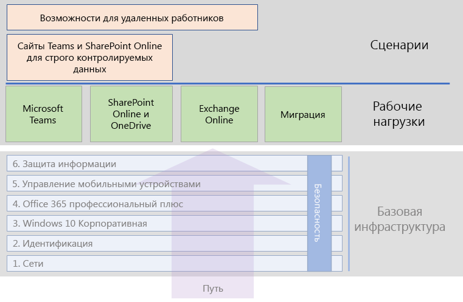

# Рабочие нагрузки и сценарии Microsoft 365 корпоративный

Чтобы можно было использовать возможности для творчества и работы в группах, имеющиеся в Microsoft 365 корпоративный, разверните эти рабочие нагрузки и сценарии на основе вашей базовой инфраструктуры.

- [Microsoft Teams](teams-workload.md)
- [Exchange Online](exchangeonline-workload.md)
- [SharePoint Online](sharepoint-online-onedrive-workload.md)
- [Миграция на Microsoft 365 корпоративный](migration-microsoft-365-enterprise-workload.md)
- [Сайты Microsoft Teams и SharePoint Online для жестко регламентированных данных](teams-sharepoint-online-sites-highly-regulated-data.md)

На приведенном ниже рисунке показаны рабочие нагрузки в общем содержимом развертывания Microsoft 365 корпоративный.

Развертывать рабочие нагрузки следует после выполнения всех этапов развертывания [базовой инфраструктуры](deploy-foundation-infrastructure.md).
