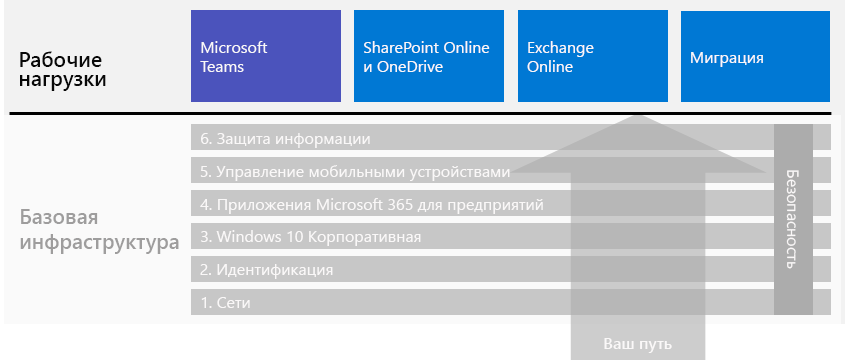

# Рабочие нагрузки Microsoft 365 для предприятийMicrosoft 365 for enterprise workloads

Чтобы использовать возможности для творчества и работы в группах, имеющиеся в Microsoft 365 для предприятий, разверните эти рабочие нагрузки на основе вашей базовой инфраструктуры.To get the creativity and teamwork benefits of Microsoft 365 for enterprise, deploy these workloads over your foundation infrastructure:

- [Microsoft TeamsMicrosoft Teams](teams-workload.md)
- [Exchange OnlineExchange Online](exchangeonline-workload.md)
- [SharePoint и OneDriveSharePoint and OneDrive](sharepoint-online-onedrive-workload.md)

Общий план по миграции всей организации в Microsoft 365 для предприятий, в том числе клиентских продуктов Microsoft Office, локальных продуктов Office Server и устройств под управлением Microsoft Windows, см. в статье о [миграции](migration-microsoft-365-enterprise-workload.md).See the [migration](migration-microsoft-365-enterprise-workload.md) article for a general roadmap to migrate your entire organization to Microsoft 365 for enterprise, which includes Microsoft Office client products, on-premises Office Server products, and Microsoft Windows-based devices.

Рабочие нагрузки в общем руководстве по развертыванию Microsoft 365 для предприятий:Here are the workloads in the overall Microsoft 365 for enterprise deployment guide:

## Необходимые компоненты базовой инфраструктурыFoundation infrastructure prerequisites

*В идеале* следует развертывать нагрузки после настройки всех этапов [базовой инфраструктуры](deploy-foundation-infrastructure.md).*Ideally*, you should deploy workloads after you have configured all of the phases of the [foundation infrastructure](deploy-foundation-infrastructure.md). Это обеспечит наличие всех базовых слоев для выполнения интеграции, настройки защиты и оптимального взаимодействия с пользователями и их устройствами.This ensures that all of the underlying foundation layers are in place to provide integration, security, and the best experience for your users and their devices.

| ЭтапPhase | РезультатResult |
|:-------|:-----|
| СетьNetwork | Сеть обновляется для оптимальной работы облачных служб Microsoft 365.Your network is updated for optimum performance to Microsoft 365 cloud services. |
| УдостоверениеIdentity | Удостоверение синхронизируется и защищается с помощью надежной проверки подлинности для учетных записей пользователей и средств защиты для учетных записей администраторов.Identity is synchronized and secured with strong authentication for user accounts and protection for admin accounts. |
| Windows 10 КорпоративнаяWindows 10 Enterprise | На ваших компьютерах под управлением Windows 7 или Windows 8.1 операционную систему можно обновить до Windows 10 Корпоративная, а на новых устройствах сразу устанавливается Windows 10 Корпоративная.Your computers running Windows 7 or Windows 8.1 can upgrade to Windows 10 Enterprise and new devices are installed with Windows 10 Enterprise. |
| Приложения Microsoft 365 для предприятийMicrosoft 365 Apps for enterprise | Существующие пользователи Microsoft Office могут перейти на подписку "Приложения Microsoft 365 для предприятий".Your existing users of Microsoft Office can upgrade to Microsoft 365 Apps for enterprise. |
| Управление мобильными устройствамиMobile device management | Ваши устройства можно регистрировать и контролировать.Your devices can be enrolled and managed. |
| Защита информацииInformation protection | Настраиваются функции защиты информации Microsoft 365, позволяющие использовать настройки конфиденциальности или метки Azure Information Protection для защиты документов и электронной почты.Microsoft 365 information protection features are configured and your sensitivity or Azure Information Protection labels are ready to protect documents and email. |

Помните, что это идеальный вариант и его планирование, настройка, тестирование и создание его пилотной версии могут занять некоторое время особенно в крупных организациях с существующей инфраструктурой и несколькими местоположениями.Remember that this is ideal and can take some time to plan for, configure, test, and pilot, especially in large organizations with existing infrastructure and multiple locations. Чтобы быстрее начать использовать преимущества Microsoft 365 для предприятий, необязательно выполнять все эти этапы во всех расположениях.Completing all of these phases in all locations is not necessary for you to more quickly get business value from Microsoft 365 for enterprise. 

Вот несколько стандартных рабочих нагрузок для быстрого развертывания:Here are some common workloads to deploy right away: 

- После развертывания этапа **Удостоверение** базовой инфраструктуры для пользователей многие организации развертывают следующие продукты:After the **Identity** phase of the foundation infrastructure is rolled out to users, many organizations deploy:
  - [Приложения Microsoft 365 для предприятий](office365proplus-infrastructure.md) объединены с [OneDrive](https://docs.microsoft.com/onedrive/plan-onedrive-enterprise).[Microsoft 365 Apps for enterprise](office365proplus-infrastructure.md) combined with [OneDrive](https://docs.microsoft.com/onedrive/plan-onedrive-enterprise). В рамках подписки "Приложения Microsoft 365 для предприятий" доступны все возможности последней версии клиента Microsoft Office и защита с помощью современной проверки подлинности.Microsoft 365 Apps for enterprise provides the security of modern authentication and the user experience of the latest Microsoft Office client. Перенос личных файлов пользователей в OneDrive упрощает инфраструктуру и устраняет необходимость в поддержке папок и дисков.The migration of user's personal files to OneDrive reduces infrastructure and the need to support home folders and drives.
  - [Exchange Online](exchangeonline-workload.md), чтобы пользователи могли использовать облачную электронную почту.[Exchange Online](exchangeonline-workload.md) so that users can begin using cloud-based email.
- Если у вас нет срочной необходимости в хранении жестко регламентированных цифровых ресурсов в облаке, разверните для пользователей продукты [Microsoft Teams](teams-workload.md) и [SharePoint](sharepoint-online-onedrive-workload.md) до развертывания этапа **Защита информации**.If you don't have an immediate need for storing highly regulated digital assets in the cloud, deploy [Microsoft Teams](teams-workload.md) and [SharePoint](sharepoint-online-onedrive-workload.md) for your users prior to the **Information protection** phase.

Вы должны выбрать оптимальный порядок и решить, как развернуть конфигурацию необходимых компонентов инфраструктуры, которая лучше всего соответствует вашим бизнес-потребностям.You must decide on how to best order and deploy the configuration of prerequisite phases of foundation infrastructure to meet your business needs.

### РекомендацияBest practice

Мы настоятельно рекомендуем развертывать этап **Удостоверение** базовой инфраструктуры до подключения пользователей к рабочим нагрузкам или сценариям.We highly recommend that you deploy and roll out the **Identity** phase of the foundation infrastructure prior to onboarding your users to any workloads or scenarios.

Этап **Удостоверение** обеспечивает содержание в облачных удостоверениях учетных записей пользователей и компьютеров, а также групп для управления проверкой подлинности и доступом, независимо от того, располагаются ли эти удостоверения только в облаке или синхронизируются с локальными доменными службами Active Directory (AD DS).The **Identity** phase ensures that your cloud-based identity, whether cloud-only or synchronized with your on-premises Active Directory Domain Services (AD DS), contains the user and computer accounts and groups to manage authentication and access. Для размещения цифровых ресурсов организации в облаке Microsoft 365 требуется надежная проверка подлинности для всех пользователей, а также надежные средства защиты учетных записей администраторов.Strong authentication for all your users along with strong protection of admin accounts is required before placing your organization's digital assets in the Microsoft 365 cloud.

Хотя этап **Сеть** является базовым и очень важен с точки хранения производительности, его развертывание можно выполнять одновременно с подключением пользователей к рабочим нагрузкам. При этом вы должны понимать, что изначально производительность рабочих нагрузок и служб Microsoft 365 будет неоптимальной и улучшится со временем.Although foundational and very important to overall performance, the rollout of the **Networking** phase can be in progress while onboarding your users to workloads, with the understanding that Microsoft 365 workload and service performance will improve over time. Это особенно актуально для крупных организаций с несколькими местоположениями, где пограничные устройства используется вместе с подключениями к Интернету.This is especially true for enterprise organizations with multiple locations and a mixture of edge devices and Internet connections.
