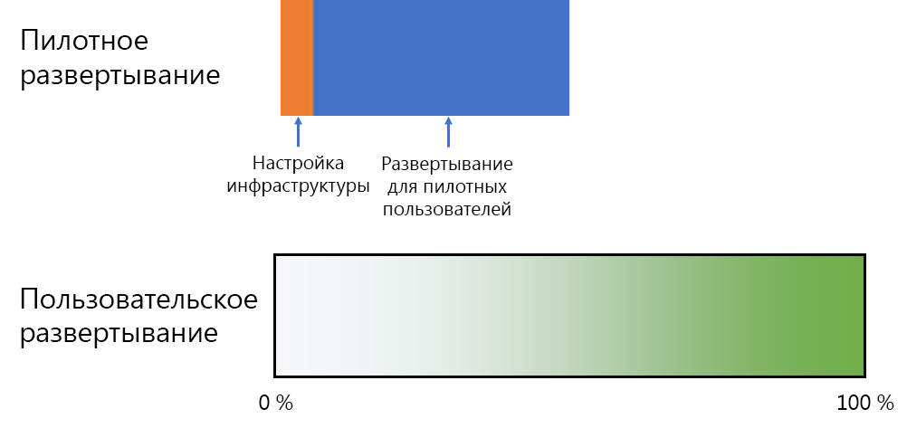
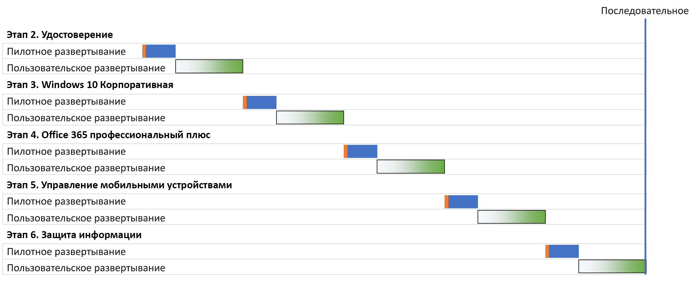
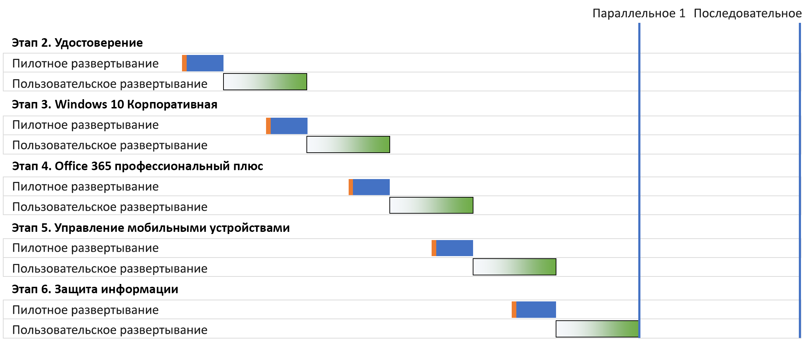
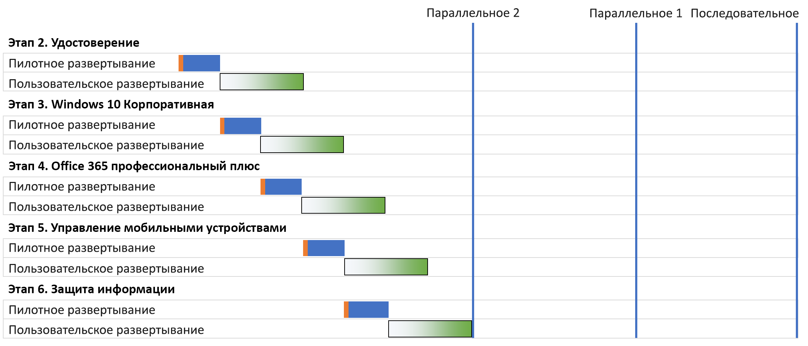

# Стратегии развертывания базовой инфраструктуры Microsoft 365 корпоративныйMicrosoft 365 Enterprise foundation infrastructure deployment strategies

Существует множество способов, с помощью которых можно развернуть этапы [базовой инфраструктуры](deploy-foundation-infrastructure.md) Microsoft 365 корпоративный и реализовать ее возможности, программное обеспечение и службы для пользователей. Чтобы начать управление таким проектом, который может быть масштабным и сложным в зависимости от размера организации и существующей инфраструктуры, рассмотрите указанные ниже стратегии развертывания.There are many ways you can deploy the phases of the [foundation infrastructure](deploy-foundation-infrastructure.md) of Microsoft 365 Enterprise and roll out its capabilities, software, and services to your users. To get you started on the project management of this undertaking, which can be large and complex depending on the size of your organization and its existing infrastructure, consider the following deployment strategies:

- Последовательное развертываниеSerial deployment
- Параллельное развертывание без перекрытия пользовательского развертыванияParallel deployment with non-overlapping user rollout
- Параллельное развертывание с перекрытием пользовательского развертыванияParallel deployment with overlapping user rollout
- Предварительная подготовка инфраструктуры и внедрение комплексной настройкиUp-front infrastructure and rollout of the end-to-end configuration

Используйте эти стратегии для выбора способа управления общим проектом и ускоренной реализации бизнес-преимуществ Microsoft 365 корпоративный.Use these strategies for ideas on how to manage the overall project and more quickly realize the business benefits of Microsoft 365 Enterprise.

>[!Note]
>В этой статье содержатся допущения и упрощения для единообразного способа описания стратегий развертывания. Эти стратегии развертывания являются обобщенными, не подразумевают конкретных временных рамок и не предназначены для применения во всех организациях и ситуациях.This article contains assumptions and simplifications for a consistent way to describe the deployment strategies. These deployment strategies are generalized and are not meant to imply any specific timeframes, nor are they meant to apply to all organizations and situations.
>

## Элементы управления ИТ-проектами для типовых корпоративных организацийElements of IT project management for typical enterprise organizations

ИТ-инфраструктура включает серверные службы, развертывание новых или улучшенных возможностей или установленного программного обеспечения для конечных пользователей. Развертывание ИТ-отделами элементов ИТ-инфраструктуры обычно выполняется систематично. Этапы одного из способов успешного развертывания элемента ИТ-инфраструктуры:IT infrastructure includes both backend services and the rollout of new or improved capabilities or installed software to end users. IT departments typically deploy elements of an IT infrastructure in a methodical way. One approach to the successful deployment of an element of IT infrastructure consists of:

- Пилотное развертываниеA pilot rollout 

  Включает исходную настройку инфраструктуры и развертывание для пилотной группы пользователей, тестирование и последующие изменения в настройке инфраструктуры.This includes initial infrastructure configuration and rollout to a pilot set of users, testing, and subsequent modifications to the infrastructure configuration.

- Пользовательское развертываниеA user rollout

  Включает развертывание для остальной организации на основе областей, отделов, групп и других типов системного распространения настройки или программного обеспечения.This includes the rollout to the rest of your organization based on regions, departments, groups, or other types of systematic propagation of configuration or software.

Группа пользователей в пилотном развертывании отличается от группы пользовательского развертывания.The set of users in the pilot rollout are not the same as those in the user rollout.

В этой статье используются указанные ниже изображения для этих определений.This article uses the following graphics to depict these definitions: 

 

Затенение изображения пользовательского развертывания указывает развертывание в организации от 0 до 100 % с использованием структурного или методичного подхода, например по группам, отделам или областям.The shading for the user rollout graphic indicates the rollout across your organization from 0% to 100% using a structured or methodical approach such as groups, departments, or regions.

## Стратегии развертыванияDeployment strategies

Рассмотрите указанные ниже стратегии развертывания.Consider the following deployment strategies:

- Последовательное развертываниеSerial deployment
- Параллельное развертывание без перекрытия пользовательского развертыванияParallel deployment with non-overlapping user rollout
- Параллельное развертывание с перекрытием пользовательского развертыванияParallel deployment with overlapping user rollout
- Предварительная подготовка инфраструктуры и внедрение комплексной настройкиUp-front infrastructure and rollout of the end-to-end configuration

### Последовательное развертываниеSerial deployment

При последовательном развертывании перед переходом к следующему этапу выполняется полное развертывание текущего этапа с достижением 100 % завершения для всех пользователей. Причины возможного применения этого способа развертывания:With a serial deployment, you completely roll out a phase, allowing the phase to reach 100% completion of deployment to all of your users, before moving on to the next one. Here are some of the reasons why you might deploy this way:

- Устранение рисковRisk mitigation
- Ограничения ресурсовResourcing constraints
- Циклы финансирования ИТ-отделовIT department funding cycles
- Зависимости от ИТ-технологииIT technology dependencies
- Управление изменениями в компании и сопротивление конечных пользователейBusiness change management and end-user resistance

На этой диаграмме Ганта показано упрощенное последовательное развертывание этапов 2–6 базовой инфраструктуры для Microsoft 365 корпоративный.This Gantt chart shows a simplified serial deployment of phases 2-6 of the foundation infrastructure for Microsoft 365 Enterprise.

 
 
Для упрощения обсуждения и примера предполагается, что каждый этап и сегмент развертывания в каждом этапе занимают одинаковое время.To simplify the discussion and example, each phase and deployment segment within each phase are assumed to take the same amount of time.

>[!Note]
>Этап 1. Сетевые подключения базовой инфраструктуры Microsoft 365 корпоративный являются этапом, относящимся только к ИТ-отделу. Пользователи используют преимущества оптимизированного подключения к облачным ресурсам Майкрософт, но не обязаны участвовать в реализации этого этапа.Phase 1: Networking of the Microsoft 365 Enterprise Foundation Infrastructure is an IT department-only phase. Users reap the benefits of optimized connectivity to Microsoft’s cloud resources but are not imposed upon to achieve it.
>

Упрощенный пример опыта пилотного пользователя:Simplified example pilot user experience:

- В декабре пользователю нужно использовать свой смартфон для многофакторной проверки подлинности. (Удостоверение)In December, I need to use my smart phone for MFA. (Identity)
- В марте на компьютере пользователя с Windows 8.1 устанавливается Windows 10 Корпоративная. (Windows 10 Корпоративная)In March, I get Windows 10 Enterprise installed on my Windows 8.1 desktop. (Windows 10 Enterprise)
- В июне для пользователя устанавливается Office 365 профессиональный плюс, заменяющий Office 2013. (Office 365 профессиональный плюс)In June, I get Office 365 ProPlus installed, replacing Office 2013. (Office 365 ProPlus)
- В сентябре выполняется развертывание устройства и применение политик приложения и условного доступа. (Управление мобильными устройствами)In September, I get device enrollment and app and conditional access policies applied. (Mobile device management)
- В декабре для пользователя устанавливается клиент Azure Information Protection и он проходит обучение по применению меток к документам. (Защита информации)In December, I get the Azure Information Protection client installed and get trained on how to apply labels to documents. (Information protection)

В результате обеспечивается периодичность в 90 дней между успешными пилотными развертываниями.The result is a 90-day cadence between successive pilot rollouts.

Упрощенный пример опыта конечного пользователя:Simplified example end-user experience:

- В январе пользователю нужно использовать свой смартфон для многофакторной проверки подлинности. (Удостоверение)In January, I need to use my smart phone for MFA. (Identity)
- В апреле на компьютере пользователя с Windows 8.1 устанавливается Windows 10 Корпоративная. (Windows 10 Корпоративная)In April, I get Windows 10 Enterprise installed on my Windows 8.1 desktop. (Windows 10 Enterprise)
- В июле для пользователя устанавливается Office 365 профессиональный плюс, заменяющий Office 2013. (Office 365 профессиональный плюс)In July, I get Office 365 ProPlus installed, replacing Office 2013. (Office 365 ProPlus)
- В октябре выполняется развертывание устройства и применение политик приложения и условного доступа. (Управление мобильными устройствами)In October, I get device enrollment and app and conditional access policies applied. (Mobile device management)
- В январе следующего года для пользователя устанавливается клиент Azure Information Protection и он проходит обучение по применению меток к документам. (Защита информации)In January of the following year, I get the Azure Information Protection client installed and get trained on how to apply labels to documents. (Information protection)

В результате обеспечивается периодичность в 90 дней между успешными пользовательскими развертываниями.The result is a 90-day cadence between successive user rollouts.

Недостатком этой стратегии развертывания является возможная продолжительность полного развертывания базовой инфраструктуры Microsoft 365 корпоративный.The disadvantage to this deployment strategy is that it can take a long time to fully deploy the Microsoft 365 Enterprise foundation infrastructure.

### Параллельное развертывание без перекрытия пользовательского развертывания (параллельное 1)Parallel deployment with non-overlapping user rollout (Parallel 1)

При этой стратегии пилотное развертывание следующего этапа начинается на последнем шаге пользовательского развертывания текущего этапа. Ниже представлено развертывание этапов 2–6 при выполнении пилотного развертывания во время завершения пользовательского развертывания предыдущего этапа.For this deployment strategy, you start the pilot rollout of the next phase during the last part of the user rollout of the current phase. Here is the deployment of phases 2-6 when the pilot rollout occurs as the user rollout of the previous phase is wrapping up.

Ниже приведено упрощенное сравнение стратегий параллельного и последовательного развертывания.Here is a simplified comparison between parallel and serial deployment strategies.

 
 
Итоговым результатом является завершение в организации пользовательского развертывания текущего этапа до начала следующего. Пользователи, не участвующие в пилотных развертываниях, не сталкиваются с одновременным развертыванием нескольких этапов, но пилотные развертывания выполняются параллельно с пользовательскими.The end result is that user rollout for the current phase completes across your organization before the next one starts. Users that are not in pilot rollouts are not dealing with the rollouts of multiple phases at the same time, but pilot rollouts are done in parallel with user rollouts.

Упрощенный пример опыта пилотного пользователя:Simplified example pilot user experience: 

- В декабре пользователю нужно использовать свой смартфон для многофакторной проверки подлинности. (Удостоверение)In December, I need to use my smart phone for MFA. (Identity)
- В феврале на компьютере пользователя с Windows 8.1 устанавливается Windows 10 Корпоративная. (Windows 10 Корпоративная)In February, I get Windows 10 Enterprise installed on my Windows 8.1 desktop. (Windows 10 Enterprise)
- В апреле для пользователя устанавливается Office 365 профессиональный плюс, заменяющий Office 2013. (Office 365 профессиональный плюс)In April, I get Office 365 ProPlus installed, replacing Office 2013. (Office 365 ProPlus)
- В июне выполняется развертывание устройства и применение политик приложения и условного доступа. (Управление мобильными устройствами)In June, I get device enrollment and app and conditional access policies applied. (Mobile device management)
- В августе для пользователя устанавливается клиент Azure Information Protection и он проходит обучение по применению меток к документам. (Защита информации)In August, I get the Azure Information Protection client installed and get trained on how to apply labels to documents. (Information protection)

В результате обеспечивается периодичность в 60 дней между успешными пилотными развертываниями.The result is a 60-day cadence between successive pilot rollouts.

Упрощенный пример опыта конечного пользователя:Simplified example end-user experience:

- В январе пользователю нужно использовать свой смартфон для многофакторной проверки подлинности. (Удостоверение)In January, I need to use my smart phone for MFA. (Identity)
- В марте на компьютере пользователя с Windows 8.1 устанавливается Windows 10 Корпоративная. (Windows 10 Корпоративная)In March, I get Windows 10 Enterprise installed on my Windows 8.1 desktop. (Windows 10 Enterprise)
- В мае для пользователя устанавливается Office 365 профессиональный плюс, заменяющий Office 2013. (Office 365 профессиональный плюс)In May, I get Office 365 ProPlus installed, replacing Office 2013. (Office 365 ProPlus)
- В июле выполняется развертывание устройства и применение политик приложения и условного доступа. (Управление мобильными устройствами)In July, I get device enrollment and app and conditional access policies applied. (Mobile device management)
- В сентябре для пользователя устанавливается клиент Azure Information Protection и он проходит обучение по применению меток к документам. (Защита информации)In September, I get the Azure Information Protection client installed and get trained on how to apply labels to documents. (Information protection)

В результате обеспечивается периодичность в 60 дней между успешными пользовательскими развертываниями.The result is a 60-day cadence between successive user rollouts.

Преимущество этой стратегии развертывания заключается в возможности быстрее выполнить полное развертывание базовой инфраструктуры Microsoft 365 корпоративный без необходимости ИТ-отделу и пользователям сталкиваться с несколькими развертываниями одновременно.The advantage to this deployment strategy is that it can take less time to fully deploy the Microsoft 365 Enterprise foundation infrastructure, without having your IT department and users deal with multiple rollouts the same time.

### Параллельное развертывание с перекрытием пользовательского развертывания (параллельное 2)Parallel deployment with overlapping user rollout (Parallel 2)

При этой стратегия развертывания вы начинаете:For this deployment strategy, you start the:

- пилотное развертывание следующего этапа во время последней части пользовательского развертывания текущего этапа.Pilot rollout of the next phase during the last part of the user rollout of the current phase.
- пользовательское развертывание следующего этапа во время пользовательского развертывания текущего этапа таким образом, что пользователям не приходится сталкиваться одновременным развертыванием нескольких этапов. Предполагается, что развертывание каждого этапа базовой инфраструктуры выполняется аналогично (по областям, отделам или другим единицам).User rollout of the next phase during the user rollout of the current phase in such a way that no user is dealing with the rollouts of multiple phases at the same time. This assumes that you are rolling out each phase of the foundation infrastructure in the same way, via regions, departments, or other.

Ниже приведено упрощенное сравнение разных стратегий развертывания.Here is a simplified comparison between the different deployment strategies.

 

Итоговый результат:The end result is that:

- Переход пилотных развертываний с одного этапа на следующий выполняется без задержек.Pilot rollouts go from one phase to the next without a pause.
- Пользовательское развертывание для этапа начинается до завершения пользовательского развертывания предыдущего этапа, но отдельные пользователи не выполняют одновременное развертывание нескольких этапов.The user rollout for a phase begins before the completion of the user rollout of the previous phase, but no individual user is rolling out more than one phase at a time.

Упрощенный пример опыта пилотного пользователя:Simplified example pilot user experience: 

- В декабре пользователю нужно использовать свой смартфон для многофакторной проверки подлинности. (Удостоверение)In December, I need to use my smart phone for MFA. (Identity)
- В январе на компьютере пользователя с Windows 8.1 устанавливается Windows 10 Корпоративная. (Windows 10 Корпоративная)In January, I get Windows 10 Enterprise installed on my Windows 8.1 desktop. (Windows 10 Enterprise)
- В феврале для пользователя устанавливается Office 365 профессиональный плюс, заменяющий Office 2013. (Office 365 профессиональный плюс)In February, I get Office 365 ProPlus installed, replacing Office 2013. (Office 365 ProPlus)
- В марте выполняется развертывание устройства и применение политик приложения и условного доступа. (Управление мобильными устройствами)In March, I get device enrollment and app and conditional access policies applied. (Mobile device management)
- В апреле для пользователя устанавливается клиент Azure Information Protection и он проходит обучение по применению меток к документам. (Защита информации)In April, I get the Azure Information Protection client installed and get trained on how to apply labels to documents. (Information protection)

В результате обеспечивается периодичность в 30 дней между успешными пилотными развертываниями.The result is a 30-day cadence between successive pilot rollouts.

Упрощенный пример опыта конечного пользователя:Simplified example end-user experience:

- В январе пользователю нужно использовать свой смартфон для многофакторной проверки подлинности. (Удостоверение)In January, I need to use my smart phone for MFA. (Identity)
- В феврале на компьютере пользователя с Windows 8.1 устанавливается Windows 10 Корпоративная. (Windows 10 Корпоративная)In February, I get Windows 10 Enterprise installed on my Windows 8.1 desktop. (Windows 10 Enterprise)
- В марте для пользователя устанавливается Office 365 профессиональный плюс, заменяющий Office 2013. (Office 365 профессиональный плюс)In March, I get Office 365 ProPlus installed, replacing Office 2013. (Office 365 ProPlus)
- В апреле выполняется развертывание устройства и применение политик приложения и условного доступа. (Управление мобильными устройствами)In April, I get device enrollment and app and conditional access policies applied. (Mobile device management)
- В мае для пользователя устанавливается клиент Azure Information Protection и он проходит обучение по применению меток к документам. (Защита информации)In May, I get the Azure Information Protection client installed and get trained on how to apply labels to documents. (Information protection)

В результате обеспечивается периодичность в 30 дней между успешными пользовательскими развертываниями.The result is a 30-day cadence between successive user rollouts.

Преимущество этой стратегии развертывания заключается в возможности еще быстрее выполнить полное развертывание базовой инфраструктуры Microsoft 365 корпоративный без необходимости отдельным пользователям сталкиваться с несколькими развертываниями одновременно. Но для пользователей отсутствует перерыв между успешно выполненными этапами.The advantage to this deployment strategy is that it can take even less time to fully deploy the Microsoft 365 Enterprise foundation infrastructure, still without having individual users deal with multiple rollouts the same time. However, users don’t get a break between successive phases.

### Предварительная настройка инфраструктуры и внедрение комплексной настройкиUp-front infrastructure and rollout of end-to-end configuration

Для небольших организаций с возможностью сжатия этапов 2–6 в один сегмент развертывания итоговое развертывание выглядит представленным ниже образом.For smaller organizations with the ability to compress phases 2-6 into a single deployment segment, the resulting deployment looks like this:
 
 

ИТ-отдел настраивает инфраструктуру для этапов 2–6, а затем развертывает ее для пилотных пользователей, чтобы проверить комплексные функции. Например, пилотные пользователи получают все эти функциональные возможности одновременно:The IT department configures the infrastructure for phases 2-6, then rolls out to the pilot users to check for the end-to-end functionality. For example, pilot users get all of this functionality at the same time:

- многофакторная проверка подлинности и другие функции удостоверений (удостоверение);MFA and other identity features (Identity)
- Windows 10 Корпоративная на устройствах с Windows (Windows 10 Корпоративная);Windows 10 Enterprise on Windows devices (Windows 10 Enterprise)
- Office 365 профессиональный плюс для набора Office (Office 365 профессиональный плюс);Office 365 ProPlus for the Office suite (Office 365 ProPlus)
- политики приложения и условного доступа (управление мобильными устройствами);App and conditional access policies (Mobile device management)
- установленный клиент Azure Information Protection и обучение по применению меток к документам (защита информации).Azure Information Protection client installed and training on how to apply labels to documents (Information protection)

После завершения пилотного развертывания начинается пользовательское развертывание, при котором пользователь получает все функциональные возможности одновременно.Once the pilot rollout is concluded, the user rollout begins in which each user gets all the functionality the same time.

## Дальнейшие действияNext step

Начните развертывание Microsoft 365 корпоративный в [базовой инфраструктуре](deploy-foundation-infrastructure.md).Start your deployment of Microsoft 365 Enterprise with the [foundation infrastructure](deploy-foundation-infrastructure.md).
