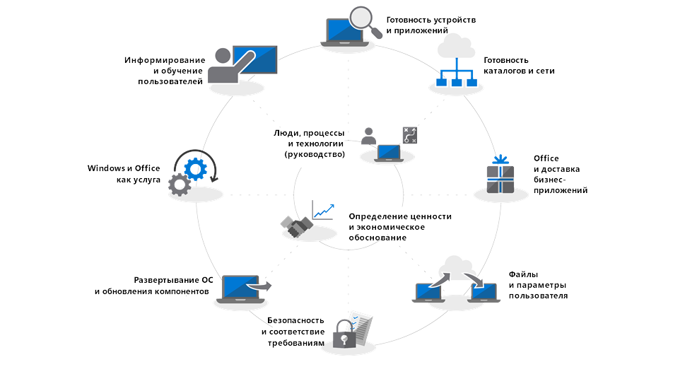

# Центр развертывания современных компьютеров

Выполните эти инструкции для планирования и осуществления крупномасштабного развертывания Windows 10 и Office 365 профессиональный плюс. Все указанные ниже действия являются частью общего процесса планирования и развертывания. Действия обычно выполняются параллельно при поэтапном развертывании. Скачайте бесплатный набор [Modern Desktop Deployment and Management Lab Kit](https://aka.ms/howtoshiftlabs), чтобы попрактиковаться с инструментами, выделенными в процессе развертывания.

 

<table>
<tr class="even">
<td></td>
<td>
<strong><a href="https://aka.ms/mdd0">Начало работы. Руководство по пользователям, процессу и технологии</a></strong>

Узнайте о преимуществах современных компьютеров, значительных изменениях и рекомендациях по сравнению с предыдущими развертываниями, а также советах по обеспечению плавного перехода на Windows 10 и Office 365 профессиональный плюс.
</td>
<td></td>
</tr>
<tbody>
<tr class="odd">
<td></td>
<td>
<strong><a href="https://aka.ms/mdd1">Шаг 1. Проверка готовности устройств и приложений</a></strong>

Начните проект развертывания компьютера с инвентаризации устройств и приложений, определите приоритеты, протестируйте приоритетные приложения и устройства, а затем исправьте необходимые элементы, чтобы подготовиться к развертыванию.
</td>
<td></td>
</tr>
<tr class="even">
<td></td>
<td>
<strong><a href="https://aka.ms/mdd2">Шаг 2. Проверка готовности каталогов и сети</a></strong>

Облачные службы в Office 365 профессиональный плюс и новые возможности развертывания, например Windows Autopilot, требуют Azure Active Directory. Сеть и подключение также важны для планирования при перемещении изображений, приложений, драйверов и соответствующих файлов Windows на ваш компьютер. Узнайте, как новые инструменты и возможности развертывания уменьшают и оптимизируют сетевой трафик.
</td>
<td></td>
</tr>
<tr class="odd">
<td></td>
<td>
<strong><a href="https://aka.ms/mdd3">Шаг 3. Доставка приложений Office и бизнес-приложений</a></strong>

Убедитесь, что приложения упакованы и готовы для автоматической установки. Узнайте, как упаковка по технологии "нажми и работай" с использованием Office 365 профессиональный плюс предоставляет новые возможности для настройки, установки и обновления приложений Office.
</td>
<td></td>
</tr>
<tr class="even">
<td></td>
<td>
<strong><a href="https://aka.ms/mdd4">Шаг 4. Файлы и параметры пользователей</a></strong>

При обновлении или замене компьютера, сэкономьте время путем автоматизации резервного копирования и восстановления состояния пользователя. Новые возможности облачной синхронизации файлов позволяют выполнять для каждого пользователя синхронизацию с OneDrive папок рабочего стола, документов и изображений для удобного доступа к файлам из новых экземпляров Windows.
</td>
<td></td>
</tr>
<tr class="odd">
<td></td>
<td>
<strong><a href="https://aka.ms/mdd5">Шаг 5. Вопросы по безопасности и соответствию требованиям</a></strong>

Windows 10 и Office 365 профессиональный плюс предоставляют новые способы защиты данных, устройств и пользователей, а также быстрого выявления угроз и реагирования на них. Кроме того, узнайте, как устранять распространенные проблемы, связанные с шифрованием дисков, приложениями для защиты от вредоносных программ и политиками при переходе на Windows 10.
</td>
<td></td>
</tr>
<tr class="even">
<td></td>
<td>
<strong><a href="https://aka.ms/mdd6">Шаг 6. Обновления компонентов и развертывание ОС</a></strong>

Развертывание на основе последовательности задач используется для автоматизации крупномасштабного, поэтапного развертывания исходного состояния системы, обновления и замены компьютеров. Последовательность задач при обновлении помогает также не забывать установить значительные полугодичные обновления. Windows Autopilot — это недавнее дополнение, оптимизирующее процесс приобретения нового компьютера.
</td>
<td></td>
</tr>
<tr class="odd">
<td></td>
<td>
<strong><a href="https://aka.ms/mdd7">Шаг 7. Подготовка к модели "Windows и Office как услуга"</a></strong>

В Windows 10 и Office 365 профессиональный плюс постоянно добавляются новые функции, чтобы развивать пользовательский интерфейс и средства безопасности в соответствии с новейшими инновациями. Узнайте, как обеспечивать актуальность с помощью полугодичных и ежемесячных обновлений, как работают новые модели обслуживания и какие у вас есть инструменты и возможности.
</td>
<td></td>
</tr>
<tr class="even">
<td></td>
<td>
<strong><a href="https://aka.ms/mdd8">Шаг 8. Информирование и обучение пользователей</a></strong>

Убедитесь, что пользователи уведомлены о новых возможностях и способах работы при переходе на Windows 10 и Office 365 профессиональный плюс. Узнайте, как воспользоваться помощью по адаптации пользователей с применением Microsoft FastTrack, обучающими материалами, шаблонами для общения, а также новыми способами отслеживать принятие и использование продуктов пользователями.
</td>
<td></td>
</tr>
<tr class="odd">
<td></td>
<td>
<strong><a href="https://transform.microsoft.com" target="_blank">Обеспечение поддержки руководителей: определение ценности и экономическое обоснование</a></strong>

Если вы изучили развертывание, оценили готовность приложения и устройства, подготовили план развертывания и начали процесс развертывания, но не имеете поддержки и необходимых ресурсов от руководства для соблюдения сроков развертывания, вам могут помочь программы Business Value корпорации Майкрософт. Узнайте, как выполнить экономическое обоснование для развертывания современного компьютера и привлечь сотрудников к проекту.
</td>
<td></td>
</tr>
</tbody>
</table>
