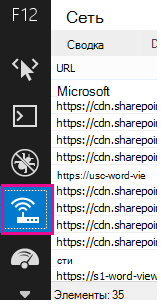
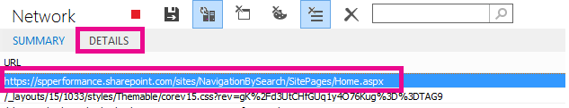

# Диагностика проблем производительности в SharePoint Online

В этой статье показано, как можно диагностировать распространенные проблемы с сайтом SharePoint Online с помощью средств разработчика Internet Explorer.
  
Существует три разных способа определить, что страница на сайте SharePoint Online имеет проблемы с производительностью, связанную с настройками.
  
- Сетевой монитор панели инструментов F12

- Сравнение с ненастраиваемым базовым планом

- Метрики заголовков ответа SharePoint Online

В этом разделе описывается, как использовать каждый из этих методов для диагностики проблем с производительностью. Определив причину проблемы, вы можете работать над решением, используя статьи о повышении производительности SharePoint, на которых можно найти https://aka.ms/tune .
  
## Использование панели инструментов F12 для диагностики производительности в SharePoint Online

В этой статье мы используем Internet Explorer 11. В версиях средств разработчика F12 в других браузерах есть похожие функции, хотя они могут выглядеть немного иначе. Сведения о средствах разработчика F12 приведены в следующих статьях:
  
- [Новые возможности средств F12](https://go.microsoft.com/fwlink/p/?LinkId=522545)

- [Использование средств разработчика F12](https://go.microsoft.com/fwlink/p/?LinkId=522546)

Чтобы открыть инструменты разработчика, нажмите клавишу **F12** , а затем щелкните значок Wi/Fi:
  

  
На вкладке **сеть** нажмите зеленую кнопку проигрывания, чтобы загрузить страницу. Средство возвращает все файлы, запрашиваемые браузером, чтобы получить запрашиваемую страницу. На следующем снимке экрана показан один из таких списков.
  

  
Кроме того, можно просмотреть время загрузки файлов в правой части, как показано на снимке экрана.
  

  
Это позволяет получить визуальное представление о том, сколько времени заняло Загрузка файла. Зеленая линия показывает, когда страница готова к отображению в браузере. Это может привести к быстрому просмотру различных файлов, которые могут вызывать снижение загрузки страниц на сайте.
  
## Настройка не настраиваемого базового плана для SharePoint Online

Лучший способ определить производительность сайта слабые точки — настроить полностью готовое семейство сайтов в SharePoint Online. Таким образом вы можете сравнить все различные аспекты сайта с тем, что не нужно настраивать на странице. Домашняя страница OneDrive для бизнеса — это хороший пример отдельного семейства веб-сайтов, для которого вряд ли настроены какие-либо настройки.
  
## Просмотр сведений о заголовках ответа SharePoint

В SharePoint Online можно получить доступ к сведениям, которые отправляются обратно в браузер в заголовке ответа для каждого файла. Наиболее полезное значение для диагностики проблем с производительностью — **SPRequestDuration**, в котором отображается время, в течение которого запрос обрабатывается на сервере. Это поможет определить, является ли запрос очень большим и интенсивным для ресурсов. Это оптимальное понимание того, сколько работы выполняет сервер для обслуживания страницы.

### Просмотр сведений о заголовке ответа SharePoint
  
1. Убедитесь, что у вас установлены средства F12. Более подробную информацию о загрузке и установке этих средств можно узнать [в статье новые возможности средств F12](https://go.microsoft.com/fwlink/p/?LinkId=522545).

2. В инструментах F12 на вкладке **сеть** нажмите зеленую кнопку проигрывания, чтобы загрузить страницу.

3. Щелкните один из файлов. aspx, возвращенных средством, а затем нажмите кнопку **сведения**.

    
  
4. Щелкните **заголовки ответа**.

    
  
## Что вызывает проблемы с производительностью в SharePoint Online?

[Параметры навигации по статье для SharePoint Online](navigation-options-for-sharepoint-online.md) показаны пример использования значения SPRequestDuration для определения того, что сложная структурная навигация привела к длительному времени для обработки страницы на сервере. Принимая значение для базового сайта (без настройки), можно определить, занимается ли заданный файл длительное время для загрузки. Пример, используемый в [параметрах навигации для SharePoint Online](navigation-options-for-sharepoint-online.md) , — это файл main. aspx. В этом файле содержится большая часть кода ASP.NET, который выполняется при загрузке страницы. В зависимости от используемого шаблона сайта может быть Start. aspx, Home. aspx, Default. aspx или другое имя, если вы настроите домашнюю страницу. Если это число значительно выше, чем у базового сайта, это хорошо указывает на то, что на странице возникла какая-то сложность, которая вызывает проблемы с производительностью.
  
После того как вы определили, что проблема связана с вашим сайтом, рекомендуемый способ выяснить, что вызывает низкую производительность — устранить все возможные причины, например настройки страницы, а затем добавить их обратно на сайт по одному. После удаления достаточной настройки, которая хорошо работает на странице, можно добавить отдельные настройки по одному.
  
Например, если у вас очень сложная навигация, попробуйте изменить навигацию, чтобы не показывать дочерние сайты, а затем проверьте, не изменились ли другие средства разработчика. Если вы используете большой объем контента, попробуйте удалить их со страницы и проверить, улучшается ли эта проблема. Если вы устраните все возможные причины и добавите их по одному, вы можете легко определить, какие функции являются крупнейшими проблемами, а затем работать над решением.
