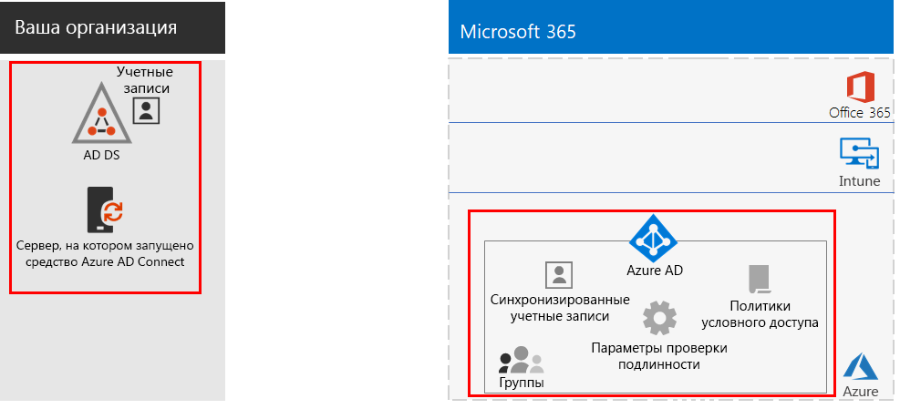
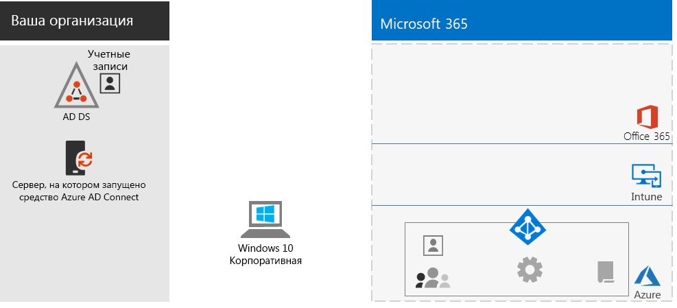
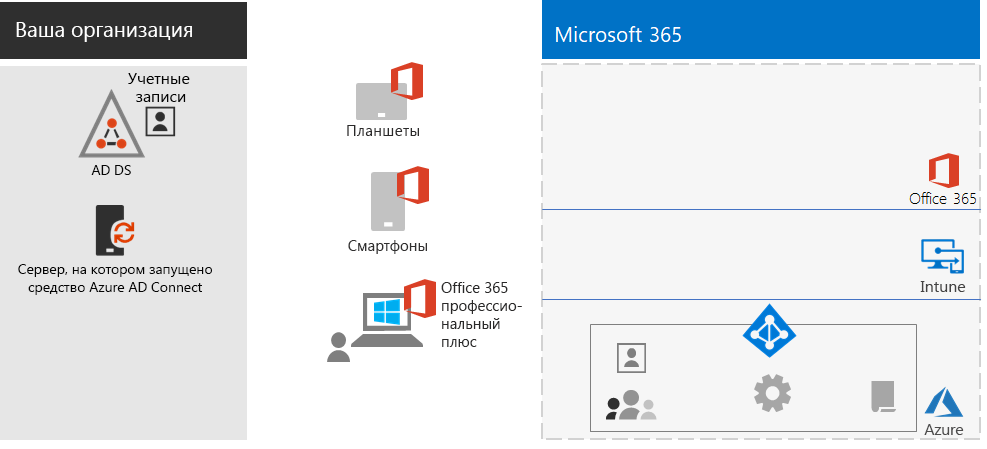
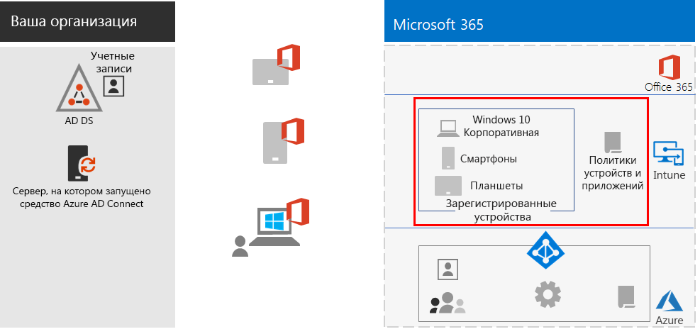
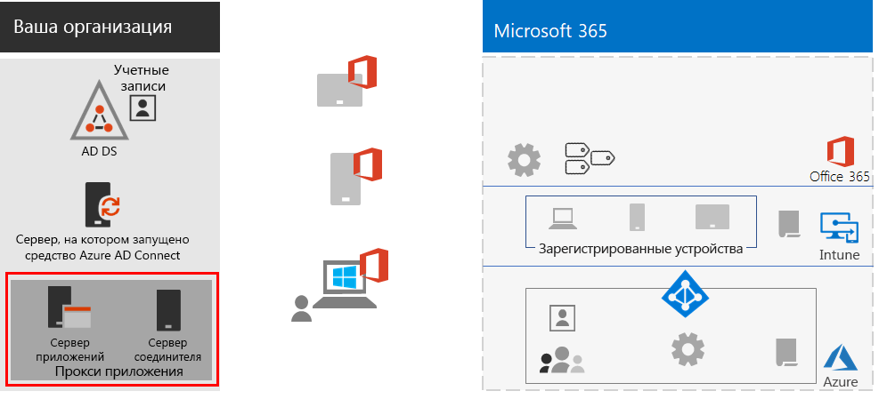
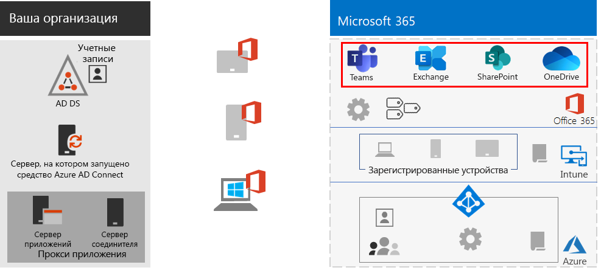
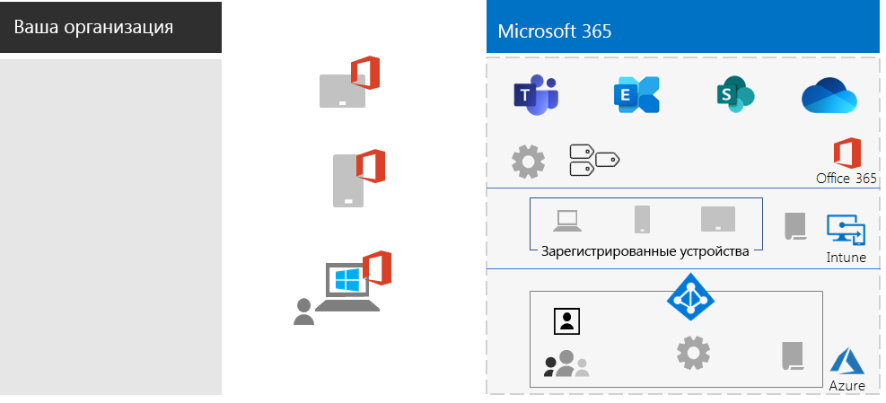

# Возможности для удаленных работников

*Этот сценарий применяется к планам E3 и E5 Microsoft 365 корпоративный.*

Возможность эффективной и безопасной работы сотрудников вдали от офиса важна для многих организаций и позволяет уменьшить размеры офисов, нанимать и удерживать сотрудников, не готовых к переезду, и сократить время поездок на работу, что предоставляет больше времени для продуктивной работы и расслабляющего отдыха после нее.

Удаленная работа, также называемая дистанционной работой, может включать следующее:

- Сотрудники, периодически находящиеся вне офиса на конференциях или собраниях с клиентами.
- Некоторые сотрудники, постоянное работающие удаленно.
- Полностью удаленная организация, в которой нет офиса и все сотрудники являются удаленными.

Для поддержки удаленных работников в Microsoft 365 корпоративный имеется сочетание функций, позволяющее им эффективно сотрудничать, например:

- Собрания по сети и сеансы чата.
- Общие рабочие области для облачного хранилища файлов с глобальным доступом и взаимодействием в режиме реального времени.
- Общие задачи и рабочие процессы для разделения работы и выполнения целей.

Для надежной защиты Microsoft 365 корпоративный включает:

- Требования принудительной проверки проверка подлинности, обнаружение рискованных входов и реагирование на них, блокирование выбранных приложений и устройств, не соответствующих требованиям.
- Зашифрованные подключения и цифровые ресурсы в облаке.
- Разрешения, чтобы определять, кто и какие действия может выполнять с файлами.
- Защита от потери данных (DLP) для предотвращения утечек строго регулируемых данных.

Чтобы соблюдать эти условия для удаленных сотрудников, используйте следующие возможности Microsoft 365 корпоративный:

- Удостоверение пользователя и безопасность входа
  - Учетные записи пользователей Azure Active Directory (Azure AD) с многофакторной проверкой подлинности (MFA)
  - Политики условного доступа с целью обязательного применения MFA для рискованных входов
- Платформы для совместной работы
  - Microsoft Teams, SharePoint и OneDrive, с помощью которых удаленные работники могут планировать собрания и участвовать в видеособраниях по сети, а также одновременно работать над одним документом
- Безопасный доступ к ресурсам
  - Группы и разрешения для Teams, сайтов SharePoint и OneDrive, чтобы доступ предоставлялся только прошедшим проверку подлинности пользователям с соответствующими разрешениями
- Защита от утечки файлов
  - Политики защиты от потери данных в Office 365
  - Метки конфиденциальности для шифрования и разрешения, передаваемые с файлами
- Управление устройствами и обеспечение безопасности с использованием Microsoft Intune
  - Регистрация управляемых устройств
  - Параметры приложений для личных устройств
  - Политики устройств и приложений
- Приложения для устройств, предназначенные для эффективной работы
  - Приложения Office 365 профессиональный плюс для совместной работы в Teams, SharePoint и OneDrive 
- Windows 10 Корпоративная
  - Комплексные функции безопасности для защиты от кибератак и предотвращения утечки данных
- Доступ к локальным приложениям
  - В организациях с гибридными удостоверениями могут использоваться прокси-приложения Azure AD вместо подключений по виртуальной частной сети (VPN)

Следующие этапы являются пошаговым развертыванием функции Microsoft 365 корпоративный для удаленного доступа и ее внедрения для удаленных работников. Если вы уже развернули элементы из этих этапов, убедитесь в их соответствии указанным требованиям перед переходом к следующему элементу.

 1-страничное краткое описание этого сценария приведено на [плакате "Возможности для удаленных работников"](media/empower-people-to-work-remotely/empower-remote-workers-scenario.pdf).

Вы также можете скачать этот плакат в формате [PDF](https://github.com/MicrosoftDocs/microsoft-365-docs/raw/public/microsoft-365/enterprise/media/empower-people-to-work-remotely/empower-remote-workers-scenario.pdf) или [PowerPoint](https://github.com/MicrosoftDocs/microsoft-365-docs/raw/public/microsoft-365/enterprise/media/empower-people-to-work-remotely/Empower-Remote-Workers-Poster.pptx) и распечатать его на бумаге размера letter, legal или tabloid (11 x 17).

## Этап 1. Развертывание функций и возможностей Microsoft 365 для удаленных сотрудников

Так как для этого сценария требуется большое число разнообразных функций и возможностей, мы предоставляем пошаговые инструкции по обязательным элементам разделов базовой инфраструктуры и рабочих нагрузок из [руководства по развертыванию Microsoft 365 корпоративный](deploy-microsoft-365-enterprise.md).

### Шаг 1. Требования к базовой инфраструктуре для удаленных работников

На этом шаге рассматриваются этапы [базовой инфраструктуры](deploy-foundation-infrastructure.md) и перечисляются обязательные элементы для поддержки удаленных работников.

Для [этапа 2 (идентификация)](identity-infrastructure.md) разверните следующие компоненты удостоверений пользователей и безопасности входа:

- Для гибридных удостоверений: учетные записи пользователей и группы, синхронизированные из локальных доменных служб Active Directory (AD DS).
- Для назначения разрешений: синхронизированные группы или группы Azure AD с соответствующими участниками.
- Параметры проверки подлинности, например обязательная многофакторная проверка подлинности.
- Политики условного доступа с целью обязательного применения многофакторной проверки подлинности для рискованных входов и блокировка клиентов, не поддерживающих современную проверку подлинности

Ниже представлена итоговая конфигурация с выделенными элементами идентификации.

 
Для [этапа 3 (Windows 10 Корпоративная)](windows10-infrastructure.md) разверните следующие элементы:

- Инфраструктура развертывания новых устройств с Windows 10 Корпоративная и модернизации устройств с Windows 7 или Windows 8.1 до Windows 10 Корпоративная
- Поддержка функций комплексной безопасности для защиты удостоверений, информации и защиты от угроз

Ниже представлена итоговая конфигурация для устройств с Windows 10 Корпоративная.

 
Для [этапа 4 (Office 365 профессиональный плюс)](office365proplus-infrastructure.md) разверните инфраструктуру для установки Office 365 профессиональный плюс или обновите установленный набор Office, например Office 2010 или Office 2013, до Office 365 профессиональный плюс на устройствах организации. Это обеспечит для пользователей наилучшую защиту и возможности совместной работы.

Ниже представлена итоговая конфигурация с набором Office 365 профессиональный плюс, установленным на устройствах.

 
Для [этапа 5 (управление мобильными устройствами)](mobility-infrastructure.md) разверните управление устройствами и приложениями Intune с целью применения следующих возможностей:

- Регистрация устройств с Windows 10 Корпоративная, iOS, macOS, Android и Android Enterprise, чтобы они получали компоненты и параметры безопасности, определенные в вашей организации.
- Параметры приложений для дополнительной защиты, а также для разрешения или блокирования приложений даже на личных устройствах сотрудников.
- Политики соответствия требованиям с условным доступом для предотвращения подключения устройств, не соответствующих требованиям.

Ниже приведена итоговая конфигурация с выделенными устройствами и политиками, зарегистрированными в Intune.

 
Для [этапа 6 (защита данных)](infoprotect-infrastructure.md) разработайте и настройте защиту цифровых ресурсов с помощью следующих элементов:

- Политики защиты от потери данных в Office 365.
- Метки конфиденциальности Office 365 для шифрования и разрешения, передаваемые с файлами.

Ниже приведена итоговая конфигурация с выделенными метками конфиденциальности и политиками защиты от потери данных.

 
Для доступа к локальным приложениям можно использовать [прокси-приложение Azure AD](https://docs.microsoft.com/azure/active-directory/manage-apps/application-proxy), для которого требуется среда гибридной идентификации.

Ниже представлена итоговая конфигурация с выделенными компонентами прокси-приложения.

 
### Шаг 2. Рабочие нагрузки для удаленных работников

[Exchange Online](exchangeonline-workload.md): разверните для каждого пользователя почтовые ящики Exchange Online.

[Teams](teams-workload.md): разверните приложение Teams для своих пользователей и групп.

[SharePoint и OneDrive](sharepoint-online-onedrive-workload.md): разверните сайты групп или информационные сайты SharePoint и папки OneDrive.

Ниже представлена итоговая конфигурация с выделенными рабочими нагрузками.

 
### Результаты развертывания

Возможности для удаленных работников после развертывания базовой инфраструктуры и рабочих нагрузок, а также развертывания Windows 10 Корпоративная и Office 365 профессиональный плюс:

- Применение надежной проверки подлинности и защиты удостоверений.
- Наличие последней и самой безопасной версии Windows на устройствах.
- Наличие последней и максимально эффективной версии набора Office на устройствах.
- Применение управления приложениями и политик соответствия требованиям для устройств.
- Применение политик и ограничений для защиты от потери данных.
- Возможность назначения меток конфиденциальности для шифрования и разрешений, передаваемых с файлами и по электронной почте.
- Доступ к локальным приложениям без VPN-подключения.
- Возможность выполнять работу и сотрудничать с коллегами в режиме реального времени с помощью чатов, собраний и файлов в Teams, а также файлов в SharePoint и OneDrive.

В автономном режиме (без подключения к Интернету) удаленные работники могут изменять локальные копии файлов. При появлении подключения к Интернету служба OneDrive синхронизирует локальные копии с файлами, хранящимися в вашей подписке на Microsoft 365. 

Ниже приведена итоговая конфигурация для удаленных работников организации при использовании гибридных удостоверений.

 
 
Ниже приведена итоговая конфигурация для удаленных работников организации при использовании облачных удостоверений.

## Этап 2. Внедрение возможностей среди удаленных работников

Теперь, когда развернута базовая инфраструктура и рабочие нагрузки, пора внедрить регулярное применение этих возможностей среди удаленных работников, чтобы обеспечивать их производительность в любом месте и в любое время.

### Шаг 1. Обучение пользователей

Цели при обучении удаленных работников:

- Правильные процедуры входа в систему, включая регистрацию в службе многофакторной проверки подлинности и способ проверки входов при обнаружении риска.
- Использование устройств и способ применения политик для блокирования доступа к устройствам, не соответствующим требованиям.
- Использование разрешенных приложений и способ применения политик приложений Intune для блокирования приложений.
- Функции безопасности Windows 10 Корпоративная.
- Способы использования Outlook для работы с электронной почтой и календарем.
- Способы использования [Teams](https://docs.microsoft.com/microsoftteams/training-microsoft-teams-landing-page) для ведения чатов, видеоконференций, обмена документами и цепочек обсуждений.
- Способы использования сайтов групп и информационных сайтов SharePoint и папок OneDrive для поиска файлов в библиотеке пользователя и группы.
- Способы использования и применения меток конфиденциальности к файлам с конфиденциальными или строго регулируемыми данными для локальных и сетевых версий файлов.

В программу такого обучения следует включить практические занятия, где обучающиеся смогут опробовать эти возможности и ознакомиться с результатами.

### Шаг 2. Проведение периодических проверок использования и ответы на отзывы работников

В последующие за обучением недели:

- Быстро рассмотрите отзывы удаленных сотрудников и отрегулируйте политики и настройки.
- Проанализируйте использование команд, сайтов SharePoint и папок OneDrive и сравните их с предполагаемым использованием.
- Убедитесь в правильном применении соответствующих меток конфиденциальности для конфиденциальных и строго регулируемых файлов.

При необходимости следует провести повторное обучение пользователей.

### Результаты адаптации пользователей к новым требованиям

Удаленные сотрудники могут использовать свои устройства с Windows 10 Корпоративная или другие устройства и службу Office 365 профессиональный плюс для доступа к общим облачным службам и ресурсам Microsoft 365 корпоративный, а также для работы с ними в защищенной среде. Они также могут проводить собрания, создавать и совместно работать в режиме реального времени.

## См. также

[Рабочие нагрузки и сценарии](deploy-workloads.md)

[Microsoft 365 Productivity Library](https://aka.ms/productivitylibrary) (https://aka.ms/productivitylibrary)

[Руководство по развертыванию](deploy-microsoft-365-enterprise.md)
