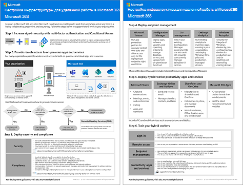

# Возможности для удаленных работниковEmpower remote workers

*Этот сценарий применяется к планам E3 и E5 Microsoft 365 корпоративный.**This scenario applies to both the E3 and E5 versions of Microsoft 365 Enterprise*

Возможность эффективной и безопасной работы сотрудников вдали от офиса важна для многих организаций и позволяет уменьшить размеры офисов, нанимать и удерживать сотрудников, не готовых к переезду, и сократить время поездок на работу, что предоставляет больше времени для продуктивной работы и расслабляющего отдыха после нее.Allowing employees to work away from the office seamlessly and securely is important for many organizations to save on office space, hire and retain employees who are unwilling to relocate, and reduce employee commuting, leaving them with more time to be productive and for stress-reducing activities outside of work.

Удаленная работа, также называемая дистанционной работой, может включать следующее:Remote working, also known as teleworking, can span a spectrum that includes:

- Сотрудники, периодически находящиеся вне офиса на конференциях или собраниях с клиентами.Employees that are occasionally away from the office for conferences or client meetings.
- Некоторые сотрудники, постоянное работающие удаленно.Some employees that work remotely full-time.
- Полностью удаленная организация, в которой нет офиса и все сотрудники являются удаленными.A fully remote organization in which there is no office and all employees are remote.

Для поддержки удаленных работников в Microsoft 365 корпоративный имеется сочетание функций, позволяющее им эффективно сотрудничать, например:To support remote workers, a combination of features in Microsoft 365 Enterprise enables your remote workers in a highly collaborative way, such as:

- Собрания по сети и сеансы чата.Online meetings and chat sessions.
- Общие рабочие области для облачного хранилища файлов с глобальным доступом и взаимодействием в режиме реального времени.Shared workspaces for cloud-based file storage with global accessibility and real-time collaboration.
- Общие задачи и рабочие процессы для разделения работы и выполнения целей.Shared tasks and workflows to divide up the work and get things done.

Для надежной защиты Microsoft 365 корпоративный включает:For strong security, Microsoft 365 Enterprise includes:

- Требования принудительной проверки проверка подлинности, обнаружение рискованных входов и реагирование на них, блокирование выбранных приложений и устройств, не соответствующих требованиям.Enforced authentication requirements, detecting and responding to high-risk sign-ins, and blocking selected apps and non-compliant devices.
- Зашифрованные подключения и цифровые ресурсы в облаке.Encrypted connections and digital assets in the cloud.
- Разрешения, чтобы определять, кто и какие действия может выполнять с файлами.Permissions to define who can do what with files.
- Защита от потери данных (DLP) для предотвращения утечек строго регулируемых данных.Data loss prevention (DLP) to prevent leakage of highly regulated data.

Чтобы соблюдать эти условия для удаленных сотрудников, используйте следующие возможности Microsoft 365 корпоративный:To meet these criteria for remote workers, use the following Microsoft 365 Enterprise features:

- Удостоверение пользователя и безопасность входаUser identity and sign-in security
  - Учетные записи пользователей Azure Active Directory (Azure AD) с многофакторной проверкой подлинности (MFA)Azure Active Directory (Azure AD) user accounts with multi-factor authentication (MFA)
  - Политики условного доступа с целью обязательного применения MFA для рискованных входовConditional Access policies to require MFA for risky sign-ins
- Платформы для совместной работыCollaboration platforms
  - Microsoft Teams, SharePoint и OneDrive, с помощью которых удаленные работники могут планировать собрания и участвовать в видеособраниях по сети, а также одновременно работать над одним документомMicrosoft Teams, SharePoint, and OneDrive, with which remote workers can schedule and attend online video-based meetings and work on the same documents at the same time
- Безопасный доступ к ресурсамSecure access to resources
  - Группы и разрешения для Teams, сайтов SharePoint и OneDrive, чтобы доступ предоставлялся только прошедшим проверку подлинности пользователям с соответствующими разрешениямиGroups and permissions for Teams, SharePoint sites, and OneDrive so that only authenticated and permitted users have access
- Защита от утечки файловProtection for leaked files
  - Политики защиты от потери данныхDLP policies
  - Метки конфиденциальности для шифрования и разрешения, передаваемые с файламиSensitivity labels for encryption and permissions that travel with files
- Управление устройствами и обеспечение безопасности с использованием Microsoft IntuneDevice management and security with Microsoft Intune
  - Регистрация управляемых устройствEnrollment for managed devices
  - Параметры приложений для личных устройствApp settings for personal devices
  - Политики устройств и приложенийDevice and app policies
- Приложения для устройств, предназначенные для эффективной работыProductivity apps for devices
  - "Приложения Microsoft 365 для предприятий" для совместной работы в Teams, SharePoint и OneDriveMicrosoft 365 Apps for enterprise apps for collaborative experiences with Teams, SharePoint, and OneDrive 
- Windows 10 КорпоративнаяWindows 10 Enterprise
  - Комплексные функции безопасности для защиты от кибератак и предотвращения утечки данныхComprehensive security features to protect against cyberattacks and prevent data leakage
- Доступ к локальным приложениямAccess to on-premises apps
  - В организациях с гибридными удостоверениями могут использоваться прокси-приложения Azure AD вместо подключений по виртуальной частной сети (VPN)Organizations that have hybrid identity can use Azure AD Application Proxy instead of virtual private network (VPN) connections

Следующие этапы являются пошаговым развертыванием функции Microsoft 365 корпоративный для удаленного доступа и ее внедрения для удаленных работников.The following phases step you through deploying the feature of Microsoft 365 Enterprise for remote access and driving adoption for remote workers. Если вы уже развернули элементы из этих этапов, убедитесь в их соответствии указанным требованиям перед переходом к следующему элементу.If you have already deployed elements of these phases, ensure that they meet the stated requirements before moving on to the next element.

 1-страничное краткое описание этого сценария приведено на [плакате "Возможности для удаленных работников"](../media/empower-people-to-work-remotely/empower-remote-workers-scenario.pdf).For a 1-page summary of this scenario, see the [Empower remote workers poster](../media/empower-people-to-work-remotely/empower-remote-workers-scenario.pdf).

Вы также можете скачать этот плакат в формате [PDF](https://github.com/MicrosoftDocs/microsoft-365-docs/raw/public/microsoft-365/media/empower-people-to-work-remotely/empower-remote-workers-scenario.pdf) или [PowerPoint](https://github.com/MicrosoftDocs/microsoft-365-docs/raw/public/microsoft-365/media/empower-people-to-work-remotely/Empower-Remote-Workers-Poster.pptx) и распечатать его на бумаге размера letter, legal или tabloid (11 x 17).You can also download this poster in [PDF](https://github.com/MicrosoftDocs/microsoft-365-docs/raw/public/microsoft-365/media/empower-people-to-work-remotely/empower-remote-workers-scenario.pdf) or [PowerPoint](https://github.com/MicrosoftDocs/microsoft-365-docs/raw/public/microsoft-365/media/empower-people-to-work-remotely/Empower-Remote-Workers-Poster.pptx) formats and print it on letter, legal, or tabloid (11 x 17)-sized paper.

## Этап 1. Развертывание функций и возможностей Microsoft 365 для удаленных сотрудниковPhase 1: Deploy Microsoft 365 features and capabilities for remote workers

Так как для этого сценария требуется большое число разнообразных функций и возможностей, мы предоставляем пошаговые инструкции по обязательным элементам разделов базовой инфраструктуры и рабочих нагрузок из [руководства по развертыванию Microsoft 365 корпоративный](deploy-microsoft-365-enterprise.md).Because of the breadth and number of features and capabilities required for this scenario, we’ll step you through the required elements of the foundation infrastructure and workloads sections of the [Microsoft 365 Enterprise Deployment Guide](deploy-microsoft-365-enterprise.md).

### Шаг 1. Требования к базовой инфраструктуре для удаленных работниковStep 1: Foundation infrastructure requirements for remote workers

На этом шаге рассматриваются этапы [базовой инфраструктуры](deploy-foundation-infrastructure.md) и перечисляются обязательные элементы для поддержки удаленных работников.In this step, we’ll visit the phases of the [foundation infrastructure](deploy-foundation-infrastructure.md) and list the required elements to enable remote workers.

Для [этапа 2 (идентификация)](identity-infrastructure.md) разверните следующие компоненты удостоверений пользователей и безопасности входа:For [Phase 2: Identity](identity-infrastructure.md), deploy the following for user identity and sign-in security:

- Для гибридных удостоверений: учетные записи пользователей и группы, синхронизированные из локальных доменных служб Active Directory (AD DS).For hybrid identity, user accounts and groups synchronized from on-premises Active Directory Domain Services (AD DS).
- Для назначения разрешений: синхронизированные группы или группы Azure AD с соответствующими участниками.For assigning permissions, synchronized or Azure AD groups with the appropriate members.
- Параметры проверки подлинности, например обязательная многофакторная проверка подлинности.Authentication settings, such as requiring MFA.
- Политики условного доступа с целью обязательного применения многофакторной проверки подлинности для рискованных входов и блокировка клиентов, не поддерживающих современную проверку подлинностиConditional Access policies to require MFA for risky sign-ins and block clients that don’t support modern authentication.

Ниже представлена итоговая конфигурация с выделенными элементами идентификации.Here's the resulting configuration with the identity elements highlighted.

 
Для [этапа 3 (Windows 10 Корпоративная)](windows10-infrastructure.md):For [Phase 3: Windows 10 Enterprise](windows10-infrastructure.md):

- Разверните инфраструктуру развертывания новых устройств с Windows 10 Корпоративная и модернизации устройств с Windows 7 или Windows 8.1 до Windows 10 КорпоративнаяDeploy the infrastructure to deploy new devices with Windows 10 Enterprise and to upgrade your Windows 7 or Windows 8.1 devices to Windows 10 Enterprise
- Включите функции комплексной безопасности для защиты удостоверений, информации и защиты от угрозEnable comprehensive security features for identity, threat, and information protection

Ниже представлена итоговая конфигурация для устройств с Windows 10 Корпоративная.Here's the resulting configuration with Windows 10 Enterprise devices.

 
[Этап 4. "Приложения Microsoft 365 для предприятий"](office365proplus-infrastructure.md) предусматривает развертывание инфраструктуры для установки компонентов подписки "Приложения Microsoft 365 для предприятий" или обновления установленного набора Office, например Office 2010 или Office 2013, до подписки "Приложения Microsoft 365 для предприятий" на устройствах организации.For [Phase 4: Microsoft 365 Apps for enterprise](office365proplus-infrastructure.md), deploy the infrastructure to install Microsoft 365 Apps for enterprise or upgrade your currently installed Office suite, such as Office 2010 or Office 2013, to Microsoft 365 Apps for enterprise on your organization devices. Это обеспечит для пользователей наилучшую защиту и возможности совместной работы.This will give your users the best security and collaborative experiences.

Ниже представлена итоговая конфигурация с компонентами подписки "Приложения Microsoft 365 для предприятий", установленными на устройствах.Here's the resulting configuration with Microsoft 365 Apps for enterprise installed on devices.

 
Для [этапа 5 (управление мобильными устройствами)](mobility-infrastructure.md) разверните управление устройствами и приложениями Intune с целью применения следующих возможностей:For [Phase 5: Mobile device management](mobility-infrastructure.md), deploy Intune device and app management for:

- Регистрация устройств с Windows 10 Корпоративная, iOS, macOS, Android и Android Enterprise, чтобы они получали компоненты и параметры безопасности, определенные в вашей организации.Enrollment of your Windows 10 Enterprise, iOS, macOS, Android, and Android Enterprise devices so they receive features and security settings defined by your organization.
- Параметры приложений для дополнительной защиты, а также для разрешения или блокирования приложений даже на личных устройствах сотрудников.App settings for extra security and to allow or block apps, even on employee-owned personal devices.
- Политики соответствия требованиям с условным доступом для предотвращения подключения устройств, не соответствующих требованиям.Compliance policies with Conditional Access to prevent non-compliant devices from connecting.

Ниже приведена итоговая конфигурация с выделенными устройствами и политиками, зарегистрированными в Intune.Here's the resulting configuration with Intune enrolled devices and policies highlighted.

 
Для [этапа 6 (защита данных)](infoprotect-infrastructure.md) разработайте и настройте защиту цифровых ресурсов с помощью следующих элементов:For [Phase 6: Information protection](infoprotect-infrastructure.md), design and configure protection for your digital assets with:

- Политики защиты от потери данных.DLP policies.
- Метки конфиденциальности Microsoft 365 для шифрования и разрешения, передаваемые с файлами.Microsoft 365 sensitivity labels for encryption and permissions that travel with files.

Ниже приведена итоговая конфигурация с выделенными метками конфиденциальности и политиками защиты от потери данных.Here's the resulting configuration with DLP policies and sensitivity labels highlighted.

 
Для доступа к локальным приложениям можно использовать [прокси-приложение Azure AD](https://docs.microsoft.com/azure/active-directory/manage-apps/application-proxy), для которого требуется среда гибридной идентификации.For access to on-premises apps, you can use [Azure AD Application Proxy](https://docs.microsoft.com/azure/active-directory/manage-apps/application-proxy), which requires a hybrid identity environment.

Ниже представлена итоговая конфигурация с выделенными компонентами прокси-приложения.Here's the resulting configuration with the application proxy components highlighted.

 
### Шаг 2. Рабочие нагрузки для удаленных работниковStep 2: Workloads for remote workers

[Exchange Online](exchangeonline-workload.md): разверните для каждого пользователя почтовые ящики Exchange Online.For [Exchange Online](exchangeonline-workload.md), deploy Exchange Online mailboxes to each of your users.

[Teams](teams-workload.md): разверните приложение Teams для своих пользователей и групп.For [Teams](teams-workload.md), deploy Teams to your users and groups.

[SharePoint и OneDrive](sharepoint-online-onedrive-workload.md): разверните сайты групп или информационные сайты SharePoint и папки OneDrive.For [SharePoint and OneDrive](sharepoint-online-onedrive-workload.md), deploy SharePoint team or communication sites and OneDrive folders.

Ниже представлена итоговая конфигурация с выделенными рабочими нагрузками.Here's the resulting configuration with the workloads highlighted.

 
### Результаты развертыванияDeployment results

Возможности для удаленных работников после развертывания базовой инфраструктуры и рабочих нагрузок, а также развертывания Windows 10 Корпоративная и компонентов подписки "Приложения Microsoft 365 для предприятий":After deploying the foundation infrastructure and workloads and rolling out Windows 10 Enterprise and Microsoft 365 Apps for enterprise, remote workers:

- Применение надежной проверки подлинности и защиты удостоверений.Are subject to strong authentication and identity protection.
- Наличие последней и самой безопасной версии Windows на устройствах.Have the latest and most secure version of Windows on their Windows devices.
- Наличие последней и максимально эффективной версии набора Office на устройствах.Have the latest and most productive version of the Office suite on their devices.
- Применение управления приложениями и политик соответствия требованиям для устройств.Are subject to app management and device compliance policies.
- Применение политик и ограничений для защиты от потери данных.Are subject to DLP policies and restrictions.
- Возможность назначения меток конфиденциальности для шифрования и разрешений, передаваемых с файлами и по электронной почте.Can assign sensitivity labels for encryption and permissions that travel with files and email.
- Доступ к локальным приложениям без VPN-подключения.Can access on-premises apps without a VPN connection.
- Возможность выполнять работу и сотрудничать с коллегами в режиме реального времени с помощью чатов, собраний и файлов в Teams, а также файлов в SharePoint и OneDrive.Can perform their own work and participate in real-time collaboration with co-workers with chats, meetings, and files in Teams and files in SharePoint and OneDrive.

В автономном режиме (без подключения к Интернету) удаленные работники могут изменять локальные копии файлов.When offline (not connected to the Internet), your remote workers can change local copies of files. При появлении подключения к Интернету служба OneDrive синхронизирует локальные копии с файлами, хранящимися в вашей подписке на Microsoft 365.When they reconnect to the Internet, OneDrive synchronizes local copies with the files stored in your Microsoft 365 subscription. 

Ниже приведена итоговая конфигурация для удаленных работников организации при использовании гибридных удостоверений.Here's the resulting configuration for remote workers of your organization if you use hybrid identity.

 
 
Ниже приведена итоговая конфигурация для удаленных работников организации при использовании облачных удостоверений.Here's the resulting configuration for remote workers your organization if you use cloud-only identity.

## Этап 2. Внедрение возможностей среди удаленных работниковPhase 2: Drive user adoption for remote workers

Теперь, когда развернута базовая инфраструктура и рабочие нагрузки, пора внедрить регулярное применение этих возможностей среди удаленных работников, чтобы обеспечивать их производительность в любом месте и в любое время.Now that the foundation infrastructure and workloads are in place, it’s time to drive the ongoing usage of these capabilities to your remote workers so they can be productive anywhere and at any time.

### Шаг 1. Обучение пользователейStep 1: Train your users

Цели при обучении удаленных работников:Train your remote workers on:

- Правильные процедуры входа в систему, включая регистрацию в службе многофакторной проверки подлинности и способ проверки входов при обнаружении риска.Proper sign-in procedures, including MFA registration, and how sign ins can be challenged when risk is detected.
- Использование устройств и способ применения политик для блокирования доступа к устройствам, не соответствующим требованиям.The use of devices and how policies can be used to block access for non-compliant devices.
- Использование разрешенных приложений и способ применения политик приложений Intune для блокирования приложений.The use of allowed apps and how Intune app polices can be used to block apps.
- Функции безопасности Windows 10 Корпоративная.Windows 10 Enterprise security features.
- Способы использования Outlook для работы с электронной почтой и календарем.How to use Outlook for email and calendaring.
- Способы использования [Teams](https://docs.microsoft.com/microsoftteams/training-microsoft-teams-landing-page) для ведения чатов, видеоконференций, обмена документами и цепочек обсуждений.How to use [Teams](https://docs.microsoft.com/microsoftteams/training-microsoft-teams-landing-page) for chat, video-based conferencing, document sharing, and threaded conversations.
- Способы использования сайтов групп и информационных сайтов SharePoint и папок OneDrive для поиска файлов в библиотеке пользователя и группы.How to use SharePoint team or communication sites and OneDrive folders to browse files in a user's library and those belonging to a group.
- Способы использования и применения меток конфиденциальности к файлам с конфиденциальными или строго регулируемыми данными для локальных и сетевых версий файлов.How to use and apply sensitivity labels for files containing sensitive or highly regulated data, for both local and online versions of files.

В программу такого обучения следует включить практические занятия, где обучающиеся смогут опробовать эти возможности и ознакомиться с результатами.This training should include hands-on exercises so that your students can experience these capabilities and their results.

### Шаг 2. Проведение периодических проверок использования и ответы на отзывы работниковStep 2: Conduct periodic reviews of usage and address worker feedback

В последующие за обучением недели:In the weeks after training:

- Быстро рассмотрите отзывы удаленных сотрудников и отрегулируйте политики и настройки.Quickly address remote worker feedback and fine tune polices and configurations.
- Проанализируйте использование команд, сайтов SharePoint и папок OneDrive и сравните их с предполагаемым использованием.Analyze usage for teams, SharePoint sites, and OneDrive folders and compare it with usage expectations.
- Убедитесь в правильном применении соответствующих меток конфиденциальности для конфиденциальных и строго регулируемых файлов.Verify that sensitive or highly regulated files have been properly labeled with the appropriate sensitivity label.

При необходимости следует провести повторное обучение пользователей.Retrain your users as needed.

### Результаты адаптации пользователей к новым требованиямUser adoption results

Удаленные сотрудники могут использовать свои устройства с Windows 10 Корпоративная или другие устройства и "Приложения Microsoft 365 для предприятий" для доступа к общим облачным службам и ресурсам Microsoft 365 корпоративный, а также для работы с ними в защищенной среде. Они также могут проводить собрания, создавать и совместно работать в режиме реального времени.Your remote workers can use their Windows 10 Enterprise or other devices and Microsoft 365 Apps for enterprise to access and work on shared Microsoft 365 Enterprise cloud services and resources in a secure environment, and they’re meeting, creating, and collaborating in real time.

## Дополнительные возможности Майкрософт для поддержки удаленных сотрудниковAdditional Microsoft features to support remote workers

Вы можете использовать [VPN-подключение "точка-сеть" Azure](https://docs.microsoft.com/azure/vpn-gateway/point-to-site-about) для подключения удаленных сотрудников к серверам, работающим в виртуальной сети Azure.You can use [Azure Point-to-Site VPN connections](https://docs.microsoft.com/azure/vpn-gateway/point-to-site-about) to connect remote workers to servers running in an Azure virtual network.

Вы можете использовать [виртуальный рабочий стол Windows](https://docs.microsoft.com/azure/virtual-desktop/overview) для виртуализации рабочего стола и приложений, размещенных в Azure.You can use [Windows Virtual Desktop](https://docs.microsoft.com/azure/virtual-desktop/overview) for desktop and app virtualization hosted by Azure.

## См. такжеSee also

[Рабочие нагрузки и сценарииWorkloads and scenarios](deploy-workloads.md)

[Microsoft 365 Productivity Library](https://aka.ms/productivitylibrary) (https://aka.ms/productivitylibrary)[Microsoft 365 Productivity Library](https://aka.ms/productivitylibrary) (https://aka.ms/productivitylibrary)

[Руководство по развертываниюDeployment guide](deploy-microsoft-365-enterprise.md)
