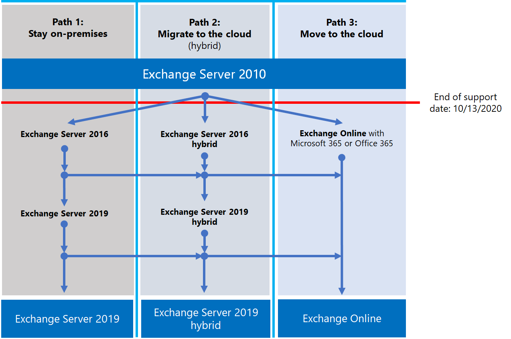

# План действий после прекращения поддержки Exchange 2010Exchange 2010 end of support roadmap

*Эта статья относится к Microsoft 365 корпоративный и Office 365 корпоративный.**This article applies to both Microsoft 365 Enterprise and Office 365 Enterprise.*

Exchange Server 2010 г. достигла конца поддержки **13 октября 2020 г.**Exchange Server 2010 reached its end of support on **October 13, 2020**. Если вы еще не начали миграцию с Exchange 2010 г. на Microsoft 365, Office 365 или Exchange 2016 г., настало время приступить к планированию.If you haven't already begun your migration from Exchange 2010 to Microsoft 365, Office 365, or Exchange 2016, now's the time to start planning.

## Что означает *конец поддержки?*What does *end of support* mean?

Большинство продуктов Майкрософт имеют жизненный цикл поддержки, в ходе которого они получают новые функции, исправления ошибок, исправления безопасности и так далее.Most Microsoft products have a support lifecycle during which they get new features, bug fixes, security fixes, and so on. Этот жизненный цикл обычно длится 10 лет с начального выпуска продукта.This lifecycle typically lasts for 10 years from the product's initial release. Конец жизненного цикла называется завершением поддержки продукта.The end of this lifecycle is known as the product's end of support. Поскольку Exchange 2010 г. поддержка была достигнута 13 октября 2020 г., Корпорация Майкрософт больше не предоставляет:Because Exchange 2010 reached its end of support on October 13, 2020, Microsoft no longer provides:

- Техническая поддержка проблем, которые могут возникнуть.Technical support for problems that may occur.
- Ошибка устраняет проблемы, которые могут повлиять на стабильность и доступность сервера.Bug fixes for issues that may impact the stability and usability of the server.
- Устранение уязвимостей, которые могут сделать сервер уязвимым для нарушений безопасности.Security fixes for vulnerabilities that may make the server vulnerable to security breaches.
- Обновления часовой зоны.Time zone updates.

Установка Exchange 2010 г. продолжится после этой даты.Your installation of Exchange 2010 will continue to run after this date. Но из-за перечисленных выше изменений настоятельно рекомендуется как можно скорее перенести Exchange 2010 г.But because of the changes listed above, we strongly recommend that you migrate from Exchange 2010 as soon as possible.

Дополнительные сведения о завершении поддержки см. в справке Ресурсы, которые помогут вам обновиться с Office серверов и [клиентов 2010 г.](upgrade-from-office-2010-servers-and-products.md)For more information about nearing the end of support, see [Resources to help you upgrade from Office 2010 servers and clients](upgrade-from-office-2010-servers-and-products.md).

## Какие у меня варианты?What are my options?

Это отличное время для изучения параметров и подготовки плана миграции.It's a great time to explore your options and prepare a migration plan. Вы получаете перечисленные ниже возможности.You can:

- Полностью перенести на Microsoft 365.Migrate fully to Microsoft 365. Перенос почтовых ящиков с помощью переноса, минимальной гибридной или полной гибридной миграции.Migrate mailboxes using cutover, minimal hybrid, or full hybrid migration. Затем удалите локальное Exchange серверов и Active Directory.Then remove on-premises Exchange servers and Active Directory.
- Миграция Exchange серверов 2010 г. в Exchange 2016 г. на локальном сервере.Migrate your Exchange 2010 servers to Exchange 2016 on your on-premises servers.

> [!IMPORTANT]
> Если ваша организация хочет перенести почтовые ящики в Microsoft 365, но планирует сохранить DirSync или Azure AD Подключение для продолжения управления учетными записями пользователей из локального Active Directory, необходимо сохранить хотя бы один сервер Microsoft Exchange на локальном сервере.If your organization chooses to migrate mailboxes to Microsoft 365 but plans to keep DirSync or Azure AD Connect in place to continue managing user accounts from on-premises Active Directory, you need to keep at least one Microsoft Exchange server on-premises. Если удалить все Exchange серверы, вы не сможете вносить изменения в Exchange получателей в Exchange Online, так как источник полномочий остается в локальном Active Directory.If you remove all Exchange servers, you won't be able to make changes to Exchange recipients in Exchange Online because the source of authority remains in your on-premises Active Directory. Здесь необходимо внести изменения.Changes need to be made there. В этом сценарии у вас есть следующие параметры:In this scenario, you have the following options:
>
>- *Рекомендуется:* Если до 13 октября 2020 г. вы перенаселили почтовые ящики на Microsoft 365 и обновили серверы, используйте Exchange 2010 г. для подключения к Microsoft 365 и переноса почтовых ящиков.*Recommended:* If you migrated your mailboxes to Microsoft 365 and upgraded your servers by October 13, 2020, use Exchange 2010 to connect to Microsoft 365 and migrate mailboxes. Затем перенести Exchange 2010 г. на Exchange 2016 г., а остальные серверы Exchange 2010 г.Next, migrate Exchange 2010 to Exchange 2016, and decommission any remaining Exchange 2010 servers.
>- Если вы не завершили миграцию почтовых ящиков и обновление локального сервера к 13 октября 2020 г., сначала Exchange 2010 г. до Exchange 2016 г.If you didn't complete the mailbox migration and on-premises server upgrade by October 13, 2020, upgrade your on-premises Exchange 2010 servers to Exchange 2016 first. Затем используйте Exchange 2016 для подключения к Microsoft 365 и переноса почтовых ящиков.Then use Exchange 2016 to connect to Microsoft 365 and migrate mailboxes.

> [!NOTE]
> Это немного сложнее, но вы также можете перенести почтовые ящики в Microsoft 365 при переносе локального сервера Exchange 2010 г. на Exchange 2016 г.It's little more complicated, but you can also migrate mailboxes to Microsoft 365 while migrating your on-premises Exchange 2010 servers to Exchange 2016.

Вот три пути, которые можно принять, чтобы избежать окончания поддержки Exchange Server 2010.Here are the three paths you can take to avoid the end of support for Exchange Server 2010.

В следующих разделах подробно изучаются все параметры.The following sections explore each option in more detail.

## Миграция в Microsoft 365Migrate to Microsoft 365

Перенос электронной почты в Microsoft 365 является наилучшим и простым вариантом, который поможет вам завершить развертывание Exchange 2010 г.Migrating your email to Microsoft 365 is the best and simplest option to help you retire your Exchange 2010 deployment. При переносе Microsoft 365 можно сделать один переход от старой технологии к текущим функциям, в том числе:With a migration to Microsoft 365, you can make a single hop from old technology to current features, including:

- Возможности обеспечения соответствия требованиям, такие как политики хранения, In-Place и судебное удержание, хранение электронных данных на месте и другие.Compliance capabilities such as Retention Policies, In-Place and Litigation Hold, in-place eDiscovery, and more.
- Microsoft Teams.Microsoft Teams.
- Power BI.Power BI.
- Сфокусированный почтовый ящик.Focused Inbox.
- MyAnalytics.MyAnalytics.

Microsoft 365 также сначала получают новые функции и возможности, чтобы организация сразу же начала их использовать.Microsoft 365 also gets new features and experiences first, so your organization can start using them right away. Кроме того, вам не придется беспокоиться о:Also, you won't have to worry about:

- Приобретение и обслуживание оборудования.Purchasing and maintaining hardware.
- Оплата тепла и охлаждения серверов.Paying to heat and cool your servers.
- Ведение в курсе исправлений безопасности, продуктов и часового пояса.Keeping up to date on security, product, and time-zone fixes.
- Ведение хранилища и программного обеспечения в соответствии с требованиями соответствия требованиям.Maintaining storage and software to support compliance requirements.
- Обновление до новой версии Exchange.Upgrading to a new version of Exchange. Вы всегда в последней версии Exchange в Microsoft 365.You're always on the latest version of Exchange in Microsoft 365.

### Как перейти на Microsoft 365?How should I migrate to Microsoft 365?

В зависимости от организации у вас есть несколько вариантов для получения Microsoft 365.Depending on your organization, you have a few options to get to Microsoft 365. Сначала необходимо рассмотреть несколько вещей, таких как:First, you need to consider a few things, such as:
- Количество мест или почтовых ящиков, которые необходимо переместить.The number of seats or mailboxes you need to move.
- Как долго вы хотите, чтобы миграция длилась.How long you want the migration to last.
- Нужна ли вам плавная интеграция между локальной установкой и Microsoft 365 во время миграции.Whether you need a seamless integration between your on-premises installation and Microsoft 365 during the migration.
 
В этой таблице показаны параметры миграции и наиболее важные факторы, определяющих, какой метод использовать.This table shows your migration options and the most important factors that determine which method to use.

|Параметр МиграцияMigration option|Размер организацииOrganization size|ДлительностьDuration|
|---|---|---|
|Прямая миграцияCutover migration|Менее 150 местFewer than 150 seats|Неделя или меньшеA week or less|
|Минимальная гибридная миграцияMinimal hybrid migration|Менее 150 местFewer than 150 seats|Несколько недель или менееA few weeks or less|
|Полная гибридная миграцияFull hybrid migration|Более 150 местMore than 150 seats|Несколько недель или болееA few weeks or more|

В следующих разделах представлен обзор этих методов.The following sections give you an overview of these methods. Дополнительные сведения см. [в сайте Decide on a migration path.](https://support.office.com/article/Decide-on-a-migration-path-0d4f2396-9cef-43b8-9bd6-306d01df1e27)For more information, see [Decide on a migration path](https://support.office.com/article/Decide-on-a-migration-path-0d4f2396-9cef-43b8-9bd6-306d01df1e27).

### Прямая миграцияCutover migration

При переносе переключе можно перенести все почтовые ящики, группы рассылки, контакты и Office 365 в установленные даты и время.In a cutover migration, you migrate all your mailboxes, distribution groups, contacts, and so on, to Office 365 at a set date and time. После этого вы закрываете свои Exchange серверы и начинаете использовать Microsoft 365 исключительно.When you're done, you shut down your on-premises Exchange servers and start using Microsoft 365 exclusively.

Миграция отсейки отлично подходит для небольших организаций, которые не имеют большого количества почтовых ящиков, хотят быстро Microsoft 365 и не хотят иметь дело со сложностью других методов.Cutover migration is great for small organizations that don't have many mailboxes, want to get to Microsoft 365 quickly, and don't want to deal with the complexity of the other methods. Но он должен быть завершен в неделю или меньше.But it should be completed in a week or less. Для этого необходимо, чтобы пользователи перенастроили свои Outlook профилей.And it requires users to reconfigure their Outlook profiles. Миграция при сокращении может мигрировать до 2000 почтовых ящиков, но мы рекомендуем использовать их не более 150.Cutover migration can migrate up to 2,000 mailboxes, but we recommend you use it for a maximum of 150. Если вы попробуете перенести больше, у вас может не оказаться времени для переноса всех почтовых ящиков до истечения срока, и сотрудники службы поддержки ИТ могут быть перегружены запросами на помощь пользователям в перенастройке Outlook.If you try to migrate more, you could run out of time to transfer all the mailboxes before your deadline, and your IT support staff may get overwhelmed with requests to help users reconfigure Outlook.

Вот что нужно учитывать при переносе перереза:Here are things to consider about cutover migration:

- Microsoft 365 необходимо подключиться к серверам 2010 Exchange 2010 с помощью Outlook в любом месте над портом TCP 443.Microsoft 365 will need to connect to your Exchange 2010 servers by using Outlook Anywhere over TCP port 443.
- Все почтовые ящики на месте будут перемещены в Microsoft 365.All on-premises mailboxes will be moved to Microsoft 365.
- Вам понадобится учетная запись локального администратора, которая имеет доступ к почтовым ящикам пользователей.You'll need an on-premises administrator account that has read access to your users' mailboxes.
- Принятые Exchange 2010 г., которые вы хотите использовать в Microsoft 365, должны быть добавлены в качестве проверенных доменов в службе.The Exchange 2010 accepted domains that you want to use in Microsoft 365 need to be added as verified domains in the service.
- Между началом миграции и началом этапа завершения Microsoft 365 периодически синхронизирует почтовые ящики Microsoft 365 и локально.Between when you start the migration and when you begin the completion phase, Microsoft 365 will periodically synchronize the Microsoft 365 and on-premises mailboxes. Это позволяет завершить миграцию, не беспокоясь о том, что электронная почта останется в локальном почтовом ящике.This lets you complete the migration without worrying about email being left behind in your on-premises mailboxes.
- Пользователи получат новые временные пароли для своей Microsoft 365 учетной записи.Users will receive new temporary passwords for their Microsoft 365 account. При первом входе в почтовые ящики им потребуется изменить их.They'll need to change those when they sign in to their mailboxes for the first time.
- Вам потребуется лицензия Microsoft 365, которая включает Exchange Online для каждого переносимый почтовый ящик пользователя.You'll need a Microsoft 365 license that includes Exchange Online for each user mailbox you migrate.
- Пользователям потребуется настроить новый профиль Outlook на каждом из своих устройств и скачать электронную почту снова.Users will need to set up a new Outlook profile on each of their devices and download their email again. Количество электронной почты, которую Outlook будет скачивать, может отличаться.The amount of email that Outlook will download can vary. Дополнительные сведения см. в [интернете Work offline in Outlook.](https://support.microsoft.com/office/f3a1251c-6dd5-4208-aef9-7c8c9522d633)For more information, see [Work offline in Outlook](https://support.microsoft.com/office/f3a1251c-6dd5-4208-aef9-7c8c9522d633).

Дополнительные дополнительные информацию о переносе перереза см. в этой информации:To learn more about cutover migration, see:

- [Что нужно знать о переносе электронной почты на сокращениеWhat you need to know about a cutover email migration](/Exchange/mailbox-migration/what-to-know-about-a-cutover-migration)
- [Выполните перенос переноса электронной почты в Office 365Perform a cutover migration of email to Office 365](/Exchange/mailbox-migration/cutover-migration-to-office-365)

### Минимальная гибридная миграцияMinimal hybrid migration

При минимальной гибридной или экспресс-миграции несколько сотен почтовых ящиков перемещаются Microsoft 365 в течение нескольких недель.In a minimal hybrid, or express, migration you move a few hundred mailboxes to Microsoft 365 within a few weeks. Этот метод не поддерживает расширенные функции гибридной миграции, такие как общие сведения о свободном и загруженном календаре.This method doesn't support advanced hybrid-migration features like shared free/busy calendar information.

Минимальная гибридная миграция отлично подходит для организаций, которые должны перенести свои почтовые ящики в Microsoft 365, но все равно планируют завершить миграцию в течение нескольких недель.Minimal hybrid migration is great for organizations that need to take more time to migrate their mailboxes to Microsoft 365, but still plan to complete the migration within a few weeks. Вы получаете некоторые преимущества более продвинутой полно-гибридной миграции *без* особой сложности.You get some of the benefits of the more advanced *full-hybrid migration* without much of the complexity. Вы можете управлять количеством почтовых ящиков и их переносом в данный момент времени.You can control how many and which mailboxes to migrate at a given time. Microsoft 365 почтовые ящики будут создаваться с именами пользователей и паролями учетных записей на месте.Microsoft 365 mailboxes will be created with the user names and passwords of the on-premises accounts. Кроме того, в отличие от переносов отсеяния пользователям не нужно Outlook профилей.And, unlike cutover migrations, your users don't have to recreate their Outlook profiles.

Вот что нужно учитывать при минимальной гибридной миграции:Here are things to consider about minimal hybrid migration:

- Вам потребуется разовая синхронизация каталогов между локальной серверами Active Directory и Microsoft 365.You'll need to do a one-time directory synchronization between your on-premises Active Directory servers and Microsoft 365.
- Пользователи смогут войти в свой Microsoft 365 с тем же именем пользователя и паролем, что и перед почтовым ящиком.Users will be able to sign in to their Microsoft 365 mailbox with the same user name and password as before their mailbox.
- Вам потребуется лицензия Microsoft 365, которая включает Exchange Online для каждого переносимый почтовый ящик пользователя.You'll need a Microsoft 365 license that includes Exchange Online for each user mailbox that you migrate.
- Пользователям не потребуется настроить новый профиль Outlook на большинстве своих устройств, хотя некоторым старым телефонам с Android может потребоваться новый профиль.Users won't need to set up a new Outlook profile on most of their devices, though some older Android phones might need a new profile. Пользователям не потребуется перезагружать электронную почту.Users won't need to redownload their email.

Дополнительные сведения см. в сообщении [Use Minimal Hybrid](/Exchange/mailbox-migration/use-minimal-hybrid-to-quickly-migrate)для быстрой миграции Exchange почтовых ящиков в Office 365 .For more information, see [Use Minimal Hybrid to quickly migrate Exchange mailboxes to Office 365](/Exchange/mailbox-migration/use-minimal-hybrid-to-quickly-migrate).

### Полный гибридFull hybrid

При полной гибридной миграции у вас есть несколько сотен, до десятков тысяч почтовых ящиков, и вы перемещаете некоторые или все Microsoft 365.In a full hybrid migration, you have many hundreds, up to tens of thousands, of mailboxes, and you move some or all to Microsoft 365. Поскольку эти миграции, как правило, являются более длительными, гибридные миграции делают возможным:Because these migrations are typically longer-term, hybrid migrations make it possible to:

- Покажите пользователям на локальном сайте сведения о свободном или загруженном календаре для пользователей в Microsoft 365 и наоборот.Show on-premises users the free/busy calendar information for users in Microsoft 365, and vice versa.
- См. единый глобальный адресный список, содержащий получателей как в локальном, так и в Microsoft 365.See a unified global address list that contains recipients in both on-premises and Microsoft 365.
- Просмотр полных Outlook свойств получателей для всех пользователей независимо от того, являются ли они локальной или Microsoft 365.View full Outlook recipient properties for all users, regardless of whether they're on-premises or in Microsoft 365.
- Безопасное сообщение электронной почты между Exchange серверами и Office 365 с помощью TLS и сертификатов.Secure email communication between on-premises Exchange servers and Office 365 using TLS and certificates.
- Обрабатывайте сообщения, отправленные между Exchange серверами и Microsoft 365 как внутренние, что позволяет:Treat messages sent between on-premises Exchange servers and Microsoft 365 as internal, enabling them to:
  - Должны правильно оцениваться и обрабатываться агентами транспорта и соответствия требованиям, нацеленными на внутренние сообщения.Be properly evaluated and processed by transport and compliance agents targeting internal messages.
  - Обход фильтров от нежелательной почты.Bypass anti-spam filters.

Полные гибридные миграции лучше всего для организаций, которые рассчитывают оставаться в гибридной конфигурации в течение многих месяцев или более.Full hybrid migrations are best for organizations that expect to stay in a hybrid configuration for many months or more. Вы получаете функции, перечисленные ранее в этом разделе, а также синхронизацию каталогов, более интегрированные функции соответствия требованиям, а также возможность перемещения почтовых ящиков в и из него Microsoft 365 с помощью интерактивных ходов почтовых ящиков.You get the features listed earlier in this section, plus directory synchronization, better integrated compliance features, and the ability to move mailboxes to and from Microsoft 365 using online mailbox moves. Microsoft 365 становится расширением локальной организации.Microsoft 365 becomes an extension of your on-premises organization.

Что следует учитывать при полном гибридном переносе:Things to consider about full-hybrid migration:

- Они не подходят для всех организаций.They aren't suited to all organizations. Из-за сложности полных гибридных миграций организации с менее чем несколькими сотнями почтовых ящиков обычно не видят преимуществ, оправдывающих затраты и усилия.Due to the complexity of full hybrid migrations, organizations with less than a few hundred mailboxes don't typically see benefits that justify the effort and cost involved. В таких случаях рекомендуется учесть сокращение или минимальную гибридную миграцию.In such cases, we recommend that you consider cutover or minimal hybrid migration instead.
- Необходимо настроить синхронизацию каталогов с Azure Active Directory (Azure AD) Подключение между локальной серверами Active Directory и Microsoft 365.You need to set up directory synchronization using Azure Active Directory (Azure AD) Connect between your on-premises Active Directory servers and Microsoft 365.
- Пользователи смогут войти в свой почтовый ящик Microsoft 365 с тем же именем пользователя и паролем, который они используют при входе в локализованную сеть.Users will be able to sign in to their Microsoft 365 mailbox with same user name and password they use when they sign in to the local network. (Для этой функции требуется Подключение Azure AD с синхронизацией паролей и/или службами Федерации Active Directory).(This functionality requires Azure AD Connect with password synchronization and/or Active Directory Federation Services).
- Вам нужна Microsoft 365 лицензия, которая включает Exchange Online для каждого переносимый почтовый ящик пользователя.You need a Microsoft 365 license that includes Exchange Online for each user mailbox you migrate.
- Пользователям не нужно устанавливать новый профиль Outlook на большинстве своих устройств, хотя некоторым старым телефонам с Android может потребоваться новый профиль.Users don't need to set up a new Outlook profile on most of their devices, although some older Android phones might need a new profile. Пользователям не потребуется перезагружать электронную почту.Users won't need to redownload their email.

> [!IMPORTANT]
> Если организация хочет перенести почтовые ящики в Microsoft 365, но планирует сохранить DirSync или Azure AD Подключение для продолжения управления учетными записями пользователей из локального Active Directory, необходимо сохранить хотя бы один сервер Exchange локально.If your organization chooses to migrate mailboxes to Microsoft 365 but plans to keep DirSync or Azure AD Connect in place to continue managing user accounts from on-premises Active Directory, you need to keep at least one Exchange server on-premises. Если все Exchange серверы удалены, вы не сможете внести изменения в Exchange получателей в Exchange Online.If all Exchange servers are removed, you won't be able to make changes to Exchange recipients in Exchange Online. Это происходит из-за того, что источник полномочий остается в локальном Каталоге Active Directory и необходимо внести изменения в них.This is because the source of authority remains in your on-premises Active Directory and changes need to be made there.

Если полная гибридная миграция звучит правильно, см. в следующих полезных ресурсах:If a full hybrid migration sounds right for you, see the following helpful resources:

- [Exchange Помощник по развертываниюExchange Deployment Assistant](/exchange/exchange-deployment-assistant)
- [Гибридные развертывания Exchange ServerExchange Server Hybrid Deployments](/exchange/exchange-hybrid)
- [Мастер гибридной конфигурацииHybrid Configuration wizard](/exchange/hybrid-configuration-wizard)
- [Мастер гибридной конфигурации: вопросы и ответыHybrid Configuration wizard FAQs](/exchange/hybrid-configuration-wizard-faqs)
- [Предварительные условия для гибридного развертыванияHybrid deployment prerequisites](/exchange/hybrid-deployment-prerequisites)

## Обновление до более новой версии Exchange Server локальной версииUpgrade to a newer version of Exchange Server on-premises

Мы твердо верим, что вы получите наилучшее значение и пользовательский опыт, полностью переехав в Microsoft 365.We strongly believe that you get the best value and user experience by migrating fully to Microsoft 365. Но мы понимаем, что некоторым организациям необходимо сохранить Exchange серверов на месте.But we understand that some organizations need to keep some Exchange Servers on-premises. Это может быть из-за нормативных требований, чтобы гарантировать, что данные не хранятся в иностранном центре обработки данных, так как у вас есть уникальные параметры или требования, которые не могут быть выполнены в облаке, или потому что вам необходимо Exchange для управления облачными почтовыми ящиками, так как вы по-прежнему используете локальное использование Active Directory.This might be because of regulatory requirements, to guarantee data isn't stored in a foreign datacenter, because you have unique settings or requirements that can't be met in the cloud, or because you need Exchange to manage cloud mailboxes because you still use Active Directory on-premises. В любом случае при Exchange локальной среде необходимо обеспечить обновление среды Exchange 2010 г. по крайней мере до Exchange 2013 г. или Exchange 2016 г.In any case, if you keep Exchange on-premises, you should ensure your Exchange 2010 environment is upgraded to at least Exchange 2013 or Exchange 2016.

Для лучшего опыта рекомендуется обновить оставшиеся локальной среды до Exchange 2016 г.For the best experience, we recommend that you upgrade your remaining on-premises environment to Exchange 2016. Вам не нужно устанавливать Exchange Server 2013 г., если вы хотите перейти Exchange Server 2010 г. Exchange Server 2016 г.You don't need to install Exchange Server 2013 if you want to go straight from Exchange Server 2010 to Exchange Server 2016.

Exchange 2016 включает все функции предыдущих выпусков Exchange.Exchange 2016 includes all the features of previous releases of Exchange. Он наиболее тесно совпадает с опытом, доступным с Microsoft 365, хотя некоторые функции доступны только в Microsoft 365.It most closely matches the experience available with Microsoft 365, although some features are available only in Microsoft 365. Ознакомьтесь с несколькими недостающими вещами:Check out just a few of the things you've been missing:

|Exchange выпускаExchange release|ФункцииFeatures|
|---|---|
|**Exchange 2013****Exchange 2013**|Упрощенная архитектура сокращает число ролей сервера до трех (почтовый ящик, клиентский доступ, крамный транспорт)Simplified architecture reduces the number of server roles to three (Mailbox, Client Access, Edge Transport)|
||Политики предотвращения потери данных (DLP), которые помогают предотвратить утечку конфиденциальной информацииData loss prevention policies (DLP) that help keep sensitive information from leaking|
||Улучшенная Outlook Web AppImproved Outlook Web App experience|
|**Exchange 2016****Exchange 2016**|*Функции Exchange 2013 и ...**Features from Exchange 2013 and …*|
||Дополнительные упрощенные роли сервера только для почтовых ящиков и edge transportFurther simplified server roles to just Mailbox and Edge Transport|
||Улучшенная DLP вместе с интеграцией с SharePointImproved DLP along with integration with SharePoint|
||Повышение устойчивости баз данныхImproved database resilience|
||Совместная работа с документами в ИнтернетеOnline document collaboration|

|ФакторConsideration|Дополнительные сведенияMore information|
|---|---|
|Окончание дат поддержкиEnd of support dates|Как Exchange 2010 г., каждая версия Exchange имеет свою дату окончания поддержки:Like Exchange 2010, each version of Exchange has its own end-of-support date:  Exchange 2013 — апрель 2023 г.Exchange 2013 - April 2023 Exchange 2016 — октябрь 2025 г.Exchange 2016 - October 2025  Чем раньше дата окончания службы поддержки, тем быстрее потребуется выполнить другую миграцию.The earlier the end-of-support date, the sooner you'll need to perform another migration. Апрель 2023 года намного ближе, чем вы думаете!April 2023 is a lot closer than you think!|
|Путь миграции Exchange 2013 или 2016Migration path to Exchange 2013 or 2016|Путь миграции Exchange 2010 г. в более новую версию является одинаковым, независимо от того, Exchange 2013 или Exchange 2016 г.:The migration path from Exchange 2010 to a newer version is the same whether you choose Exchange 2013 or Exchange 2016:  Установите Exchange 2013 или 2016 г. в существующую организацию Exchange 2010 г.Install Exchange 2013 or 2016 into your existing Exchange 2010 organization. Перемещение служб и другой инфраструктуры в Exchange 2013 или 2016 г.Move services and other infrastructure to Exchange 2013 or 2016. Перемещение почтовых ящиков и общедоступных папок в Exchange 2013 или 2016 г. с Exchange серверов 2010 г.Move mailboxes and public folders to Exchange 2013 or 2016 Decommission remaining Exchange 2010 servers.|
|Сосуществование версийVersion coexistence|При переносе Exchange 2013 или Exchange 2016 г. можно установить версию в существующую Exchange 2010 г.When migrating to Exchange 2013 or Exchange 2016, you can install either version into an existing Exchange 2010 organization. Это позволяет установить один или несколько серверов Exchange 2013 или Exchange 2016 года и сделать миграцию.This enables you to install one or more Exchange 2013 or Exchange 2016 servers and do your migration.|
|Серверное оборудованиеServer hardware|Требования к оборудованию сервера изменились с Exchange 2010 г.Server hardware requirements have changed from Exchange 2010. Убедитесь, что оборудование совместимо.Make sure your hardware is compatible. Дополнительные информацию о требованиях к оборудованию для каждой версии можно узнать здесь:Find out more about hardware requirements for each version here:  [Требования к системе для Exchange 2016Exchange 2016 system requirements](/Exchange/plan-and-deploy/system-requirements?view=exchserver-2016) [Требования к системе для Exchange 2013Exchange 2013 system requirements](/Exchange/exchange-2013-system-requirements-exchange-2013-help)  При значительном Exchange производительности и увеличении вычислительной мощности и емкости хранилища на новых серверах, скорее всего, потребуется меньше серверов для поддержки одинакового числа почтовых ящиков.With the significant improvements in Exchange performance and the increased computing power and storage capacity in newer servers, you'll likely need fewer servers to support the same number of mailboxes.|
|Версия операционной системыOperating system version|Минимальные поддерживаемые версии операционной системы для каждой версии:The minimum supported operating system versions for each version are:  Exchange 2016 - Windows Server 2012Exchange 2016 - Windows Server 2012 Exchange 2013 — Windows 2008 R2 SP1Exchange 2013 - Windows Server 2008 R2 SP1  Дополнительные сведения о поддержке операционной системы можно найти в [Exchange Supportability Matrix.](/exchange/plan-and-deploy/supportability-matrix)You can find more information about operating system support at [Exchange Supportability Matrix](/exchange/plan-and-deploy/supportability-matrix).|
|Функциональный уровень леса Active DirectoryActive Directory forest functional level|Минимальные поддерживаемые функциональные уровни леса Active Directory для каждой версии:The minimum supported Active Directory forest functional levels for each version are:  Exchange 2016 — Windows 2008 R2 SP1Exchange 2016 - Windows Server 2008 R2 SP1 Exchange 2013 — Windows Server 2003Exchange 2013 - Windows Server 2003  Дополнительные сведения о поддержке функционального уровня леса можно найти в [Exchange Supportability Matrix.](/exchange/plan-and-deploy/supportability-matrix)You can find more information about forest functional level support at [Exchange Supportability Matrix](/exchange/plan-and-deploy/supportability-matrix).|
|Office клиентских версийOffice client versions|Минимальные поддерживаемые Office для каждой версии:The minimum supported Office client versions for each version are:  Exchange 2016 — Office 2010 (с последними обновлениями)Exchange 2016 - Office 2010 (with the latest updates) Exchange 2013 — Office 2007 SP3Exchange 2013 - Office 2007 SP3  Дополнительные сведения о поддержке Office в [Exchange Supportability Matrix.](/exchange/plan-and-deploy/supportability-matrix)Find more information about Office client support at [Exchange Supportability Matrix](/exchange/plan-and-deploy/supportability-matrix).||| 

Для миграции используйте следующие ресурсы:Use the following resources to help with your migration:

- [Exchange Помощник по развертываниюExchange Deployment Assistant](/exchange/exchange-deployment-assistant)
- Изменения схемы Active Directory для Exchange [2016](/exchange/plan-and-deploy/active-directory/ad-schema-changes?view=exchserver-2016), [2013](/Exchange/exchange-2013-active-directory-schema-changes-exchange-2013-help)Active Directory schema changes for Exchange [2016](/exchange/plan-and-deploy/active-directory/ad-schema-changes?view=exchserver-2016), [2013](/Exchange/exchange-2013-active-directory-schema-changes-exchange-2013-help)
- Требования к системе для Exchange [2016](/exchange/plan-and-deploy/system-requirements?view=exchserver-2016), [2013](/Exchange/exchange-2013-system-requirements-exchange-2013-help)System requirements for Exchange [2016](/exchange/plan-and-deploy/system-requirements?view=exchserver-2016), [2013](/Exchange/exchange-2013-system-requirements-exchange-2013-help)
- Необходимые условия для Exchange [2016](/exchange/plan-and-deploy/prerequisites?view=exchserver-2016), [2013](/Exchange/exchange-2013-prerequisites-exchange-2013-help)Prerequisites for Exchange [2016](/exchange/plan-and-deploy/prerequisites?view=exchserver-2016), [2013](/Exchange/exchange-2013-prerequisites-exchange-2013-help)

## Сводка параметров для Office и серверов 2010 года и Windows 7Summary of options for Office 2010 client and servers and Windows 7

Визуальное представление возможностей обновления, миграции и перехода на облачные решения для клиентов и серверов Office 2010, а также Windows 7 см. на плакате [Прекращение поддержки](../downloads/Office2010Windows7EndOfSupport.pdf).For a visual summary of the upgrade, migrate, and move-to-the-cloud options for Office 2010 clients and servers and Windows 7, see the [end of support poster](../downloads/Office2010Windows7EndOfSupport.pdf).

На этом одношаговом плакате показано, как реагировать на клиентские и серверные продукты 2010 Office 2010 г., а Windows 7 — к концу поддержки, при этом в Microsoft 365 корпоративный выделены предпочтительные пути и поддержка Microsoft 365 корпоративный.This one-page poster illustrates the various paths you can take to respond to Office 2010 client and server products and Windows 7 reaching end of support, with preferred paths and option support in Microsoft 365 Enterprise highlighted.

Вы также можете [скачать](https://github.com/MicrosoftDocs/microsoft-365-docs/raw/public/microsoft-365/downloads/Office2010Windows7EndOfSupport.pdf) этот плакат и распечатать его в формате букв, юридических или таблоидов (11 x 17).You can also [download](https://github.com/MicrosoftDocs/microsoft-365-docs/raw/public/microsoft-365/downloads/Office2010Windows7EndOfSupport.pdf) this poster and print it in letter, legal, or tabloid (11 x 17) format.

## Что делать, если мне нужна помощь?What if I need help?

Если вы мигрируете в Microsoft 365, вы можете использовать нашу службу Microsoft FastTrack.If you're migrating to Microsoft 365, you might be eligible to use our Microsoft FastTrack service. FastTrack предоставляет лучшие методы, средства и ресурсы, чтобы сделать миграцию Microsoft 365 максимально бесшовной.FastTrack provides best practices, tools, and resources to make your migration to Microsoft 365 as seamless as possible. Лучше всего, что у вас будет инженер службы поддержки, который будет проходить от планирования и проектирования до переноса последнего почтового ящика.Best of all, you'll have a support engineer walk you through from planning and design to migrating your last mailbox. Дополнительные информацию о FastTrack см. [в веб-сайте Microsoft FastTrack.](https://fasttrack.microsoft.com/)For more about FastTrack, see [Microsoft FastTrack](https://fasttrack.microsoft.com/).

Если во время миграции в Microsoft 365 возникают проблемы и вы не используете FastTrack или переходите в более новую версию Exchange Server, можно использовать несколько ресурсов:If you run into problems during your migration to Microsoft 365 and you aren't using FastTrack, or you're migrating to a newer version of Exchange Server, here are some resources you can use:

- [Техническое сообществоTechnical community](https://social.technet.microsoft.com/Forums/office/home?category=exchangeserver)
- [Служба поддержки клиентовCustomer support](https://support.microsoft.com/gp/support-options-for-business)

## Связанные статьиRelated articles

[Ресурсы по обновлению серверов и клиентов Office 2010Resources to help you upgrade from Office 2010 servers and clients](upgrade-from-office-2010-servers-and-products.md)