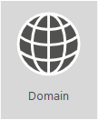

# <a name="external-domain-name-system-records-for-office-365"></a>Внешние записи DNS для Office 365

|||
|:-----|:-----|
||**Вам нужен индивидуальный список записей DNS для вашей организации Office 365?** Вы можете [найти необходимые сведения для создания записей DNS в Office 365](https://support.office.microsoft.com/article/Gather-the-information-you-need-to-create-Office-365-DNS-records-77f90d4a-dc7f-4f09-8972-c1b03ea85a67) для домена в Office 365.<br/> **Вам нужны пошаговые инструкции по добавлению этих записей в узел DNS вашего домена, такой как GoDaddy или eNom?** [См. ссылки на пошаговые инструкции для популярных узлов DNS](../admin/get-help-with-domains/create-dns-records-at-any-dns-hosting-provider.md). <br/>  **Желаете использовать этот список для собственного развертывания?** Для пользовательского развертывания Office 365 используйте следующий список. Вам потребуется выбрать записи, применимые для вашей организации, и заполнить соответствующие значения. <br/> **Возврат к статье** [Планирование сети и настройка производительности для Office 365](./network-planning-and-performance.md).  <br/> |

Зачастую разобраться с записями SPF и MX сложнее всего. Мы обновили наше руководство по записям SPF в конце этой статьи. Важно помнить, что _для своего домена вы можете использовать только одну запись SPF_. Можно использовать несколько записей MX, однако это может вызвать проблемы при доставке почты. Использование одной записи MX для направления электронной почты на одну почтовую систему позволяет избежать многих потенциальных проблем.
  
Следующие разделы отсортированы по службе в Office 365. Чтобы просмотреть индивидуальный список записей DNS для Office 365 для вашего домена, войдите в Office 365 и ознакомьтесь со статьей [Сбор необходимых сведений для создания записей DNS в Office 365](https://support.office.com/article/77f90d4a-dc7f-4f09-8972-c1b03ea85a67).
  
## <a name="external-dns-records-required-for-office-365-core-services"></a>Внешние записи DNS, необходимые для Office 365 (основные службы)
<a name="BKMK_ReqdCore"> </a>

Каждый пользователь Office 365 должен добавить две записи во внешнюю службу DNS. Первая запись CNAME предоставляет Office 365 возможность направлять рабочие станции на проверку подлинности с помощью соответствующей платформы идентификации. Вторая запись необходима для подтверждения вашего права владельца доменного имени.
  
||||
|:-----|:-----|:-----|
|**Запись DNS** <br/> |**Назначение** <br/> |**Значение для использования** <br/> |
|**CNAME** <br/> **(Пакет)** <br/> |Используется Office 365 для прямой проверки подлинности в нужной платформе идентификации. [Дополнительные сведения](../admin/services-in-china/purpose-of-cname.md?viewFallbackFrom=o365-worldwide) <br/> **Примечание.** Эта запись CNAME применяется только к службе Office 365, предоставляемой компанией 21Vianet. [Дополнительные сведения](/office365/servicedescriptions/office-365-platform-service-description/office-365-operated-by-21vianet)  |**Псевдоним:** msoid  <br/> **Целевое значение:** clientconfig.partner.microsoftonline-p.net.cn  <br/> |
|**TXT** <br/> **(Проверка домена)** <br/> |Используется Office 365 только для подтверждения прав владельца домена. Это не влияет на все остальное.  <br/> |**Узел:** @ (или доменное имя для некоторых поставщиков услуг размещения DNS)  <br/> **Значение TXT:** _текстовая строка, предоставленная_ Office 365  <br/> **Мастер настройки домена** Office 365 предоставляет значения, которые можно использовать для создания этой записи.  <br/> |


## <a name="external-dns-records-required-for-email-in-office-365-exchange-online"></a>Внешние записи DNS, необходимые для электронной почты в Office 365 (Exchange Online)
<a name="BKMK_ReqdCore"> </a>

Для электронной почты в Office 365 требуется несколько различных записей. Все пользователи должны использовать следующие три основные записи: автообнаружение, MX и SPF.
  
- **Запись автообнаружения** позволяет клиентским компьютерам автоматически находить Exchange и настраивать клиент соответствующим образом.

- **Запись MX** сообщает другим почтовым системам, куда следует направлять электронную почту для вашего домена. **Примечание.** Когда вы переходите на службу электронной почты в Office 365, после обновления записи MX домена ВСЕ электронные письма, отправляемые в этот домен, будут поступать в среду Office 365.  
Вы хотите перенести в Office 365 лишь несколько адресов? Воспользуйтесь [пилотным развертыванием Office 365 с несколькими адресами электронной почты в личном домене](https://support.office.com/article/39cee536-6a03-40cf-b9c1-f301bb6001d7).

- **Запись типа TXT для SPF** используется принимающими почтовыми системами для проверки отправляющих серверов. Это помогает предотвратить такие проблемы, как спуфинг и фишинг электронной почты. Сведения о создании подобных записей см. в разделе [Внешние записи DNS, необходимые для SPF](external-domain-name-system-records.md#BKMK_SPFrecords) в этой статье.

Для пользователей электронной почты, использующих федерацию Exchange, в нижней части таблицы приведены необходимые дополнительные записи CNAME и TXT.
  
||||
|:-----|:-----|:-----|
|**Запись DNS** <br/> |**Назначение** <br/> |**Значение для использования** <br/> |
|**CNAME** <br/> **(Exchange Online)** <br/> |Позволяет клиентам Outlook подключиться к службе Exchange Online с помощью службы автообнаружения. Служба автообнаружения автоматически находит правильный узел Exchange Server и настраивает Outlook для пользователей.  <br/> |**Псевдоним:** autodiscover  <br/> **Целевое значение:** autodiscover.outlook.com  <br/> |
|**MX** <br/> **(Exchange Online)** <br/> |Отправляет входящую почту для домена в службу Exchange Online в Office 365.  <br/> [!NOTE] Как только сообщения электронной почты начнут поступать в Exchange Online, следует удалить записи MX, указывающие на старую систему.   |**Домен:** например, contoso.com  <br/> **Целевой почтовый сервер:**\<MX token\>.mail.protection.outlook.com  <br/> **Предпочтение/приоритет:** Ниже, чем у всех остальных записей MX (это гарантирует доставку почты в Exchange Online) — например, 1 или "низкий"  <br/>  Чтобы найти свой \<MX token\>, выполните следующие действия:  <br/>  Войдите в Office 365 и перейдите в раздел администратора Office 365 \> "Домены".  <br/>  В столбце действий для вашего домена выберите "Исправить ошибки".  <br/>  В разделе записей MX выберите пункт "Что необходимо исправить?"  <br/>  Следуйте указаниям на этой странице, чтобы обновить запись MX.  <br/> [Что такое приоритет записей MX?](../admin/setup/domains-faq.yml) <br/> |
|**SPF (TXT)** <br/> **(Exchange Online)**  <br/> |Это позволяет запретить другим людям использовать ваш домен для отправки нежелательной почты или других вредоносных сообщений. SPF (инфраструктура политики отправителей) работает путем определения серверов, имеющих право на отправку электронной почты с вашего домена.  <br/> |[Внешние записи DNS, необходимые для SPF](external-domain-name-system-records.md#BKMK_SPFrecords) <br/> |
|**TXT** <br/> **(федерация Exchange)** <br/> |Применяется для федерации Exchange для гибридного развертывания.  <br/> |**Запись TXT 1:** например, contoso.com и специально созданный связанный хэш-текст для подтверждения права собственности на домен (например, Y96nu89138789315669824)  <br/> **Запись TXT 2:** например, exchangedelegation.contoso.com и специально созданный связанный хэш-текст для подтверждения права собственности на домен (например, Y3259071352452626169)  <br/> |
|**CNAME** <br/> **(федерация Exchange)** <br/> |Позволяет клиентам Outlook подключиться к Exchange Online с помощью службы автообнаружения, когда ваша компания использует федерацию Exchange. Служба автообнаружения автоматически находит правильный узел Exchange Server и настраивает Outlook для ваших пользователей.  <br/> |**Псевдоним:** например, Autodiscover.service.contoso.com  <br/> **Целевое значение:** autodiscover.outlook.com  <br/> |


## <a name="external-dns-records-required-for-skype-for-business-online"></a>Внешние записи DNS, необходимые для Skype для бизнеса Online
<a name="BKMK_ReqdCore"> </a>

Чтобы правильно настроить сеть с использованием [URL-адресов и диапазонов IP-адресов Office 365](https://support.office.com/article/8548a211-3fe7-47cb-abb1-355ea5aa88a2#BKMK_LYO) необходимо выполнить определенные действия.

> [!NOTE]
> Эти записи DNS применяются и для Teams, в частности, в случае с гибридным сценарием Teams и Skype для бизнеса, когда могут возникать определенные проблемы федерации.
  
||||
|:-----|:-----|:-----|
|**Запись DNS** <br/> |**Назначение** <br/> |**Значение для использования** <br/> |
|**SRV** <br/> **(Skype для бизнеса Online)** <br/> |Позволяет домену Office 365 передавать функции обмена мгновенными сообщениями внешним клиентам путем включения федерации SIP. Дополнительные сведения см. в статье [URL-адреса и диапазоны IP-адресов Office 365](https://support.office.com/article/8548a211-3fe7-47cb-abb1-355ea5aa88a2#BKMK_LYO).<br/> |**Служба:** sipfederationtls  <br/> **Протокол:** TCP  <br/> **Приоритет:** 100  <br/> **Вес:** 1  <br/> **Порт:** 5061  <br/> **Целевое значение:** sipfed.online.lync.com  <br/> **Примечание.** Если брандмауэр или прокси-сервер блокирует поиск SRV на внешнем DNS, эту запись необходимо также добавить во внутреннюю запись DNS.   |
|**SRV** <br/> **(Skype для бизнеса Online)** <br/> |Используется Skype для бизнеса для координации потока сведений между клиентами Lync.  <br/> |**Служба:** sip  <br/> **Протокол:** TLS  <br/> **Приоритет:** 100  <br/> **Вес:** 1  <br/> **Порт:** 443  <br/> **Целевое значение:** sipdir.online.lync.com  <br/> |
|**CNAME** <br/> **(Skype для бизнеса Online)** <br/> |Используется клиентом Lync для помощи в поиске службы Skype для бизнеса Online и входа.  <br/> |**Псевдоним:** sip  <br/> **Целевое значение:** sipdir.online.lync.com  <br/> Дополнительные сведения см. в статье [URL-адреса и диапазоны IP-адресов Office 365](https://support.office.com/article/8548a211-3fe7-47cb-abb1-355ea5aa88a2#BKMK_LYO).  <br/> |
|**CNAME** <br/> **(Skype для бизнеса Online)** <br/> |Используется мобильным клиентом Lync для помощи в поиске службы Skype для бизнеса Online и входа.  <br/> |**Псевдоним:** lyncdiscover  <br/> **Целевое значение:** webdir.online.lync.com  <br/> |

## <a name="external-dns-records-required-for-office-365-single-sign-on"></a>Внешние записи DNS, необходимые для единого входа Office 365
<a name="BKMK_ReqdCore"> </a>

||||
|:-----|:-----|:-----|
|**Запись DNS** <br/> |**Назначение** <br/> |**Значение для использования** <br/> |
|**Узел (A)** <br/> |Используется для единого входа (SSO). Предоставляет конечную точку для внешних пользователей (и локальных, при необходимости) для подключения к прокси-серверам федерации служб федерации Active Directory (AD FS) или виртуальному IP-адресу с балансировкой нагрузки (VIP).  <br/> |**Целевое значение:** например, sts.contoso.com  <br/> |

## <a name="external-dns-records-required-for-spf"></a>Внешние записи DNS, необходимые для SPF
<a name="BKMK_SPFrecords"> </a>

> [!IMPORTANT]
> Несмотря на то что инфраструктура политики отправителей разработана для предотвращения спуфинга, существует ряд методик, позволяющих обойти ее. Чтобы защититься от таких атак, по завершении настройки инфраструктуры политики отправителей необходимо настроить DKIM и DMARC для Office 365. Соответствующие инструкции по началу работы см. в статье [Проверка исходящей электронной почты, отправляемой со своего домена в Office 365, с помощью DKIM](../security/office-365-security/use-dkim-to-validate-outbound-email.md). Дальнейшие действия см. в статье [Использование протокола DMARC для проверки электронной почты в Office 365](../security/office-365-security/use-dmarc-to-validate-email.md).
  
Записи SPF — это записи TXT, которые позволяют запретить другим людям использовать ваш домен для отправки нежелательной почты или других вредоносных сообщений. SPF (инфраструктура политики отправителей) работает путем определения серверов, имеющих право на отправку электронной почты с вашего домена.
  
Для вашего домена можно использовать только одну запись SPF (т. е. запись TXT, определяющую SPF). Эта запись может содержать несколько элементов, но общее количество результат поиска DNS не должно превышать 10 (это помогает предотвратить атаки типа "отказ в обслуживании"). Для создания или обновления записи SPF с правильными значениями для вашей среды ознакомьтесь с приведенной ниже таблицей и примерами.
  
### <a name="structure-of-an-spf-record"></a>Структура записи SPF

Все записи SPF содержат три элемента: объявление о том, что это запись SPF, домены и IP-адреса, с которых должны отправляться сообщения электронной почты, а также правило принудительного применения. Для создания допустимой записи SPF необходимы все три элемента. Ниже приведен пример распространенной записи SPF для Office 365, когда используется только служба электронной почты Exchange Online:
  
``` dns
TXT Name @
Values: v=spf1 include:spf.protection.outlook.com -all
```

Система электронной почты, получающая сообщение из вашего домена, выполняет поиск записи SPF. Если для отправки письма использовался почтовый сервер Office 365, сообщение будет получено. Если же письмо отправлено с помощью вашей старой почтовой системы или нежелательной системы из Интернета, проверка SPF может завершиться ошибкой и сообщение не будет доставлено. Проверки наподобие этой помогают предотвратить спуфинг и фишинговые сообщения.
  
### <a name="choose-the-spf-record-structure-you-need"></a>Выбор необходимой структуры записи SPF

В случаях, когда в Office 365 используется не только электронная почта Exchange Online (например, также используется почта, поступающая из SharePoint Online), вы можете определить, что нужно включить в значение записи, с помощью приведенной ниже таблицы.
  
> [!NOTE]
> Для сложного сценария, включающего, например, пограничные серверы электронной почты для управления почтовым трафиком, передаваемым через брандмауэр, потребуется настроить запись SPF более детально. См. статью [Настройка записей SPF в Office 365 для предотвращения спуфинга](../security/office-365-security/set-up-spf-in-office-365-to-help-prevent-spoofing.md). Дополнительные сведения о том, как записи SPF работают в Office 365 см. в статье [Как Office 365 использует инфраструктуру политики отправителей (SPF) для предотвращения спуфинга](../security/office-365-security/how-office-365-uses-spf-to-prevent-spoofing.md).
  
| Номер|Используемая система  <br/> |Назначение  <br/> |Добавьте эти включения  <br/> |
|:-----|:-----|:-----|:-----|
|1  <br/> |Все почтовые системы (обязательно)  <br/> |Все записи SPF начинаются с этого значения  <br/> |v=spf1  <br/> |
|2  <br/> |Exchange Online (распространено)  <br/> |Используйте только с Exchange Online  <br/> |include:spf.protection.outlook.com  <br/> |
|3  <br/> |Сторонняя почтовая система (менее распространено)  <br/> ||include:\<email system like mail.contoso.com\>  <br/> |
|4  <br/> |Локальная почтовая система (менее распространено)  <br/> |Применяйте, если вы используете службу Exchange Online Protection или Exchange Online вместе с другой почтовой системой  <br/> |ip4:\<0.0.0.0\>  <br/> ip6:\< : : \>  <br/> include:\<mail.contoso.com\>  <br/> В угловых скобках (\<\>) следует указать другие почтовые системы, которые будут использоваться для отправки почты для вашего домена.  <br/> |
|5  <br/> |Все почтовые системы (обязательно)  <br/> ||-all  <br/> |

### <a name="example-adding-to-an-existing-spf-record"></a>Пример. Добавление значений в существующую запись SPF
<a name="bkmk_addtospf"> </a>

Если у вас уже есть запись SPF, вам потребуется добавить или обновить значения для Office 365. Например, для домена contoso.com уже существует следующая запись SPF:
  
``` dns
TXT Name @
Values: v=spf1 ip4:60.200.100.30 include:smtp.adatum.com -all
```

Необходимо обновить вашу запись SPF для Office 365. Для этого отредактируете вашу текущую запись так, чтобы у вас была запись SPF новые значения включающая нужные значения. Для Office 365 — "spf.protection.outlook.com".
  
Правильный вариант:
  
``` dns
TXT Name @
Values: v=spf1 ip4:60.200.100.30 include:spf.protection.outlook.com include:smtp.adatum.com -all
```

Неправильный вариант:
  
``` dns
Record 1:
TXT Name @
Values: v=spf1 ip4:60.200.100.30 include:smtp.adatum.com -all
Record 2:
Values: v=spf1 include:spf.protection.outlook.com -all
```

### <a name="more-examples-of-common-spf-values"></a>Другие примеры распространенных значений SPF
<a name="bkmk_addtospf"> </a>

Если вы используете полный набор Office 365 и рассылаете маркетинговые письма от своего имени с помощью приложения MailChimp, ваша запись SPF для домена contoso.com может выглядеть следующим образом (используются строки 1, 3 и 5 из приведенной выше таблицы). Обратите внимание, что строки 1 и 5 обязательны.
  
``` dns
TXT Name @
Values: v=spf1 include:spf.protection.outlook.com include:servers.mcsv.net -all
```

Если вы используете гибридную конфигурацию Exchange, в которой сообщения электронной почты отправляются из Office 365 и вашей локальной почтовой системы, ваша запись SPF на contoso.com может выглядеть следующим образом:
  
``` dns
TXT Name @
Values: v=spf1 include:spf.protection.outlook.com include:mail.contoso.com -all
```

Выше приведены некоторые распространенные примеры, которые могут помочь вам настроить существующую запись SPF при добавлении домена в Office 365 для работы с электронной почтой. Для сложного сценария, включающего, например, пограничные серверы электронной почты для управления почтовым трафиком, передаваемым через брандмауэр, потребуется настроить запись SPF более детально. См. статью [Настройка записей SPF в Office 365 для предотвращения спуфинга](../security/office-365-security/set-up-spf-in-office-365-to-help-prevent-spoofing.md).
  
Вы можете быстро вернуться сюда с помощью этой короткой ссылки: [https://aka.ms/o365edns]()